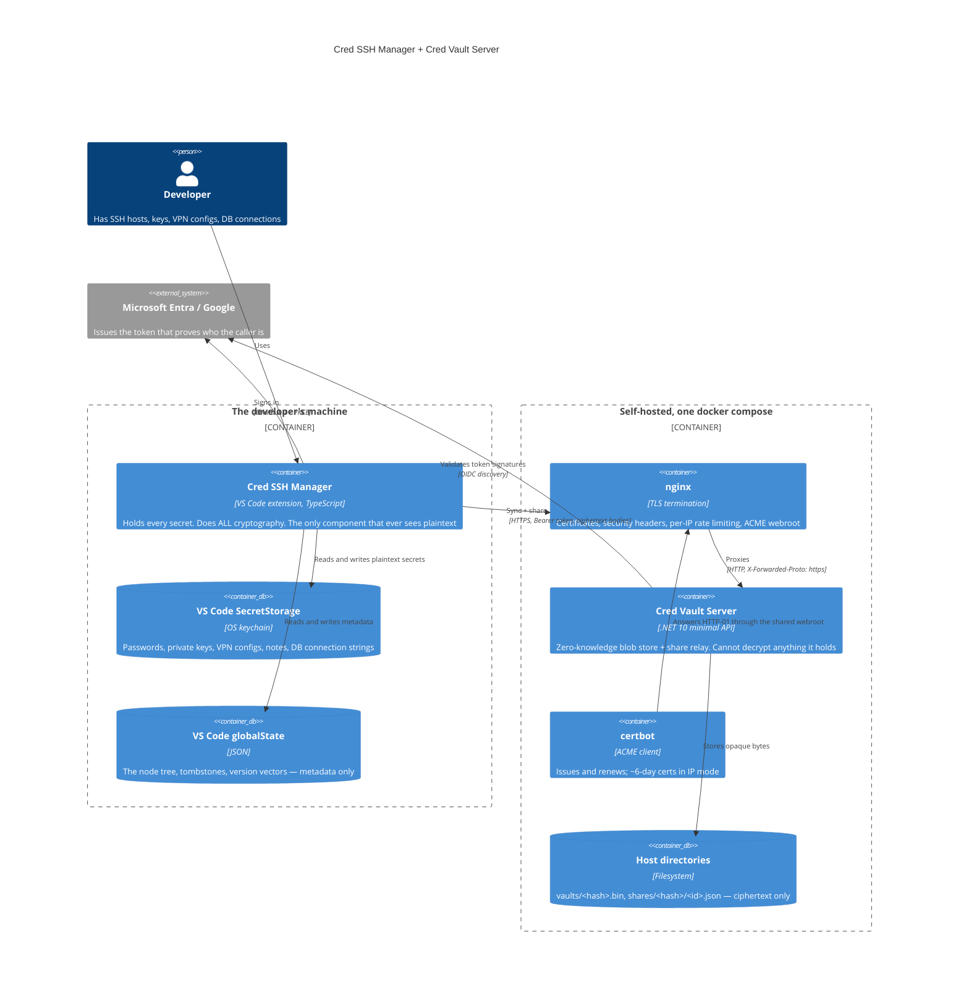

# Architecture

How the two halves of `dew_flow_creds_for_devs` fit together, and the one boundary that
everything else follows from.

> Cross-repository citations are **paths, not links** — a relative link that resolves only on one
> machine is worse than a citation naming its source.

## The system in one picture



## The trust boundary

**The server never holds a key that opens a vault.** Everything else in this document is
downstream of that sentence.

| | Sees plaintext | Holds a decryption key | Can forge a sender |
|---|---|---|---|
| The extension | yes — it is the only one | yes, derived from a PIN or a security key | n/a |
| The server | **no** | **no** | **no** — it stamps identity from a verified token |
| Anyone with disk access to the server | no | no | no |

What the server contributes is the thing a shared folder cannot: **authenticated identity**. It
knows who is calling, because the caller presents a token their identity provider signed, and it
uses that identity for exactly three decisions — which vault you may read, which inbox you may read,
and whose name goes on a share you send.

### Why that is worth a server at all

The extension works with no server, syncing through a shared folder. That mode has two problems the
server exists to solve:

1. **Everyone with folder access can read everyone's ciphertext.** Offline, at leisure. The only
   thing standing between them and the secrets is the strength of a PIN.
2. **A share's sender is a claim, not a fact.** Anyone who can write to the folder can drop in an
   item labelled "from your team lead". `research/PLAN_sharing.md` records this as a known
   residual; `todo/PLAN_nas_sender_pki.md` is the folder-mode answer nobody has needed enough to
   build, because the server answers it for free.

## What a sync actually does

```mermaid
sequenceDiagram
    participant U as Developer
    participant E as Extension
    participant K as VaultKeys
    participant N as nginx
    participant S as Server
    participant D as Disk

    U->>E: edits a credential
    E->>E: stamp a version vector {deviceId: seq}
    Note over E: debounced 5s, then a sync cycle

    E->>K: unlock(account)
    alt master key cached
        K-->>E: key
    else PIN or security key
        K->>U: prompt for PIN / touch the YubiKey
        K->>K: scrypt(N=2^17) or HKDF(WebAuthn PRF) -> unwrap master key
        K-->>E: key
    end

    E->>N: GET /api/vault (Bearer <id token>)
    N->>S: proxied, X-Forwarded-Proto: https
    S->>S: validate token, resolve email, check domain
    S->>D: read vaults/<sha256(email)[..32]>.bin
    D-->>S: ciphertext
    S-->>E: 200 ciphertext (or 404 — nothing stored yet)

    E->>E: AES-256-GCM open, verify envelope MAC
    E->>E: mergeProfiles(local, remote) — causal, per node
    Note over E: version vectors decide; ties break on updatedAt then deviceId

    E->>N: PUT /api/vault (ciphertext)
    N->>S: proxied
    S->>D: atomic write (temp file, rename)
    S-->>E: 204
```

The merge is **causal, not clock-based**: each node carries a version vector, and a vector that
dominates wins outright. Wall-clock time is only a tiebreaker for genuinely concurrent edits. That
is what lets two machines edit different credentials offline and both survive — see
[module_extension.md](module_extension.md).

## Cross-cutting concerns

### Identity

One flow, two providers. VS Code has a built-in Microsoft provider; it has none for Google, so the
extension registers its own (`googleAuthProvider.ts`) implementing the full authorization-code +
PKCE dance against a loopback listener. The server accepts **Microsoft access tokens** and **Google
id tokens** — the asymmetry is real and load-bearing: a Google access token is opaque and cannot be
validated by a third party, so the id token is what travels.

A third scheme, `Local`, is an HMAC-signed token with no cloud dependency. It exists for air-gapped
deployments and for the test suite. Anyone holding its signing key can impersonate any allowed
email, which is why the deployment guide says to leave it empty wherever a real IdP exists.

### Authorization

Three rules, applied in this order on every authenticated request:

1. **The email comes from the token**, never from the request. `TokenIdentity.Email` walks a claim
   priority list and rejects a token that explicitly marks its email unverified.
2. **The domain must be allowed.** Outside `Vault:AllowedDomains` is 403, even with a perfectly
   valid token.
3. **The resource is derived from the email.** There is no vault id and no inbox id in any URL —
   `GET /api/vault` means *your* vault by construction, so there is no parameter to tamper with.

### Rate limiting

Two independent layers, because they defend against different things:

| Layer | Partitioned by | Stops |
|---|---|---|
| nginx | source IP | unauthenticated floods, before they reach the app |
| the app | **verified caller email** | one noisy account exhausting the service for everyone |

The app's layer requires the caller to be resolved *before* the limiter runs, which is why the
pipeline authenticates in middleware rather than inside each endpoint. Getting this wrong is not
hypothetical — see [SECURITY_REVIEW_2026-08-23.md](SECURITY_REVIEW_2026-08-23.md), finding 1.

### Storage layout

```
${DATA_DIR}/
  vaults/
    <sha256(lowercased email)[..32]>.bin      the encrypted vault blob
    <sha256(lowercased email)[..32]>.email    the plaintext email, for team discovery
  shares/
    <sha256(recipient email)[..32]>/
      <guid>.json                              one pending share
```

Filenames are hashed so the directory listing is not a staff directory, and the `.email` sidecar
exists only because team discovery needs to answer "who else uses this server". Writes are atomic
(write to a temp file, rename), which is what lets `backup.sh` run against a live server.

### Logging

Serilog, console plus **a new file per run** under `logs/{UTC date}/{app}-{HH-mm-ss}-{pid}.log`.
A file per run rather than a rolling daily file, because the question during an incident is almost
always "what did *that* run do". Levels come from configuration; changing verbosity is a config
edit and a restart, never an edited call site.

## Module map

| Module | Document | What it owns |
|---|---|---|
| The extension | [module_extension.md](module_extension.md) | All cryptography, the data model, sync and sharing, the UI |
| The server | [module_server.md](module_server.md) | The HTTP contract, authorization, storage |
| The deployment | [module_deployment.md](module_deployment.md) | Containers, TLS, updates, backups |

## Where the contract lives

The HTTP contract between the two halves is stated once, in
[module_server.md](module_server.md), and implemented twice — in `Program.cs` and in
`src_vs_code/src/serverTransport.ts`. A change to one without the other ships a broken client, which
is why `CLAUDE.md` makes that a repository rule rather than a hope.
