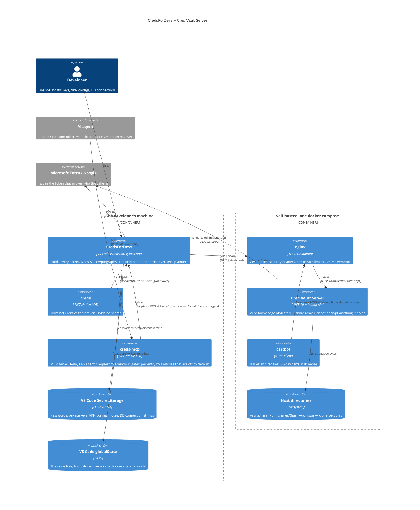
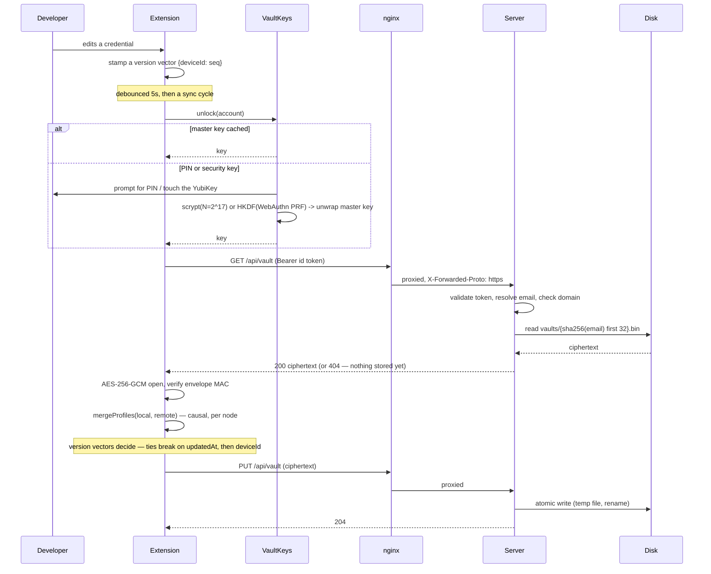

# Architecture

How the two halves of `dew_flow_creds_for_devs` fit together, and the one boundary that
everything else follows from.

> Cross-repository citations are **paths, not links** — a relative link that resolves only on one
> machine is worse than a citation naming its source.

## The system in one picture



## The trust boundary

**The server never holds a key that opens a vault.** Everything else in this document is
downstream of that sentence.

| | Sees plaintext | Holds a decryption key | Can forge a sender |
|---|---|---|---|
| The extension | yes — it is the only one | yes, derived from a PIN or a security key | n/a |
| The server | **no** | **no** | **no** — it stamps identity from a verified token |
| Anyone with disk access to the server | no | no | no |
| An AI agent granted access | **no** — it holds a capability token; the extension runs `ssh` on its behalf | no | n/a — its first use of a token needs a human's click |

The last row is the same sentence in a second setting: something is given the *use* of a credential
without being given the credential. The extension is still the only thing that sees plaintext; what
the agent has is a token that buys one entity's worth of work in the window that minted it, gated by
a modal and written down in an audit channel. See
[module_extension.md](module_extension.md#the-agent-broker--using-a-credential-without-handing-it-over).

What the server contributes is the thing a shared folder cannot: **authenticated identity**. It
knows who is calling, because the caller presents a token their identity provider signed, and it
uses that identity for exactly three decisions — which vault you may read, which inbox you may read,
and whose name goes on a share you send.

### Why that is worth a server at all

The extension works with no server, syncing through a shared folder. That mode has two problems the
server exists to solve:

1. **Everyone with folder access can read everyone's ciphertext.** Offline, at leisure. The only
   thing standing between them and the secrets is the strength of a PIN.
2. **A share's sender is a claim, not a fact.** Anyone who can write to the folder can drop in an
   item labelled "from your team lead". `research/PLAN_sharing.md` records this as a known
   residual; `todo/PLAN_nas_sender_pki.md` is the folder-mode answer nobody has needed enough to
   build, because the server answers it for free.

## What a sync actually does



The merge is **causal, not clock-based**: each node carries a version vector, and a vector that
dominates wins outright. Wall-clock time is only a tiebreaker for genuinely concurrent edits. That
is what lets two machines edit different credentials offline and both survive — see
[module_extension.md](module_extension.md).

## Cross-cutting concerns

### Identity

One flow, two providers. VS Code has a built-in Microsoft provider; it has none for Google, so the
extension registers its own (`googleAuthProvider.ts`) implementing the full authorization-code +
PKCE dance against a loopback listener. The server accepts **Microsoft access tokens** and **Google
id tokens** — the asymmetry is real and load-bearing: a Google access token is opaque and cannot be
validated by a third party, so the id token is what travels.

**The scope is a cross-module contract, and the server owns it.** A Microsoft token is only
usable if the extension asked Entra for the *operator's own* API scope; ask for `user.read` and
what comes back is a Graph token, which Microsoft makes unverifiable by third parties. That value
therefore has to travel from the deployment to every client, and having each developer paste it
into their own `settings.json` was the arrangement that produced this system's worst failure mode —
an empty Team, no error, nobody at fault. Since server 0.2.3 the server publishes it on the
anonymous `GET /api/client-config` and the extension configures itself; the local setting remains
as an override and still wins. Anonymous is not a concession here: the caller has no token yet by
definition, and a client id is public by construction.

A third scheme, `Local`, is an HMAC-signed token with no cloud dependency. It exists for air-gapped
deployments and for the test suite. Anyone holding its signing key can impersonate any allowed
email, which is why the deployment guide says to leave it empty wherever a real IdP exists.

### Authorization

Three rules, applied in this order on every authenticated request:

1. **The email comes from the token**, never from the request. `TokenIdentity.Email` walks a claim
   priority list and rejects a token that explicitly marks its email unverified.
2. **The domain must be allowed.** Outside `Vault:AllowedDomains` is 403, even with a perfectly
   valid token.
3. **The resource is derived from the email.** There is no vault id and no inbox id in any URL —
   `GET /api/vault` means *your* vault by construction, so there is no parameter to tamper with.

### Rate limiting

Two independent layers, because they defend against different things:

| Layer | Partitioned by | Stops |
|---|---|---|
| nginx | source IP | unauthenticated floods, before they reach the app |
| the app | **verified caller email** | one noisy account exhausting the service for everyone |

The app's layer requires the caller to be resolved *before* the limiter runs, which is why the
pipeline authenticates in middleware rather than inside each endpoint. Getting this wrong is not
hypothetical — see [SECURITY_REVIEW_2026-08-23.md](SECURITY_REVIEW_2026-08-23.md), finding 1.

### Storage layout

```
${DATA_DIR}/
  vaults/
    <sha256(lowercased email)[..32]>.bin      the encrypted vault blob
    <sha256(lowercased email)[..32]>.email    the plaintext email, for team discovery
  shares/
    <sha256(recipient email)[..32]>/
      <guid>.json                              one pending share
```

Filenames are hashed so the directory listing is not a staff directory, and the `.email` sidecar
exists only because team discovery needs to answer "who else uses this server". Writes are atomic
(write to a temp file, rename), which is what lets `backup.sh` run against a live server.

### Logging

Serilog, console plus **a new file per run** under `logs/{UTC date}/{app}-{HH-mm-ss}-{pid}.log`.
A file per run rather than a rolling daily file, because the question during an incident is almost
always "what did *that* run do". Levels come from configuration; changing verbosity is a config
edit and a restart, never an edited call site.

Container logs are separately capped by Docker's json-file driver at 10 MB × 5 per service, so a
log loop cannot fill the disk that holds the vaults.

### Error handling

The two halves answer failure differently, because they fail differently.

**Server.** One `UseExceptionHandler` at the edge logs the exception with its method and path and
returns a bare `{"error":"internal error"}` — the client is told nothing about internals. Below
that, expected failures are *values*, not exceptions: a missing vault is a 404, an oversize body is
a 400, a foreign domain is a 403. `catch` appears in exactly three places, and each one is a
boundary where continuing is correct rather than optimistic:

| Where | Catches | Why continuing is right |
|---|---|---|
| `VaultStore.ListVaultOwners` | `IOException`, `UnauthorizedAccessException` | One locked sidecar must not break team discovery for everyone |
| `VaultStore.ReadShareOrNullAsync` | `JsonException`, `FileNotFoundException` | One corrupted inbox item must not fail the whole listing |
| `CredVaultLogging` | `IOException`, `UnauthorizedAccessException` | An unwritable log mount is a degraded log, not an outage |

Startup is the opposite: misconfiguration **throws and stops the host**, because a credential
server that silently accepts everyone is worse than one that does not start.

**Extension.** Failures reach the user as a sentence, not a stack trace, and the sentences
distinguish causes that need different actions — "did not answer within 60s" is a different problem
from "unreachable", and a 401 ("sign in again") is different from a 403 ("outside the allowed
domain"). Decryption is the exception to all of this: a wrong PIN is detected *only* by the AEAD
tag failing, never by a heuristic, so there is exactly one way to be wrong.

### Build, test and release

**Separate workflows, not jobs in one file.** Each product owns a pipeline that appears under its
own name in the Actions tab, runs only when its own paths change, and fails on its own terms.

```
ci · extension      src_vs_code/**
                    npm ci -> typecheck -> node:test -> vsce package
                    (packaging proves the manifest is publishable)

ci · server         src_minimalapi_server/**, deploy/**, the MSBuild baseline
                    dotnet build -c Release -> the xUnit v3 runner EXECUTABLE
                    (never `dotnet test` — no VSTest host exists here)
                    + compose validated in all four TLS modes, + shellcheck
                         │
                         │ workflow_run, only on success
                         ▼
docker image        build -> RUN it -> wait for healthy -> assert 401 on /api/vault
                    -> on main: push :edge and :sha-<commit> to ghcr.io, multi-arch

docs · plans        plan-lifecycle.mjs + pin-check.mjs from the shared submodule

release             tag-driven: server-v* -> image, extension-v* -> Marketplace
```

`deploy/**` sits in the server's path filter deliberately: the compose stack is how this server is
delivered, so a change to it re-runs the server pipeline and therefore the image pipeline.

The image pipeline is **chained rather than parallel** — an image is not worth building from code
whose tests have not passed. `workflow_run` has two traps and both are handled: it fires on
completion regardless of outcome (so the job checks `conclusion == 'success'` itself), and it runs
in the context of the default branch (so the checkout names `head_sha`, or it would build main's
tip while claiming to build the commit that passed).

Two further properties worth naming:

- **The image is tested before it is published, and the publish reuses that build's cache**, so
  what reaches the registry is what passed. The push steps are gated on
  `github.ref == refs/heads/main`, so a pull request can never move a tag an operator pulls.
- **The docs are checked like code.** `plan-lifecycle.mjs` fails the build on a plan filed in the
  wrong folder, a missing status line, a link that does not resolve, or a `todo/README.md` index
  that has drifted from the folder. `pin-check.mjs` fails when the conventions submodule pin trails
  its remote.

Releases are tag-driven and per product — `server-v*` publishes a multi-arch image and moves
`:latest`; `extension-v*` publishes to the Marketplace and **refuses while the publisher id is
still a placeholder**. A tag never ships both.

## Module map

| Module | Document | What it owns |
|---|---|---|
| The extension | [module_extension.md](module_extension.md) | All cryptography, the data model, sync and sharing, the UI |
| The server | [module_server.md](module_server.md) | The HTTP contract, authorization, storage |
| The deployment | [module_deployment.md](module_deployment.md) | Containers, TLS, updates, backups |
| The CLI | [../src_cli/README.md](../src_cli/README.md) | `creds` — the terminal client of the broker. A .NET Native AOT binary holding no secret: it relays a request to the VS Code window named by a grant token and prints what comes back |
| The broker client | `src_broker_client/` | Discovery, the health probe, the wire contract and the WSL bridge — shared by both binaries, so a fix to any of it is made once. The bridge is an instance per binary (`WslInterop.Creds`, `WslInterop.CredsMcp`), each with its own override variable, because one shared `creds.exe` would have sent an MCP handshake to the CLI |
| The MCP server | `src_mcp/` | `creds-mcp` — what an AI agent talks to. Nine tools over the same broker (the ninth, `creds_config_snippet`, is read-only public text — how code reads a config, from the viewer's own catalog), every one gated by a per-entry switch that is off by default and by the same consent prompt. Holds no secret and can obtain none. **Inside WSL it carries the session rather than serving it** — see below |

### The MCP server inside WSL (2026-08-28)

An MCP client usually runs inside the distribution and starts `creds-mcp` as its own child, which
puts the server in a Linux kernel while the window it must reach listens on the **Windows**
loopback — and `127.0.0.1` there is the virtual machine's own. The announcement files are on
Windows too, at a `globalStorage` path whose shape depends on the VS Code edition.

So the Linux binary does not try to reach the window at all. It re-executes `creds-mcp.exe`
through WSL interop and becomes its stdio:

```
MCP client ──stdin──► creds-mcp (Linux) ──pipe──► creds-mcp.exe (Windows) ──loopback──► window
           ◄─stdout──                   ◄─pipe──
```

Three consequences worth stating, because each was a decision:

- **Nothing new listens anywhere.** The bridge is a process boundary, not a socket, so the broker
  stays exactly as loopback-only as it was — the same argument `creds` makes for the same trick.
- **A session is carried, not relayed.** `creds` uses `WindowsBridge.Relay` (one call, streams
  inherited, an exit code back); MCP is a long-lived JSON-RPC conversation in both directions, so
  this uses `StartPiped` and a pump that closes both halves together.
- **The Windows half does the finding.** No Linux-side guess at `/mnt/c/Users/…`, which breaks on
  the first machine whose disk is not `C:`.

`CREDS_MCP_WINDOWS_BINARY` overrides the executable — its own variable, never the CLI's. Design
record and what the build taught: [PLAN_mcp_wsl_bridge.md](PLAN_mcp_wsl_bridge.md).

## Where the contract lives

**Two contracts now, and both are implemented twice.** (Three binaries share the second: the
extension, `creds` and `creds-mcp` — which is why the C# half became a library rather than a copy.)

The HTTP contract between the extension and the server is stated once, in
[module_server.md](module_server.md), and implemented in `Program.cs` and
`src_vs_code/src/serverTransport.ts`. A change to one without the other ships a broken client,
which is why `CLAUDE.md` makes keeping them together a repository rule rather than a hope.

The **broker** contract — how a terminal client asks a VS Code window to use a credential —
used to be a TypeScript module shared by its only two callers, which made it a shared
implementation rather than a specification. With `src_cli/` it gained a second implementation in
another language, so since 2026-08-26 it is a generated file: `contract/broker-v1.json`, emitted
from `brokerProtocol.ts` by `npm run contract`, embedded into the CLI binary at build time, with
a test on **each** side asserting its own tables match it.

That check earns its place because this class of drift is silent. A client posting `vpn-up` to a
route the broker renamed, or reporting exit 95 where the other reports 0, raises no error
anywhere — it surfaces as an agent drawing a wrong conclusion in somebody’s terminal, with
nothing in any log to explain it. Exactly that bug was found on the Node side while the CLI was
being written: every verb whose answer carries no `exitCode` reported success as failure 95.
