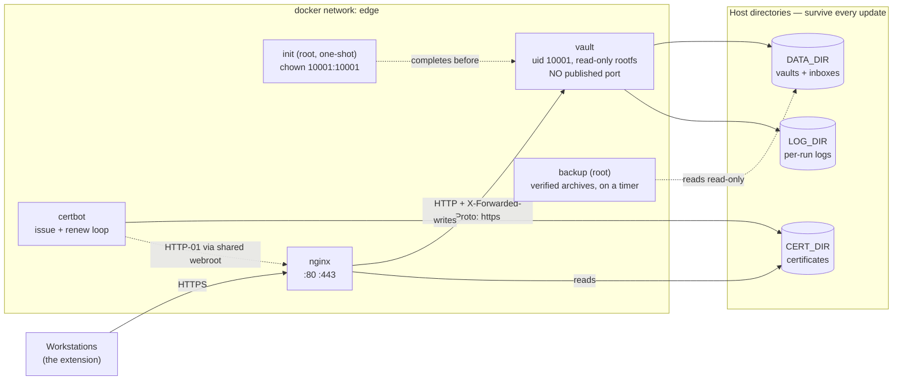

# Module: Deployment

`deploy/` — the one-command Docker stack. Operator-facing instructions live in
[deploy/README.md](../deploy/README.md); this document records *why* it is shaped this way.

## The stack



Five services, one of which exits immediately.

| Service | Runs as | Ports | Why it exists |
|---|---|---|---|
| `init` | root, one-shot | none, `network_mode: none` | Gives the bind mounts to uid 10001, then exits |
| `vault` | uid 10001 | **none** | The API |
| `nginx` | nginx | 80, 443 | TLS, headers, per-IP limiting, ACME webroot |
| `certbot` | root | none | Issues, then renews forever |
| `backup` | root | none, `network_mode: none` | Verified archives to one chosen path, on a timer. Reads the data **read-only** |

## Decisions worth recording

### The app publishes no port

`expose`, not `ports`. The only route in is nginx. This is what makes trusting
`X-Forwarded-Proto` correct: the header is only trustworthy when nothing can reach the app
directly, and here nothing can.

### `init` exists because of a bug this stack shipped with for an hour

A freshly created `./data` on a Linux host belongs to root. The app runs as uid 10001. It therefore
could not create `vaults/`, and `docker compose up -d` **crashed on first boot** — on every normal
Linux host.

It was invisible during development because Docker Desktop's Windows and macOS bind mounts are
permissive. The bug only appeared when the mount was placed inside the Docker VM. That is the whole
argument for `init`: the alternative is a manual `chown` in the README, which breaks the
one-command promise and is precisely the step people skip.

`init` is the only container here that runs as root. It has no network, no ports, and does one
`chown`.

### There is no self-signed placeholder certificate

The first version generated one so nginx could start before certbot had issued anything. Two things
were wrong with it:

1. **`openssl` is not in `nginx:alpine`.** The container crashed with exit 127.
2. More importantly, **the extension would reject the placeholder anyway** — it calls `fetch()` with
   no certificate override by design. All a placeholder achieves is turning a clear "TLS is not
   ready" into a confusing "your certificate is untrusted".

So: port 80 always listens and always serves the ACME challenge; port 443 does not listen at all
until a real certificate exists; port 80 answers everything else with

```
503  TLS is not ready: no certificate has been issued yet. Check: docker compose logs certbot
```

nginx re-reads every 15 s until the first certificate lands, then settles into a 6-hourly reload.

### nginx's own `default.conf` had to be deleted

`conf.d` loads alphabetically, so `default.conf` sorts before `vault.conf` and its `listen 80` block
became the default server for any Host not explicitly named — every request landed on the nginx
welcome page. The entrypoint removes it, and both server blocks are now explicit `default_server`s
so ordering can never decide this again.

### The template lives outside `/etc/nginx/templates`

The stock image renders everything in that directory *before* our hook runs, emitting a config with
empty certificate paths. It is mounted at `/etc/cred-vault/` instead.

### Reload on a timer, not on a deploy hook

certbot could notify nginx after a renewal, but every mechanism for that either shares the Docker
socket (which is root on the host) or needs a shared signal directory. A 6-hourly `nginx -s reload`
is cheap, never drops a connection, and keeps this container off the socket entirely.

### `certbot` idles instead of exiting

In `custom` and `none` modes it has nothing to issue. It sleeps rather than exiting, because an
`Exited (0)` container beside three running ones reads as a failure during every future incident.

## TLS modes

| `TLS_MODE` | Certificate source | Lifetime | Constraint |
|---|---|---|---|
| `domain` | Let's Encrypt HTTP-01 | 90 days | Public DNS + reachable :80 |
| `ip` | Let's Encrypt, `shortlived` profile | **~6 days** | A **public** IP; `--ip-address` needs certbot ≥ 5.4 with webroot |
| `custom` | You provide the files | yours | — |
| `none` | none | — | Only behind another TLS terminator |

**The `ip` mode's six-day lifetime is policy, not a setting.** Let's Encrypt began issuing IP
certificates on 2026-01-15 and requires the `shortlived` profile for them. An `ip` deployment whose
renewal loop is broken goes dark within a week, which is why `RENEW_INTERVAL_SECONDS` defaults to 6 h
and the README says not to raise it past ~12 h in that mode.

Private addresses (`10.x`, `172.16–31.x`, `192.168.x`) can never be certified — validation is an
inbound connection from the internet.

### The internal-network problem, stated plainly

The extension uses `fetch()` with no certificate override and **no way to trust an unknown CA**. So
on a private network:

- a bare self-signed certificate **will not work**;
- a **real domain certified by DNS-01** (which needs no inbound connectivity) pointed at a private
  IP, dropped in as `TLS_MODE=custom`, **does** — this is the recommended internal setup;
- an **internal CA already in every workstation's OS trust store** also works.

## Where the image comes from

CI publishes to **ghcr.io**, GitHub's own container registry — no second account, no second
credential, and `GITHUB_TOKEN` already carries `packages: write`.

| Tag | Published by | Moves |
|---|---|---|
| `:edge` | every push to `main` | constantly |
| `:sha-<commit>` | every push to `main` | never |
| `:1.4.0` | a `server-v1.4.0` tag | never |
| `:latest` | a `server-v*` tag only | on releases only |

`:latest` deliberately does not follow `main`, so an operator who pinned it never picks up an
untagged commit. Images are built for `linux/amd64` and `linux/arm64`, and the publish step reuses
the cache from the build that just passed the smoke test — what ships is what was tested.

A ghcr package is **private until its owner makes it public**, which surfaces as `denied` or
`manifest unknown` on an operator's first `docker compose up -d`. That is documented in
`deploy/README.md` with both fixes (change the package visibility, or `docker login ghcr.io`).

## Persistence and updates

Three bind mounts, no anonymous volumes: `DATA_DIR`, `CERT_DIR`, `LOG_DIR`. Nothing in `update.sh`
touches them; `docker compose down -v` is never used in any script here.

`update.sh`:

1. refuses to run against an invalid `.env`;
2. pulls **before** recreating, so a failed pull changes nothing;
3. pushes the outgoing tag onto `.update-state`, a trail of the last THREE deployments that `--rollback` pops from — so two bad releases in a row can both be stepped back over, and a plain refresh does not bury the real previous by pushing a duplicate. One deep, which is what this was until 2026-09-03, turns the case that actually happens into a rebuild under pressure (`development-workflow.md`, *A rollback must not BUILD*). The trail doubles as the retention policy: once the new container reports healthy, `prune_images` removes every image of OUR repository that is neither running nor on the trail — ours only by name, never `docker system prune -a` on a host that may be shared, and never when only one of ours is visible. Before this the host kept every image it had ever pulled;
4. recreates only `vault` (`--no-deps`), so TLS termination never blinks;
5. **waits for the healthcheck** and exits non-zero with the container's logs if it never goes
   healthy.

**Automatic updates were considered and deliberately not shipped.** Watchtower needs the Docker
socket — root on the host — and a credential server that pulls and runs new images unattended turns
a registry compromise into a full compromise. Pin a tag; run `update.sh` when you mean to.

### Backups: one path, and four rules that came from rehearsing a restore

The `backup` service writes a verified archive to `BACKUP_DIR` every `BACKUP_INTERVAL_HOURS`. That
path is the *entire* interface — a NAS mount, an rclone mount, a Google Drive or OneDrive sync
folder, another disk. Nothing in the server knows about any cloud provider, which is exactly why it
works with all of them.

`backup/backup-once.sh` is shared by the scheduled service and the manual `backup.sh`, so "what a
backup is" has one definition. Its four non-obvious rules each exist because of a specific failure:

1. **Write to `.tmp`, rename after verifying.** A sync client uploads whatever appears the moment
   it appears; a half-written file under the real name would be replicated as a backup.
2. **Skip when nothing changed.** A daily backup of a quiet vault would otherwise re-upload
   identical bytes to a metered folder forever.
3. **Refuse to archive an empty source when archives already exist.** Found by rehearsing: after
   the data directory was destroyed and the stack restarted, the scheduled run archived the *empty*
   directory. Archives sort by timestamp, so the empty one became "newest" and would have been what
   a restore picked — destroying the restore point at the moment it was needed.
4. **Retention never deletes the last archive.** A clock skew, or a destination unreachable for a
   month, must not turn "prune old backups" into "delete every backup".

`.env` is deliberately **not** in the archive: it holds `LOCAL_SIGNING_KEY`, and the destination is
frequently a cloud folder.

### Restore, rehearsed

`restore.sh` verifies the archive before touching anything, refuses one with no vault blobs, moves
the current data aside instead of deleting it, and **rolls back** on any failure past the point of
no return — restoring the displaced data and restarting the stack. That rollback exists because the
first rehearsal died on a bad archive and left the stack stopped with the data under another name,
which is worse than where the operator started.

The whole cycle has been exercised: vault written, data directory destroyed (server returning 404),
`restore.sh` run, vault readable again with its exact contents.

### There are TWO backups now, and both stay (2026-09-07, epic 5)

`backup.sh` and `restore.sh` are the HOST's. Epic 5 added the SERVER's — one encrypted `.cvbk`
archive the server takes itself, on a schedule an administrator sets from the editor, sent to an
S3-compatible bucket or an Azure Blob container. Neither replaces the other, and knowing which
question each answers is the whole reason both are here:

| | `backup.sh` / `restore.sh` | the server's own backup / `restore-archive.sh` |
|---|---|---|
| Who can take one | whoever has a shell on this host | an administrator with an editor and no ssh key |
| Encrypted | **no** — so wherever it lands has to be trusted | yes, AES-256-GCM in chunks, under a key the server never keeps |
| Where it lands | this host's `BACKUP_DIR` | this host's `org/backup/archives/`, and every configured cloud destination |
| What it holds | the data directory and the certificates | every vault, the sealed login keys, the registry, projects, the event log, and the server's own configuration as a snapshot |
| The key | none | the printable `BK1-` words, shown once and unrecoverable |
| Certificates | yes | **no** — they belong to the host rather than to the deployment, and are reissued rather than restored |

The certificate row is why `backup.sh` cannot simply be retired: a restore onto a fresh host still
wants `restore.sh`'s certificate handling, and the server's archive deliberately carries nothing that
belongs to the machine rather than to the deployment.

### `restore-archive.sh`, and the order it does things in

It takes the encrypted archive and asks for the backup key — from `--key-file`, from `CVBK_KEY`, or
from a silent prompt, and never as an argument, because an argument is visible in `ps` to every user
on the box and lands in the shell history. What it is handed goes into a mode-600 file in a scratch
directory removed on every exit path.

**Everything checkable happens before anything that currently works is touched.** The archive is
verified, the key is proved to open it, and the extraction goes into the scratch directory — only
when a complete tree exists on disk does the stack stop and the current data move aside. That
ordering is the point, and `restore.sh` learned it the hard way: its first rehearsal died on a bad
archive with the stack down and the data under another name. Here the same failure happens with the
server still running and nothing moved.

**A durable marker, not only a trap.** A trap does not run when the machine loses power, and the
state in between — data moved aside, nothing put back — is the one a person coming to it fresh cannot
read. `data.restore-in-progress` names the archive, the displaced directory and the instant, so
finishing or undoing an interrupted restore is reading one file rather than guessing from timestamps;
a second run refuses while it exists.

**The decoder is the deployment's own image, and that puts a rule on every future release.** The
script runs the archive verbs through `VAULT_IMAGE` — the tag from this deployment's `.env`, not a
reach for `:latest` — because the binary that reads an archive should be the one that writes them.
A review round asked what happens when a later release changes the format, and the answer is a rule
rather than a mechanism: **every format version this product has ever shipped stays readable by
every later server.** The archive carries its version in its header and a reader REFUSES a version
it does not know, so dropping a decoder fails loudly on an old archive rather than misreading one —
which is the property that makes the rule enforceable instead of hopeful. What is deliberately not
done is recording the writer's image reference inside the archive: that would pin a restore to a
registry tag that may not exist by the time somebody needs it, which is a worse dependency than a
versioned format read by whatever binary the operator has to hand.

**The configuration snapshot is printed by KEY and never by value**, and removed from the restored
tree. It holds the deployment KEK and the local signing key in clear — that is what it is for, so a
restore onto a fresh host can work — and this script's output goes to a terminal, a CI log or
somebody's scrollback.

`shellcheck` runs over it in `ci · server` from the day it landed, and so does
`deploy/restore-archive-itest.sh`, which RUNS it: it is the one script whose failure mode is a stack
that is down with the data moved aside, so a typo in it costs an outage.

### The script is driven as a program, with `docker` shimmed

Reading a script cannot check its ORDER, and the order is this script's entire design. So
`restore-archive-itest.sh` builds a throwaway `deploy/` directory, puts a fake `docker` on `PATH`
that records every invocation and answers from knob files, and runs the real script through seven
scenarios — 23 assertions. What it is able to say that no other tier can: *"the stack was never
stopped"*, as a fact about what reached `docker`, rather than *"the script printed something
reassuring"*.

The review round is what made this necessary: it found the unfinished-restore check sitting AFTER
`docker compose down`, so a retry took the running stack offline and only then refused — a second
outage handed to somebody already recovering from the first. Scenario 4 asserts that no
`compose down` reaches docker when a marker exists, and it goes red the moment that check moves.
The same round found `docker compose down` guarded with `|| true`, which would have moved a data
directory out from under a still-running server; scenario 5 pins that too.

**It is not the live-stack rehearsal, and does not claim to be.** No image is pulled, no server runs,
and nothing in it proves that a real archive from a real deployment restores onto a real host.
`restore.sh`'s cycle WAS exercised that way — vault written, data directory destroyed, restored,
vault readable again — and this one has not been. That is a **tracked exception to the Definition of
Done** rather than a checklist item quietly left unticked: the script ships with its decisions
exercised and its live rehearsal outstanding, named here, in
[PLAN_corp_server_backup.md](PLAN_corp_server_backup.md) and in the epic's summary.

## Hardening summary

| Control | Where |
|---|---|
| Non-root (uid 10001) | Dockerfile `USER vault` |
| Read-only root filesystem | compose `read_only: true`; only `/data`, `/logs`, `/tmp` writable |
| `no-new-privileges`, all capabilities dropped | compose `security_opt`, `cap_drop` |
| Memory limit | `VAULT_MEMORY_LIMIT`, default 512 MB |
| Log rotation | json-file, 10 MB × 5 per container — a log loop cannot fill the vault's disk |
| TLS 1.2+, HSTS, `nosniff`, `DENY`, `no-referrer`, restrictive CSP | `vault.conf.template` |
| gzip **off** | Vault blobs are incompressible ciphertext; compressing them would only add a BREACH-style side channel |
| Per-IP rate + connection limits | `limit_req_zone`, `limit_conn_zone` |
| Non-API paths 404 | There is no browser UI to serve |

## Verified, not assumed

Everything above was exercised on 2026-08-23 rather than reasoned about:

- image builds; container healthy; runs as uid 10001; `/app` write refused by the read-only rootfs
- **data survives a full container destroy + recreate from a different image** — the update guarantee
- `docker compose up -d` from **root-owned** bind mounts reaches healthy, and `init` leaves
  `10001:10001` behind
- the no-certificate state: 503 with an honest message, ACME path served, 443 closed, nginx stable
- the certificate state: HTTPS on TLS 1.3, HTTP→HTTPS redirect, all five security headers present
- a full authenticated round-trip over TLS — whoami, vault round-trip and isolation, team discovery,
  share delivery with server-stamped sender, recipient-only inbox
- `compose config` valid in all four TLS modes, and refused with a blank `ALLOWED_DOMAINS`
- per-run log files land on the mounted volume; a second run produces a second file
- shellcheck clean (bash and POSIX sh)

Corporate recovery was added to the stack on 2026-08-27 and exercised the same way. It is the one
setting here that changes what happens to **other people's** vaults, so nothing about it was taken
from the YAML:

- `compose config` resolves `CORP_RECOVERY_OFFICERS` / `_THRESHOLD` / `_SETUP_TTL_HOURS` when set,
  and to `""` / `2` / `72` when the `.env` never mentions them — an existing deployment that pulls
  this image gains no corporate recovery by upgrading, which is the only acceptable default
- the server, started with exactly those variables, logged the roster **WARNING** at startup and
  served `GET /api/org-recovery/config` to an ordinary account: the disclosure path works from a
  compose-shaped environment, not only from a test fixture
- an ordinary account was refused an officer endpoint (`403`) while an officer got their inbox
  (`200 []`) against the same running server
- both misconfigurations were watched being caught: `CORP_RECOVERY_THRESHOLD=1` and a two-officer
  roster each left the feature **off** with an `Error` line naming the fix, and the server started
  normally — corrected 2026-08-27 from a refusal to boot, which stopped ordinary vault sync for
  everybody over a feature nobody had enrolled in yet

All three roster branches were then watched again on **0.3.1 as deployed**, against the published
image on the production host, in throwaway containers (`--rm`, no volumes, no published ports,
their own random signing key) so the live stack was never involved:

| roster passed to the probe | observed |
|---|---|
| two officers | `ERR … names 2 officer(s); at least 3 are required` **then** `Application started` |
| three officers, threshold 1 | `ERR … Threshold is 1, which is outside 2..3` **then** `Application started` |
| three officers, threshold 2 | `WRN CORPORATE RECOVERY IS ON: 2 of 3 officers …` + fingerprint |

The `Application started` line is the whole point of the change and is why the probe greps for it
rather than for the error alone: on 0.3.0 the process exited instead. The production container's
own log contains no `CORPORATE` line at all, which is the fourth branch — no roster, feature off,
silent.

The keys are absent from `.env.example` on purpose until an operator writes them: an empty roster is
the feature switched off, and that is the state every deployment should be in until somebody decides
otherwise on the record.
