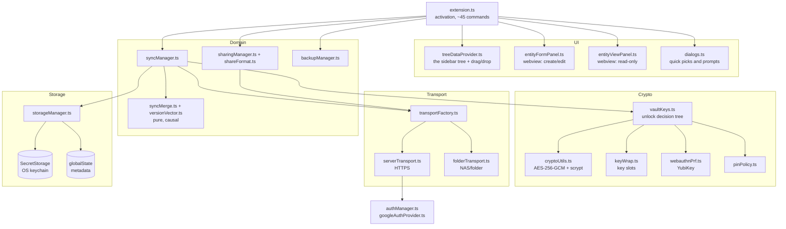

# Module: Cred SSH Manager (VS Code extension)

`src_vs_code/` — TypeScript, compiled with `tsc`, **zero runtime dependencies**: Node built-ins and
the `vscode` API only.

## Purpose

Keep a developer's SSH hosts, keys, VPN configs, database connections and passwords in the editor,
one tree per signed-in account, and connect with one click. Everything sensitive lives in the OS
keychain; everything that leaves the machine is encrypted first.

## Layers



### The `vscode`-free rule

`cryptoUtils`, `keyWrap`, `pinPolicy`, `shareFormat`, `syncMerge`, `versionVector`, `dbConnString`,
`googleOauth`, `backupNaming`, `defaultFolders`, `secretClipboard` and `serverTransport` import **no
`vscode`**. That is why their edge cases are real unit tests under `node:test` rather than hopeful
comments — no VS Code test harness is needed anywhere. Keep new pure logic on that side of the line.

## Data model

`TreeNode` is stored **flat**; the tree is derived from `parentId` at render time.


| Data | Where | Encrypted by |
|---|---|---|
| Passwords, private keys, VPN configs, notes, DB connection strings | `SecretStorage` | the OS keychain |
| Node tree, tombstones, version vectors, device id | `globalState` | nothing — it is metadata |
| The off-machine vault blob | NAS folder or server | **this extension**, AES-256-GCM |

The extension's own crypto wraps only what *leaves* the machine. Local storage is protected by the
OS keychain, which is the platform's job.

## Cryptography

### The envelope

Two versions, both AES-256-GCM with a fresh 16-byte salt and 12-byte IV per encryption:

- **v1** — payload sealed directly under `scrypt(accountId + PIN)`.
- **v2** — payload sealed under a random 256-bit **master key**; the master key is itself wrapped
  once per unlock method (`KeyWrap[]`). A LUKS-style key-slot design: adding or removing a YubiKey
  rewrites one small wrap record, never the payload.

| Parameter | Value |
|---|---|
| KDF | scrypt, `N=2^17`, `r=8`, `p=1` (legacy blobs: `N=2^15`) |
| Cipher | AES-256-GCM, 128-bit tag |
| WebAuthn wrap | HKDF over the PRF secret, `info="cred-ssh-manager/webauthn"` |
| Envelope MAC | HMAC-SHA256, `info="cred-ssh-manager/envelope-mac"`, compared with `timingSafeEqual` |

**KDF parameters are recorded in the blob**, so raising the cost never orphans an old vault, and
`kdfMigration.test.ts` proves both that the round-trip works and that a mismatched recorded `N`
fails through the auth tag rather than silently producing garbage.

The v2 envelope carries an HMAC over its own plaintext metadata (`format`, `version`, `account`,
`wraps`) — the fields the GCM tag does not cover. `shares` is deliberately excluded, because other
users legitimately append to it; that exclusion is the root of finding 3 in
[SECURITY_REVIEW_2026-08-23.md](SECURITY_REVIEW_2026-08-23.md).

### Unlocking

`VaultKeys.unlock()` tries, in order: the in-memory cache → a PIN wrap → a security-key touch
(interactive only) → an explicit PIN prompt. The master key then stays cached for the window's
lifetime; `Cred SSH: Lock Vaults` is the only eviction, which is finding 5 in the review.

## Sync

Per-account cycle in `syncManager.ts`: read remote → unlock → decrypt → `mergeProfiles` → write back
what changed. Debounced 5 s after any mutation, plus on startup and every
`autoSyncIntervalMinutes` (default 5). A single-cycle guard prevents overlap.

**Conflict resolution is causal.** Each node carries a version vector `{deviceId: seq}`:

- a vector that **dominates** wins outright;
- genuinely **concurrent** edits fall back to `updatedAt`, then to the lexicographically greatest
  `deviceId` — deterministic on every machine, which matters more than being right;
- a per-profile **horizon** (the element-wise maximum ever seen) lets 90-day-old tombstones be hard
  deleted without a stale backup resurrecting the entry it deleted.

That last point is the subtle one, and `syncMerge.test.ts` covers it explicitly: *"a >90-day-old
backup cannot resurrect a deleted entry after tombstone GC"* and *"a genuinely new offline node
(beyond the horizon) is NOT rejected as a phantom"*.

## Transports

`isServerLocation(location)` — `/^https?:\/\//` — is the entire routing rule. A URL means the
server; anything else is a folder path.

| | `ServerTransport` | `FolderTransport` |
|---|---|---|
| Reaches | `https://vault.company.com` | `Z:\Backups`, `/mnt/nas`, `\\NAS\Vault` |
| Auth | Bearer token per request | folder ACLs |
| Shares | server-side inbox, sender stamped | a plaintext array inside the recipient's envelope |
| Sender identity | **unforgeable** | claimed, forgeable by anyone who can write |
| Timeout | **60 s** per request | filesystem |

### The server transport's timeout

`fetch` has no timeout of its own. Until 2026-08-23 a server that accepted the connection and then
stopped answering left the request pending for the life of the window — and because the sync cycle
awaits it under a one-at-a-time guard, nothing synced again. Every request now carries
`AbortSignal.timeout(60_000)`, and a timeout is reported differently from a refused connection
because they are different operational problems.

### Tokens

`transportFactory.tokenFor` resolves per provider: Microsoft gives `session.accessToken` from the
built-in provider; Google gives the **id token**, because a Google access token is opaque and the
server could not validate it.

## Sharing

`sealShare()` encrypts a `SharePayload` under `scrypt(recipientKeyId + PIN)`, where `recipientKeyId`
is the recipient's `accountId` for folder transport and their **email** for the server. The
recipient tries every PIN they know against every pending item (`resolveShares`), which is what
makes "Accept all" work without a key exchange.

The payload is authenticated by GCM. The surrounding metadata — `fromEmail`, `entityName`,
`entityKind`, `createdAt` — is **not**, which is a spoofing surface on the folder transport and
finding 3 of the security review.

## Secrets at rest and in flight

| Path | Handling |
|---|---|
| Clipboard | Every secret copy expires after **45 s**, and only if the clipboard still holds exactly what was copied (`secretClipboard.ts`) |
| SSH private key on disk | Materialised only when `ssh -i` needs a path; `0600` in a `0700` directory under the extension's own storage — never the OS temp dir — and purged on activate, on deactivate, and when the terminal closes |
| Terminal | `buildSshCommand` composes host/user/port/key-*path* only. No password ever reaches a command line |
| Webviews | `default-src 'none'`, nonce-based scripts, `localResourceRoots: []`, everything escaped. The read-only viewer never receives secret values at all — copy actions round-trip through the extension host |

## Build and test

```bash
cd src_vs_code
npm ci
npm run typecheck          # tsc --noEmit
npm test                   # tsc && node --test "out/test/*.test.js"
npm run package            # vsce package
npm run icon               # regenerate media/icon.png
```

**79 tests**, all `node:test`, ~13 s. Note the glob in the test script: `node --test out/test/`
resolves the directory as a module on Node 22+ and exits `MODULE_NOT_FOUND` — the suite silently ran
nothing before 2026-08-23.

`scripts/server-transport-itest.cjs` is a separate integration test that drives the compiled
transport against a live server; it stubs `vscode` with a `Module._resolveFilename` patch and is not
part of `npm test`.

## Marketplace packaging

`media/icon.png` (128×128) is generated by `scripts/generate-icon.mjs` — a dependency-free
rasteriser that draws the same key glyph as `media/icon.svg` and encodes the PNG with `node:zlib`.
The Marketplace rejects an SVG in the `icon` field, and a committed binary nobody can regenerate is
worse than a script. Full publishing procedure: `src_vs_code/docs/PUBLISHING.md`.
