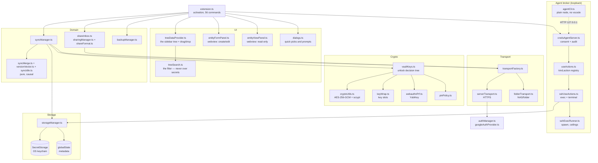
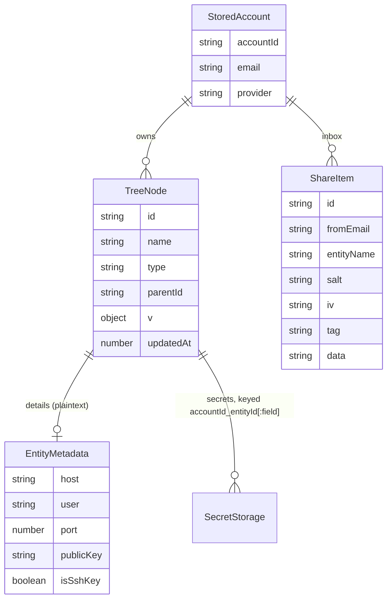
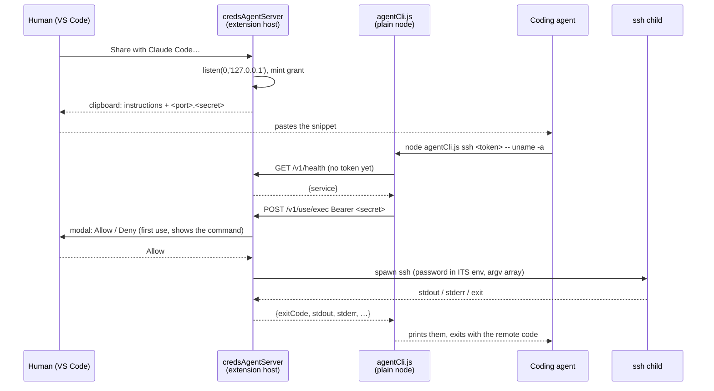

# Module: CredsForDevs (VS Code extension)

`src_vs_code/` — TypeScript, compiled with `tsc`, **zero runtime dependencies**: Node built-ins and
the `vscode` API only.

## Purpose

Keep a developer's SSH hosts, keys, VPN configs, database connections and passwords in the editor,
one tree per signed-in account, and connect with one click. Everything sensitive lives in the OS
keychain; everything that leaves the machine is encrypted first.

## Layers



### The `vscode`-free rule

`cryptoUtils`, `keyWrap`, `pinPolicy`, `shareFormat`, `syncMerge`, `versionVector`, `dbConnString`,
`googleOauth`, `backupNaming`, `defaultFolders`, `secretClipboard` and `serverTransport` import **no
`vscode`**. That is why their edge cases are real unit tests under `node:test` rather than hopeful
comments — no VS Code test harness is needed anywhere. Keep new pure logic on that side of the line.

`sshCredential` belongs on that list too, and for the reason the rule exists: it decides which secret
an SSH connection authenticates with — referenced key entity, stored key, key path, password, in that
order — for **both** the human Connect path and the agent broker. A regression there changes two
surfaces at once, so the order is asserted in `sshCredential.test.ts` rather than re-derived by
whoever reads it next. (The empty-string `sshKeyPath` case has its own test: historic entities use it
to mean "no `-i` flag", and reading it as falsy would start sending stored passwords to hosts only
ever reached with a key.)

The agent broker added a second reason to stay on that side: `grantToken`, `grantRegistry`,
`useActions`, `brokerProtocol`, `sshExecCommand`, `agentCliArgs`, `agentShareSnippet` and
`agentAuditLog` are `vscode`-free because **`agentCli.ts` runs under plain `node`** and imports them.
A `vscode` import anywhere in that graph is not a testing inconvenience there; it is a CLI that
cannot start.

## Data model

`TreeNode` is stored **flat**; the tree is derived from `parentId` at render time.



| Data | Where | Encrypted by |
|---|---|---|
| Passwords, private keys, VPN configs, notes, DB connection strings | `SecretStorage` | the OS keychain |
| Node tree, tombstones, version vectors, device id | `globalState` | nothing — it is metadata |
| The off-machine vault blob | NAS folder or server | **this extension**, AES-256-GCM |

The extension's own crypto wraps only what *leaves* the machine. Local storage is protected by the
OS keychain, which is the platform's job.

### The kind is carried, not re-derived (0.58.x, audit A4)

An entity now states what it is: `EntityMetadata.kind`, read through **`resolveKind`** in
`entityKind.ts` — the only code allowed to fall back to the old flags. `kindOf` still exists
but is reachable only from there; nothing else in `src/` calls it any more.

- **Migration is the fallback, not a rewrite.** A record written before the field existed has
  no `kind`, so `resolveKind` derives it from the flags exactly as before. No vault is
  converted, no version is bumped, and a record from a NEWER build carrying a kind this one
  does not know falls back rather than being thrown away.
- **A write states the kind AND keeps the flags in step.** `stampKind` runs inside
  `StorageManager.stampVector` — the one line every local write already passes through, so no
  call site can forget it. The flags are rewritten *from* the kind (a stale flag would win on
  an older machine and make the entity two things at once), and they are still written at all
  because a vault syncs to builds that predate the field: dropping them would make every
  synced entity read as a plain credential over there and silently lose its Connect, Start
  and Run. They are a compatibility shim with a defined end, not a second source of truth.
- **A new kind is a build error.** `kindIcon` ends in `assertNever`, and the two label tables
  are `Record<EntityKind, …>`. Verified by adding a hypothetical `totp` kind: three compile
  errors, one of them *"Argument of type `'totp'` is not assignable to parameter of type
  `never`"*. That is the guarantee S5 asked for — `terminal` in 0.26.0 and the missing
  `script` selector entry were both this defect.
- **`oneUse` cannot be set on a kind the broker never serves.** A burn fires only through the
  broker and the broker does not serve `sshkey`, so `{kind: 'sshkey', burnPolicy: 'oneUse'}`
  would be a promise nothing could keep — the entry living forever while the UI said it would
  vanish after first use. `stampKind` drops it on write, so the impossible state cannot reach
  the vault even if a form offers it. Temporary SSH keys for a customer's instance are the
  first thing anyone reaches for here, which is why this is refused rather than documented.
- **"Can I connect over SSH" is one predicate, and deliberately broader than the kind.**
  `canConnectSsh` — the tree keyed its `:ssh` menu on a host being present while `kindOf` keys
  the kind on `isSshEnabled` (the S5 divergence). They are one named function now, and the
  breadth is kept: narrowing it would remove Connect from host-bearing entries that have it
  today, which is a product decision rather than a refactor. Stated and tested, not left to be
  re-discovered.

### Entity kinds — one list, three consumers

A node's kind is not a stored field. It is **derived** by `kindOf()` from the flags in
`EntityMetadata` (`isSshKey`, `isVpn`, `isDb`, `isTerminal`, host present, …), which is why an
older vault syncs into a newer extension without a migration: an entry written before `terminal`
existed simply has no `isTerminal`, and reads back as a credential.

Three surfaces need that list — the folder-type picker, the entity form, and the tree's icon and
`contextValue`. `ENTITY_KINDS` and `ENTITY_KIND_LABELS` in `types.ts` are the single source, and
`types.test.ts` fails when a kind has no label. This is written down because the alternative was
tried: the picker held its own hand-written copy of the five kinds it knew, so `terminal` shipped
in 0.26.0 as a type **nobody could select**. Default folders seed once, at account creation, so a
brand-new profile had the folder and every existing account had no way to make one — the feature
looked present in testing and absent in use.

| Kind | Recognised by | Action it adds |
|---|---|---|
| `credential` | nothing more specific matches | copy password |
| `ssh` | `host` | Connect via SSH (green triangle) |
| `sshkey` | `isSshKey` | install to `~/.ssh`, materialise for `ssh -i` |
| `vpn` | `isVpn` | Start / Stop (WireGuard, OpenVPN — green triangle), copy config |
| `db` | `isDb` | open in a DB extension |
| `terminal` | `isTerminal` | Run in Terminal (green triangle), Copy Command |

### Terminal commands

A CLI invocation is stored as a verb plus **rows**, never as one string: `args: CommandArg[]`,
each with its own value, its own note, and an enabled flag. `commandLine.ts` is `vscode`-free and
holds the whole of the logic — `normalizeArgs`, `buildCommandLine`, `describeCommand`.

The row shape is the feature. What is forgotten about `aws sso login --sso-session OD-org` a week
later is never the verb; it is which value belongs to which environment and why, so every argument
carries its explanation next to it. A disabled row keeps a flag you are not using now (`--debug`)
without it reaching the command line — deleting it means retyping it from memory later.

`Run in Terminal` sends the line **with** a newline: it executes. The first implementation stopped
at the prompt and left Enter to the user; the operator overruled that, and it is theirs to
overrule — these are commands the user wrote and saved, not commands arriving from elsewhere.
`Copy Command` covers "let me edit it before it runs".

### VPN start and stop

`vpnCommand.ts` (pure, `vscode`-free) composes the line; `runVpn` in `extension.ts` writes the config
out and shows it in a terminal.

**Elevation is deliberately the OS's.** Both tools create a network interface, which an editor
extension cannot be granted, so the command is *shown* and the prompt is UAC (`Start-Process -Verb
RunAs`) or `sudo`. Nothing is elevated silently and the line is on screen before it runs.

Three constraints that are encoded rather than remembered:

- `wg-quick` derives the interface name from the **file** name, and the kernel's `IFNAMSIZ` caps it
  at 15 characters — so `vpnTunnelName` sanitizes and truncates, and `materializeVpnConfig` takes a
  file name instead of using the entity id.
- The config lands in the same `keys/` directory as materialized SSH keys, so the existing purge on
  activate and deactivate covers it. On Windows the `0600` mode is advisory; the NTFS ACL of the
  extension's storage under the user profile is what actually protects it.
- **Stop never needs the vault.** A locked vault must not be able to strand a tunnel that is up,
  which is why only start re-materializes the config and stop works from the tunnel name.

Only WireGuard and OpenVPN get a button — the tree adds `:vpnrun` to `contextValue` for those. IKEv2
and L2TP are OS-level profiles; a button for them could only ever explain itself.

### Pasting a command

`commandParse.ts` splits a pasted line into a verb and argument rows; `helpText.ts` reads what each
flag means out of the tool's own `--help`; `helpLookup.ts` runs it. The split is the inverse of
`buildCommandLine` and a round-trip test asserts it: a parse that silently changes a command would be
worse than no parse.

Where the verb ends is a guess with no signal to settle it — `aws sso login` and `docker run nginx`
are indistinguishable — so the rule is "subcommand-shaped tokens, at most three", and the answer
lands in an editable field rather than being applied invisibly.

**What may be executed.** Reading a description means running a binary named in a text field, and a
*shared* entry is exactly where a hostile one would come from. `isProbeSafe` therefore whitelists:
every word must be letters, digits, and the few marks real tool names contain. Anything with a shell
metacharacter is never run — which also sidesteps the Windows problem that `aws`, `npm` and
`terraform` are `.cmd` shims Node refuses to spawn without a shell. `credSshManager.readCliHelp`
turns the whole lookup off; rows still split.

Two defects here were found only by running it against real tools after every invented case passed:
a usage synopsis served as a description (`git commit -m` → `[--allow-empty-message] …`), and a
wrapped description truncated at the first line break (`docker run --rm` → "Automatically remove
the"). Both now have tests built from the real output.

### Small shared utilities (audit A1)

`describeError.ts`: the error-to-sentence rule (`Error` → its message, anything else →
`String(...)`) that 21 call sites carried inline and two files had grown named copies of —
`backupManager.describeUnknown` even special-cased `BackupError`, which extends `Error`, so
the case changed nothing. `StorageManager.exportSecretsFor(accountId, ids)`: the seven-kind
secret walk the external export used to hand-roll beside `exportBundle`'s own walk; absent
kinds are absent keys, entities without secrets keep their slot. (`sshUseActions.ts` still
carries two inline ladders — owned by a parallel work stream at extraction time.)

### The `vscode`-free rule, applied late

`entityText.ts` (the details block / `Copy All`) and `sshCommand.ts` (the `ssh` line) were carved out
of `dialogs.ts` and `terminalManager.ts` because of a bug, not for tidiness: a terminal entry
rendered its name and nothing else in the viewer and in `Copy All`, and neither could be tested
where it lived. An entire entity kind was missing from both and no suite could notice. The
regression test exists because of the move — which is the argument for the rule generally.

### Snapshots: two settings, both per-account

The folder (`accountBackupPaths` → `backupLocation`) and the schedule (`accountBackupIntervals` →
`backupIntervalHours`) are shaped identically and set from the same account menu — *Set Backup
Location…* and *Set Backup Schedule…*. Per-account because the menu item sits on an account, and a
schedule set there that silently changed every other account is a worse surprise than no menu item.

`describeInterval` / `INTERVAL_CHOICES` live in `backupSchedule.ts` (pure): the setting is in hours
because a timer needs hours, and nobody picks a schedule by thinking "168". The scheduler's own
`onDidChangeConfiguration` listener restarts it, so writing the setting is the whole of applying it —
there is deliberately no second `reschedule()` path.

### `Backup to NAS` and the key wraps

`backupPlan.ts` decides how a vault file may be written, and it exists because the answer was wrong.
`backupToNas` asked for a master PIN and wrote the PIN-only v1 envelope — over **the same file the
sync transport uses**, since both take the name from `planBackupFileNames`. A vault with a security
key registered came back as one without: the wraps were overwritten, silently, and the key stopped
opening it.

`backupWriteMode(existingRaw)` reads what is in that file, keyed off a **security-key** wrap (not "any
wrap"). `wrapped` → a webauthn slot is present, so the backup is opened through the vault's own key
slots (`VaultKeys.unlock` + `VaultKeys.encrypt`) and its master IS the sync vault's master — safe to
share the per-account key cache. `pin` → no vault yet, a legacy v1 file, or a v3 backup with only a
pin-wrap: opened by its **standalone backup PIN** through a self-contained `wrapPinVault` /
`unwrapWithPin`, never through the cache (which is keyed per account and would otherwise shadow the sync
master with the backup's freshly-minted one). **Unparseable content returns `wrapped`** — the
non-downgrading answer. Since the v1 retirement, the `pin` path writes **v3** (a pin-wrap under the
backup PIN), so backups upgrade on their next run; a legacy v1 backup still restores with its PIN.
Dated snapshots copy the sync ciphertext and never touch a key, so they are v3 whenever the sync vault
is.

### Security keys: the envelope arithmetic is its own module (audit A1)

`securityKeyOps.ts` (pure, `vscode`-free) computes the NEXT envelope for Add/Remove Security
Key; the two handlers hold only the ceremony and the conversation. Four regimes, each a unit
test against the real crypto (`securityKeyOps.test.ts`): add-to-wrapped adds a slot around the
SAME master (the PIN keeps opening it); add-to-legacy refuses without a PIN, else upgrades to a
fresh master under PIN + key; remove-last-key re-keys so the removed key and every stale backup
holding its wrap stop opening future versions; remove-one-of-many drops the slot, re-signs
around the same master, and reports `rekeyed: false` so the caller says out loud that existing
copies stay openable.

### Security keys: the user handle must be stable

A discoverable ("resident") credential is keyed by `(RP ID, user.id)`. `RP_ID` is fixed, so `user.id`
carries the whole identity — and it was 16 random bytes minted at each registration, which meant
re-registering an account never replaced its own credential. It added another. A YubiKey 5 holds
about 25, cannot be told to drop one from here, and a full authenticator **refuses `create()`**,
which presents as the dialog reappearing.

`webauthnUserHandle(email)` in `cryptoUtils.ts` is now that identity: SHA-256 of the lowercased
email, so the same account replaces its own slot from any machine. Hashed because `user.name`
already carries the readable address; the identifier need not be reversible too.

### Seeding defaults needs evidence, not silence

Sign-in pulls the remote vault, quietly, before deciding whether to create the default folders — and
swallows failures, which on a fresh machine is the *normal* outcome because no sync PIN is stored
yet. An empty local tree then looks exactly like a brand-new account, so the defaults were created;
the next successful sync brought the account's real folders, whose ids differ, and the merge kept
both. Two `db`, two `vpn`, two of everything.

`RemoteState` (`no-location` | `empty` | `unknown`) is the missing third input to
`shouldSeedDefaults`. `probeRemote` answers it **without decrypting**: a vault file that exists is
proof the account has a structure, and that is the entire question — being unable to open it yet is
the ordinary state of a machine that has just signed in. Unreachable counts as `unknown`, never as
`empty`.

The seeded flag is also claimed before the first `await`, so two concurrent sign-in flows cannot
both pass the guard.

### Env bindings: names travel, values never do

`envBinding.ts` (pure) + `envApply.ts` (the collection writer). A secret field can be exported into
VS Code's environment variable collection — injected into every integrated terminal opened
afterwards, persisted across reloads. The binding's NAME lives in `EntityMetadata.envBindings` and
syncs (it is not a secret); the VALUE is written only locally, from this machine's SecretStorage, on
save or via the viewer's `Set` button. That button exists because the collection can be lost with
the extension's storage — recovery must not require re-saving the entity. `staleEnvNames` is why a
renamed or disabled binding is deleted from the collection on save instead of surviving forever —
with the guard that a name another field still binds is not deleted.

The viewer shows env UI **only for fields whose binding is on**: the name, a copy-name button, and
`Set`. Default name shape: `ENV_<ENTITYNAME>_<FIELD>` (`defaultEnvName`), minted in the form when
the toggle is switched on and editable after.

### Attachments: one file, one image, per entity

`attachment.ts` (pure) owns the rules: an allowlist of document formats (PDF, Office, text, data,
archives) with the executable family refused even as the tail of a double extension; the popular
image formats; a 4 MB cap; and the mime map the preview needs. The `accept` lists and the webview's
inline regexes are derived from the same arrays — two lists that drift is a picker offering what the
save refuses.

Content is base64 in SecretStorage (`:attachment` / `:image` keys) and rides the same records as
every secret: `exportBundle` → sync merge (`copySecret`, winner's value) → `importBundle`, backups
and snapshots included. The display NAME sits in plaintext metadata (`attachmentFileName` /
`imageFileName`), the same trade `vpnConfigFileName` already made, so the viewer can label a row
without opening the vault.

One deliberate exception to "secrets never enter the webview": the image preview. A preview cannot
round-trip through the host, so the viewer receives a `data:` URI for exactly this one secret, under
a CSP whose `img-src` allows only `data:`. Preview starts at 200×200; each click doubles it, twice;
a third click resets.

### The plaintext-leak audit (0.50.0)

Every place a secret could be read without opening the vault, and what closed it.

| Was | Now |
|---|---|
| `substituteScript` baked variable VALUES into the body, and the body went to disk and into the viewer | `resolveScriptEnv` translates `${NAME}` into the language's own env read (`$NAME`, `$env:NAME`, `os.environ.get`, `process.env.NAME`) and returns the values separately, for the child's environment only. Consequence: a **fresh terminal per run**, because VS Code sets a terminal's env only at creation — the SSH password path already made that trade |
| a script could still print its own variables | `detectSecretPrints` — a narrow heuristic over the ORIGINAL body, asked once per exact content, ignoring the normal case of passing a variable to a tool. Advisory, never blocking: this is the user's own code |
| `runScript` had no trust gate while `runCommand` did | scripts now share `commandTrust`. Sync and Accept Share are first-class features, so "you wrote this yourself" is not true of a stored script either |
| `envProbe` echoed `NAME=value` — a bound private key went to scrollback in full | `NAME: SET (len=N)` / `NOT SET`, per shell dialect; an invalid env name is refused rather than interpolated into a shell line |
| `chmod 0600` on Windows, described in comments as protection | `fileAcl.restrictToOwnerArgv` + `lockToOwner` at all four secret-write sites: `icacls /inheritance:r /grant:r <owner>:F`. The inherited ACL grants SYSTEM and local Administrators full control of everything under the user profile — the wrong audience exactly where the operator is not the administrator. Measured on the operator's own machine before deciding |
| `installKeyToSystem` was silently permanent | says so, and `removeInstalledKey` is the way back |
| DB Connect put the connection string INCLUDING the password on the clipboard, silently | the message says it, and `Copy Connection String (no password)` (`withoutPassword`, textual so query-string options survive) is the companion |
| the 45 s clipboard TTL implied completeness | `secretClipboardTtlSeconds`, and the description states what no extension can control: Windows Clipboard History captures the value at copy time, and clearing the clipboard never reaches it |

One leak was **introduced and fixed in the same day** (0.48.0 → 0.49.1): the script viewer
rendered variable values unmasked into the webview. Recorded here rather than quietly
patched, because the invariant it broke — "the read-only viewer never receives secret
values" — is stated in this file, and a broken invariant that leaves no trace is one that
breaks again.

### Multi-select (0.51.0)

`canSelectMany` plus `selectionResolver.ts`, and the resolver exists for one constraint:
**VS Code evaluates a menu's `when` clause against the anchor row only**, never the
selection. So a folder can sit in a selection whose anchor was an entity, and a foreign
profile's node in one whose anchor was yours — the menu offers the command regardless.
Three rules, all tested: non-node rows out (counted), the anchor decides the profile
(others counted), and a folder swallows its own selected descendants at any depth
(silent — an ordinary shift-click, not a mistake).

Delete is **sequential and must be**: every storage mutator is an unlocked
read-modify-write of one array per account, so concurrency would drop deletions silently.
Export unions subtrees with no second dedup — the resolver guarantees no overlap, and a
defensive pass would mask a resolver bug instead of surfacing it. Share unions payloads
into the delivery batch that was already N-safe.

### The broker beyond SSH (0.52.0)

Five kinds joined the `(kind, action)` registry; `useActions.ts` and `credsAgentServer.ts`
needed **no change** — the seam worked as designed. `runBounded` was extracted from
`sshExecRunner` because none of its ceilings were ever ssh-specific.

| Kind | Action | Where the secret goes | Note |
|---|---|---|---|
| `script` | `run` | child env (`resolveScriptEnv`) | body ignored; content-trust required |
| `terminal` | `run` | none — no secret field | body ignored; the ONE `shell: true` caller, safe because no agent text is in the line |
| `db` | `query` | `PGPASSWORD` / `MYSQL_PWD` / `SQLCMDPASSWORD` | only host/port/db on the command line — argv is world-readable in the process list |
| `credential` | `exportEnv` | the env collection | answers with NAMES; narrow, and the consent text says so |
| `vpn` | `up`/`down` | materialized config | opens the human's terminal — no headless child can answer a UAC prompt |

**MongoDB is refused, deliberately.** `mongosh` has no password environment variable and
its `--eval` runs in the same JavaScript interpreter that can read `process.env` — an
agent's "query" could print the password straight back. No SQL tool has that channel
because SQL cannot read an environment. A capability that leaks by design is worse than an
absent one.

`sshkey` is excluded: a key means nothing except attached to a host, and that host entity
already has `exec`.

### Re-shares, dates and history (0.53.0)

`shareOrigin.ts` — a **local** map keyed by *(sender address, sender's own entity id)* —
answers "is this an update of something I already accepted from them". The keying is the
whole design: letting the sender name a local id is precisely the attack the original
always-fresh-id rule was written against, so the map is ours and a sender can never
address an entry they never sent. Dismissing the Update/Keep-both dialog **leaves the
share in the inbox** — the decision needs a look at what is already there, and consuming
the item to ask would destroy the only copy of it.

`createdAt` is stamped in `addNode` and never moved by `updateNode`; both dates show in the
viewer and the edit form, and pre-0.53 nodes say the creation date is unknown rather than
inventing one.

`revisionHistory.ts` keeps **3** versions in SecretStorage — a replaced password is still a
password — recorded before an edit or an accepted update overwrites anything. Two limits
are documented rather than left to be found: **no attachments** in a revision (three copies
of a 4 MB file per entry costs more than the history is worth) and **history is
per-machine**, not in the sync bundle. Entries with history wear a theme-coloured icon; the
flag is cached on the provider because reading history means reading SecretStorage, which
`getTreeItem` cannot await.

### The tree filter (0.55.0)

`treeSearch.ts` is `vscode`-free and holds the whole semantics; the provider only routes.
The first root the provider returns is always `{ kind: 'search' }` — the filter row, above
the first account — and it is returned **unconditionally**, including when the filter hides
every other row. A clear button that vanishes with the rows it filtered out leaves no way
back but reloading the window.

What a term is matched against is the one decision with a security argument behind it. It is
the text the row already shows: name, folder type, user, host, port, db/VPN type, `command`,
`commandNote`, `sshKeyPath`, `scriptLanguage`. It is **never** a secret — not `password`,
`privateKey`, `vpnConfig`, `dbConnection`, `notes`, the script body or a script variable's
value. A filter over secrets is an oracle: it answers "does this password contain `Tr0ub4`?"
to anyone at an unlocked window, one keystroke at a time, without opening an entry and
without a line in any of the places a revealed secret is recorded. The rule is therefore
stated as: if the row does not say it out loud, typing it will not find it — and it is a
test, not a convention (`treeSearch.test.ts` asserts that no secret field is reachable by
any term).

Three behaviours that are decisions rather than side effects:

- **A folder is kept when a descendant matches**, and while filtering it renders `Expanded`
  with the term appended to its `item.id`. VS Code remembers expansion per id, so a stable
  id would honour the collapsed state you left behind and hide the hit behind a twisty.
- **A folder matched by its own NAME shows all of its contents** (`parentMatched`). Asking
  for "Passwords" and receiving an empty Passwords folder answers a different question.
- **The walk is cycle-bounded.** Nodes arrive by sync and by external import, so `parentId`
  is data, not an invariant; an unguarded recursion would hang the extension host rather
  than render a bad row.

The row is the field because the API has no alternative: a `TreeView` renders rows, not
widgets, so clicking it opens an `InputBox` whose `onDidChangeValue` sets the term live.
Escape restores the previous term (a cancelled search is not a lost one); the inline **×**
is contributed against `contextValue === 'credSearchActive'`, which is why the row carries
two different context values. `credSshManager.search` is listed as palette-only in
`manifest.test.ts`: it is reached by the row's own `TreeItem.command`, which a manifest check
cannot see.

### One notification for locked vaults (0.55.0)

`lockedNotice.ts` builds the text; `SyncManager` collects locked accounts during a cycle
(`noteLocked`) and reports once at the end (`reportLocked`). Per-account popups were the
original behaviour and the failure was structural, not cosmetic: three stack in the corner,
each covering the previous one's buttons, and a fourth is off-screen. The message **names**
every locked vault rather than counting them away, because the reason for interrupting
someone is that they cannot see which. One vault keeps its own two buttons; several get one
`Unlock…` that picks an account and then offers that vault exactly the choice a single one
would have had. `warnedAccounts` still dedupes per account per session, so nothing nags.

### The two viewers share their arithmetic (audit A1)

`viewerOptions.ts` (pure): the field-to-secret ladder both viewers used to carry twice is one
`secretResolver` over a `SecretReader` — the live viewer reads the keychain at Copy time
(`storageSecretReader`), the revision viewer answers from the record (`revisionSecretReader`) —
and `dbDisplay` owns the always-show-a-port / never-inline-the-password arithmetic.
`revisionSnapshot.ts` (pure): the five-secret capture recorded before an entity is overwritten,
shared by an edit and by an accepted same-sender share update — previously two copies, where a
secret added to one would silently fall out of the other's history.

### History as tree rows (0.56.0)

An entity with kept versions is `Collapsed` rather than `None`, and its children are
`{ kind: 'revision', accountId, node, index }` — addressed by **position** in the capped list,
which is rewritten in place, so an index stays valid where a copy of the revision would go
stale. The provider caches `historyById: Map<id, RevisionHead[]>` — heads, not revisions:
`revisionHead()` strips `secrets`, so no replaced password is resident in the extension host for
the session. A handler that needs the secret (`revisionClicked` → the viewer) reads
`storage.getHistory` at that moment through `nodeAt()`, which resolves a revision row to a node
element carrying that version's name and metadata. That is why Run, Copy Command, Show Command
and Clone needed no second code path: they take the same shape and act on "the entity as it
was". The version row's `contextValue` is `revision` plus the entity's own `:cmd` / `:script`
suffixes and nothing else — so the `^entity`, `:shareable` and `:pwd` menus never match it.
`openRevisionViewer` refuses `setEnv`/`checkEnv` (an old secret in a live variable) and passes
`history: []`. An index past the end renders *version no longer kept* rather than throwing.

### The entity form's chrome (0.56.0)

Save / Cancel and the validation line live in a `position: sticky` bar above the `<h2>`; long
forms had them below the fold. Inputs are themed by exclusion
(`input:not([type=checkbox]):not([type=radio]):not([type=file])`) because an attribute selector
does not match an input with no `type`, and the browser default for one is a white box — how the
Dates fields shipped. `webviewHtml.test.ts` parses the page script for every kind, so the
template-string-inside-CSS-comment trap (a backtick in a comment ends the template) is a red
test, not a shipped form.

### Clone

`cloneNode` copies a folder or entity's settings and deliberately **not** its secrets. Duplicating
a password would double it on disk and in every backup and snapshot, and the reason to clone is
almost always a near-identical entry that needs its own credential anyway.

### Sync readiness

`syncReadiness.ts` answers, per account, "can this actually sync, and if not what is missing" —
once, `vscode`-free, for two surfaces that must never disagree: the colour of the account icon and
the report `Sync Now` prints. Locked is reported ahead of every "you are missing something"
verdict, because telling somebody to set a PIN they already set, seconds after they pressed Lock,
is how a status line stops being believed. A registered security key with no stored PIN is
**not** green: a timer cannot touch a key, so unattended sync would keep stopping to ask.

Readiness needs `SecretStorage`, which a `getTreeItem` call cannot await — so it is cached on the
provider and recomputed at the moments it can change: startup, a sync cycle, a PIN being set, a
lock.

## Cryptography

### The envelope

Four versions, all AES-256-GCM with a fresh 16-byte salt and 12-byte IV per encryption:

- **v1** — payload sealed directly under `scrypt(accountId + PIN)`. The salt is fresh per write, so
  the derived key cannot be cached and scrypt (~1 s) runs on every read AND write. **Read-only now:**
  nothing writes v1 any more (see *No v1 is written* below); a v1 file still decrypts forever.
- **v2 / v3** — payload sealed under a random 256-bit **master key**; the master key is itself wrapped
  once per unlock method (`KeyWrap[]`). A LUKS-style key-slot design: adding or removing a YubiKey
  rewrites one small wrap record, never the payload. v3 moved the payload key to **HKDF** (so a cached
  master key makes reads/writes cheap — scrypt runs once, at unlock, to unwrap) and grew the MAC to
  cover the sealed blob.
- **v4** — v3 plus the header bound to the payload as **AEAD associated data** (audit A5). A wrapped
  write is always v4.

#### What v4 binds, and what it deliberately does not

The header is plaintext and was protected only by the envelope MAC — a check a caller has to
REMEMBER to run, and the MAC-healing defect of 2026-08-25 is what forgetting it looks like
(decrypt, merge, re-sign, and the tamper is now legitimately signed). `headerAad` binds
`format`, `version`, `account` and `kdf` through the same length-prefixed `canonicalBytes` the MAC
uses, so a forged owner fails inside `decipher.final()` — a property rather than a branch. The MAC
stays, because it detects tampering without unwrapping the master key.

AAD binds metadata to ONE sealing, so only fields that are immutable for a given ciphertext may go
in it. Two are not, and both were found the honest way — by an existing test failing:

- **`wraps`** — add/remove Security Key rewrites the wraps around the SAME master key and must never
  re-encrypt the payload; that is the whole point of the wrap layer. Binding them made
  *"removing one key leaves the others working and the payload untouched"* fail immediately. Wrap
  tampering stays the MAC's job — the right tool for mutable metadata, because a MAC can be re-signed
  when the change is legitimate and AAD cannot.
- **`shares`** — colleagues legitimately append them to a folder envelope; binding them would make
  every incoming share indistinguishable from tampering.

`envelopeAad.test.ts` pins all of it, including a **frozen real v3 envelope**: nothing in the tree can
write v3 any more, so every other v3 case in the suite silently became a v4 case the day the writer
changed, and the "reading v3 works forever" promise would otherwise have had no test at all.

**No v1 is written (every vault is v3, PIN-only included).** `VaultKeys.encrypt` upgrades a v1 key on
the spot — `keyWrap.wrapPinVault` mints a master key, seals it in a **pin-wrap**, and writes v3 — so a
legacy PIN-only vault migrates on its next write and a brand-new PIN-only vault is v3 from the first.
`SyncManager.syncProfile` forces that write once for a v1 file it just decrypted (never before a good
decrypt, so a wrong PIN can't overwrite an unreadable file); `rekeyToNewPin` migrates on a PIN change
too. See [PLAN_v1_vault_migration.md](PLAN_v1_vault_migration.md). The unlock path already opens a
pin-only v3 file (a `pin`-wrap with no key-wrap → `silentPin` → `unwrapWithPin`).

| Parameter | Value |
|---|---|
| KDF | scrypt, `N=2^17`, `r=8`, `p=1` (legacy blobs: `N=2^15`) |
| Cipher | AES-256-GCM, 128-bit tag |
| WebAuthn wrap | HKDF over the PRF secret, `info="cred-ssh-manager/webauthn"` |
| Envelope MAC | HMAC-SHA256, `info="cred-ssh-manager/envelope-mac"`, compared with `timingSafeEqual` |

**KDF parameters are recorded in the blob**, so raising the cost never orphans an old vault, and
`kdfMigration.test.ts` proves both that the round-trip works and that a mismatched recorded `N`
fails through the auth tag rather than silently producing garbage.

The v2 envelope carries an HMAC over its own plaintext metadata (`format`, `version`, `account`,
`wraps`) — the fields the GCM tag does not cover. `shares` is deliberately excluded, because other
users legitimately append to it; that exclusion is the root of finding 3 in
[SECURITY_REVIEW_2026-08-23.md](SECURITY_REVIEW_2026-08-23.md).

### Unlocking

`VaultKeys.unlock()` tries, in order: the in-memory cache → a stored PIN wrap → a security-key
touch (interactive only) → an explicit PIN prompt. The master key is then cached until an eviction:
`Lock Vaults`, or the idle auto-lock.

**Two gates, and they answer different questions.** `LockState.allowsSilentUnlock()` decides whether
a caller that *cannot* ask — the sync timer, the post-edit debounce — may open the vault from a
secret already on the machine. `LockState.requiresPresence()` decides the same for a caller that
*can*.

The second gate exists because the first was not enough, and the gap was visible in use: *Unlock
Vault* announced `Vault of … unlocked.` without asking for anything. It could have asked, so it
counted as deliberate — but the stored Sync PIN opened the vault at step 2, long before the
security-key branch at step 3 was reached. Anyone at an unattended machine clicked Unlock and was
in, which is the one situation Lock exists for. While the lock stands, the cache and the stored PIN
are both skipped, on v1 vaults as well as v2, so opening it costs a key touch or the PIN typed.

Only the LOCK demands a gesture. Reading a password from an unlocked vault does not — and no
credential-read path calls `unlock()` at all, because credentials live in the OS keychain and are
not protected by the vault key. Every caller of `unlock()` is a vault-management act: sync, register
or remove a security key, re-key.

## Sync

Per-account cycle in `syncManager.ts`: read remote → unlock → decrypt → `mergeProfiles` → write back
what changed. Debounced 5 s after any mutation, plus on startup and every
`autoSyncIntervalMinutes` (default 5). A single-cycle guard prevents overlap.

**Conflict resolution is causal.** Each node carries a version vector `{deviceId: seq}`:

- a vector that **dominates** wins outright;
- genuinely **concurrent** edits fall back to `updatedAt`, then to the lexicographically greatest
  `deviceId` — deterministic on every machine, which matters more than being right;
- a per-profile **horizon** (the element-wise maximum ever seen) lets 90-day-old tombstones be hard
  deleted without a stale backup resurrecting the entry it deleted.

That last point is the subtle one, and `syncMerge.test.ts` covers it explicitly: *"a >90-day-old
backup cannot resurrect a deleted entry after tombstone GC"* and *"a genuinely new offline node
(beyond the horizon) is NOT rejected as a phantom"*.

## Transports

`isServerLocation(location)` — `/^https?:\/\//` — is the entire routing rule. A URL means the
server; anything else is a folder path.

| | `ServerTransport` | `FolderTransport` |
|---|---|---|
| Reaches | `https://vault.company.com` | `Z:\Backups`, `/mnt/nas`, `\\NAS\Vault` |
| Auth | Bearer token per request | folder ACLs |
| Shares | server-side inbox, sender stamped | a plaintext array inside the recipient's envelope |
| Sender identity | **unforgeable** | claimed, forgeable by anyone who can write |
| Timeout | **60 s** per request | filesystem |

### The server transport's timeout

`fetch` has no timeout of its own. Until 2026-08-23 a server that accepted the connection and then
stopped answering left the request pending for the life of the window — and because the sync cycle
awaits it under a one-at-a-time guard, nothing synced again. Every request now carries
`AbortSignal.timeout(60_000)`, and a timeout is reported differently from a refused connection
because they are different operational problems.

### Conditional writes

`ServerTransport` remembers the `ETag` of each account's last read and sends it as `If-Match` on the
next write. A `412` means another machine wrote in between: the stored version is dropped (so the
retry re-reads rather than failing identically forever) and the error says plainly that nothing was
overwritten. A write with no prior read carries no precondition, which is exactly what every client
did before the server understood them.

### Tokens

`transportFactory.tokenFor` resolves per provider: Microsoft gives `session.accessToken` from the
built-in provider; Google gives the **id token**, because a Google access token is opaque and the
server could not validate it.

**Which scope Microsoft is asked for** decides whether the token is usable at all. Ask for
`user.read` and Entra mints a **Graph** token, which Microsoft deliberately makes unverifiable by
third parties — no server can accept one. So the extension asks for the operator's own API scope,
resolved by `resolveMicrosoftScope(configured, advertised)`:

1. `credSshManager.microsoftApiScope`, when the user set it — a person who typed a value is never
   silently overridden by a machine, and it is the escape hatch for a server advertising the wrong
   one.
2. otherwise whatever the server publishes on `GET /api/client-config`, fetched and cached per
   location by `ClientConfigCache` (`clientConfig.ts`) — including the **negative** answer, since a
   server that does not publish it will not start mid-session and a round trip on every sync would
   land on the path that is already the slow one.

Discovery is best-effort with a 5 s deadline: an older server, an unreachable one or a malformed
answer leaves the caller exactly where it was, on the configured setting. Breaking sign-in over a
discovery step would be a worse failure than the one it exists to fix.

## Sharing

The moving parts split three ways (audit A1): `shareFormat.ts` is the pure crypto,
`sharingManager.ts` is the data source (team lists, the inbox files), and `ShareInbox`
(`shareInbox.ts`, explicit-deps constructor after the `SyncManager` pattern) is the whole
CONVERSATION — recipient picking, the one-time PIN, delivery and its error report, the sender
check, the accept round-robin, and the import into the tree (fresh local id; same-sender update
recorded as a revision first). The `activate()` handlers only resolve what was clicked.
`shareInbox.test.ts` drives the accept paths through the REAL seal/open crypto.

`sealShare()` encrypts a `SharePayload` under `scrypt(recipientKeyId + PIN)`, where `recipientKeyId`
is the recipient's `accountId` for folder transport and their **email** for the server. The
recipient tries every PIN they know against every pending item (`resolveShares`), which is what
makes "Accept all" work without a key exchange.

The payload is authenticated by GCM. The surrounding metadata — `fromEmail`, `entityName`,
`entityKind`, `createdAt` — is not covered by that GCM tag, which was finding 3 of the security
review and a real spoofing surface on the folder transport, where nobody stamps the sender.

It is now covered by an **Ed25519 signature** over a length-prefixed transcript binding the share id,
both emails, the timestamp, the sender's public key, the KDF parameters, the ciphertext and the tag
(`shareSignature.ts`; see [PLAN_nas_sender_pki.md](PLAN_nas_sender_pki.md)). `judgeSender` pins the
key on first contact and returns `verified` · `firstContact` · `mismatch` · `downgraded` ·
`unsigned` · `badSignature`; the last three are refused rather than shown, because a signature that
disappeared from a sender who had one is what stripping a signature looks like. A share from an
older build is `unsigned` and shown as such — the gap that only a fingerprint comparison closes, so
*Show Signing Fingerprint…* exists on the account row.

## The agent broker — using a credential without handing it over

An AI coding agent needs to reach a host whose password lives here. The two ways it could get one
before this existed were typing the password into a chat and exporting it to a file; both put the
plaintext in a transcript. The vault already knew how to *use* a password without showing it — the
askpass mechanism above — so what was missing was a way for something other than a click to trigger
that use.

**Share with Claude Code…** (`credSshManager.shareWithAgent`, on any `:ssh` entity) mints a grant and
copies a paste-ready snippet. The agent runs the CLI in the snippet; the CLI asks this window to do
the work.



**The token is `<port>.<secret>`.** The port is the broker's own loopback port, so the CLI dials the
exact window that minted the token — there is no discovery file to go stale and no ambiguity when two
windows are open, which is the whole reason the family's `services/<name>.json` convention is *not*
used here (it names one file per service, and this service is legitimately one per window). The
secret half is a 256-bit bearer credential; the port half never authorizes anything.

**Health is unauthenticated on purpose.** A closed window frees its port and the OS hands the number
out again, so the CLI confirms the port still answers as `creds-for-devs-agent` *before* it sends the
token anywhere.

**The HTTP contract** (loopback only, 64 KB body cap, `Authorization: Bearer <secret>`):

| Route | Body | 200 |
|---|---|---|
| `GET /v1/health` | — | `{ok, service}` |
| `POST /v1/use/exec` | `{command, timeoutMs?}` | `{exitCode, stdout, stderr, stdoutTruncated, stderrTruncated, timedOut, durationMs}` |
| `POST /v1/use/terminal` | `{}` | `{opened}` |

Errors are `{error:{code,message}}`: `invalid_request` 400 · `unauthorized` 401 · `denied` 403 ·
`not_found`/`not_supported` 404 · `no_credential` 409 · `payload_too_large` 413 ·
`too_many_requests` 429 · `internal` 500 · `consent_timeout` 504. The CLI maps them onto a reserved
exit band (90–98) and passes a **remote** exit code through untouched, so `&&` and `$?` behave as
they would around a real `ssh`.

**No response type has a field a secret could travel in.** That is the structural half of the
promise, and it is why `brokerProtocol.ts` holds the shapes: an agent cannot obtain plaintext by
asking cleverly, because there is nothing for it to arrive in.

**Consent.** The first call on a token opens a modal showing the command about to run. Allow covers
every later call on that token; Deny is sticky for its life. A *dismissed* dialog refuses only that
call and is deliberately not recorded — a mis-click must not lock an agent out until the window
closes. Every call, allowed or refused, writes one line to the **CredsForDevs: Agent Access** output
channel; an unknown token is answered but never logged, since the CLI legitimately probes.

**Auto-lock sees the human, not the agent.** Only the Allow click calls `noteUserActivity()`. A long
unattended run of agent calls is exactly what the idle window exists to catch, so agent traffic must
not postpone it — the same reasoning that stopped background sync from counting as presence.

**`BatchMode` is conditional, and the reason is a claim that did not survive checking.** An
unattended exec must not hang, and `BatchMode=yes` is the usual way to say so — but BatchMode has
historically also meant "never ask for a password", by zeroing `NumberOfPasswordPrompts`, which is
precisely the prompt askpass answers. The evidence is ambiguous (`ssh -G -o BatchMode=yes` on
OpenSSH 10.3 still reports `numberofpasswordprompts 3`, and that dump is not the authentication
code), and it cannot be settled without a live SSH server. So the password branch takes the options
the human path already proves in production and adds `NumberOfPasswordPrompts=1` — a wrong stored
password then fails once instead of asking our script for the same wrong password three times. The
key branch keeps `BatchMode=yes`, where nothing supplies a passphrase and failing fast is right.

**Ceilings**, all enforced rather than hoped for: 256 KB per stream, capped while streaming and the
child killed once past it; 30 s default wall-clock, caller-raisable to 120 s, SIGTERM then SIGKILL;
8 concurrent execs, refused with 429 rather than queued. `dispose()` aborts every child, so no `ssh`
outlives the window.

**Growth seam.** `useActions.ts` is a `(kind, action) → {validate, summarize, run}` registry; the
broker resolves the pair from the *grant*, never from the URL. A `db` or `vpn` capability registers
two functions and needs no change to the HTTP layer. Duplicate registration throws at startup — a
shadowed capability is one that quietly stops being the one that was audited.

### Sealed metadata at rest (0.57.0, B8)

`metadataCipher.ts` (pure): AES-256-GCM over the JSON of a node slot, keyed by a per-device
32-byte key in SecretStorage (`credSshManager.metadataKey`), with the slot name
(`credSshManager.nodes.{accountId}`) bound as **AAD** — a blob moved between accounts refuses to
open. `StorageManager.init()` (awaited by `activate` before any tree read) loads or mints the key
and seals legacy plaintext slots in place; `saveNodes` seals every later write; `openNodesSlot`
turns an unopenable slot into an empty tree plus `metadataFault` — one sentence `activate`
surfaces — and migration never writes over a slot it could not read. Deliberately a DEVICE key,
not PIN-derived: the tree stays visible while the OS session is unlocked (the same boundary every
other secret already relies on), and a lost keychain loses only a cache the next sync rebuilds.
Tombstones/horizon stay plaintext — ids and version vectors, no topology.

### Fail closed on an unreadable cache (0.58.1)

`SyncManager.syncProfile` stops before the merge when `storage.metadataFault` is set. The reason is
specific: a sealed slot that will not open yields an EMPTY node list while the tombstone and horizon
slots — unsealed — survive, and `mergeProfiles` then drops every remote node through the
phantom-rollback guard (no local node, no local tombstone, covered by the local horizon). The merge
result is empty, `remoteChanged` is true, and the cycle would push that over the good copy; the
pushed horizon would then empty every other machine. `syncFailClosed.test.ts` pins all three shapes,
including that an honestly-new machine (empty tree, EMPTY horizon) must still adopt the remote —
which is why "the tree is empty" cannot itself be the signal. `StorageManager.init` probes each
sealed slot so the fault is known at activation instead of on first read.

`grantExpiry` checks status before the clock: a denied grant is terminal and never expires. Nothing
uses a refused token, so nothing touches it, and an idle clock measured from minting swept the
refusal about an hour after Deny — after which the broker answered "unknown" and an agent would
reasonably ask for a fresh token, reopening the dialog just refused. An allowed grant still expires;
the precedence lives in the one function every lookup passes through.

### Short-lived entries — the engine (0.58.1)

`entityExpiry.ts` is pure and answer-only: `isExpired`, `burnsOnAgentUse`, `burnsOnClose`,
`expiredNodes`, `describeRemaining`. It deliberately cannot delete anything, because expiry MUST go
through `deleteNodeRecursive` — the only path that writes a causal tombstone and removes all eight
SecretStorage keys including the revision history. A "burned" flag would leave the old password in
history, in the next backup, and — with no tombstone and no version bump — would be restored by the
next machine that synced. `expiresAt`/`burnPolicy` are on `EntityMetadata` and in
`isEntityMetadata`; without the validator line they are stripped on every sync, import and sealed
read. The sweep, the broker burn hook and the form are not built yet (they need `extension.ts`).

### The git transport (0.58.0)

`gitRemote.ts` is the pure half — argv builders, remote recognition, and the classification of
git's stderr into `rejected` / `empty` / `auth` / `unreachable` / `other`, which is what decides
whether the caller retries or tells the person their network is down. `gitTransport.ts` is the
`VaultTransport` over it: a clone under `<globalStorage>/git/<remote-hash>/` treated strictly as
a cache (fetch + `reset --hard FETCH_HEAD` on every read), `vault_*.enc` files exactly as the
folder transport lays them out, and `embedsShares = true` so shares ride inside the envelope with
no inbox to keep.

Recognition is deliberately narrow and comes FIRST in `TransportFactory.build`: only `ssh://`,
`git@host:path`, a `git+` prefix or a `.git` suffix. `https://host/path` stays a server URL,
because guessing wrong would point an account at the wrong backend and sync it nowhere quietly.

`GIT_BASE_ARGS` forces `core.autocrlf=false` and `core.eol=lf` on every invocation, and
`initLocally` commits a `.gitattributes` marking `*.enc` binary. Both exist because of a real
failure the integration test caught on the first run against a real repository: git rewrote line
endings on checkout, so a vault written on one machine read back as different bytes on another.
Our own `-c` options bind only us; the attributes file binds every other client.

Two kinds of collision, and only one of them was covered. A **rejected push** is this
transport’s `412` — someone else’s clone wrote in between; it is reported, never forced, and
the next cycle re-reads and lets `syncMerge.ts` reconcile. That contract sees collisions
*between* clones and is blind to collisions *inside* one: `TransportFactory` caches ONE
`GitTransport` per location, a dozen call sites use it independently (the sync cycle, *Share
with team*, accepting a share, *Add/Remove Security Key*, the backup scheduler), and only the
sync cycle guarded against itself. Since every read hard-resets the shared working directory, a
read that began while a write sat between its `writeFileSync` and its `commit` **discarded that
write** — and the write then saw a clean `git status`, concluded there was nothing to commit,
and reported success. Silent data loss, found by review in 0.58.3. Every operation that touches
the clone now runs through one `SerialQueue` (`serialQueue.ts`): public methods queue, and the
private `*Inner` forms they share do not, because a queued operation awaiting a queued
operation is a deadlock. This serializes within one instance only — other windows and other
people remain the rejected-push contract’s job.

`scripts/git-transport-itest.cjs` drives all of it against `git init --bare` in a temp directory
— no network, no account, genuinely git — and runs in CI. The rejected-push path is covered by
unit tests instead: forcing a non-fast-forward through the public API would mean racing two
pushes inside a millisecond, which is a flaky test for a path already pinned exactly.

### Masking the broker's output (0.57.3)

`secretMasker.ts` (pure) prepares a table of exact needles — the value, its percent-encoded and
base64 forms, and a PEM key's body lines — longest first, so a short secret cannot cut a longer
one in half. `maskEntries.ts` builds that table from ONE entity: the one the grant points at,
five keychain reads at most, only when a grant is used. `CredsAgentServer.masked()` applies it
in `handle()` immediately before `respond()` — the single action-agnostic choke point, so
`ssh:exec`, `db:query`, `script:run` and anything added later are covered without touching an
action. It fails OPEN: an unbuildable table means the call still answers, because masking is a
second line behind the structural guarantee, and trading a possible leak for a certain outage is
the wrong way round. The audit line carries a count, never a value.

A connection string is also mined for the password *inside* it, because the bare value is what a
client actually prints. Both dialects, since 0.58.3: URL form and MSSQL’s
`Server=…;Password=…` key-value form, which is what the entity form builds and what people paste
out of Azure and SSMS. Parsing only URLs meant the MSSQL password never entered the table at all
— masked as part of the whole string, never on its own, which is the form `SQLCMDPASSWORD` puts
in the environment of the very process being masked. Both now go through the one
`parseDbConnectionString` the launcher uses, so the two cannot disagree about what the
credential is.

`secretScan.ts` is the same matching used the other way: which vault secrets appear in a text,
by label and line, never printing the value. It exists because the clipboard *watcher* that was
originally asked for cannot be built — VS Code exposes no clipboard-change event, and Windows
Clipboard History captures at copy time, which `secretClipboard.ts` already documents for its
own TTL clearing. On-demand scanning is the honest version; its commands are not contributed
yet, pending handler registration.

### Refusals are remembered (0.57.2)

`GrantRegistry.prune()` used to delete every `denied` grant before minting the next one, on the
reasoning that an unknown token is refused just the same. It is not the same answer: the broker maps
denied to 403 and unknown to 401, the CLI to exits 92 and 91, and an agent told "unknown" will
sensibly ask for a fresh token — reopening the dialog the person just refused. Refusals are kept as
tombstones bounded by `MAX_DENIED_TOMBSTONES` (64, oldest dropped first), which also makes them the
cheapest thing the 256-grant cap can reclaim.

`scripts/agent-broker-itest.cjs` now runs in `ci-extension.yml`. Its `keyFiles()` helper had read
`keys/` without recursing while materialized keys live in `keys/<pid>/` — so it always returned an
empty list, which made one assertion impossible to pass and the two around it impossible to fail.
`itest:server` stays manual: it needs a Cred Vault Server started by hand.

### The block-B fixes (0.57.0)

- **KDF off the UI thread.** `cryptoUtils.sealBlobAsync/openBlobAsync/decryptJsonAsync` and
  `keyWrap.wrapWithPinAsync/unwrapWithPinAsync/wrapPinVaultAsync` are the async twins of the
  scrypt paths — same bytes, same errors, `crypto.scrypt` on the libuv pool. `VaultKeys.unlock`,
  `VaultKeys.encrypt/decrypt` (now async), `SyncManager.rekeyToNewPin`, the security-key
  handlers and `backupManager` restore use them. The sync forms stay for pure callers and tests;
  `shareFormat` still seals/opens shares synchronously (a follow-up).
- **Grant lifetime.** `GrantRegistry.lookup(secret, now, limits)` returns live / expired(why) /
  unknown and deletes an expired grant on the way out; `touch` bumps `uses` and `lastUsedAt`
  only after consent. Limits come from `agentGrantIdleMinutes` / `agentGrantMaxCalls`, read per
  request. `UseActionRegistry.actionsFor(kind)` feeds the consent dialog the full list of what
  an Allow buys.
- **One viewer.** `dialogs.showEntityDetails` (SSH-only QuickPick) is deleted; `viewDetails`
  routes to `openEntityViewer`.
- **Keyboard/a11y in the webviews**: `autofocus` on Name, Esc → cancel/close, Ctrl/Cmd+S → save,
  `role="alert"` on the error line; `webviewHtml.test.ts` asserts each.
- `addSecurityKey`/`removeSecurityKey` call `refreshReadiness()`; `handleDrag` warns about rows
  it dropped from another profile.

### The per-entity flag caches, and the three rules that keep them honest

`entityFlags.ts` (pure) owns the walk that fills the tree's two per-entity caches — does this
entry keep previous versions, does it have a stored password — and `entityKey(accountId,
entityId)` is the key for BOTH. Three rules, each a test in `entityFlags.test.ts`, each written
after a review found the code without it:

- **Keyed by account as well as entity.** The keychain key is, so the caches must be: a restore
  puts the same ids into two profiles, and an id-only key let one profile's revisions render
  under the other's row — with its dates and a twisty that resolved to nothing.
- **Runs are serialized and coalesced.** A walk is hundreds of sequential keychain reads and
  every mutation starts one; two in flight raced to swap their results, and the winner was
  whichever finished LAST — so a slow walk begun before an edit could republish pre-edit flags,
  and the entry that had just been given a password lost its *Copy Password*. A request during a
  walk now sets a rerun flag instead of starting a second walk, which also collapses a burst of
  mutations into one extra pass.
- **Another window's write reaches this one.** Both caches mirror the keychain, so `activate()`
  subscribes to `secrets.onDidChange` (debounced) — before that, a password saved in a second
  window of the same profile left this window's menu wrong until an unrelated local mutation.

The provider disposes as well as the view: `CredTreeDataProvider` owns the filter debounce timer
and its emitter, and disposing a `TreeView` does not dispose its provider.

### Performance: caches instead of per-row and per-cycle work (0.57.0–0.57.1, audit §3.C)

Four costs the 2026-08-25 audit measured and removed. All numbers are from
`scripts/tree-perf-bench.cjs` (1,000 entities, 300 in one folder), which runs the real compiled
`StorageManager` and `CredTreeDataProvider` over counting fakes; `BENCH_OUT=<dir>` points it at
any other build for a before/after.

| cost | before | after |
|---|---|---|
| expand a 300-entity folder | 300 keychain reads | **0** (`passwordIds` cache) |
| five filter keystrokes | 5 tree repaints | **1** (50 ms debounce) |
| 100× `getNodes`+`getChildren`, no write | 13.9 ms | **0.08 ms** (identity cache) |
| idle sync cycle | 7,000 keychain reads + 3 canonical serializations | **0** (skipped) |
| cold module load (0.57.1) | 49 ms, 98 files | **23 ms**, one bundle |

- **C1 — `passwordIds`.** `getTreeItem` used to await `storage.getPassword` per row to decide
  whether `:pwd`/`:shareable` belong in the context menu. The answer is now a `Set` on the
  provider keyed `accountId:entityId` (a restore can put one id into two profiles), filled in
  the same walk that refreshes `historyById` — on startup, `mutated()`, restore, accepted
  share, and now also on a pulled sync. Both caches are swapped at the end of the walk, not
  cleared at the start, so a repaint mid-walk never shows a tree with every flag off.
  `getTreeItem` is synchronous now.
- **C2 — debounce + `FilterMemo`.** `setSearchQuery` applies the term synchronously (so
  Escape-restore cannot be overtaken by a late keystroke) and coalesces the repaint by 50 ms.
  Within a render, `FilterMemo` (in `treeSearch.ts`, pure) remembers per-term subtree verdicts
  and filtered child lists: the root's answer is reused when the account row opens, and a kept
  folder opens from the verdicts the root walk left. It is tuned to one term (a new term drops
  it) and cleared by `provider.refresh()`, where every mutation arrives.
- **C3 — the storage read cache.** `StorageManager` caches the validated node array and each
  parent's sorted children per account, validated by the IDENTITY of the memento's stored
  value: `ExtHostMemento` hands back the same object until something writes the key — this
  window via `update` (a JSON clone) or another window via the change broadcast — so there are
  no invalidation hooks to forget and no cross-window staleness. Returned arrays are frozen:
  an in-place edit throws instead of corrupting the shared cache. (B8's sealing wraps the slot
  read/write around this cache; the sealed envelope is a fresh object per write, so identity
  validation still holds.)
- **C4 — the idle-cycle skip.** `StorageManager.changeToken` (per-account mutation counter +
  memento-identity check + a SecretStorage change-event epoch) changes whenever the local
  snapshot may have; `syncIdle.ts` (pure) holds the decision: a cycle that ends with nothing
  applied and nothing written leaves a mark naming the token and the remote-bytes hash it saw,
  and the next cycle skips `getSnapshot` (seven keychain reads per entity) and `mergeProfiles`
  exactly when both still match. The token is read BEFORE the snapshot so a write landing
  mid-cycle is never marked as synced. `mergeProfiles` also fingerprints the merged snapshot
  once instead of twice.
- **C5 — the bundle (0.57.1).** `vscode:prepublish` bundles `out/extension.js` and
  `out/agentCli.js` with esbuild into `dist/` — deliberately from the compiled output the
  tests just ran against, not from the TypeScript sources, so the shipped file is a
  concatenation of exactly what was tested. `main` points at `dist/`; `out/**` no longer
  ships. F5 development needs `npm run bundle` once (or use the packaged vsix).

### Client meta-commands are a shell escape (0.56.1)

`refuseQuery(dbType, query)` in `dbCliLauncher.ts` is the gate between the agent's text and a
process holding the password. The invariant "no response field a secret could travel in" is true
of the wire shapes and was false of `stdout`: psql's `\!`, mysql's `\!`/`system`, sqlcmd's `:!!`
spawn a shell that inherits `PGPASSWORD`/`MYSQL_PWD`/`SQLCMDPASSWORD`, and consent is per grant,
so after one Allow the query `\! echo $PGPASSWORD` ran silently. The rules are shape rules —
postgres: no line starts with `\`; mysql: no backslash anywhere (the client executes `\!`
mid-line) and no client word at a statement start; mssql: no line starts with `:`/`!!`, and the
launch passes `-x` because sqlcmd resolves `$(NAME)` from the environment. `buildDbQueryLaunch`
re-checks, so nothing that builds a launch can bypass the action's refusal.

## Secrets at rest and in flight

| Path | Handling |
|---|---|
| Clipboard | Every secret copy expires after **45 s**, and only if the clipboard still holds exactly what was copied (`secretClipboard.ts`) |
| SSH private key on disk | Materialised only when `ssh -i` needs a path; `0600` in a `0700` directory under the extension's own storage — never the OS temp dir — and purged on activate, on deactivate, and when the terminal closes |
| Terminal | `buildSshCommand` composes host/user/port/key-*path* only. No password ever reaches a command line |
| Webviews | `default-src 'none'`, nonce-based scripts, `localResourceRoots: []`, everything escaped. The read-only viewer never receives secret values at all — copy actions round-trip through the extension host |

## Build and test

```bash
cd src_vs_code
npm ci
npm run typecheck          # tsc --noEmit
npm run lint               # the four boundary rules (eslint.config.mjs); CI-enforced
npm test                   # tsc && node --test "out/test/*.test.js"
npm run bundle             # tsc + esbuild out/{extension,agentCli}.js -> dist/ (what ships; F5 needs it)
npm run package            # vsce package (runs vscode:prepublish = bundle)
npm run icon               # regenerate media/icon.png
node scripts/tree-perf-bench.cjs   # tree/storage/sync perf counters; BENCH_OUT=<dir> for another build
```

**635 tests** (2026-08-25), all `node:test`, ~13 s. Linting (audit A2): `eslint.config.mjs`
enforces exactly four rules — `max-lines: 800`, `max-lines-per-function: 50` (120 in tests,
where a body narrates one scenario), `complexity: 4`, `no-console` — deliberately not a style
linter. Pre-existing debt carries explicit `eslint-disable` markers at each site (178 inline +
3 documented file-level for `extension.ts`/`entityFormPanel.ts`/`storageManager.ts`), so a lint
failure always means a NEW violation. Two rules make that claim checkable rather than hopeful:
`reportUnusedDisableDirectives: 'error'` fails the build on a marker that has stopped being
needed (a stale file-level disable would otherwise keep exempting a file that a refactor brought
back under the limit), and a `no-restricted-syntax` ban on the inline
`x instanceof Error ? x.message : String(x)` keeps `describeError` load-bearing — the sweep that
created it had already missed two call sites by the time it landed. The ban is scoped to the
MESSAGE form; normalizing an unknown into an `Error` object is a different job and stays allowed. Note the glob in the test script: `node --test
out/test/` resolves the directory as a module on Node 22+ and exits `MODULE_NOT_FOUND` — the suite
silently ran nothing before 2026-08-23.

`scripts/server-transport-itest.cjs` is a separate integration test that drives the compiled
transport against a live server; it stubs `vscode` with a `Module._resolveFilename` patch and is not
part of `npm test`.

`scripts/agent-broker-itest.cjs` does the same for the agent broker, and needs nothing running: it
stubs `vscode` (with a modal whose answer the test chooses), starts the real broker, drives it with
the **real** `out/agentCli.js`, and spawns a real `ssh` at an address that refuses or blackholes — so
the surface, the consent gate, the CLI exit codes, the byte and time ceilings and the dispose path
are all exercised without an SSH server. `npm run itest:agent`.

## Security hardening (2026-08-25 review)

A post-merge review ([SECURITY_REVIEW_2026-08-25.md](SECURITY_REVIEW_2026-08-25.md)) closed ten
findings; the behavioural guarantees they added, so the diagrams above are not read as the whole
story:

- **A tampered vault fails closed.** `verifyEnvelopeMac` still detects an altered envelope, and
  `macStatusBlocksSync` (`cryptoUtils.ts`) now makes `syncManager` refuse the whole cycle on a
  `bad` MAC — it is not decrypted, merged or re-signed, so a detected splice is no longer healed
  into a fresh valid file. A legacy unsigned (`missing`) envelope keeps syncing.
- **Auto-lock cannot zero a key in use.** The cache, the key `unlock()` returned and the Buffer
  `lock()` wiped were one object, so an auto-lock tick could zero the master key a sync cycle was
  still sealing with — sealing an undecryptable vault. `detachVaultKey`/`wipeVaultKey`
  (`vaultKeyLifetime.ts`) hand each caller its own copy while the cache keeps the original.
- **The agent DB action refuses option-injection.** A stored `dbConnection` is attacker-influenced
  (sync/share/import); `isSafePostgresUri` (`dbCliLauncher.ts`) proves it is a plain `postgres://`
  URL before `agentUseActions` hands it to `psql` as a `--`-guarded positional.
- **The advertised sign-in scope is validated.** `isSafeAdvertisedScope` allows only an
  app-specific `api://…/scope`, and `isDiscoverableLocation` fetches it over https or loopback-http
  only (`clientConfig.ts`) — a malicious server cannot make the extension mint a Graph token for it.
- **Materialized key material is per-window.** Each window owns `keys/<pid>/` and purges only its
  own (`keyInstaller.ts` + the `keysPurge`/`materializedKeys` split), so one window's activate/
  dispose can no longer delete another's live SSH key or running script.
- **The broker is bounded and durable.** `GrantRegistry` caps at 256 grants, sweeping denied ones
  and preferring pending victims so a live allowed token is never evicted; the audit trail is a
  durable per-run file (`agentAuditFile.ts`, `logs/{day}/agent-*.log`, 14-day retention) written
  asynchronously in order, not only the output channel that dies with the window; and a transient
  loopback-bind failure no longer disables Share-with-Agent for the session (`idempotentStart.ts`).

## Marketplace packaging

`media/icon.png` (128×128) is generated by `scripts/generate-icon.mjs` — a dependency-free
rasteriser that draws the same key glyph as `media/icon.svg` and encodes the PNG with `node:zlib`.
The Marketplace rejects an SVG in the `icon` field, and a committed binary nobody can regenerate is
worse than a script. Full publishing procedure: `src_vs_code/docs/PUBLISHING.md`.
