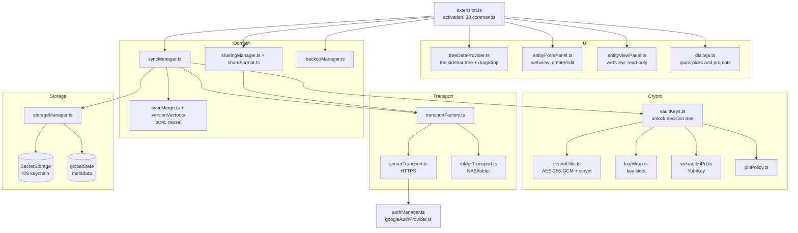
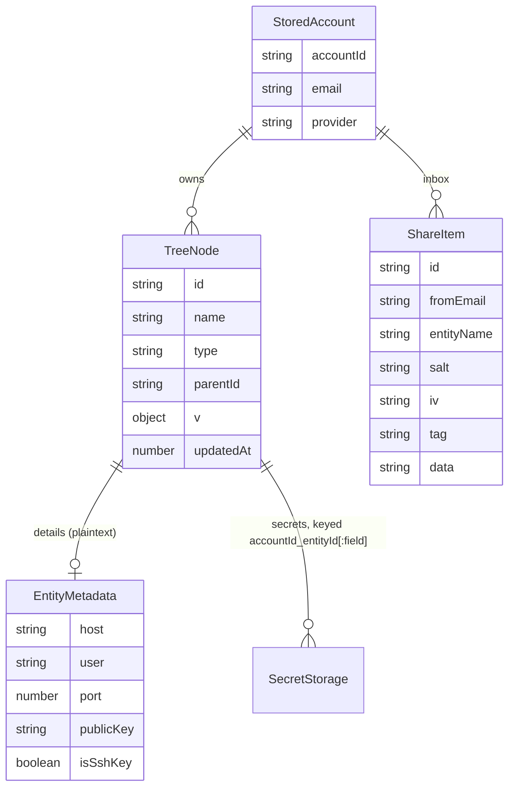

# Module: CredsForDevs (VS Code extension)

`src_vs_code/` — TypeScript, compiled with `tsc`, **zero runtime dependencies**: Node built-ins and
the `vscode` API only.

## Purpose

Keep a developer's SSH hosts, keys, VPN configs, database connections and passwords in the editor,
one tree per signed-in account, and connect with one click. Everything sensitive lives in the OS
keychain; everything that leaves the machine is encrypted first.

## Layers



### The `vscode`-free rule

`cryptoUtils`, `keyWrap`, `pinPolicy`, `shareFormat`, `syncMerge`, `versionVector`, `dbConnString`,
`googleOauth`, `backupNaming`, `defaultFolders`, `secretClipboard` and `serverTransport` import **no
`vscode`**. That is why their edge cases are real unit tests under `node:test` rather than hopeful
comments — no VS Code test harness is needed anywhere. Keep new pure logic on that side of the line.

## Data model

`TreeNode` is stored **flat**; the tree is derived from `parentId` at render time.



| Data | Where | Encrypted by |
|---|---|---|
| Passwords, private keys, VPN configs, notes, DB connection strings | `SecretStorage` | the OS keychain |
| Node tree, tombstones, version vectors, device id | `globalState` | nothing — it is metadata |
| The off-machine vault blob | NAS folder or server | **this extension**, AES-256-GCM |

The extension's own crypto wraps only what *leaves* the machine. Local storage is protected by the
OS keychain, which is the platform's job.

### Entity kinds — one list, three consumers

A node's kind is not a stored field. It is **derived** by `kindOf()` from the flags in
`EntityMetadata` (`isSshKey`, `isVpn`, `isDb`, `isTerminal`, host present, …), which is why an
older vault syncs into a newer extension without a migration: an entry written before `terminal`
existed simply has no `isTerminal`, and reads back as a credential.

Three surfaces need that list — the folder-type picker, the entity form, and the tree's icon and
`contextValue`. `ENTITY_KINDS` and `ENTITY_KIND_LABELS` in `types.ts` are the single source, and
`types.test.ts` fails when a kind has no label. This is written down because the alternative was
tried: the picker held its own hand-written copy of the five kinds it knew, so `terminal` shipped
in 0.26.0 as a type **nobody could select**. Default folders seed once, at account creation, so a
brand-new profile had the folder and every existing account had no way to make one — the feature
looked present in testing and absent in use.

| Kind | Recognised by | Action it adds |
|---|---|---|
| `credential` | nothing more specific matches | copy password |
| `ssh` | `host` | Connect via SSH (green triangle) |
| `sshkey` | `isSshKey` | install to `~/.ssh`, materialise for `ssh -i` |
| `vpn` | `isVpn` | Start / Stop (WireGuard, OpenVPN — green triangle), copy config |
| `db` | `isDb` | open in a DB extension |
| `terminal` | `isTerminal` | Run in Terminal (green triangle), Copy Command |

### Terminal commands

A CLI invocation is stored as a verb plus **rows**, never as one string: `args: CommandArg[]`,
each with its own value, its own note, and an enabled flag. `commandLine.ts` is `vscode`-free and
holds the whole of the logic — `normalizeArgs`, `buildCommandLine`, `describeCommand`.

The row shape is the feature. What is forgotten about `aws sso login --sso-session OD-org` a week
later is never the verb; it is which value belongs to which environment and why, so every argument
carries its explanation next to it. A disabled row keeps a flag you are not using now (`--debug`)
without it reaching the command line — deleting it means retyping it from memory later.

`Run in Terminal` sends the line **with** a newline: it executes. The first implementation stopped
at the prompt and left Enter to the user; the operator overruled that, and it is theirs to
overrule — these are commands the user wrote and saved, not commands arriving from elsewhere.
`Copy Command` covers "let me edit it before it runs".

### VPN start and stop

`vpnCommand.ts` (pure, `vscode`-free) composes the line; `runVpn` in `extension.ts` writes the config
out and shows it in a terminal.

**Elevation is deliberately the OS's.** Both tools create a network interface, which an editor
extension cannot be granted, so the command is *shown* and the prompt is UAC (`Start-Process -Verb
RunAs`) or `sudo`. Nothing is elevated silently and the line is on screen before it runs.

Three constraints that are encoded rather than remembered:

- `wg-quick` derives the interface name from the **file** name, and the kernel's `IFNAMSIZ` caps it
  at 15 characters — so `vpnTunnelName` sanitizes and truncates, and `materializeVpnConfig` takes a
  file name instead of using the entity id.
- The config lands in the same `keys/` directory as materialized SSH keys, so the existing purge on
  activate and deactivate covers it. On Windows the `0600` mode is advisory; the NTFS ACL of the
  extension's storage under the user profile is what actually protects it.
- **Stop never needs the vault.** A locked vault must not be able to strand a tunnel that is up,
  which is why only start re-materializes the config and stop works from the tunnel name.

Only WireGuard and OpenVPN get a button — the tree adds `:vpnrun` to `contextValue` for those. IKEv2
and L2TP are OS-level profiles; a button for them could only ever explain itself.

### Pasting a command

`commandParse.ts` splits a pasted line into a verb and argument rows; `helpText.ts` reads what each
flag means out of the tool's own `--help`; `helpLookup.ts` runs it. The split is the inverse of
`buildCommandLine` and a round-trip test asserts it: a parse that silently changes a command would be
worse than no parse.

Where the verb ends is a guess with no signal to settle it — `aws sso login` and `docker run nginx`
are indistinguishable — so the rule is "subcommand-shaped tokens, at most three", and the answer
lands in an editable field rather than being applied invisibly.

**What may be executed.** Reading a description means running a binary named in a text field, and a
*shared* entry is exactly where a hostile one would come from. `isProbeSafe` therefore whitelists:
every word must be letters, digits, and the few marks real tool names contain. Anything with a shell
metacharacter is never run — which also sidesteps the Windows problem that `aws`, `npm` and
`terraform` are `.cmd` shims Node refuses to spawn without a shell. `credSshManager.readCliHelp`
turns the whole lookup off; rows still split.

Two defects here were found only by running it against real tools after every invented case passed:
a usage synopsis served as a description (`git commit -m` → `[--allow-empty-message] …`), and a
wrapped description truncated at the first line break (`docker run --rm` → "Automatically remove
the"). Both now have tests built from the real output.

### The `vscode`-free rule, applied late

`entityText.ts` (the details block / `Copy All`) and `sshCommand.ts` (the `ssh` line) were carved out
of `dialogs.ts` and `terminalManager.ts` because of a bug, not for tidiness: a terminal entry
rendered its name and nothing else in the viewer and in `Copy All`, and neither could be tested
where it lived. An entire entity kind was missing from both and no suite could notice. The
regression test exists because of the move — which is the argument for the rule generally.

### Snapshots: two settings, both per-account

The folder (`accountBackupPaths` → `backupLocation`) and the schedule (`accountBackupIntervals` →
`backupIntervalHours`) are shaped identically and set from the same account menu — *Set Backup
Location…* and *Set Backup Schedule…*. Per-account because the menu item sits on an account, and a
schedule set there that silently changed every other account is a worse surprise than no menu item.

`describeInterval` / `INTERVAL_CHOICES` live in `backupSchedule.ts` (pure): the setting is in hours
because a timer needs hours, and nobody picks a schedule by thinking "168". The scheduler's own
`onDidChangeConfiguration` listener restarts it, so writing the setting is the whole of applying it —
there is deliberately no second `reschedule()` path.

### `Backup to NAS` and the key wraps

`backupPlan.ts` decides how a vault file may be written, and it exists because the answer was wrong.
`backupToNas` asked for a master PIN and wrote the PIN-only v1 envelope — over **the same file the
sync transport uses**, since both take the name from `planBackupFileNames`. A vault with a security
key registered came back as one without: the wraps were overwritten, silently, and the key stopped
opening it.

`backupWriteMode(existingRaw)` now reads what is in that file. `wrapped` → unlock through the vault's
own key slots (`VaultKeys.unlock` + `VaultKeys.encrypt`, so the wraps are carried across); `pin` →
only for a vault that does not exist yet or a genuine v1 one, and the prompt is lazy. **Unparseable
content returns `wrapped`**: guessing "no wraps" from a parse failure is exactly how they would be
overwritten, so the unsafe answer is never the default.

### Security keys: the user handle must be stable

A discoverable ("resident") credential is keyed by `(RP ID, user.id)`. `RP_ID` is fixed, so `user.id`
carries the whole identity — and it was 16 random bytes minted at each registration, which meant
re-registering an account never replaced its own credential. It added another. A YubiKey 5 holds
about 25, cannot be told to drop one from here, and a full authenticator **refuses `create()`**,
which presents as the dialog reappearing.

`webauthnUserHandle(email)` in `cryptoUtils.ts` is now that identity: SHA-256 of the lowercased
email, so the same account replaces its own slot from any machine. Hashed because `user.name`
already carries the readable address; the identifier need not be reversible too.

### Seeding defaults needs evidence, not silence

Sign-in pulls the remote vault, quietly, before deciding whether to create the default folders — and
swallows failures, which on a fresh machine is the *normal* outcome because no sync PIN is stored
yet. An empty local tree then looks exactly like a brand-new account, so the defaults were created;
the next successful sync brought the account's real folders, whose ids differ, and the merge kept
both. Two `db`, two `vpn`, two of everything.

`RemoteState` (`no-location` | `empty` | `unknown`) is the missing third input to
`shouldSeedDefaults`. `probeRemote` answers it **without decrypting**: a vault file that exists is
proof the account has a structure, and that is the entire question — being unable to open it yet is
the ordinary state of a machine that has just signed in. Unreachable counts as `unknown`, never as
`empty`.

The seeded flag is also claimed before the first `await`, so two concurrent sign-in flows cannot
both pass the guard.

### Env bindings: names travel, values never do

`envBinding.ts` (pure) + `envApply.ts` (the collection writer). A secret field can be exported into
VS Code's environment variable collection — injected into every integrated terminal opened
afterwards, persisted across reloads. The binding's NAME lives in `EntityMetadata.envBindings` and
syncs (it is not a secret); the VALUE is written only locally, from this machine's SecretStorage, on
save or via the viewer's `Set` button. That button exists because the collection can be lost with
the extension's storage — recovery must not require re-saving the entity. `staleEnvNames` is why a
renamed or disabled binding is deleted from the collection on save instead of surviving forever —
with the guard that a name another field still binds is not deleted.

The viewer shows env UI **only for fields whose binding is on**: the name, a copy-name button, and
`Set`. Default name shape: `ENV_<ENTITYNAME>_<FIELD>` (`defaultEnvName`), minted in the form when
the toggle is switched on and editable after.

### Attachments: one file, one image, per entity

`attachment.ts` (pure) owns the rules: an allowlist of document formats (PDF, Office, text, data,
archives) with the executable family refused even as the tail of a double extension; the popular
image formats; a 4 MB cap; and the mime map the preview needs. The `accept` lists and the webview's
inline regexes are derived from the same arrays — two lists that drift is a picker offering what the
save refuses.

Content is base64 in SecretStorage (`:attachment` / `:image` keys) and rides the same records as
every secret: `exportBundle` → sync merge (`copySecret`, winner's value) → `importBundle`, backups
and snapshots included. The display NAME sits in plaintext metadata (`attachmentFileName` /
`imageFileName`), the same trade `vpnConfigFileName` already made, so the viewer can label a row
without opening the vault.

One deliberate exception to "secrets never enter the webview": the image preview. A preview cannot
round-trip through the host, so the viewer receives a `data:` URI for exactly this one secret, under
a CSP whose `img-src` allows only `data:`. Preview starts at 200×200; each click doubles it, twice;
a third click resets.

### Clone

`cloneNode` copies a folder or entity's settings and deliberately **not** its secrets. Duplicating
a password would double it on disk and in every backup and snapshot, and the reason to clone is
almost always a near-identical entry that needs its own credential anyway.

### Sync readiness

`syncReadiness.ts` answers, per account, "can this actually sync, and if not what is missing" —
once, `vscode`-free, for two surfaces that must never disagree: the colour of the account icon and
the report `Sync Now` prints. Locked is reported ahead of every "you are missing something"
verdict, because telling somebody to set a PIN they already set, seconds after they pressed Lock,
is how a status line stops being believed. A registered security key with no stored PIN is
**not** green: a timer cannot touch a key, so unattended sync would keep stopping to ask.

Readiness needs `SecretStorage`, which a `getTreeItem` call cannot await — so it is cached on the
provider and recomputed at the moments it can change: startup, a sync cycle, a PIN being set, a
lock.

## Cryptography

### The envelope

Two versions, both AES-256-GCM with a fresh 16-byte salt and 12-byte IV per encryption:

- **v1** — payload sealed directly under `scrypt(accountId + PIN)`.
- **v2** — payload sealed under a random 256-bit **master key**; the master key is itself wrapped
  once per unlock method (`KeyWrap[]`). A LUKS-style key-slot design: adding or removing a YubiKey
  rewrites one small wrap record, never the payload.

| Parameter | Value |
|---|---|
| KDF | scrypt, `N=2^17`, `r=8`, `p=1` (legacy blobs: `N=2^15`) |
| Cipher | AES-256-GCM, 128-bit tag |
| WebAuthn wrap | HKDF over the PRF secret, `info="cred-ssh-manager/webauthn"` |
| Envelope MAC | HMAC-SHA256, `info="cred-ssh-manager/envelope-mac"`, compared with `timingSafeEqual` |

**KDF parameters are recorded in the blob**, so raising the cost never orphans an old vault, and
`kdfMigration.test.ts` proves both that the round-trip works and that a mismatched recorded `N`
fails through the auth tag rather than silently producing garbage.

The v2 envelope carries an HMAC over its own plaintext metadata (`format`, `version`, `account`,
`wraps`) — the fields the GCM tag does not cover. `shares` is deliberately excluded, because other
users legitimately append to it; that exclusion is the root of finding 3 in
[SECURITY_REVIEW_2026-08-23.md](SECURITY_REVIEW_2026-08-23.md).

### Unlocking

`VaultKeys.unlock()` tries, in order: the in-memory cache → a stored PIN wrap → a security-key
touch (interactive only) → an explicit PIN prompt. The master key is then cached until an eviction:
`Lock Vaults`, or the idle auto-lock.

**Two gates, and they answer different questions.** `LockState.allowsSilentUnlock()` decides whether
a caller that *cannot* ask — the sync timer, the post-edit debounce — may open the vault from a
secret already on the machine. `LockState.requiresPresence()` decides the same for a caller that
*can*.

The second gate exists because the first was not enough, and the gap was visible in use: *Unlock
Vault* announced `Vault of … unlocked.` without asking for anything. It could have asked, so it
counted as deliberate — but the stored Sync PIN opened the vault at step 2, long before the
security-key branch at step 3 was reached. Anyone at an unattended machine clicked Unlock and was
in, which is the one situation Lock exists for. While the lock stands, the cache and the stored PIN
are both skipped, on v1 vaults as well as v2, so opening it costs a key touch or the PIN typed.

Only the LOCK demands a gesture. Reading a password from an unlocked vault does not — and no
credential-read path calls `unlock()` at all, because credentials live in the OS keychain and are
not protected by the vault key. Every caller of `unlock()` is a vault-management act: sync, register
or remove a security key, re-key.

## Sync

Per-account cycle in `syncManager.ts`: read remote → unlock → decrypt → `mergeProfiles` → write back
what changed. Debounced 5 s after any mutation, plus on startup and every
`autoSyncIntervalMinutes` (default 5). A single-cycle guard prevents overlap.

**Conflict resolution is causal.** Each node carries a version vector `{deviceId: seq}`:

- a vector that **dominates** wins outright;
- genuinely **concurrent** edits fall back to `updatedAt`, then to the lexicographically greatest
  `deviceId` — deterministic on every machine, which matters more than being right;
- a per-profile **horizon** (the element-wise maximum ever seen) lets 90-day-old tombstones be hard
  deleted without a stale backup resurrecting the entry it deleted.

That last point is the subtle one, and `syncMerge.test.ts` covers it explicitly: *"a >90-day-old
backup cannot resurrect a deleted entry after tombstone GC"* and *"a genuinely new offline node
(beyond the horizon) is NOT rejected as a phantom"*.

## Transports

`isServerLocation(location)` — `/^https?:\/\//` — is the entire routing rule. A URL means the
server; anything else is a folder path.

| | `ServerTransport` | `FolderTransport` |
|---|---|---|
| Reaches | `https://vault.company.com` | `Z:\Backups`, `/mnt/nas`, `\\NAS\Vault` |
| Auth | Bearer token per request | folder ACLs |
| Shares | server-side inbox, sender stamped | a plaintext array inside the recipient's envelope |
| Sender identity | **unforgeable** | claimed, forgeable by anyone who can write |
| Timeout | **60 s** per request | filesystem |

### The server transport's timeout

`fetch` has no timeout of its own. Until 2026-08-23 a server that accepted the connection and then
stopped answering left the request pending for the life of the window — and because the sync cycle
awaits it under a one-at-a-time guard, nothing synced again. Every request now carries
`AbortSignal.timeout(60_000)`, and a timeout is reported differently from a refused connection
because they are different operational problems.

### Conditional writes

`ServerTransport` remembers the `ETag` of each account's last read and sends it as `If-Match` on the
next write. A `412` means another machine wrote in between: the stored version is dropped (so the
retry re-reads rather than failing identically forever) and the error says plainly that nothing was
overwritten. A write with no prior read carries no precondition, which is exactly what every client
did before the server understood them.

### Tokens

`transportFactory.tokenFor` resolves per provider: Microsoft gives `session.accessToken` from the
built-in provider; Google gives the **id token**, because a Google access token is opaque and the
server could not validate it.

## Sharing

`sealShare()` encrypts a `SharePayload` under `scrypt(recipientKeyId + PIN)`, where `recipientKeyId`
is the recipient's `accountId` for folder transport and their **email** for the server. The
recipient tries every PIN they know against every pending item (`resolveShares`), which is what
makes "Accept all" work without a key exchange.

The payload is authenticated by GCM. The surrounding metadata — `fromEmail`, `entityName`,
`entityKind`, `createdAt` — is **not**, which is a spoofing surface on the folder transport and
finding 3 of the security review.

## Secrets at rest and in flight

| Path | Handling |
|---|---|
| Clipboard | Every secret copy expires after **45 s**, and only if the clipboard still holds exactly what was copied (`secretClipboard.ts`) |
| SSH private key on disk | Materialised only when `ssh -i` needs a path; `0600` in a `0700` directory under the extension's own storage — never the OS temp dir — and purged on activate, on deactivate, and when the terminal closes |
| Terminal | `buildSshCommand` composes host/user/port/key-*path* only. No password ever reaches a command line |
| Webviews | `default-src 'none'`, nonce-based scripts, `localResourceRoots: []`, everything escaped. The read-only viewer never receives secret values at all — copy actions round-trip through the extension host |

## Build and test

```bash
cd src_vs_code
npm ci
npm run typecheck          # tsc --noEmit
npm test                   # tsc && node --test "out/test/*.test.js"
npm run package            # vsce package
npm run icon               # regenerate media/icon.png
```

**79 tests**, all `node:test`, ~13 s. Note the glob in the test script: `node --test out/test/`
resolves the directory as a module on Node 22+ and exits `MODULE_NOT_FOUND` — the suite silently ran
nothing before 2026-08-23.

`scripts/server-transport-itest.cjs` is a separate integration test that drives the compiled
transport against a live server; it stubs `vscode` with a `Module._resolveFilename` patch and is not
part of `npm test`.

## Marketplace packaging

`media/icon.png` (128×128) is generated by `scripts/generate-icon.mjs` — a dependency-free
rasteriser that draws the same key glyph as `media/icon.svg` and encodes the PNG with `node:zlib`.
The Marketplace rejects an SVG in the `icon` field, and a committed binary nobody can regenerate is
worse than a script. Full publishing procedure: `src_vs_code/docs/PUBLISHING.md`.
