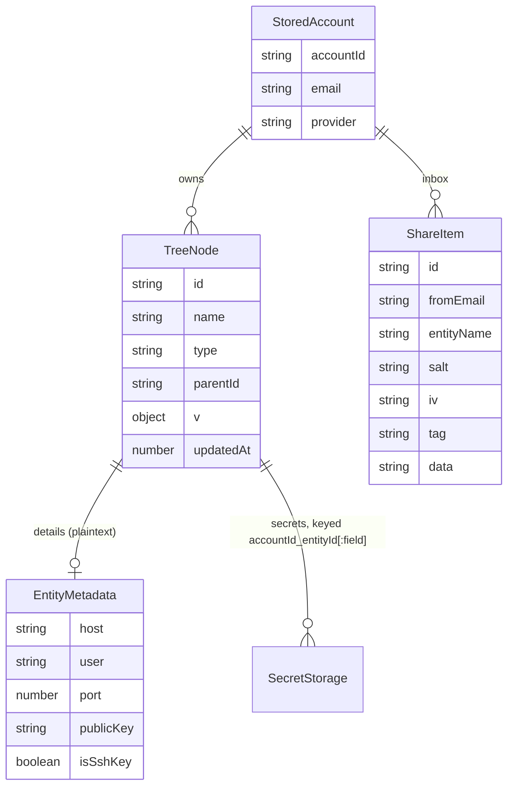
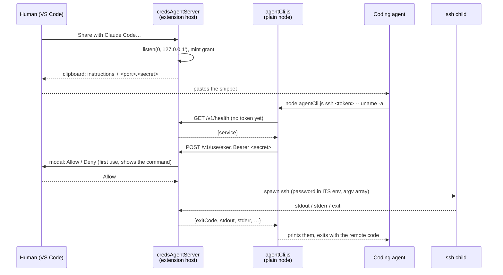
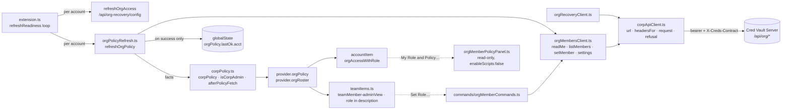

# Module: CredsForDevs (VS Code extension)

`src_vs_code/` — TypeScript, compiled with `tsc`, **zero runtime dependencies**: Node built-ins and
the `vscode` API only. That has survived a YAML/TOML/INI validator, a Shamir split, an SSH agent and
an unreleased QR decoder — each of which had an obvious package and was written instead.

## Purpose

Keep a developer's SSH hosts, keys, VPN configs, database connections and passwords in the editor,
one tree per signed-in account, and connect with one click. Everything sensitive lives in the OS
keychain; everything that leaves the machine is encrypted first.

## Layers

```mermaid
flowchart TD
    subgraph UI
        TREE[treeDataProvider.ts<br/>the sidebar tree + drag/drop]
        SEARCH[treeSearch.ts<br/>the filter — never over secrets]
        FORM[entityFormPanel.ts<br/>webview: create/edit]
        VIEW[entityViewPanel.ts<br/>webview: read-only]
        DLG[dialogs.ts<br/>quick picks and prompts]
    end

    EXT[extension.ts<br/>activation, 56 commands]

    subgraph Domain
        SYNC[syncManager.ts]
        MERGE[syncMerge.ts + versionVector.ts + syncIdle.ts<br/>pure, causal]
        SHARE[shareInbox.ts<br/>sharingManager.ts + shareFormat.ts]
        BACKUP[backupManager.ts]
    end

    subgraph Agent["Agent broker (loopback)"]
        BROKER[credsAgentServer.ts<br/>consent + audit]
        UA[useActions.ts<br/>kind,action registry]
        SSHUSE[sshUseActions.ts<br/>exec + terminal]
        RUN[sshExecRunner.ts<br/>spawn, ceilings]
        CLI[agentCli.ts<br/>plain node, no vscode]
    end

    subgraph SshAgent["SSH agent (socket / named pipe)"]
        AGMGR[sshAgentManager.ts<br/>keys in memory, the modal]
        AGSRV[sshAgentServer.ts<br/>protocol over net]
        AGPROTO[sshAgentProtocol.ts<br/>framing + what is being signed]
        AGKEY[sshKeyParse.ts + sshAgentSign.ts<br/>read a key, make a signature]
    end

    subgraph MaskedRun["Run with secrets"]
        REF[secretRef.ts<br/>creds:// resolution]
        PLANR[runPlan.ts<br/>rewrite to env reads]
        MASK[outputMask.ts<br/>stream masking]
        MTERM[maskedTerminal.ts<br/>pseudoterminal we own]
    end

    subgraph Crypto
        CU[cryptoUtils.ts<br/>AES-256-GCM + scrypt]
        KW[keyWrap.ts<br/>key slots]
        VK[vaultKeys.ts<br/>unlock decision tree]
        PRF[webauthnPrf.ts<br/>YubiKey]
        PIN[pinPolicy.ts]
    end

    subgraph Transport
        TF[transportFactory.ts]
        ST[serverTransport.ts<br/>HTTPS]
        FT[folderTransport.ts<br/>NAS/folder]
    end

    subgraph Storage
        SM[storageManager.ts]
        SS[(SecretStorage<br/>OS keychain)]
        GS[(globalState<br/>metadata)]
    end

    AUTH[authManager.ts<br/>googleAuthProvider.ts]

    EXT --> TREE & FORM & VIEW & DLG
    TREE --> SEARCH
    EXT --> SYNC & SHARE & BACKUP
    EXT --> BROKER
    EXT --> AGMGR --> AGSRV --> AGPROTO & AGKEY
    AGMGR --> SM
    EXT --> REF & PLANR --> MTERM --> MASK
    REF --> SM
    CLI -.->|HTTP 127.0.0.1| BROKER
    BROKER --> UA --> SSHUSE --> RUN
    SSHUSE --> SM
    SYNC --> MERGE & VK & TF
    SHARE --> TF
    TF --> ST & FT
    ST --> AUTH
    SYNC --> SM
    VK --> CU & KW & PRF & PIN
    SM --> SS & GS
```



### The `vscode`-free rule

`cryptoUtils`, `keyWrap`, `pinPolicy`, `shareFormat`, `syncMerge`, `versionVector`, `dbConnString`,
`googleOauth`, `backupNaming`, `defaultFolders`, `secretClipboard` and `serverTransport` import **no
`vscode`**. That is why their edge cases are real unit tests under `node:test` rather than hopeful
comments — no VS Code test harness is needed anywhere. Keep new pure logic on that side of the line.

`sshCredential` belongs on that list too, and for the reason the rule exists: it decides which secret
an SSH connection authenticates with — referenced key entity, stored key, key path, password, in that
order — for **both** the human Connect path and the agent broker. A regression there changes two
surfaces at once, so the order is asserted in `sshCredential.test.ts` rather than re-derived by
whoever reads it next. (The empty-string `sshKeyPath` case has its own test: historic entities use it
to mean "no `-i` flag", and reading it as falsy would start sending stored passwords to hosts only
ever reached with a key.)

The agent broker added a second reason to stay on that side: `grantToken`, `grantRegistry`,
`useActions`, `brokerProtocol`, `sshExecCommand`, `agentCliArgs`, `agentShareSnippet` and
`agentAuditLog` are `vscode`-free because **`agentCli.ts` runs under plain `node`** and imports them.
A `vscode` import anywhere in that graph is not a testing inconvenience there; it is a CLI that
cannot start.

## Data model

`TreeNode` is stored **flat**; the tree is derived from `parentId` at render time.



| Data | Where | Encrypted by |
|---|---|---|
| Passwords, private keys, VPN configs, notes, DB connection strings, TOTP seeds | `SecretStorage` | the OS keychain |
| Node tree, tombstones, version vectors, device id | `globalState` | nothing — it is metadata |
| The off-machine vault blob | NAS folder or server | **this extension**, AES-256-GCM |

The extension's own crypto wraps only what *leaves* the machine. Local storage is protected by the
OS keychain, which is the platform's job.

### The kind is carried, not re-derived (0.58.x, audit A4)

An entity now states what it is: `EntityMetadata.kind`, read through **`resolveKind`** in
`entityKind.ts` — the only code allowed to fall back to the old flags. `kindOf` still exists
but is reachable only from there; nothing else in `src/` calls it any more.

- **Migration is the fallback, not a rewrite.** A record written before the field existed has
  no `kind`, so `resolveKind` derives it from the flags exactly as before. No vault is
  converted, no version is bumped, and a record from a NEWER build carrying a kind this one
  does not know falls back rather than being thrown away.
- **A write states the kind AND keeps the flags in step.** `stampKind` runs inside
  `StorageManager.stampVector` — the one line every local write already passes through, so no
  call site can forget it. The flags are rewritten *from* the kind (a stale flag would win on
  an older machine and make the entity two things at once), and they are still written at all
  because a vault syncs to builds that predate the field: dropping them would make every
  synced entity read as a plain credential over there and silently lose its Connect, Start
  and Run. They are a compatibility shim with a defined end, not a second source of truth.
- **A new kind is a build error.** `kindIcon` ends in `assertNever`, and the two label tables
  are `Record<EntityKind, …>`. Verified by adding a hypothetical `totp` kind: three compile
  errors, one of them *"Argument of type `'totp'` is not assignable to parameter of type
  `never`"*. That is the guarantee S5 asked for — `terminal` in 0.26.0 and the missing
  `script` selector entry were both this defect.
  **`folderIcon` was outside that guarantee until 0.91.1**, and it is the clearest case yet of
  what the guarantee is worth: it was a SECOND switch over the same union with a `default` at
  the bottom, so `script` and `config` — added to `ENTITY_KINDS` later — simply started falling
  through to the generic folder glyph. Not obscure either, because `defaultFolders.ts` seeds a
  folder of each kind: every vault this product has ever created had two of them. It now asks
  `kindIcon` instead of listing the kinds again, so there is one table and the ninth kind is a
  compile error for folders too; `project` stays named there because nothing is OF that kind,
  and the `default` stays for a type a NEWER build wrote, which a row must still draw.
- **`oneUse` cannot be set on a kind the broker never serves.** A burn fires only through the
  broker and the broker does not serve `sshkey`, so `{kind: 'sshkey', burnPolicy: 'oneUse'}`
  would be a promise nothing could keep — the entry living forever while the UI said it would
  vanish after first use. `stampKind` drops it on write, so the impossible state cannot reach
  the vault even if a form offers it. Temporary SSH keys for a customer's instance are the
  first thing anyone reaches for here, which is why this is refused rather than documented.
- **"Can I connect over SSH" is one predicate, and deliberately broader than the kind.**
  `canConnectSsh` — the tree keyed its `:ssh` menu on a host being present while `kindOf` keys
  the kind on `isSshEnabled` (the S5 divergence). They are one named function now, and the
  breadth is kept: narrowing it would remove Connect from host-bearing entries that have it
  today, which is a product decision rather than a refactor. Stated and tested, not left to be
  re-discovered.

### Entity kinds — one list, three consumers

A node's kind is not a stored field. It is **derived** by `kindOf()` from the flags in
`EntityMetadata` (`isSshKey`, `isVpn`, `isDb`, `isTerminal`, host present, …), which is why an
older vault syncs into a newer extension without a migration: an entry written before `terminal`
existed simply has no `isTerminal`, and reads back as a credential.

Three surfaces need that list — the folder-type picker, the entity form, and the tree's icon and
`contextValue`. `ENTITY_KINDS` and `ENTITY_KIND_LABELS` in `types.ts` are the single source, and
`types.test.ts` fails when a kind has no label. This is written down because the alternative was
tried: the picker held its own hand-written copy of the five kinds it knew, so `terminal` shipped
in 0.26.0 as a type **nobody could select**. Default folders seed once, at account creation, so a
brand-new profile had the folder and every existing account had no way to make one — the feature
looked present in testing and absent in use.

| Kind | Recognised by | Action it adds |
|---|---|---|
| `credential` | nothing more specific matches | copy password |
| `ssh` | `host` | Connect via SSH (green triangle) |
| `sshkey` | `isSshKey` | install to `~/.ssh`, materialise for `ssh -i` |
| `vpn` | `isVpn` | Start / Stop (WireGuard, OpenVPN — green triangle), copy config |
| `db` | `isDb` | open in a DB extension |
| `terminal` | `isTerminal` | Run in Terminal (green triangle), Copy Command |
| `script` | `isScript` | Run, Copy, materialise |
| `config` | `isConfig` | write the file, diff it, open it to code |
| `payment` | `isPayment` | card, bank details or a hidden phrase — see below |

#### `payment`, and the two predicates that default to the wrong answer

Added with [PLAN_payment_instruments.md](PLAN_payment_instruments.md). Three FORMS in one
kind — `paymentForm: 'card' | 'bank' | 'phrase'` (`paymentForm.ts`) — because the three differ only
in their fields while the tree, the folder types, the sharing, the backup and the trash treat them
identically. Making them three kinds would have tripled nine per-kind seams to buy nothing.

Two things about adding a ninth kind are worth keeping, because neither is visible in a diff:

**The compiler demands four maps and misses everything else.** `ENTITY_KIND_LABELS`
(`types.ts`), `EVERY_KIND_HAS_A_SHAPE` (`entityShape.ts`), `kindIcon`'s `assertNever` switch
(`treeIcons.ts`) and `KIND_HINT` (`entityFormPage.ts`) all fail the build. The flag ladder
(`kindOf`), the legacy flags (`legacyFlags`), the context token (`treeRowText.ts`) and the seeded
folder (`defaultFolders.ts`) do not — they compile perfectly while doing nothing.

**The values are one JSON record under one keychain key** (`paymentFields.ts`, suffix `:payment`),
following `entityFields.ts` and its stated reason: a field added later is a key in that object rather
than another pass through the nine files a secret kind touches. Twenty-two keys across the three
forms. Four rules, each a test: an unparseable string is no fields rather than a throw; an all-empty
record serializes to `undefined`, which DELETES the key; a wrong-typed value is dropped rather than
coerced (turning `4111` into `"4111"` would invent a card number, and records arrive from imports and
foreign builds); and `shuffledFields` is filtered to the five fields §3a allows to be woven.

Two of those came out of the code review. **`shuffledFields` describes the record, not a form** — a
card with a woven PIN keeps it — so emptiness is measured over the VALUE fields only; otherwise a card
whose fields were all cleared left a keychain entry holding nothing but the names of fields that no
longer existed, which nobody would ever look for again. And `clearForForm` drops the names whose
fields do not survive a form switch, so the viewer cannot draw a method picker over an absent field.

**Storage is one `SECRET_KINDS` row** (`storageManager.ts`) plus four typed accessors — for the
TABLE-DRIVEN seams. Export, import, snapshot and delete-with-the-entry all walk that list, so the
record reaches the backup, the restore and the keychain cleanup with no line written at any of those
sites, asserted rather than assumed.

#### The write-order invariant — one sentence, five write paths

Not a payment rule. The plan filed it as one and the exploration found it is not: `§3d` asked for
*"secret, then node"*, which is right for a WRITE and, read as a global rule, destroys data on a
DELETE. Two rounds of the review gate shaped what replaced it.

> An orphaned secret — bytes in the keychain that no node references — is the only torn state allowed
> to exist. It is invisible, harmless and collectable. A node claiming a record that is not there is
> visible, broken, and it **syncs**.

**Rule A — the referrer is written on the safe side of its referent.** Node metadata refers to a
secret. **Adding** a reference writes the referent first (secret, then node); **removing** one writes
the referrer first (node, then secret). One save does both, because a form's filled fields are
additions and its `clearX` checkboxes are removals — which is why `applyFormSecrets.ts` is
`applyAdditions` + `applyRemovals` and every caller puts its node write BETWEEN them. A single
ordered call cannot be right for both halves.

**Rule B — a durable record naming what is about to become unreachable exists before it becomes
unreachable.** For a deletion that record is the tombstone, so `deleteNodeRecursive` writes
**tombstone → node → secrets**. Interrupted after the tombstone, the entry is both live and
tombstoned, which the sweep deliberately refuses to touch: the deletion is merely unfinished.

| write path | order | note |
|---|---|---|
| create (`treeMutationCommands`) | additions → node | a create has no removals, but the pass runs: a `clearX` can arrive on a new entry |
| edit (`entityEditCommands`) | additions → node → removals | the case a single call cannot serve |
| delete (`storageManager`) | tombstone → node → secrets | Rule B |
| **restore / sync-apply (`importBundle`)** | **secrets → record vanishing → tree → drop-vanished → clear** | had it backwards in BOTH halves; the record is LOCAL, not a tombstone |
| share accept (`shareInbox`) | node, then secrets — a fresh id, so nothing pre-exists to claim | |
| **import (`importCommands`)** | **secrets → node, per entity, compensated** | inverted; every entry in a file had its own window |
| **agent create (`mcpHooks`)** | **secret → node, compensated** | the secret may have been GENERATED here, so a lost one is a value nobody asked for |
| **account removal (`storageManager`)** | **record intent → unlist → secrets → tree/tombstones/horizon → clear** | the record is LOCAL. See `pendingCleanup.ts` |

The `importBundle` one is the find worth keeping: the review asked which other paths write both, and
that was the answer. Its vanished-id list is now captured from the OLD tree before `saveNodes`,
because afterwards those ids are no longer in the tree to iterate — moving the call without that
would have silently narrowed what it cleans.

##### `orphanSweep.ts` — the sweep the plan assumed existed

`§3d` called an orphan "cleaned by a startup sweep". There was no sweep, and one could not simply be
written: `vscode.SecretStorage` is `get`/`store`/`delete` on a KNOWN key, and every secret read here
walks the LIVE node list — so a departed node's id is derivable from nothing. The review proposed
budgeting a durable key index. **It already exists under another name:** the tombstones. Which is why
Rule B moved the tombstone write ahead of the node write — so no interruption can produce an orphan
that nothing names.

It runs inside `EphemeralSweeper`, whose own header already said a window OPENING is when what a
crashed window left behind is found. An orphaned secret is that, for a deletion instead of an expiry —
one trigger, one place to look. **The honest limit:** a tombstone pruned by the horizon before any
sweep ran leaves an orphan that is never collected. That is a keychain slot holding ciphertext no read
path reaches — the state the invariant permits, tolerated rather than hidden.

##### `entityWrite.ts` — the create's orphan is the one nothing can collect

A deletion's orphan is collectable because the tombstone names it. A **create** has no tombstone: if
the node write fails after the secret is stored, that id is in neither the tree nor any record, and
the bytes stay in the keychain until the machine is wiped. The review escalated this from tidiness to
security, and the framing is fair — a create that keeps failing keeps leaving unaccountable slots.

`createEntityWithSecrets(writeSecrets, writeNode, undoSecrets)` compensates for every failure this
process can **observe** — a keychain refusal, a rejected node write, a validation throw — deleting
what it wrote before rethrowing. If the undo fails too, the caller still hears the **original** error:
a failure to tidy up must not mask the failure that made tidying necessary.

**The caller supplies the undo**, which is the design: it knows exactly which secrets it wrote, and
undoing precisely those is safe where "delete everything this id owns" would not be. It is for
CREATES only — on an update that phrasing would delete the values being replaced. Taking callbacks
also meant no new `StorageManager` method, on a file at its size-ratchet baseline.

**What it deliberately does not cover:** a process KILL between the two writes. Covering that needs a
durable record written before the first secret, and both candidates were rejected for stated reasons —
reusing the tombstone list would **sync a deletion for an id that never existed** (another machine
could then apply it to a live entry), and a machine-local pending-id list needs an expiry window to
tell an abandoned id from one in flight, which is a second consistency problem to keep honest. The
residual is written down in the module header rather than left to be rediscovered.

### Payment instruments — the ninth kind

A card, a set of bank details, or a phrase somebody must not lose. One entry kind, three FORMS, and
one encrypted record under one keychain key — the shape `entityFields.ts` already established for a
credential's login and URL, which is why a payment did not have to go through all nine secret seams a
tenth time.

| module | what it owns |
|---|---|
| `paymentForm.ts` / `paymentFields.ts` | the three forms, the 22 field keys, and which form owns which |
| `cardBrand.ts` | nine payment systems as a table of BIN ranges and issued lengths |
| `cardBrandIcons.ts` + `media/brands/` | generated marks, deliberately generic rather than the networks' logos. All nine are drawn into the page hidden and one is revealed, so a STORED system never reaches the HTML — which needs `.brandMark[hidden] { display: none }` in `BRAND_MARK_STYLES`, because an author rule carrying `display` beats the browser's own `[hidden]`, and without it the card showed all nine at once. The webview mark is 64px (four times the 16px tree glyph), scaled by CSS over the viewBox so the generated files stay 16; the form lays its row out as `.brandLine`, or the select's `width: 100%` pushes the mark onto the line below |
| `paymentFormSwitch.ts` / `paymentSaveGate.ts` | what a form switch erases, and the two questions asked before a save |
| `decoyDigits.ts` / `decoyPhrase.ts` | decoys that cannot be told from the real half |
| `paymentWeaving.ts` | where the marks become woven values |
| `paymentValidation.ts` | a failing checksum: a hint when plain, a confirmation when about to be woven |
| `mixedFieldGuard.ts` | a woven record cannot be opened in the edit form |
| `wordlists.ts` + ten `wordlistBip39*.ts` + `wordlistMoneroEn.ts` | the lists and the checksum that reads them |
| `moneroChecksum.ts` | Monero's own checksum — a different FAMILY, not a variation on BIP-39's |
| `phraseLayout.ts` / `phraseReassembly.ts` | two columns, the arithmetic that decides which layouts exist, and the way back |
| `cardNumberFormat.ts` | a number as it is READ (groups of four, 4-6-5 for Amex) against as it is STORED (digits) |
| `addressFormat.ts` | a billing address as six cells, the parse that guesses them, and five countries' orders |
| `weaveExample.ts` | what a weaving method does, drawn on two generated samples |
| `phraseGenerate.ts` | drawing a checksum-valid phrase, with the list and the length chosen |
| `secretEnvelope.ts` | a secret that describes itself: woven, or locked under a PIN, in one write |
| `phraseFormMarkup.ts` / `phraseFormScript.ts` / `phraseSaveGate.ts` | the phrase form, and the record a phrase save writes |
| `paymentViewCard.ts` / `paymentViewMessages.ts` / `paymentViewHost.ts` | the read-only card: its markup, what the host answers, and what is asked first |
| `revealGate.ts` / `phraseBuffer.ts` | the rung that asks again, and the bytes that get zeroed |
| `paymentRedaction.ts` / `secretClaims.ts` | what leaves in a share, and what a node may claim to hold |

#### Two windows of one profile — the lock

`SerialQueue` serializes this extension's dangerous operations within ONE instance and says so in its
own header. VS Code runs an extension host per WINDOW and every window of a profile shares one
`globalState` and one `SecretStorage`, so two windows were serialized by nothing.
`crossWindowWrites.test.ts` reproduces what that cost: window B's import **succeeds and is reported
as successful**, then window A's account removal wipes it — an end state that is perfectly
self-consistent and missing the person's data, which is why no sweep could ever find it.

| module | what it owns |
|---|---|
| `windowLock.ts` | the lock: an atomic `mkdir`, a heartbeat, a stale break, a fenced release |
| `leasedQueue.ts` | `SerialQueue` plus that lock; the wait, the skip, and the sweep's retry |
| `leasedWrites.ts` | the only `vscode`-facing part: the status-bar notice, and the wiring |

**The primitive is a directory, and that is the whole design.** The first draft was a lease record in
`globalState` with a write-then-read-back to settle ties; its review round returned three Blocking
findings from three vendors independently, all the same — `Memento.update` is asynchronous and a
foreign write arrives by broadcast with no ordering against a local read, so both windows read empty,
both write, and each re-reads its own value. `fs.mkdir` without `recursive` either creates or fails,
and `globalStorageUri` is a directory every window of the profile already shares.

Three things around it that are not decoration:

- **A heartbeat, not a renewed deadline.** A holder is valid while its timestamp is fresh, so a window
  that dies stops being a holder without having to notice — which is what a killed window and a wedged
  one have in common. A long import simply keeps beating.
- **A fenced release.** The holder file names the ACQUISITION, and release removes the lock only if it
  still names ours; otherwise a holder that overran its TTL deletes the lock of whoever replaced it,
  and the failure arrives through the exit.
- **The sweep skips and comes back.** Another window holding the lock IS that window doing the sweep's
  work — but the sweep runs once at startup, so a holder killed a moment later would leave its
  half-finished removal for nobody. A skip schedules another attempt after the TTL, three times.

**Without a lock directory it is a `SerialQueue` and nothing else**, which is what every test that
builds a `StorageManager` with two arguments gets. That is the behaviour this extension had until
now, so the fallback is a degradation to the previous guarantee rather than a failure.

**The residual race is in `windowLock.ts`'s own header** rather than in a plan: breaking a stale lock
is `remove` then `mkdir`, two operations, so a third window's fresh claim made in the instant between
them can be removed. Microseconds wide, and it needs a holder to have already exceeded the TTL.

#### The read side, added in the UI tail

Until [PLAN_payment_ui_tail.md](PLAN_payment_ui_tail.md), `entityViewPage.ts` did not contain the
string `payment` at all: a saved card was readable only by opening it for EDITING, six of the modules
above had no production caller, and the weave boxes were disabled because nothing could unweave. The
card closed that, and it carries three rules worth knowing before changing it.

**The card is drawn from METADATA.** `paymentCardMarkup` is given which form, which keys the record
holds and which of them are woven — never a value, so none can be interpolated. Values arrive by
`postMessage` and are set as DOM *properties*. The claim asserted by the test is precise, because the
loose one is false: no stored value is built into the page's HTML **string** — the thing that gets
concatenated and, when something goes wrong, logged. A value that has arrived is in the live DOM, and
that was never what the rule was about.

**Two representations of one mark, and one question.** A woven digit field is named in
`shuffledFields`; a woven PHRASE is not, because `mixed` is not a field that got woven — it IS the
woven phrase, and `SHUFFLEABLE_KEYS` excludes it under a compiler-checked `satisfies`. `wovenKeys()`
is the single question both are asked, by the edit guard, by the card and by the record builder. Before
it existed, `hasMixedField` knew only the first, so a saved phrase would have been editable and
destroyed on the next save — the exact destruction S3.4 built the guard to prevent, reached by the one
record shape the guard had never seen.

**Two checksum families, one question.** BIP-39 reads a phrase as bits — a word is its INDEX, and the
trailing bits are a SHA-256 of the entropy. Monero does none of that: it CRC-32s the first three
characters of each word and the remainder names which word is repeated as the twenty-fifth. `Wordlist`
therefore carries a `checksum` field and `checksumHolds`/`mnemonicFor` dispatch on it; the Monero half
lives in its own module because the two share nothing but the question. The registry's tests are
scoped the same way — every "every list is 2048 words" assertion was always about the BIP-39 family
and now says so.

**The gate covers the picker, not only the button.** `revealGate` decides that a CVV, a PIN and an
assembled phrase ask a second time; `paymentViewHost` asks it for `reveal` AND for `reassemble`, since
a woven PIN reached through a method picker is the same value. The grant is per field and per card,
dropped when the panel re-renders another entry — this viewer is the shared preview tab. The same
question guards a Copy, because copying is showing, to the clipboard.

#### The four decisions worth knowing before changing any of it

**1. The method is stored NOWHERE.** A woven field is the person's value and a decoy shuffled together
under one of twelve methods, and the method lives only in their memory. Everything else follows from
that: the value has to be right the first time (hence `paymentValidation`'s confirmation), the decoy
has to be indistinguishable (hence `decoyDigits`' Luhn and mod-97 work), and the entry can never be
opened in the edit form again (hence `mixedFieldGuard`) — a second weave doubles the length under two
unknown methods, then four, with no error at any step.

**2. The decoy matches the real value's checksum STATE, not "is valid".** Somebody who deliberately
re-ordered their own phrase has one that does not converge; a converging decoy beside it would point
straight at the correct method. And the constraint applies only where a checksum exists at that length
in the decoy's own list — otherwise the generator hunts something no draw can produce.

**3. A stored payment record is never rendered into the page's HTML.** Every other kind's stored value
is (a db connection string, a config body). For a CVV and a PIN that is one place too many, because
the HTML is a string that gets built, concatenated and — the moment anything goes wrong — logged. It
travels by `postMessage`, on request.

**4. Claims are kept to what can be shown.** `phraseBuffer.ts` does not promise one copy in memory:
that is false and unverifiable, since no test here can count copies in a heap. It promises fewer copies
*we* control and a buffer we zero — and the help says the limit in plain words. The same discipline
produced the export warning (counts, never values) and the "what weaving does not buy" paragraph in
the form itself.

#### What the reviews caught, since it shaped the code

Four safety nets shipped with **no caller** across this feature — `clearForForm`, `withheldFromShare`,
`validatePayment`, and `EntityFormOptions.initialPayment`. The last was the worst: editing a saved card
opened a blank form over it and saving DELETED the record, while the destructive-switch confirmation
could never fire because it read the same absent value. Each is now held by a test that asserts the
CALL, not only the function.

**And then six more, which is the number worth remembering.** An audit on 2026-09-02 scanned the
imports rather than the story table and found `revealGate`, `phraseBuffer`, `phraseReassembly`,
`phraseLayout`, `decoyPhrase` and `wordlists` (with its ten lists, ~245 KB) reachable from nothing but
their own tests. Ten no-caller modules in one feature is not ten oversights; it is what building
pure logic bottom-up produces when "the tests are green" is allowed to answer "does it work". The
lesson the reviews already stated for the first four — *a test that asserts the CALL, not only the
function* — is the one that would have caught all ten, and it is why every story in the tail plan
named a caller before it named a module. **All ten are wired as of the UI tail**, and the count is
kept here rather than deleted, because the shape recurs.

The other class was drift between two sides of one rule: `ibanConverges` normalised its input and
`ibanDecoy` did not, so an IBAN typed with spaces crashed the save and a lowercase one silently
produced a decoy failing the very checksum that makes it indistinguishable. Both directions now share
one normaliser.

##### `pendingCleanup.ts` — the record that must NOT sync, and the resume that reads it

Two operations remove things in a sequence a crash can interrupt: removing an account, and applying a
bundle that drops entities (a restore, or a sync apply). Both need Rule B's durable record, and for
both the first answer tried was a **tombstone**. Two review rounds killed that answer twice, for the
same reason each time — a tombstone *syncs*:

| attempt | what went wrong |
|---|---|
| account removal: tombstones, then wipe the tree | killed in between, the ids are both tombstoned and live — a state the sweep deliberately refuses, so nothing ever finished the removal, while the tombstones told every other machine to delete entries this one still shows |
| restore: mint a tombstone with an EMPTY version vector, to keep it weak | a weak record LOSES the merge to a live remote node, which then syncs back over secrets this machine has already deleted. A record strong enough to win instead publishes a deletion that was only ever meant locally |

What these operations need is a note to **this machine** about work in flight — nobody else's business,
and actively harmful as a published fact. One key, never in a bundle, never in a snapshot, cleared when
the work lands. `removeWithIntent` wraps the removal; `resumePending` finishes whatever a killed window
left, on the same trigger as the orphan sweep.

**The resume is explicit, not inferred.** An earlier version compared stored keys against the account
list to work out what had been interrupted, and both review providers said the same thing about it: an
inference cannot tell an interrupted removal from an account mid-creation, an id being reused, or a key
left by some other lifecycle. It reads the recorded intent instead.

**An account that is re-added FINISHES its interrupted removal first** (`finishBeforeReuse`, called by
`upsertAccount`). Two rounds went into this one. First: a stale marker must never wipe the tree a
person just re-added — account ids are stable per provider account, so "sign out, sign in again, open a
window" is ordinary. Then the review caught what skipping alone would leave: an interrupted wipe has
deleted *some* entities and *some* secrets, and letting that back in as a live account is worse than
either finishing or deleting it. So the re-add finishes the wipe and clears the marker, and what comes
back is a clean profile that can pull its vault — not the wreckage of the deletion that was ordered.
This is also the only point at which both facts are known: that a removal was pending, and that
somebody wants this account back.

**Liveness is re-read per id**, not sampled once: there is an `await` between every delete and a sync
apply can land in one, so an answer from before the previous await is an answer about a tree that may
no longer be the tree.

**Pending secret deletions check liveness before acting** — and before EVERY key, not once per entity:
deleting one entity is a dozen awaited keychain calls, and a sync apply can land in any of them.
Interrupted *before* the tree was replaced, those entities are still live and still hold their values;
deleting them then would be precisely the data loss the invariant exists to prevent.

##### The race was never going to close one side at a time

Three rounds went into narrowing one window: re-check liveness before each key, then clear the pending
list from the writer's side before the first secret is written. Each round the reviewers said the same
thing in a new way, and they were right — **a narrower window is not a closed one.**

The window existed because applying a bundle, removing an account and finishing interrupted work are
all `async` and all touch the same secrets, so every `await` inside one is a place another can start.
The fix is that they do not: all three go through a **`SerialQueue`**, which already existed in this
codebase for exactly this shape of bug in `GitTransport` — a read hard-resetting the working directory
out from under a write. One instance, not two windows, which is the same boundary the sweep already
exists for.

With that holding, the pending-list clear moved back to AFTER the restore, where a crash cannot lose
the intent. That ordering was only ever forced by the race it no longer has to guard.

**And a removal killed before it unlisted is now FORGOTTEN, not carried out later.** The same record
cannot mean two things: a marker whose account is still listed belongs to a removal that destroyed
nothing, and skipping it left the marker to fire on the next upsert of that account — wiping a live
profile nobody asked to remove.

**The account order, unchanged and still the point:** unlist FIRST. The account is then invisible to
the UI and to the sync cycle, which iterates `getAccounts()`, so nothing about it can be published
while its data is being taken apart. Whether other machines lose the account is a separate question the
product already asks out loud — *"Also delete this vault from &lt;location&gt;? Other machines syncing
this account will lose it too"* — and answers with `transport.deleteVault`, not with tombstones.

##### The compensation covers ONE case, and the review is how that was settled

`createEntityWithSecrets`' undo went through three shapes, and the third is the one worth keeping:

1. **delete the secrets and rethrow** — worse than nothing when `writeNode` fails *after* the node is
   persisted, because the live node is then claiming a record that is not there;
2. **retract the node first, then the secrets** — safe locally, and the retraction needs a tombstone
   once you notice a sync cycle can publish in that window;
3. **compensate only when the node never landed** — where it stayed.

Shape 3 exists because the two review providers demanded **opposite** things about shape 2's
tombstone. One: built from the node's own vector it may not dominate a concurrent remote edit, so the
remote live node syncs back over deleted secrets. The other: one that *does* dominate will clobber a
peer where the entity legitimately exists. Both are right, and together they say there is no local
answer — **a machine cannot decide, from its own failure, what other machines are entitled to keep.**

So `nodeLanded()` is the single question the compensation asks — and it is a **read of the tree**
(`!storage.provenAbsent(...)`), never an inference from the error. That distinction is what makes it
safe: sync publishes from this same tree (`getSnapshot` → `exportBundle` → `getNodes`), so a node that
is not in it was never published, whatever the failed write reported.

**And it has THREE answers, not two.** `nodePresence` returns `present | absent | unknown`, because
`openNodesSlot` answers `[]` and records a `metadataFault` when the sealed cache will not open — a
device key reset, a corrupted cache, `init()` not run — and every node then reads as missing. Harmless
for rendering, since the tree repopulates from the next sync; catastrophic for a compensation, which
would conclude nothing landed and delete the secrets of entities that all exist.

Failing closed alone was not enough either, and the review said so: it left the aborted create's
secrets with nothing naming them, which is the uncollectable orphan this story exists to shrink. So
`unknown` **defers** — the id goes into the same local `pendingCleanup` record the removals use, and
the sweep collects it once the tree can say it is really gone.

False: nothing could have published the node, its secrets are unreachable by construction, and deleting
them is unambiguous. True: leave both halves alone. The entry is live and holds its values — a
consistent entry reached by a failing path.

**And the caller is told which happened.** `EntryLandedError` wraps the original error with a sentence
saying the entry exists, because both providers raised the same consequence of the quiet version: shown
"creating failed", the person retries the same form and ends up with two entries and no way to tell
which is real. An entry that exists when the person was told it did not is a surprise worth naming; a
credential deleted from under a node other machines can see is data loss.

**Changing the thrown error was not enough** — the next round said so, and it was right: an uncaught
`EntryLandedError` reaches VS Code's generic command-failure notification, which reads as "it did not
work". The interactive create catches it and shows the sentence itself (`createdOrExplained`); the
import path already wraps its failures in `Import failed: …`, which carries the message through.

##### `secretClaims.ts` — the permanent version of "a node claiming a secret that is not there"

The write order handles the TORN version of that state, the one a crash leaves for a moment. An audit
asking "is there a path that writes a node claiming a secret it never writes" found the version that
is never repaired — a claim copied onto a node whose secret is never written. It does not heal, and it
syncs.

Two paths had it, and it was the same mistake in both (spread `details`, fix up the id), so the fix is
one table rather than two lists that would drift:

| path | what it inherited | consequence |
|---|---|---|
| **Duplicate** (`cloneNode`) | everything | a *Copy One-Time Code* menu with no seed; a download row for no file; env bindings that fill nothing; and `configKeyHash` — two entries answering to one application key make `findConfigKeyHolder`'s `.find()` a race the empty copy can win, and the running application is answered **401** |
| **Share** (`shareableDetails`) | attachment / image metadata | `SharePayload.secrets` has no attachment or image field at all, so that content STRUCTURALLY cannot travel — while its file name, size and "changed by" attribution did |

The same audit found a third: `shareInbox`'s "the one REMOVAL on this path" called
`setPassword(undefined)`, which **keeps**. For as long as that line existed, a sender who deleted a
password and re-shared as an update left the old credential on the recipient's machine.

##### `secretMaps.ts` — the eleven rows, out of the class that used them

`SECRET_KINDS`, `SecretMapKey`, `SecretMaps` and `emptySecretMaps` moved out of `storageManager.ts`
in S1.4. Five other files carry lists that must AGREE with this table (below), and a shared truth
living inside the one class that happens to use it is a shared truth nothing else can be checked
against. `emptySecretMaps` is now **derived** from the rows instead of hand-written — it was an
eleventh list, and the kind that is wrong for a release before anyone notices, because a missing key
reads as "this bundle carried no payments" rather than as a mistake. (Not `secretKinds.ts`, which is
about what the extension can GENERATE.)

##### The row is half the job, and the other half deletes if you forget it

Adding a secret kind to `SECRET_KINDS` is free for everything that walks the table and **actively
destructive** for everything that does not. Five lists are hand-maintained and must agree with it, and
the code review of S1.2 found three of them missing while the tests were green:

| hand-maintained list | what forgetting it does |
|---|---|
| `syncMerge.ts` — `ProfileSnapshot`, `emptySnapshot`, `fingerprint`, the `copySecret` line, the `merged` literal | **DELETES.** The row already puts the kind into the snapshot `getSnapshot` builds, so a merged snapshot returning without it reads as an absence and `dropAbsentKinds` deletes that key for every entity. Save a card, let any ordinary change arrive from another machine, lose the card |
| `syncManager.ts` — the vault read-back (`payload.x ?? {}`) | Drops the FAR side's values on arrival, so the fingerprint never matches and every cycle pushes. Its own comment records `fields` being forgotten here in 0.82 |
| `idQuarantine.ts` — `remapBundle`'s `rekey` list | Strands the record. An unsafe imported id is renamed, the value stays under the old key, the restored entry reads empty and the only copy becomes an unreachable keychain orphan |
| `revisionHistory.ts` — `RevisionSecrets`, `SMALL_FIELDS`, `revisionSnapshot.ts` | A rollback returns the entry without that field. **Closed for `payment`** — all five lists now carry it |
| `externalSecretsApply.ts` — `EXTERNAL_SECRET_KEYS` | Silently DISCARDS the value on an external (broker/CLI) import. It had stopped agreeing twice — `config` since 0.77.0 and `payment` from S1.3 — which is why the loop is now driven from one exported table instead of written out at the call site |

Only one of these is caught by a test today, and it is worth copying rather than admiring:
`syncManager.test.ts` derives its slot list from `emptySnapshot()` **at run time**, so a new slot is
covered by construction — that test is the only reason the vault read-back was noticed, and its own
comment says it was written for exactly this. The other three needed a reviewer.

#### The six directions, and why they have no common answer

`paymentRedaction.ts` holds the one rule, in one place, because the plan's §2.5 exists for a defect of
exactly that shape: the promise *"the CVV and the PIN do not leave"* stood in three places and was
covered by ONE test, against the agent filter.

| direction | CVV and PIN | why |
|---|---|---|
| Local backup | **carry** | it is your own encrypted vault; scrubbing them loses them at restore |
| Sync | **carry** | the same, between your own machines |
| Revision history | **carry** | or a rollback returns the card without half its fields |
| External export | **carry** | owner's decision: an export is a full copy, and it already carries private SSH keys |
| **Share to a person** | **STRIP** | the value leaves your vault and lives on in theirs |
| Agent surface | **absent entirely** | `McpVaultSource` has no reader for a payment record, so this surface cannot obtain one however the shaping code is later edited |

**The share/export asymmetry is a decision, not an oversight.** A shared copy lives on in someone
else's vault and travels to their machines without a further choice by anyone. An export is a file a
person made once, deliberately, with a warning.

Every direction has its own test, and **both sides of each** — because the export test is the one that
earns its keep in a year. Somebody reading "the CVV must not leave" out of context will eventually add
a scrub there, and every restored card after that comes back unusable.

Two details worth keeping. The stripped field NAMES leave with their values **for free**: the S1.2 rule
that a mark may not outlive its value means deleting `cvv` deletes it from `shuffledFields` too, so the
recipient's card draws no method picker over a field it does not have — asserted rather than
re-implemented, because two implementations of one rule is how they drift.

And **redaction runs at BOTH ends, through one function.** The first version of this ran on the sending
side only, on the argument that redacting on arrival would be two opinions about one rule. The review's
counter is better and it won: `importShared` is a TRUST BOUNDARY, and everything reaching it was written
by somebody else's process — so *"a share cannot carry a CVV"* has to be true of what ARRIVES and not
merely of what we send. A crafted or replayed payload, or one from a build whose redaction was removed,
could otherwise put a CVV into the recipient's vault while the product claimed it could not. The two
arguments reconcile: `redactArrivedPayment` calls the SAME allowlist the sender calls, so it is one
opinion applied twice — the shape sender identity already uses, stamped from a verified token and never
accepted from the body.

One deliberate asymmetry between the ends. The SENDING side refuses outright when a stored record exists
and cannot be parsed, because a refusal there costs nothing. The ARRIVING side imports the entry and
reports that the payment details could not be read, because a share that reached a person is theirs and
refusing to store the readable half would lose more than it protects — but it says so, which the first
version did not, and two reviewers rejected that silence independently.

The sender is also told, by field name and never by value, what a share withheld: somebody sharing a
hidden phrase would otherwise read "Shared …" and believe the phrase arrived, when it cannot have.

#### `secretKeys.ts` — an extraction the ratchet forced, and the test that made it safe

`storageManager.ts` sat at exactly its checked-in ratchet baseline, and the ratchet lets an exempted
file shrink but never grow — so a new secret kind could not add a line to it. The `SecretStorage` key
builders moved out: pure, `vscode`-free, reading nothing off the manager. 1168 → 1121 lines, baseline
lowered so it cannot grow back.

The record worth keeping is what the review said about it. Eleven builders were moved and rewritten
through one `suffixed()` helper, and **nothing checked that the strings survived**. A separator changed
by one character would pass the build, the typecheck and every payment test, and orphan every secret a
person already had — reported to them as simply missing. `secretKeys.test.ts` now holds the literal key
each builder must produce, hardcoded and deliberately not composed the way the code composes them: a
test that agrees with itself cannot fail. Proven with teeth — `:` changed to `_` reddens three of its
seven tests, including the one guarding the `x:sshPrivateKey` collision the escape exists for.

**Worse: three lists are written BY EXCLUSION, so a new kind defaults to `true` in each.**
`keepsPassword`, `canBurnOnAgentUse` and `formSections.ts`'s `passwordSection` are all
`allBut(...)` / `kind !== 'x'`. Left alone, a payment instrument would have had an invisible,
uneditable password slot **and** a Secret section offering it **and** a burn-after-first-use that
nothing in the product can fire, since the broker serves no payment field. All three now name
`payment`. The `passwordSection` one is the same defect class as the 0.92.0 config/TOTP drift, so
`formSections.test.ts` no longer asserts a fixed list for it — it asserts the rule: *a kind
`keepsPassword` refuses is never shown the Secret section.* That test caught `payment` on the
commit that added it.

#### The label of a weaving method is a property of the CODE (2026-09-03)

`shuffle.ts` said it in writing from the start — *"The methods, in their permanent order. The UI
shows them SHUFFLED; the code never moves"* — and neither half was true. The form listed the twelve
codes unshuffled and labelled them by position, so "Method 5" was always `f5`; the card drew a fresh
order on every open (`methodOrder`) and labelled THAT by position, so its "Method 5" was a different
algorithm each time the card was opened.

The method is stored **nowhere** — it lives in one person's memory — so a label that names a
different algorithm on the surface where the value has to be read back is not a cosmetic
disagreement. It is the value becoming unreadable by the only route there is. `METHOD_LABELS` /
`methodLabel` now bind the name to the code, on both surfaces, and only the ORDER is drawn afresh —
which is what makes "a method remembered by position is one a later release could move" an argument
rather than a slogan. Nothing stored needed re-reading: the form's naming was the correct one all
along, so every value woven before the fix keeps the label it was saved under.

#### `brand` is confirmed, not merely derived (2026-09-03)

`paymentFields.ts` has always described `brand` as stored rather than derived — *"a field the person
confirms"* — because a number woven with a decoy has no first digits left to read a system from. Its
only writer derived it from the typed number on every save, and no control existed anywhere to
confirm or correct it, so a card whose prefix this build does not recognise stored no system at all.
The form now offers the choice, defaulted to *Detected automatically*.

The marks themselves had been drawn and wired to nothing: `brandIconFile` and `BRAND_ICON_FILES` had
no consumer outside their own module, though all eighteen files existed under `media/brands/`. The
DRAWING moved out of the generator script into `cardBrandIcons.ts`, so a file on disk and a glyph in
a webview are one mark; the webview inlines it with `currentColor`, which is why no panel had to open
its `localResourceRoots`. All nine marks are rendered hidden and the page reveals the one the value
names — a glyph for a stored system, with that system never interpolated into the page's HTML.

#### The card number is read as it is printed (2026-09-03)

Grouping is presentation, and the record keeps digits. Not a preference: a woven number is permuted
per CHARACTER, so a stored space would be woven in among the digits and the original could never be
rebuilt. `cardNumberFormat.ts` formats on the way to the screen and strips on the way to the record,
the caret is counted in DIGITS so a keystroke in the middle of a saved number does not throw the
cursor to the end, and the number row carries two clipboard buttons — digits for a form that refuses
spaces, groups of four for reading it aloud. A copy VARIANT is a shape and never a key: `allowCopy`
splits on the pipe, so `pay_cvv|anything` asks exactly as `pay_cvv` does.

#### The billing address is six cells (2026-09-03)

It was one free textarea, which is where an address goes to become unusable — nobody can copy just
the postcode out of one. It follows the doctrine `commandParse.ts` already states for a pasted
command line: *every guess it makes is written into a field the user can see and correct, never
applied invisibly.* `address` STAYS as the derived block, rewritten from the cells on every save
exactly as `brand` is derived and stored, which is what lets the share, the export, the import and
the agent filter go on seeing one field — and `paymentRedaction` names the cells beside it, because
redacting the assembled string while shipping its parts would be the same address in a share that
says it removed it. An older record's block is parsed back into cells on open, visibly and
correctably.

#### The weaving controls show what a method does (2026-09-03)

Somebody was asked to choose one of twelve methods, told in the same paragraph that the choice is
stored nowhere and that forgetting it loses the value — and shown nothing at all about what any of
them does. Per marked field there are now three columns: a generated value, a generated decoy, and
the weave of the two with every token painted by the half it came from. **Both columns are
generated**: drawing somebody's real number beside the decoy it is woven with, under the method that
wove them, would put the answer on screen next to the question. The third column is `shuffleLayout`
itself, the same function the real weave reads, so the picture cannot show one thing while the save
does another.

#### A phrase can be drawn (2026-09-03)

`mnemonicFor` had produced checksum-valid phrases since the decoy work and was reachable from one
caller. The phrase form now has a Generate control; the draw happens in the host from
`crypto.randomInt`, and a length the chosen list cannot checksum is moved to one it can with the
note saying so. Word LENGTH is offered for the password's passphrase and never for a stored phrase:
on a BIP-39 list the lengths are the list's, and filtering them produces something no wallet
accepts. Where it IS offered, the strength is recomputed from the pool actually left.

#### The secret envelope (2026-09-03)

`secretEnvelope.ts` — the value and the facts about how it is protected, written in ONE operation.
The mark cannot live on the tree node, where it would sync for free, because the keychain and
`globalState` are not one transaction and a mark that can exist without its value is unreadable
data. A locked secret is a fresh random data key sealing the value, that key wrapped under the PIN
(`sealBlob` + `wrapWithPin` — the vault's own primitives, no new cryptography), and the plaintext
nowhere. A string this build never wrote IS a plaintext secret, so there is no migration. Reading
answers a typed `locked` result and never prompts: the readers include background sync, the tree
renderer and headless tooling, none of which can show a modal.

Its second consumer — a PIN on an entry or a folder — is still
[PLAN_woven_passwords_and_entity_pin.md](PLAN_woven_passwords_and_entity_pin.md)
Part 2. The first shipped; it is the section below.

#### A PIN on an entry, and on everything in a folder (2026-09-04)

The second consumer of `secretEnvelope`, and the one it was built for. Every secret slot an entry
holds is re-encrypted under a PIN of its own: a fresh random data key seals the value, the PIN seals
that key, the plaintext is nowhere. The owner's model, in their words — *"галочка на папке папку не
шифрует, она просто сетает всем сущностям внутри рекурсивно пин и шифрует"* — makes the folder
command a LOOP over the entry command, so a folder is never a thing that has a PIN and nothing is
inherited at read time.

| Module | What it holds |
|---|---|
| `entitySlots.ts` | the nine slots, as one table everything walks — and the fixed ORDER |
| `entityPin.ts` | `protectEntity` / `unprotectEntity` / `pinOpens` / `lockedSlotCount`, pure of `vscode` |
| `pinSession.ts` | the grant: a module-level Map in the extension host and nothing else |
| `pinGate.ts` | opening one value for an operation somebody CLICKED; `automaticPinRefusal` for everything else |
| `pinAdmission.ts` | the door — asked ONCE per entry, not per field |
| `pinPrompt.ts` | the thin `vscode` edge: the one input box, with the one wording |
| `pinCommands.ts` | the three commands, and the folder run |
| `pinFolderPlan.ts` | what a folder run would do, and the sentences it says before doing it |
| `pinOnCreate.ts` | a new entry in a folder whose entries are protected |
| `sharePayloadBuild.ts` | the payload builder, lifted out of `shareInbox` when this pushed it over its ceiling |

**Idempotent and self-describing, NOT atomic.** Three reviewers said the plan's "all-or-nothing per
entry" was a promise nothing could keep, and they were right: `SecretStorage` has no transaction, so
a process killed between two slot writes leaves a mixture, and holding the values in memory first
changes nothing. What makes that survivable is the decision the woven password already rests on —
**the mark is inside each value** — so a half-protected entry is not a state nothing can describe: it
is an entry whose password is locked and whose notes are not, and `readSecret` says exactly that per
slot. `protect` therefore skips what is already locked and **re-running IS the resume**, with no
progress marker to go stale when the entry gains or loses a slot between runs. A slot locked under a
DIFFERENT PIN is left alone and reported; a CORRUPT one is never overwritten, because damaged
ciphertext is the only copy of the evidence; a wrong PIN on the way out fails before the first write;
and the password is wrapped LAST, so an interruption leaves the most-wanted value in the state the
person last chose deliberately.

**Attachments and images are deliberately not slots** — megabyte base64 blobs held in memory twice to
seal, protecting nothing an attacker who has the file does not already have.

**The reader survey, done before the code.** The plan said every read path must learn about `locked`
and was written before anyone read them. Enumerated, most need no change at all, because a locked
envelope is a STRING and they move strings: the existence flags, the tree badges,
`mcpEntries.storedSecrets`, `revisionSnapshot`, and `exportSecrets` — a backup of a locked entry
stays locked, which is what its owner asked for. What changed is a dozen callers, each in its own
way: the viewer asks at the DOOR (four values are read eagerly to build the page, and a per-field
gate would ask four times while anything that slipped past reached the page as envelope JSON); env,
the terminal, `creds://` and the SSH broker withhold through `FieldReading`; an agent rotation is
refused; the hygiene scan SKIPS, because the ciphertext of a random data key always grades "strong
and unique" and scanning it would tell somebody their weakest habit is fine; the masker skips what no
tool will ever print; and a share unwraps at share time.

**Agents do not see a protected entry.** `hiddenFromAgents` is written once and called before a
listing, a search result, a tree serialisation and a **direct id** — enumeration filters alone leave
the way in that matters, an agent holding an id from an older listing. It answers `undefined`, not
`closed`: "closed" would say the entry exists and name the switch to ask for, and a PIN is not a
switch anybody can throw. `pinProtected` on the entry is a MIRROR of the wrap, not the truth about
it — the truth is inside each value — and exists because these surfaces answer synchronously. It
fails CLOSED: missing when it should be set leaves the entry listed, where every automatic path still
refuses its values with a reason. The mark is written AFTER the values it describes, so an
interruption never hides an entry whose values are still readable.

**A folder may hold entries under two PINs, and the interface says which one you typed.** Four
reviewers converged on the plan's "accepted when it opens AT LEAST ONE protected sibling": with
siblings under two PINs either is accepted and nothing says which was used. A stored folder PIN and a
dropdown of sibling PINs are both impossible here — nothing stores a PIN, by design. What ships is a
COUNT, said as the PIN is typed: *"this PIN opens 4 of the 7 protected entries in this folder"*. The
run also names what it will SKIP before it runs, because somebody running with a new PIN expects
uniformity and would otherwise lock themselves out of the other entries while believing the opposite.

**What the code round changed.** Nine reviewers over the branch found five real holes, and one of
them was the serious kind: sharing a FOLDER delegated to a walk that built payloads with no gate, so
the folder holding a protected entry sent its raw envelope — a payload the recipient can never open.
The walk goes through the gated path now, and one declined entry stops the whole folder. The others:
`openedText` returned a CORRUPT envelope as text (into the notes box, the connection string and a
share payload) where the envelope's contract says damaged and not-mine are different answers; a
session grant was keyed by entity id alone, which a restore can put into two profiles; `protectEntity`
accepted an empty PIN, locking an entry under nothing; and a folder run said nothing when an entry
failed and showed no progress, so a name alone could not tell "working" from "stuck" during minutes
of scrypt.

**The share, both ends (2026-09-05).** The sender types the entry's PIN and every value is
unwrapped, because a payload wrapped under a PIN nobody at the far end has is a payload nobody can
ever open. So the copy arrives in the clear — and 0.99.0 shipped it arriving with `pinProtected`
still on, claiming a wrap it did not have: hidden from the recipient's agent surfaces, its form
saying *PIN — on*, and the command that form points at reading the values, finding nothing locked,
and contradicting it. `pinProtected` now sits in `SECRET_CLAIM_FIELDS` (which fixes the clone path
too, since a clone copies settings and no secrets), and copies that already arrived are repaired at
the door: a mark with nothing locked under it is self-diagnosing, so `admit` clears it on the first
open.

What travels in its place is `pinAskOnImport` — an instruction to ask, never a claim about a value —
inside the sealed payload, so the server learns nothing. On accept the recipient chooses a PIN of
their OWN, typed twice; and the prompt names the SENDER, because `acceptMany` walks several shares in
a row and two people may well have sent something called `prod-db`. Declining imports nothing and says
why. **The wrap happens in memory, before a single write**: import-then-protect leaves an unprotected
copy on disk if anything fails between the two steps, which is exactly what "declining imports
nothing" promises against.

Two ways to get nothing, and they are DIFFERENT facts, so `ShareInbox.sealedForRecipient` is the step
that tells them apart: a decline is a decision and the message says how to change it; a wrap that
FAILED is a machine problem whose reason has to reach the person, and it used to escape `acceptOne`
past both of its try blocks, leaving only VS Code's generic command failure. Either way nothing is
written — the wrap builds a whole payload or rejects, and the payload is what the import takes, so
there is no partial state to reach. The seconds it costs are `withProgress`'s to explain: nine slots
is nine scrypt derivations, and an accept command sitting silent for that long reads as a hang.

**The folder that asks (2026-09-05).** Whether an ENTRY is protected stays DERIVED from the entry —
that cannot drift and is self-repairing. `TreeNode.folderAsksForPin` closes the one case derivation
cannot: a folder the command ran on while it was EMPTY. It is a PREFERENCE, and the wording is
load-bearing — "entries created here are asked for a PIN" describes no value, so it cannot disagree
with one. It is validated in `hasValidFolderExtras` like every other stored field, and that is not a
formality: a field the guard does not know about is stripped by every sync and import, so a folder
protected while it was EMPTY would lose the one record of that fact and the next entry created there
on another machine would be stored with no PIN and no question asked. The ancestor walk that reads it
goes through `storage.getNode` one parent at a time — indexed — rather than rebuilding a map of the
whole account on every create. *Stop Asking for a PIN Here* turns it off, because a preference with no way off is a trap;
turning it off changes nothing about the entries, which keep their own PINs. A MOVE is not a create
and does not ask.

**One thing that is NOT built, recorded rather than implied.** The plan asked for a headless share
import to fail fast naming its PIN argument. There is no such surface: `openShare` exists only inside
the extension, and no CLI or MCP path imports a share — so there is nothing to fail fast, and the line
was inherited from the plan's first draft. The two items that stood here on 2026-09-04 — the
recipient's own PIN, and the folder that asks while empty — are the two sections above.

#### A woven password (2026-09-04)

A credential's password can be stored the way a card's PIN already could: interleaved with a decoy
of its own shape, under one of the twelve methods, and **the method is stored nowhere**. What is on
screen when you open the entry is two rows of characters with nothing marking either — you pick the
method you chose and read the row you recognise.

**The mark is a FIELD of the entry** (`EntityMetadata.passwordWoven`), and that is the one place
this feature parts company with the envelope above. The PIN wrap keeps its mark INSIDE the value
because it must: a wrap whose mark is lost is ciphertext nobody can identify. A woven value whose
mark is lost is whole and merely mislabelled, and the person sets it again. That asymmetry is the
whole reason Part 1 could ship on its own — `getPassword` still returns a plain string, so the
export, the share and the hygiene scan needed no change, and `storageManager.ts` was not touched.

| Module | What it holds |
|---|---|
| `wovenSecret.ts` | `weaveSecret` / `unweaveSecret` / `weaveRefusal` — a password and its decoy, and the two readings a method gives back |
| `wovenPasswordSave.ts` | the four states a save meets, and `unwovenWarning` — what to SAY when the form will not do what it appears to promise |
| `wovenPasswordHost.ts` | the viewer's half: what a Show or a Copy on the two rows is answered with |
| `wovenRow.ts` | the two-column row itself, serving the card and the password from one implementation |
| `wovenFormScript.ts` | the form's page script — when the controls appear, and the live example |
| `fieldReading.ts` | `value \| withheld(reason) \| absent` — see *withheld is not absent* below |
| `entityFieldReading.ts` | every field a `creds://` reference can name, as one of those three |

**A decoy is the same LENGTH and character CLASSES as the password** (`decoyDigits.passwordDecoy`).
A character from a class the real password does not use would be provably decoy, and the halves
would separate by inspection.

**The automatic paths refuse, and say why.** An environment variable, a terminal, the SSH broker and
an agent rotation are all handed a sentence rather than a guess: nothing here — this build included
— knows which half is the person's. The alternative, prompting for the method and the column at each
use, was considered and rejected by the owner: it puts the choice of which half is real in front of
somebody at the moment they are least able to check it.

**Withheld is not absent.** Every automatic path used to answer `string | undefined`, so "there is
nothing here" and "there is something here and you may not have it" arrived identically, and each
caller invented its own sentence. A `creds://` reference to a woven password reported *"X has no
password stored — … resolves to nothing"*, false in both halves. `FieldReading` puts the difference
in the TYPE: the only route to the value is a reading that carries the refusal with it, so a new
consumer cannot fail to see it. `bindableFieldReading` decides the policy once;
`bindableFieldValue` is its narrowing, kept for `applyEnvBindings`, which writes what it can.

**What cannot be undone is UNWEAVING, and the form says exactly that.** The stored value cannot be
unwoven — that needs the method. Replacing it always works, and the weaving box arrives ticked for
an entry that already has it, so a replacement stays protected unless somebody unticks it
deliberately. A weave the form REFUSES — a one-character password, or a method code the build has no
name for — is put to the person BEFORE the save settles, in the shape `confirmInvalidSave` set: the
panel stays open and Cancel leaves the cursor where it was.

**A rotation is refused rather than silently unmarked.** An agent rotating a woven password would
store a new unwoven value while the entry went on saying `Woven — on`, leaving the viewer with a
two-column row over a plain password. Unmarking is a decision about somebody's protection and
nothing automatic is entitled to make it; the form is where a replacement chooses.

**A share carries the mark**, or the recipient opens an entry whose password is unreadable with
nothing on screen explaining why.

#### Where the time goes (2026-09-03)

`startupTiming.ts` answers a report of a slow start and about five seconds before a command opens.
It is a MEASUREMENT rather than a fix, and deliberately: the cross-window lock (four operations take
it, no launch among them), the tool probes, the mask table, `StorageManager.init` and the bundle
were each read and eliminated first, and none accounts for seconds. `PhaseTimer` records the
activation phases; `timed` wraps every command through the ONE `register` helper, so ninety call
sites are instrumented by a single wrap and anything over 750 ms names itself in the per-run
diagnostic file.

### Terminal commands

A CLI invocation is stored as a verb plus **rows**, never as one string: `args: CommandArg[]`,
each with its own value, its own note, and an enabled flag. `commandLine.ts` is `vscode`-free and
holds the whole of the logic — `normalizeArgs`, `buildCommandLine`, `describeCommand`.

The row shape is the feature. What is forgotten about `aws sso login --sso-session OD-org` a week
later is never the verb; it is which value belongs to which environment and why, so every argument
carries its explanation next to it. A disabled row keeps a flag you are not using now (`--debug`)
without it reaching the command line — deleting it means retyping it from memory later.

`Run in Terminal` sends the line **with** a newline: it executes. The first implementation stopped
at the prompt and left Enter to the user; the operator overruled that, and it is theirs to
overrule — these are commands the user wrote and saved, not commands arriving from elsewhere.
`Copy Command` covers "let me edit it before it runs".

### VPN start and stop

`vpnCommand.ts` (pure, `vscode`-free) composes the line; `runVpn` in `extension.ts` writes the config
out and shows it in a terminal.

**Elevation is deliberately the OS's.** Both tools create a network interface, which an editor
extension cannot be granted, so the command is *shown* and the prompt is UAC (`Start-Process -Verb
RunAs`) or `sudo`. Nothing is elevated silently and the line is on screen before it runs.

Three constraints that are encoded rather than remembered:

- `wg-quick` derives the interface name from the **file** name, and the kernel's `IFNAMSIZ` caps it
  at 15 characters — so `vpnTunnelName` sanitizes and truncates, and `materializeVpnConfig` takes a
  file name instead of using the entity id.
- The config lands in the same `keys/` directory as materialized SSH keys, so the existing purge on
  activate and deactivate covers it. On Windows the `0600` mode is advisory; the NTFS ACL of the
  extension's storage under the user profile is what actually protects it.
- **Stop never needs the vault.** A locked vault must not be able to strand a tunnel that is up,
  which is why only start re-materializes the config and stop works from the tunnel name.

Only WireGuard and OpenVPN get a button — the tree adds `:vpnrun` to `contextValue` for those. IKEv2
and L2TP are OS-level profiles; a button for them could only ever explain itself.

#### Paired tokens, where an action has two directions

Three places need to offer one of two opposite items rather than one item that toggles, and each
spends **two** tokens on it: `:agenton` / `:agentoff` for the SSH agent, and `:bridged` /
`:nobridge` for the Remote Bridge. A single token would leave the other item needing "ssh AND NOT
bridged", which VS Code expresses awkwardly and which shows **both** items on any row whose value
is stale.

The bridge pair exists because of a defect a live click found: *Open Remote Bridge…* kept that
title while a bridge was running — the command toggled and the label did not — so somebody looking
for *Close* found nothing, and had to click *Open* on an open bridge to reach a quick-pick hidden
behind it. That is durable status (rule 8) inside a tree: the only place a row can show its state
is `contextValue`, so the provider asks `isBridged` per row and never caches it.

**The refresh is the load-bearing half.** It runs on open, on close, and in `SshBridgeManager`’s
`onEnded` callback — the case that decides whether the label is honest, because a bridge that dies
by itself must take its row back to *Open* rather than leave *Close* offered for something that no
longer exists. A row whose state went stale between render and click is told so ("it had already
ended") rather than told a bridge was closed that was not.

### Pasting a command

`commandParse.ts` splits a pasted line into a verb and argument rows; `helpText.ts` reads what each
flag means out of the tool's own `--help`; `helpLookup.ts` runs it. The split is the inverse of
`buildCommandLine` and a round-trip test asserts it: a parse that silently changes a command would be
worse than no parse.

Where the verb ends is a guess with no signal to settle it — `aws sso login` and `docker run nginx`
are indistinguishable — so the rule is "subcommand-shaped tokens, at most three", and the answer
lands in an editable field rather than being applied invisibly.

**What may be executed.** Reading a description means running a binary named in a text field, and a
*shared* entry is exactly where a hostile one would come from. `isProbeSafe` therefore whitelists:
every word must be letters, digits, and the few marks real tool names contain. Anything with a shell
metacharacter is never run — which also sidesteps the Windows problem that `aws`, `npm` and
`terraform` are `.cmd` shims Node refuses to spawn without a shell. `credSshManager.readCliHelp`
turns the whole lookup off; rows still split.

Two defects here were found only by running it against real tools after every invented case passed:
a usage synopsis served as a description (`git commit -m` → `[--allow-empty-message] …`), and a
wrapped description truncated at the first line break (`docker run --rm` → "Automatically remove
the"). Both now have tests built from the real output.

### Small shared utilities (audit A1)

`describeError.ts`: the error-to-sentence rule (`Error` → its message, anything else →
`String(...)`) that 21 call sites carried inline and two files had grown named copies of —
`backupManager.describeUnknown` even special-cased `BackupError`, which extends `Error`, so
the case changed nothing. `StorageManager.exportSecretsFor(accountId, ids)`: the seven-kind
secret walk the external export used to hand-roll beside `exportBundle`'s own walk; absent
kinds are absent keys, entities without secrets keep their slot. (`sshUseActions.ts` still
carries two inline ladders — owned by a parallel work stream at extraction time.)

### The `vscode`-free rule, applied late

`entityText.ts` (the details block / `Copy All`) and `sshCommand.ts` (the `ssh` line) were carved out
of `dialogs.ts` and `terminalManager.ts` because of a bug, not for tidiness: a terminal entry
rendered its name and nothing else in the viewer and in `Copy All`, and neither could be tested
where it lived. An entire entity kind was missing from both and no suite could notice. The
regression test exists because of the move — which is the argument for the rule generally.

### Snapshots: two settings, both per-account

The folder (`accountBackupPaths` → `backupLocation`) and the schedule (`accountBackupIntervals` →
`backupIntervalHours`) are shaped identically and set from the same account menu — *Set Backup
Location…* and *Set Backup Schedule…*. Per-account because the menu item sits on an account, and a
schedule set there that silently changed every other account is a worse surprise than no menu item.

`describeInterval` / `INTERVAL_CHOICES` live in `backupSchedule.ts` (pure): the setting is in hours
because a timer needs hours, and nobody picks a schedule by thinking "168". The scheduler's own
`onDidChangeConfiguration` listener restarts it, so writing the setting is the whole of applying it —
there is deliberately no second `reschedule()` path.

### `Backup to NAS` and the key wraps

`backupPlan.ts` decides how a vault file may be written, and it exists because the answer was wrong.
`backupToNas` asked for a master PIN and wrote the PIN-only v1 envelope — over **the same file the
sync transport uses**, since both take the name from `planBackupFileNames`. A vault with a security
key registered came back as one without: the wraps were overwritten, silently, and the key stopped
opening it.

`backupWriteMode(existingRaw)` reads what is in that file, keyed off a **security-key** wrap (not "any
wrap"). `wrapped` → a webauthn slot is present, so the backup is opened through the vault's own key
slots (`VaultKeys.unlock` + `VaultKeys.encrypt`) and its master IS the sync vault's master — safe to
share the per-account key cache. `pin` → no vault yet, a legacy v1 file, or a v3 backup with only a
pin-wrap: opened by its **standalone backup PIN** through a self-contained `wrapPinVault` /
`unwrapWithPin`, never through the cache (which is keyed per account and would otherwise shadow the sync
master with the backup's freshly-minted one). **Unparseable content returns `wrapped`** — the
non-downgrading answer. Since the v1 retirement, the `pin` path writes **v3** (a pin-wrap under the
backup PIN), so backups upgrade on their next run; a legacy v1 backup still restores with its PIN.
Dated snapshots copy the sync ciphertext and never touch a key, so they are v3 whenever the sync vault
is.

### Security keys: the envelope arithmetic is its own module (audit A1)

`securityKeyOps.ts` (pure, `vscode`-free) computes the NEXT envelope for Add/Remove Security
Key; the two handlers hold only the ceremony and the conversation. Four regimes, each a unit
test against the real crypto (`securityKeyOps.test.ts`): add-to-wrapped adds a slot around the
SAME master (the PIN keeps opening it); add-to-legacy refuses without a PIN, else upgrades to a
fresh master under PIN + key; remove-last-key re-keys so the removed key and every stale backup
holding its wrap stop opening future versions; remove-one-of-many drops the slot, re-signs
around the same master, and reports `rekeyed: false` so the caller says out loud that existing
copies stay openable.

### Security keys: the RP ID is ours, not every local page's (0.81, security-tail item 1)

WebAuthn scopes a credential by RP ID *string*. Under the bare `localhost` every local page on
every port could ask the key for this vault's PRF secret, with the `credentialId` and `prfSalt`
sitting in the envelope in plaintext by design. Since 0.81 the loopback page is served as
`http://creds-for-devs.localhost:<port>` — loopback per RFC 6761 with no DNS setup, measured in Edge
151 with a YubiKey on 2026-08-28 (secure context, `create` and `get` with PRF) — and that name is
the RP ID (`webauthnRp.ts`: `CURRENT_RP_ID`, `LEGACY_RP_ID`).

An existing credential cannot follow, so a wrap carries `rpId` and one WITHOUT it is legacy.
`keyAssertionPlan` (`keyWrap.ts`) asks per RP — the current one first, the legacy one only when
legacy wraps exist and the first ask was refused rather than cancelled (`WebAuthnError.final`).
When a legacy wrap opened the vault, `VaultKeys.onLegacyKeyUsed` tells the host, and the host offers
a re-registration as a notification (`securityKeyAdd.ts`): the same flow as *Add Security Key*,
ending in `envelopeWithMigratedKey` — the new wrap goes in and the legacy one comes out in ONE
envelope, so no written state has fewer openers, and the PIN wrap is never touched. The old
credential stays on the key (an authenticator cannot be told to drop one from here) and simply
opens nothing.

### Security keys: the user handle must be stable

A discoverable ("resident") credential is keyed by `(RP ID, user.id)`. `RP_ID` is fixed, so `user.id`
carries the whole identity — and it was 16 random bytes minted at each registration, which meant
re-registering an account never replaced its own credential. It added another. A YubiKey 5 holds
about 25, cannot be told to drop one from here, and a full authenticator **refuses `create()`**,
which presents as the dialog reappearing.

`webauthnUserHandle(email)` in `cryptoUtils.ts` is now that identity: SHA-256 of the lowercased
email, so the same account replaces its own slot from any machine. Hashed because `user.name`
already carries the readable address; the identifier need not be reversible too.

### Seeding defaults needs evidence, not silence

Sign-in pulls the remote vault, quietly, before deciding whether to create the default folders — and
swallows failures, which on a fresh machine is the *normal* outcome because no sync PIN is stored
yet. An empty local tree then looks exactly like a brand-new account, so the defaults were created;
the next successful sync brought the account's real folders, whose ids differ, and the merge kept
both. Two `db`, two `vpn`, two of everything.

`RemoteState` (`no-location` | `empty` | `unknown`) is the missing third input to
`shouldSeedDefaults`. `probeRemote` answers it **without decrypting**: a vault file that exists is
proof the account has a structure, and that is the entire question — being unable to open it yet is
the ordinary state of a machine that has just signed in. Unreachable counts as `unknown`, never as
`empty`.

The seeded flag is also claimed before the first `await`, so two concurrent sign-in flows cannot
both pass the guard.

### Env bindings: names travel, values never do

`envBinding.ts` (pure) + `envApply.ts` (the collection writer). A secret field can be exported into
VS Code's environment variable collection — injected into every integrated terminal opened
afterwards, persisted across reloads. The binding's NAME lives in `EntityMetadata.envBindings` and
syncs (it is not a secret); the VALUE is written only locally, from this machine's SecretStorage, on
save or via the viewer's `Set` button. That button exists because the collection can be lost with
the extension's storage — recovery must not require re-saving the entity. `staleEnvNames` is why a
renamed or disabled binding is deleted from the collection on save instead of surviving forever —
with the guard that a name another field still binds is not deleted.

The viewer shows env UI **only for fields whose binding is on**: the name, a copy-name button, and
`Set`. Default name shape: `ENV_<ENTITYNAME>_<FIELD>` (`defaultEnvName`), minted in the form when
the toggle is switched on and editable after.

### Attachments: one file, one image, per entity

`attachment.ts` (pure) owns the rules: an allowlist of document formats (PDF, Office, text, data,
archives) with the executable family refused even as the tail of a double extension; the popular
image formats; a 4 MB cap; and the mime map the preview needs. The `accept` lists and the webview's
inline regexes are derived from the same arrays — two lists that drift is a picker offering what the
save refuses.

Content is base64 in SecretStorage (`:attachment` / `:image` keys) and rides the same records as
every secret: `exportBundle` → sync merge (`copySecret`, winner's value) → `importBundle`, backups
and snapshots included. The display NAME sits in plaintext metadata (`attachmentFileName` /
`imageFileName`), the same trade `vpnConfigFileName` already made, so the viewer can label a row
without opening the vault.

One deliberate exception to "secrets never enter the webview": the image preview. A preview cannot
round-trip through the host, so the viewer receives a `data:` URI for exactly this one secret, under
a CSP whose `img-src` allows only `data:`. Preview starts at 200×200; each click doubles it, twice;
a third click resets.

### The plaintext-leak audit (0.50.0)

Every place a secret could be read without opening the vault, and what closed it.

| Was | Now |
|---|---|
| `substituteScript` baked variable VALUES into the body, and the body went to disk and into the viewer | `resolveScriptEnv` translates `${NAME}` into the language's own env read (`$NAME`, `$env:NAME`, `os.environ.get`, `process.env.NAME`) and returns the values separately, for the child's environment only. Consequence: a **fresh terminal per run**, because VS Code sets a terminal's env only at creation — the SSH password path already made that trade |
| a script could still print its own variables | `detectSecretPrints` — a narrow heuristic over the ORIGINAL body, asked once per exact content, ignoring the normal case of passing a variable to a tool. Advisory, never blocking: this is the user's own code |
| `runScript` had no trust gate while `runCommand` did | scripts now share `commandTrust`. Sync and Accept Share are first-class features, so "you wrote this yourself" is not true of a stored script either |
| `envProbe` echoed `NAME=value` — a bound private key went to scrollback in full | `NAME: SET (len=N)` / `NOT SET`, per shell dialect; an invalid env name is refused rather than interpolated into a shell line |
| `chmod 0600` on Windows, described in comments as protection | `fileAcl.restrictToOwnerArgv` + `lockToOwner` at all four secret-write sites: `icacls /inheritance:r /grant:r <owner>:F`. The inherited ACL grants SYSTEM and local Administrators full control of everything under the user profile — the wrong audience exactly where the operator is not the administrator. Measured on the operator's own machine before deciding |
| `installKeyToSystem` was silently permanent | says so, and `removeInstalledKey` is the way back |
| DB Connect put the connection string INCLUDING the password on the clipboard, silently | the message says it, and `Copy Connection String (no password)` (`withoutPassword`, textual so query-string options survive) is the companion |
| the 45 s clipboard TTL implied completeness | `secretClipboardTtlSeconds`, and the description states what no extension can control: Windows Clipboard History captures the value at copy time, and clearing the clipboard never reaches it |

One leak was **introduced and fixed in the same day** (0.48.0 → 0.49.1): the script viewer
rendered variable values unmasked into the webview. Recorded here rather than quietly
patched, because the invariant it broke — "the read-only viewer never receives secret
values" — is stated in this file, and a broken invariant that leaves no trace is one that
breaks again.

### Multi-select (0.51.0)

`canSelectMany` plus `selectionResolver.ts`, and the resolver exists for one constraint:
**VS Code evaluates a menu's `when` clause against the anchor row only**, never the
selection. So a folder can sit in a selection whose anchor was an entity, and a foreign
profile's node in one whose anchor was yours — the menu offers the command regardless.
Three rules, all tested: non-node rows out (counted), the anchor decides the profile
(others counted), and a folder swallows its own selected descendants at any depth
(silent — an ordinary shift-click, not a mistake).

Delete is **sequential and must be**: every storage mutator is an unlocked
read-modify-write of one array per account, so concurrency would drop deletions silently.
Export unions subtrees with no second dedup — the resolver guarantees no overlap, and a
defensive pass would mask a resolver bug instead of surfacing it. Share unions payloads
into the delivery batch that was already N-safe.

### The broker beyond SSH (0.52.0)

Five kinds joined the `(kind, action)` registry; `useActions.ts` and `credsAgentServer.ts`
needed **no change** — the seam worked as designed. `runBounded` was extracted from
`sshExecRunner` because none of its ceilings were ever ssh-specific.

| Kind | Action | Where the secret goes | Note |
|---|---|---|---|
| `script` | `run` | child env (`resolveScriptEnv`) | body ignored; content-trust required |
| `terminal` | `run` | none — no secret field | body ignored; the ONE `shell: true` caller, safe because no agent text is in the line |
| `db` | `query` | `PGPASSWORD` / `MYSQL_PWD` / `SQLCMDPASSWORD` | only host/port/db on the command line — argv is world-readable in the process list |
| `credential` | `exportEnv` | the env collection | answers with NAMES; narrow, and the consent text says so |
| `vpn` | `up`/`down` | materialized config | opens the human's terminal — no headless child can answer a UAC prompt |

**MongoDB is refused, deliberately.** `mongosh` has no password environment variable and
its `--eval` runs in the same JavaScript interpreter that can read `process.env` — an
agent's "query" could print the password straight back. No SQL tool has that channel
because SQL cannot read an environment. A capability that leaks by design is worse than an
absent one.

`sshkey` is excluded: a key means nothing except attached to a host, and that host entity
already has `exec`.

### Re-shares, dates and history (0.53.0)

`shareOrigin.ts` — a **local** map keyed by *(sender address, sender's own entity id)* —
answers "is this an update of something I already accepted from them". The keying is the
whole design: letting the sender name a local id is precisely the attack the original
always-fresh-id rule was written against, so the map is ours and a sender can never
address an entry they never sent. Dismissing the Update/Keep-both dialog **leaves the
share in the inbox** — the decision needs a look at what is already there, and consuming
the item to ask would destroy the only copy of it.

`createdAt` is stamped in `addNode` and never moved by `updateNode`; both dates show in the
viewer and the edit form, and pre-0.53 nodes say the creation date is unknown rather than
inventing one.

`revisionHistory.ts` keeps **3** versions in SecretStorage — a replaced password is still a
password — recorded before an edit or an accepted update overwrites anything. Two limits
are documented rather than left to be found: **no attachments** in a revision (three copies
of a 4 MB file per entry costs more than the history is worth) and **history is
per-machine**, not in the sync bundle. Entries with history wear a theme-coloured icon; the
flag is cached on the provider because reading history means reading SecretStorage, which
`getTreeItem` cannot await.

### The tree remembers what was open (0.64.0)

It did not, in two opposite ways at once: an account row was built `Expanded` unconditionally and
a folder `Collapsed` unconditionally. So collapsing an account re-opened it and opening a folder
closed it — on the next repaint, which happens on every edit, every pulled sync and every
keystroke in the filter. It read as a tree that would not stay where you put it.

`treeExpansion.ts` (pure) holds the keying and the defaults; `ExpansionMemory` sits over
`globalState`, so it survives a reload and a reboot. Every expandable row now asks
`collapsible(element, defaultOpen)` rather than naming a state, which is what makes "the tree does
not forget" one rule instead of one per row kind.

Three decisions, each of which the obvious implementation gets wrong:

- **A map of key → open, not a set of open keys.** An account defaults to OPEN, so "absent from
  the set" cannot mean closed for it and open for a folder. Recording both answers is what lets a
  deliberately collapsed account stay collapsed; a set could only express that by inverting itself
  per kind.
- **The key is NOT `TreeItem.id`.** A folder's id carries the live filter term — it has to,
  because VS Code remembers expansion per id and a stable id would honour the collapsed state you
  left behind and refuse to open on a hit (see the filter section below). Keying the memory on it
  would file one folder under a different name for every term ever typed.
- **Expansion events are ignored while the filter is active**, because the term decides what is
  open then. Recording those would leave the tree shaped by a search nobody is running any more
  the moment the filter cleared.

A leaf answers `undefined` for its key rather than a key nobody would store, so a caller cannot
remember a row that has no twisty. The map is bounded (oldest first) — a key for a deleted entry
is inert, since ids are UUIDs and the key carries the account, but inert is not free.

### The tree filter (0.55.0)

`treeSearch.ts` is `vscode`-free and holds the whole semantics; the provider only routes.
The first root the provider returns is always `{ kind: 'search' }` — the filter row, above
the first account — and it is returned **unconditionally**, including when the filter hides
every other row. A clear button that vanishes with the rows it filtered out leaves no way
back but reloading the window.

What a term is matched against is the one decision with a security argument behind it. It is
the text the row already shows: name, folder type, user, host, port, db/VPN type, `command`,
`commandNote`, `sshKeyPath`, `scriptLanguage`. It is **never** a secret — not `password`,
`privateKey`, `vpnConfig`, `dbConnection`, `notes`, the script body or a script variable's
value. A filter over secrets is an oracle: it answers "does this password contain `Tr0ub4`?"
to anyone at an unlocked window, one keystroke at a time, without opening an entry and
without a line in any of the places a revealed secret is recorded. The rule is therefore
stated as: if the row does not say it out loud, typing it will not find it — and it is a
test, not a convention (`treeSearch.test.ts` asserts that no secret field is reachable by
any term).

Three behaviours that are decisions rather than side effects:

- **A folder is kept when a descendant matches**, and while filtering it renders `Expanded`
  with the term appended to its `item.id`. VS Code remembers expansion per id, so a stable
  id would honour the collapsed state you left behind and hide the hit behind a twisty.
- **A folder matched by its own NAME shows all of its contents** (`parentMatched`). Asking
  for "Passwords" and receiving an empty Passwords folder answers a different question.
- **The walk is cycle-bounded.** Nodes arrive by sync and by external import, so `parentId`
  is data, not an invariant; an unguarded recursion would hang the extension host rather
  than render a bad row.

The row is the field because the API has no alternative: a `TreeView` renders rows, not
widgets, so clicking it opens an `InputBox` whose `onDidChangeValue` sets the term live.
Escape restores the previous term (a cancelled search is not a lost one); the inline **×**
is contributed against `contextValue === 'credSearchActive'`, which is why the row carries
two different context values. `credSshManager.search` is listed as palette-only in
`manifest.test.ts`: it is reached by the row's own `TreeItem.command`, which a manifest check
cannot see.

### One notification for locked vaults (0.55.0)

`lockedNotice.ts` builds the text; `SyncManager` collects locked accounts during a cycle
(`noteLocked`) and reports once at the end (`reportLocked`). Per-account popups were the
original behaviour and the failure was structural, not cosmetic: three stack in the corner,
each covering the previous one's buttons, and a fourth is off-screen. The message **names**
every locked vault rather than counting them away, because the reason for interrupting
someone is that they cannot see which. One vault keeps its own buttons; several get one
`Unlock…` that picks an account and then offers that vault exactly the choice a single one
would have had. `warnedAccounts` still dedupes per account per session, so nothing nags.

**What a single vault is offered (1.1.1).** `lockedVaultPrompt.ts` owns the offer, and
`lockedButtons` is the rule: a vault whose Sync PIN is stored on this machine gets **only**
`Unlock…`; one with no stored PIN gets `Unlock…` and then `Set Sync PIN…`, in that order.
The second button is not a label — `setPin` → `rekeyToNewPin` re-wraps the vault under a NEW
PIN and writes it to the sync location, after which every other machine stops opening the
file until the same PIN is typed there. It was offered FIRST to every locked vault until
1.1.1, which meant a five-minute auto-lock timer proposed a fleet-wide credential rotation
as the fix, while `syncReadiness` had answered `Unlock` for the same state all along. Both
surfaces now take the word from `LOCKED_BUTTON_LABELS`, so they cannot drift apart again.

"Is a PIN stored" is a **tri-state**: `yes | no | unknown`, and `unknown` — a keychain that
would not answer — is treated as `yes`. A failed lookup is no evidence that nothing is
stored, and the safe side of that guess is the one that does not rewrite a vault. The lookup
is also **bounded** (5 s, `withTimeout`, shared with `credsAgentServer`): the notification is
raised *after* it, and `warnedAccounts` has already deduped the account by then, so a keychain
that hangs would otherwise mean no offer at all and nothing asking again until the window is
reloaded — a timeout counts as `unknown` and the unlock is offered anyway.

Nothing here goes quiet. A refused lookup, a timed-out one, a rejected notification and an
abandoned "which vault" pick each write a line to the diagnostic channel: every one of them
leaves the person with the same silent screen, and the log is what tells them apart afterwards.
Every detached promise carries its own catch — the offer is raised from a cycle nobody awaits,
so an escaping rejection would surface in the extension host with nothing pointing back here.

The unlock button is deliberately not named for the security key. `credSshManager.unlockWithSecurityKey`
is the GENERAL unlock — `unlockPlan` decides between a key touch, a typed PIN, or a choice
between them — and labelled for the key, a person with no key reads it as "not for me" and
presses the other one.

### The two viewers share their arithmetic (audit A1)

`viewerOptions.ts` (pure): the field-to-secret ladder both viewers used to carry twice is one
`secretResolver` over a `SecretReader` — the live viewer reads the keychain at Copy time
(`storageSecretReader`), the revision viewer answers from the record (`revisionSecretReader`) —
and `dbDisplay` owns the always-show-a-port / never-inline-the-password arithmetic.
`revisionSnapshot.ts` (pure): the five-secret capture recorded before an entity is overwritten,
shared by an edit and by an accepted same-sender share update — previously two copies, where a
secret added to one would silently fall out of the other's history.

### History as tree rows (0.56.0)

An entity with kept versions is `Collapsed` rather than `None`, and its children are
`{ kind: 'revision', accountId, node, index }` — addressed by **position** in the capped list,
which is rewritten in place, so an index stays valid where a copy of the revision would go
stale. The provider caches `historyById: Map<id, RevisionHead[]>` — heads, not revisions:
`revisionHead()` strips `secrets`, so no replaced password is resident in the extension host for
the session. A handler that needs the secret (`revisionClicked` → the viewer) reads
`storage.getHistory` at that moment through `nodeAt()`, which resolves a revision row to a node
element carrying that version's name and metadata. That is why Run, Copy Command, Show Command
and Clone needed no second code path: they take the same shape and act on "the entity as it
was". The version row's `contextValue` is `revision` plus the entity's own `:cmd` / `:script`
suffixes and nothing else — so the `^entity`, `:shareable` and `:pwd` menus never match it.
`openRevisionViewer` refuses `setEnv`/`checkEnv` (an old secret in a live variable) and passes
`history: []`. An index past the end renders *version no longer kept* rather than throwing.

### Depends on — a relationship the vault can see (0.62.0)

> Design record: [PLAN_depends_on.md](PLAN_depends_on.md).

An SSH host is useless without the VPN that reaches its network. The vault knew all three
entries and nothing about the sentence joining them, so it was re-derived by hand, usually while
something was already broken. An entity now declares what it `dependsOn`; both ends wear one
colour in the tree, and the entity depended ON grows a second sub-tree naming what needs it.

**The colour is stamped on the TARGET, never on the edge**, and that placement is the whole
feature rather than a storage detail. Pointing a second entity at `vpn / org meter` inherits its
colour with nothing to choose; changing it once changes every row referring there — because
there is no second copy to update. There is no propagation code anywhere, and there cannot be a
drift bug, because the dependents do not store a colour at all. The cost is one extra
`updateNode` against another record at save time (`applyDependencyColors`); a crash between the
two leaves the colour unset and the next save re-picks it.

**The relation rides `EntityMetadata`, for a reason `syncMerge` decides.** `pickNode` resolves a
conflict by choosing a whole `TreeNode`; there is no field-level merge. A field on the record
therefore inherits the causal ordering, the tombstones, the horizon rollback protection and the
concurrency tie-break already written and tested. A separate edge collection would need every
one of those again — plus its own type guard and its own place in `ProfileSnapshot`,
`BackupBundle`, `SharePayload` and `Revision`. Two things it must not skip: `isEntityMetadata`,
or every sync and import silently strips the field, and `toValues`, which builds `details` as an
explicit literal and would silently drop it on every save.

**The reverse index is derived per repaint, and deliberately NOT the `EntityFlagsRefresher`
shape.** Those caches exist because their answer needs `SecretStorage`, which `getTreeItem`
cannot await; `dependsOn` and `depColor` are plaintext fields already resident in
`storage.getNodes`. `DepIndexCache` is `FilterMemo`'s lifecycle — built on demand, thrown away
in `refresh()`, where every mutation already arrives — which also avoids the hazard the
refresher exists to manage: a window after an edit in which the tree paints pre-edit answers.
The tree and the decorations hold the SAME instance, so what a row is coloured and what hangs
under it cannot disagree. `treeProviderPasswordFlag`'s "expanding a folder of 300 entities reads
the keychain zero times" is what enforces the choice.

**Colouring a row's LABEL needed an API this extension had never used.** A `TreeItem` can tint
only its icon, and that channel already means "this keeps previous versions" — one channel with
two meanings tells you neither. So every entity row carries a synthetic `resourceUri`
(`credsdep:/<accountId>/<entityId>`) and `DepDecorationProvider` answers for it. It was built as
a spike and looked at before anything was designed on top of it, because nothing in the API says
whether `FileDecoration.color` reaches a *custom* tree. It does. **`provideFileDecoration` must
refuse a foreign scheme on its first line** — a decoration provider is registered against the
whole workbench, so VS Code asks it about every file in the person's workspace on every repaint;
this is a correctness requirement with a test, not an optimisation.

**The sub-tree is a place to act, not a picture.** A `dependentEntity` row carries the SAME
`contextValue` as the entity's real row, and `asElement` narrows it back to a plain `node` — so
Edit, Connect, Copy Password and the other forty commands work on it with no second code path.
Only `item.id` differs (`dep:…`), because VS Code keys expansion and selection on it and two
positions sharing one would move together. One accepted gap: `handleDrag` filters raw elements
for `kind === 'node'` without going through `asElement`, so a drag begun on a shadow row is
inert. Dragging the real row still works.

`getParent` was written here, for the first time in this provider — `TreeView.reveal` cannot
walk to a row without one, which is why Quick Open opens the viewer instead of selecting. The
"go to the original folder" button clears the filter before revealing: a filtered-out row cannot
be revealed, and a button whose whole job is "take me there" silently doing nothing is the worst
available outcome.

Three deliberate refusals, each a test: a dangling target is **not** swept (the target may be a
sync away from returning, so the id stays and the tooltip says so); a stored id whose target is
gone opens as a **missing row** rather than being dropped (dropping it would delete the
relationship on the next unrelated Save); and colour borrowing is **one hop, never transitive**
— in a vault where everything eventually reaches one VPN, following the chain would paint every
entry the same colour and stop saying anything. `dependsOn` and `depColor` are stripped on share
(`shareableDetails`): they name ids in the sender's vault and claim a relationship with entries
that are not being sent.

The line budget shaped the module split, not taste: `treeDataProvider.ts` had six lines of
headroom against `eslint`'s 800, so `treeIcons.ts`, `depTreeItems.ts` and `entityContextValue`
(into `treeRowText.ts`) came out first as pure moves, proved by the existing suite passing
unedited. `depPickerScript.ts` came out of `entityFormScript.ts` for the same reason.

That file has since answered the same question twice more, and the answer is always a row builder:
`revisionRowItem.ts` when remembering open rows pushed it to 815, and `searchRowItem.ts` when the
bridge's `:bridged` / `:nobridge` pair pushed it to 810. A row builder is the cheapest thing in
there to give its own file, because it reads nothing off the provider that cannot be handed to it.
The alternative each time was to shorten a comment until the file fit, which buys a green lint by
deleting the reason the code is the way it is.

### The form is three modules, not one file (audit A1's tail)

`entityFormPanel.ts` was 1,433 lines and carried an `eslint-disable max-lines` header saying
"do not grow this file further". It is now three, each with one job:

| module | job | lines |
|---|---|---|
| `entityFormPanel.ts` | the webview lifecycle, the message plumbing, `toValues` | 358 |
| `entityFormPage.ts` | options → markup and CSS; never learns what a message means | 504 |
| `entityFormScript.ts` | the inline page script the browser runs | 624 |

The first cut (page out of panel) still left the page at 1,088 lines, because markup and
behaviour are two things; the second cut separated them. Both disables are gone from the panel;
`formPageScript` keeps ONE documented `max-lines-per-function` disable, because it is a single
template literal and slicing a browser program that reads top-to-bottom into fragments joined by
string concatenation would be worse to read and worse to parse in the test that parses it.

**It was verified as a pure move, not asserted to be one.** The page was rendered from the
pre-split module and from the post-split modules with identical options and compared byte for
byte: identical once the one intended difference is undone (see the escaper below). That check
is worth more than the suite here, because a template-string move is exactly the kind of change
that stays green while quietly dropping a fieldset.

**JSON embedded in a page script is escaped separately, and for a different reason.** The three
lists the entity form starts from — command arguments, script variables, port forwards — are
interpolated into its inline `<script>` as JSON. `JSON.stringify` handles quotes and backslashes
and leaves `<` alone, but an HTML parser ends a script element at `</script>` wherever that
sequence appears, inside a string literal included: a stored value carrying it closed the script
early and the remainder of the form's own code was parsed as markup. The values come from a
SYNCED vault, so "our user typed it" was never the argument.

`jsonForScript` (in `webviewHtml.ts`, beside `escapeHtml`) escapes every `<` as `\u003c` —
still valid JSON to `JSON.parse`, and it closes `<!--` too. It sits in the shared module for
exactly the reason that module's own note gives about `escapeHtml`: there are **three**
interpolation sites and the escape existed at ONE of them. `webauthnPrf.ts` did it inline; the
entity form did not, which was the live defect; and `entityViewPanel.ts` was safe only because
the value it passes is a constant SVG nobody has yet made dynamic — safe by CONTENT, not by
construction, and one ordinary edit ("let the icon vary by kind") from being the same bug. All
three now go through the one function. Pinned by `webviewHtml.test.ts` and by
`entityFormScript.test.ts`, which fails against the unfixed code.

**The escape is now enforced by a scan, because it was written wrong three times.**
`webauthnPrf.ts` knew the trap and escaped by hand; `entityFormScript.ts` did not, which was a
live defect; and `depPickerScript.ts` reintroduced it in NEW code — in a fragment interpolated
into the very file that had just been fixed and already imported the escaper. Three hands, three
times, each caught by a person looking. `scriptInterpolation.test.ts` now scans every shipped
source file and fails, naming the file and line, on any `${JSON.stringify(…)}` inside a template
literal, with a short allowlist of named exceptions (an exception message, a hash key) that a
second test proves has not gone stale. A fourth site now means arguing with a list rather than
remembering a rule nobody wrote down.

`webviewHtml.ts` is the one HTML escaper the three webview renderers share. It existed three
times as byte-identical private copies — the worst shape for a security helper, since each file
looks self-consistent and hardening one leaves the others silently behind. It now also escapes
the single quote, which none of the copies did: no template interpolates into a single-quoted
attribute today, and "none of them does today" is precisely the assumption a later edit breaks
without a sound.

### Two groups, two columns, and a colour per section (0.63.0)

The form was one tall column that got taller with every feature, and on a wide screen it used a
third of the width. It is now **Main** — what the entry IS: name and type, what it connects to,
its secret, its notes, its dates — and **Additional**, holding lifetime, the advanced connection
settings, dependencies, the one-time code and attachments. Each group flows into two columns
above 1000px and collapses to one below it, Main above Additional.

**Two sections were cut in half** to make that true rather than approximately true: `Lifetime`
came out of `General`, and the jump host, tags, agent forwarding, pinned host key and port
forwards came out of `Connection` into a new `Advanced connection`. Moving whole fieldsets would
have been a third of the work and would have left lifetime sitting in the main group and a jump
host beside a hostname.

**`formSections.ts` is the catalog, and it exists because the alternative already failed here.** A
section used to be two facts in two files that agreed by habit — markup in `entityFormPage.ts`,
a show/hide rule in the page script — which is the same shape that shipped `script` as a kind
nobody could select. Adding a group and a colour would have made it four. So id, legend, group,
colour and visibility live in one list, and:

- `openSection(id)` builds every fieldset's opening tag from it, so an id the switch does not
  know cannot be rendered;
- `formVisibilityScript.ts` **generates** `updateVisibility()` from it, so a section that exists
  has a rule by construction — the hand-written ladder is gone;
- the CSS rules for the border colours are generated from it too;
- `webviewHtml.test.ts` walks it rather than a list typed out by hand. That test previously named
  eight ids and would not have noticed a ninth section at all.

**Fifteen sections share eleven colours.** The rule is not that every section differs — it is that
no two VISIBLE AT ONCE may. `VPN`, `Database`, `Terminal command` and `Script` are chosen by the
kind and can never appear beside one another, so they reuse the three colours the SSH sections
need. `colorCollisionsForKind` makes that a checked property: a test walks every entity kind and
fails naming both sections and the colour. An SSH connection is the worst case at eleven sections,
which is where the palette size came from. Verified by giving `General` and `Notes` one colour and
watching it name both, for every kind.

Two decisions in the rendering worth stating. **Two columns are a flow (`column-count`), not a
grid**: the sections have wildly different heights, and grid rows leave a tall `Connection` beside
a short `Notes` with a hole under it. **Only the border carries the colour** — the legend keeps
the theme's foreground, because fifteen coloured captions identify nothing.

`Dates` is the one section allowed to be absent (a new entry has no dates, and "unknown" plus an
em dash is noise at the moment it means least). It carries `optional: true` so the
rendered-exactly-once check can stay a hard equality for the other fourteen instead of being
softened for all of them.

The eleventh palette colour is shared with the dependency tints by design rather than copied:
adding it gave the dependency auto-pick eleven slots instead of ten, and the test that asserted
"all ten taken" is now derived from `DEP_COLOR_KEYS` — it had gone red for a palette change while
the behaviour it described had not moved.

### The entity form's chrome (0.56.0)

Save / Cancel and the validation line live in a `position: sticky` bar above the `<h2>`; long
forms had them below the fold. Inputs are themed by exclusion
(`input:not([type=checkbox]):not([type=radio]):not([type=file])`) because an attribute selector
does not match an input with no `type`, and the browser default for one is a white box — how the
Dates fields shipped. `webviewHtml.test.ts` parses the page script for every kind, so the
template-string-inside-CSS-comment trap (a backtick in a comment ends the template) is a red
test, not a shipped form.

### Clone

`cloneNode` copies a folder or entity's settings and deliberately **not** its secrets. Duplicating
a password would double it on disk and in every backup and snapshot, and the reason to clone is
almost always a near-identical entry that needs its own credential anyway.

### Sync readiness

`syncReadiness.ts` answers, per account, "can this actually sync, and if not what is missing" —
once, `vscode`-free, for two surfaces that must never disagree: the colour of the account icon and
the report `Sync Now` prints. Locked is reported ahead of every "you are missing something"
verdict, because telling somebody to set a PIN they already set, seconds after they pressed Lock,
is how a status line stops being believed. A registered security key with no stored PIN is
**not** green: a timer cannot touch a key, so unattended sync would keep stopping to ask.

Its `isLocked` fix label comes from `LOCKED_BUTTON_LABELS.unlock` rather than a literal of its
own — the auto-sync popup repeated the same decision separately and got it wrong (see *One
notification for locked vaults*), which is what a shared constant now prevents.

Readiness needs `SecretStorage`, which a `getTreeItem` call cannot await — so it is cached on the
provider and recomputed at the moments it can change: startup, a sync cycle, a PIN being set, a
lock.

### What the code round changed here

Three of its findings were about the same seam and are worth carrying: a refresh that **cannot throw**
gives a caller no way to learn it failed, so it reports an outcome instead — the role command uses it
to say "the role changed, this window is behind" rather than staying silent about a stale row; a
cached answer now remembers **which server** it came from, because an account repointed at another
corporate server keeps its id, and the old server's role would otherwise survive a failed first read
against the new one; and whether a policy is the server's own or this build's fallback is an explicit
flag rather than an identity check against the fallback object, so the page can tell a person "the
company decided this" from "this build and this server disagree about a shape".

## Cryptography

### The envelope

Four versions, all AES-256-GCM with a fresh 16-byte salt and 12-byte IV per encryption:

- **v1** — payload sealed directly under `scrypt(accountId + PIN)`. The salt is fresh per write, so
  the derived key cannot be cached and scrypt (~1 s) runs on every read AND write. **Read-only now:**
  nothing writes v1 any more (see *No v1 is written* below); a v1 file still decrypts forever.
- **v2 / v3** — payload sealed under a random 256-bit **master key**; the master key is itself wrapped
  once per unlock method (`KeyWrap[]`). A LUKS-style key-slot design: adding or removing a YubiKey
  rewrites one small wrap record, never the payload. v3 moved the payload key to **HKDF** (so a cached
  master key makes reads/writes cheap — scrypt runs once, at unlock, to unwrap) and grew the MAC to
  cover the sealed blob.
- **v4** — v3 plus the header bound to the payload as **AEAD associated data** (audit A5). A wrapped
  write is always v4.

#### The developer binding — a wrap key the server holds a factor of (2026-09-06)

On a corporate server a person may be a **developer**, and a developer's vault must be dead without a
live login. The mechanism is one function, `bindWithLoginKey` in `cryptoUtils.ts`:

```
wrap key = HKDF-SHA256(ikm = <the key this wrap would have used> ‖ S,
                       info = "cred-ssh-manager/dev-login-key-bind", 32 bytes)
```

where **S** is the 32-byte login key `GET /api/org/login-key` serves to an active developer.

**At the derived key, not at the passphrase**, for two reasons. Feeding S into scrypt beside the PIN
would spend the KDF's cost on material that is already 32 random bytes; and a security-key wrap has no
scrypt at all — its key comes from a WebAuthn PRF secret — so binding after the derivation is what lets
ONE primitive bind both kinds. `sealBlob`/`openBlob` (and their async twins) take one optional
`loginKey`; `prfWrappingKey`'s output is bound the same way.

**The wrap carries a flag, not a new kind.** `KeyWrap` gains `serverBound?: boolean` and
`loginKeyFingerprint?: string`, following `rpId`'s precedent. New kinds would fork every dispatch site
— `hasPinWrap`, `removeWrap(wraps, 'webauthn', id)`, `hasVaultKeyedWrap` — into parallel branches
somebody keeps in step by hand, and the first one forgotten is a wrap silently dropped. **A vault
written without a login key is byte-identical to before**: no new keys appear in its JSON, so an older
build reads it exactly as it always did.

**`server-key-required` is decided before any decryption.** A bound wrap attempted with no key throws
that `BackupError` from a pre-decryption guard; only after it passes can a tag failure mean what it
always meant. Without the guard both arrive as one AES-GCM failure, and the person whose company
restored an older backup is told their own PIN is wrong — so they type it again.

**Who decides what a write should bind** is `devLoginKeyOps.ts`, pure, shaped like `orgEscrowOps.ts`:
`unchanged` / `bind` / `unbind` / **`refuse`**. Two rules carry it. *Not knowing changes nothing* — a
cycle that could not reach the server leaves the wraps alone, or a flaky network would strip a binding.
And *not knowing must never downgrade*: a bound vault whose key cannot be produced is a `refuse`, so no
path rewrites bound wraps as unbound ones. An ordinary sync write CARRIES the existing wraps, so it is
safe either way; the paths that REBUILD a wrap refuse loudly — `rekeyUnderPin` throws
`server-key-required` on a PIN change, and `securityKeyOps` answers `'server-bound'` rather than adding
an unbound door.

**Two doors close when a vault becomes a developer's**, and the person is told once, because both fail
silently otherwise: the **printed recovery code** (it opens the file with no PIN and no server) and any
**unbound security-key wrap** (it opens the file offline with the key in their pocket). Never the last
way in, though: if dropping them would leave no usable wrap, nothing is dropped.

**Binding needs the PIN, so it happens when the PIN is at hand** — from `SecretStorage`, or an unlock
that just asked. A background cycle holds the master key and not the PIN, and must not prompt; it
therefore defers, which is why a developer's vault binds on the first write after their next unlock
rather than at the exact moment the role is granted.

**The held key is revalidated every five minutes** (`LOGIN_KEY_REVALIDATE_MS`). This is what decides
how long a deactivated developer keeps working in a window they had already opened: without a bound,
the key is cached and every later call is served from memory, so the `blocked` answer that evicts the
master key and locks the vault is never fetched at all. Five minutes is short enough that an
administrator sees a block take effect while they are still watching, and long enough that an ordinary
sync cycle does not become one request per write. A server that cannot answer keeps the key it had —
dropping it over one flaky request would lock somebody out of their own vault on a train — and only
`blocked` throws it away. Story 4's offline lease is the same question over a longer horizon and for
the whole account; the two are deliberately independent.

**A changed server key is reported as itself, before anything is decrypted.** The fingerprint travels
with the key through the unlock path, and `requireBinding` compares it against what the wrap was
sealed to: a vault bound to key A met by a server now issuing key B — an older backup restored on the
server — produces *"your organisation server's login key has CHANGED"*, not a wrong-password the
person answers by retyping a correct PIN. `bindWithLoginKey` also refuses a key that is not 32 bytes,
because a key of the wrong size derives a perfectly valid AES key that opens nothing.

**Three paths rebuild a wrap, and all three refuse to rebuild a bound one without the key**:
`rekeyUnderPin` (a rotation), `securityKeyOps.addAroundTheSameMaster` (adding a key or a recovery
code), and `SyncManager.rekeyToNewPin` (the Set Sync PIN command). The third was found by the
`/security-review` pass AFTER the guard had been added to the two the plan listed — the same "applied
at some of the sites that need it" shape this repository keeps meeting — so `refuseToUnbind` is
exported rather than private, and a test fails if that call site ever rebuilds the wrap without a
binding again. It mattered: a developer changing their sync PIN wrote a vault that opens with the file
and the PIN alone, and withholding the login key — the only revocation this design has — revokes
nothing for a copy like that.

**The session hands out copies of the key, never its own buffer.** `forget` zeroes what it holds, which
is the point; but a caller already sealing a wrap with that same `Buffer` would have written the vault
under `HKDF(base ‖ 0^32)`, which nothing can open. Thirty-two bytes per call removes the possibility.

**What this does not promise.** A copy taken *before* the binding still opens with the PIN — nothing
can reach into a file somebody already has. The guarantee is about versions written while bound, and
that is what makes deactivation effective going forward rather than retroactively.

#### The offline lease and the exits a developer may not use (2026-09-06)

The client half of the same epic, and deliberately the cheap half: every decision is a pure predicate
over a policy the server already derives (`corpLease.ts`, `corpExits.ts`).

**The lease** (`offlineLeaseHours`, admin-settable, `0` is the legal "strictly online") says how long
a window keeps working for a corporate account without hearing from its server. Four rows, and the
last two are the ones that matter:

| what the window holds | verdict |
|---|---|
| a personal account | never expires — a corporate rule must not reach an account that is not subject to one |
| a corporate document | expired when the last successful read is older than the lease |
| **no document, but a persisted heartbeat** | expired on the strictest window — otherwise clearing a cache buys unlimited offline use |
| no document and no heartbeat | nothing to expire: this window has never spoken to a corporate server |

`0` hours cannot honestly mean "expired one millisecond after the fetch" — the readiness loop
refreshes on a cadence, and a predicate that expired between two refreshes would lock somebody out
while they were online. It means **`STRICT_ONLINE_GRACE_MS`, five minutes**, the same horizon the
login key is revalidated on so the two do not disagree about what recent means.

**What expiry does**: `VaultKeys.standingOf` is consulted at the TOP of every unlock, so a
deactivated or expired account is refused by every route — including a person typing their PIN, which
is what makes it a lease rather than a suggestion. **Nothing is deleted**: the vault, the wraps and
the stored PIN are untouched, one successful sync restores everything, and the sentence says so and
names the command to run. Deactivation outranks the lease in the wording, because telling a blocked
person to reconnect sends them to fix the wrong thing.

**The three exits** — export, back up to disk, clone into another account — are one permission on the
server (`PolicyDoc.export`), and are refused in the HANDLER rather than by hiding a button. A VS Code
context key is window-global and cannot be true for a personal account and false for a corporate one
at the same time, which this window may hold both of; and a button that quietly disappears reads as a
broken feature rather than as a policy. Scheduled backups take the same gate, checked at run time
rather than at scheduling time because the role can change in between, and the skip line names the
policy so an operator can tell it from a missing folder.

**Cloning inside your own vault is not an export** and is not gated: the permission says "clone into
ANOTHER account", and duplicating an entry to edit it is neither an export nor a copy that leaves.

**Honest-client, and the Boundaries table says so.** Somebody who runs their own build or reads their
own keychain is outside all of this. What it provides is that the product does not hand a person a
button that breaks their company's policy, and that pressing one anyway is refused with a reason.

#### What v4 binds, and what it deliberately does not

The header is plaintext and was protected only by the envelope MAC — a check a caller has to
REMEMBER to run, and the MAC-healing defect of 2026-08-25 is what forgetting it looks like
(decrypt, merge, re-sign, and the tamper is now legitimately signed). `headerAad` binds
`format`, `version`, `account` and `kdf` through the same length-prefixed `canonicalBytes` the MAC
uses, so a forged owner fails inside `decipher.final()` — a property rather than a branch. The MAC
stays, because it detects tampering without unwrapping the master key.

**The question to ask before binding anything: does this field change without the payload
changing?** If it can, it cannot be AAD — a MAC is the tool for mutable metadata, because a MAC
can be re-signed when the change is legitimate and an AEAD tag cannot. AAD binds metadata to ONE
sealing, so only fields that are immutable for a given ciphertext may go in it. Two are not, and both were found the honest way — by an existing test failing:

- **`wraps`** — add/remove Security Key rewrites the wraps around the SAME master key and must never
  re-encrypt the payload; that is the whole point of the wrap layer. Binding them made
  *"removing one key leaves the others working and the payload untouched"* fail immediately. Wrap
  tampering stays the MAC's job — the right tool for mutable metadata, because a MAC can be re-signed
  when the change is legitimate and AAD cannot.
- **`shares`** — colleagues legitimately append them to a folder envelope; binding them would make
  every incoming share indistinguishable from tampering.

`envelopeAad.test.ts` pins all of it, including a **frozen real v3 envelope**: nothing in the tree can
write v3 any more, so every other v3 case in the suite silently became a v4 case the day the writer
changed, and the "reading v3 works forever" promise would otherwise have had no test at all.

**No v1 is written (every vault is v3, PIN-only included).** `VaultKeys.encrypt` upgrades a v1 key on
the spot — `keyWrap.wrapPinVault` mints a master key, seals it in a **pin-wrap**, and writes v3 — so a
legacy PIN-only vault migrates on its next write and a brand-new PIN-only vault is v3 from the first.
`SyncManager.syncProfile` forces that write once for a v1 file it just decrypted (never before a good
decrypt, so a wrong PIN can't overwrite an unreadable file); `rekeyToNewPin` migrates on a PIN change
too. See [PLAN_v1_vault_migration.md](PLAN_v1_vault_migration.md). The unlock path already opens a
pin-only v3 file (a `pin`-wrap with no key-wrap → `silentPin` → `unwrapWithPin`).

| Parameter | Value |
|---|---|
| KDF | scrypt, `N=2^17`, `r=8`, `p=1` (legacy blobs: `N=2^15`) — and an open accepts **only those two tuples**, see below |
| Cipher | AES-256-GCM, 128-bit tag |
| WebAuthn wrap | HKDF over the PRF secret, `info="cred-ssh-manager/webauthn"` |
| Recovery-code wrap | HKDF over the printed code's 30-symbol core, `info="cred-ssh-manager/recovery-code"` |
| Org-escrow wrap | X25519-ECDH to the org recovery public key → HKDF, `info="creds-for-devs/org-escrow-wrap"` |
| Envelope MAC | HMAC-SHA256, `info="cred-ssh-manager/envelope-mac"`, compared with `timingSafeEqual` |

**The masker is consulted BEFORE the action, and fails closed** (`tableOrFail`, `runAndDeliver` in
`brokerResponse.ts`). A response body carries the child's stdout, so the masker is the only thing
between a command that prints its own password and the agent that composed it — and it used to catch
every error and send the original body. A missing ENTITY produced the same silence with no exception
at all, which is why `maskEntriesFor` throws `MaskSourceUnavailable` rather than answering an empty
list; an entity that exists and holds no secrets still runs normally.

The order is the fix: the table is read first, and a read that will not answer refuses the call while
there is still nothing to undo. Then `run` → re-read → mask → log → answer → burn. The re-read happens
only for an action that declares `mutatesSecrets` — a ROTATION writes its new value *during* the run,
so no earlier table can hold it, and a failed re-read there WITHHOLDS rather than falling back to a
table that would mask the old credential and send the fresh one in the clear. The same rule covers the
error path: a rotation that threw after writing does not put its reason in the journal unless it can
be redacted. A withheld answer carries `actionRan: true`, so an agent does not rotate twice. Record:
[PLAN_mask_fail_closed.md](PLAN_mask_fail_closed.md).

**The broker refuses browsers at the door** (`brokerOrigin.ts`). It is a loopback HTTP server, and a
web page in the person's own browser is also on loopback — and nothing looked at `Origin` or `Host`.
The **alias door needs no token** (its authorisation is a rate limit and the consent modal, by
design), and a cross-origin `fetch` with `Content-Type: text/plain` is a *simple* request — no
preflight, and the body is parsed as JSON whatever it claims to be — so a page the person merely
visited could raise the consent dialog in their editor for any alias it could name. And the **read
routes authenticate nothing**, so under DNS rebinding a page could read the alias and entry lists.

Which check does which job is the part to keep straight, and the review gate caught the plan for this
getting it backwards. **`Origin` closes the cross-origin POST; it cannot close rebinding** — a browser
omits `Origin` on a same-origin GET, and after a rebind the page *is* same-origin. **`Host` closes
rebinding**: the browser sends the name the page was loaded from, which is the attacker's, and the
port it connected to, so both must name this listener exactly. `Sec-Fetch-Site` refuses every value
but `none`; its *absence* admits, because no command-line client sends fetch metadata at all.

`doorsFor` builds a wrapper per listener around one router, so "every listener is covered" is true by
construction rather than by every listener happening to route through one method. A refusal is `403`
with a sentence, sets `Connection: close` (the body was never read), and is said to the person **once
per window** — once across both doors, which is why they are built together rather than separately.

**There are two doors because only one listener has a port**, and getting that wrong shipped. The
second listener is a unix socket (a named pipe on Windows) — what Remote-SSH forwards and what the
WSL bridge relays into — and it shared the port's door, so it inherited the `Host` check. A caller
reaching the broker that way was never told a port, so the URL it composes cannot name ours, and
every call by NAME over the socket answered `403`. `NOT_ON_THE_NETWORK` is that listener's facing:
the `Host` check is skipped, the browser-header checks are not. Not a hole — `Host` exists to stop
DNS rebinding, that is a browser attack, and no page can open a socket or a pipe.

**What guards that transport is worth stating exactly, because "the token" is not the whole answer**
and the two listeners share one router, so every route's own authorisation is the same on both.
The TRANSPORT is guarded by the operating system: mode 0600 on POSIX, so another user is refused
before a byte of ours runs — the one real boundary the loopback port never had. On Windows the pipe
takes the default DACL, which `brokerListeners.ts` documents as a convenience rather than a
boundary. Behind that, each route authorises as it always did: the token door requires a grant
token; the **alias door requires none** — its authorisation is `AliasThrottle` plus the consent
modal, and it mints its own grant — and the **read routes authenticate nothing**, which is why the
browser-header checks stay on this listener even though no browser can reach it. This change moved
none of that; it removed a precondition that could never hold.

It reached `main` because the only thing exercising the path was a POSIX-only case in the CLI
integration suite. `brokerOriginDoor.test.ts` now drives the real second listener on **both**
platforms, which is also the first unit test that ever opened it. Record:
[PLAN_broker_origin_guard.md](PLAN_broker_origin_guard.md).

**A signed envelope without its signature is tampered, not legacy** (`verifyEnvelopeMac`,
`requireIntactEnvelope`). The envelope MAC exists for one threat, named where it is computed: on a
shared-folder transport a write-capable attacker can forge the owner account or **delete unlock
wraps** to lock the owner out. `headerAad` deliberately does not bind `wraps` — adding a security key
rewrites them without re-sealing the payload — so the MAC is the only thing authenticating the list
of ways into a vault.

Two holes, both closed 2026-09-11 (audit finding #2):

- **An absent `mac` read as `missing` at every version, and `missing` does not stop a sync.** So the
  signature could simply be deleted along with a wrap. `missing` now means only `UNSIGNED_VERSIONS` —
  exactly 1 and 2, an allow-list of integers rather than a range, because `version: "3"` fails a
  `typeof`-guarded `>=` test and a v3 payload is sealed without AAD, so a mutated version still
  decrypts. Everything else without a string `mac` is `bad`.
- **The check ran after the cache.** `VaultKeys.unlock` remembered the key together with whatever
  wraps the file carried, and `syncManager` verified afterwards — so a tampered list was trusted by
  the time it was detected, and the next save re-signed it into a file that verifies. Verification now
  lives inside `VaultKeys.remember`, the one place all four unlock routes pass through, and runs
  before the cache is written. The same gate is on the backup import and on the officer-quorum
  recovery (`openEscrowedVault` in `keyWrap.ts`, extracted there because `recoveryCommands.ts` imports
  `vscode` and the refusal had to be testable).

The failure has its own kind, `tampered`, separate from `corrupted` and `wrong-password`: told the
file is damaged a person restores a backup, told the PIN is wrong they retype it, and neither is the
action the situation calls for. The silent-PIN route re-throws it rather than folding it into its
wrong-PIN branch — the wrap's own GCM tag has already proved the PIN was right. `envelopeWithWraps`,
which copied an old MAC over new wraps and was called by nothing, was deleted; every production
rewrite goes through `resignEnvelopeWraps`. Record: [PLAN_envelope_mac_required.md](PLAN_envelope_mac_required.md).

**The recorded KDF cost is an allow-list, not a hint** (`checkedParams`, `scryptParams.ts`). Each sealed
blob carries the `kdfN`/`kdfR`/`kdfP` it was made with, so raising the cost never orphans an older file.
Read without a bound, those fields are equally an instruction from whoever can write the file: `maxmem`
caps the memory term `N·r`, and **nothing caps `p`**, which multiplies time at constant memory —
`kdfP: 128` measured at 40 s per open, reached by background sync with a stored PIN and no human in the
loop. The envelope MAC does cover all three, but verifying it needs the master key that the derivation
produces, so the check can never come first.

`openBlob` and `openBlobAsync` therefore accept exactly two tuples — `{2^15, 8, 1}` and `{2^17, 8, 1}`,
the only ones this build has written — and throw `corrupted` before deriving anything otherwise. All
three fields absent means a pre-migration blob (`N=2^15`); a *partial* set is refused, since `withKdf`
has always written all three. **Raising the cost is a format event:** add the tuple to `ACCEPTED_SCRYPT`
in the release that starts writing it and bump the envelope version with it, so an older build refuses
the file through `SUPPORTED_VERSIONS` as *newer* rather than as corrupt. Audit 2026-09-09, finding #6;
pinned by `kdfParams.test.ts`, which asserts scrypt was never called for every refused shape — and, for
the worry five reviewers raised, that a newer-versioned file is reported as *newer* rather than as
corrupt, because every envelope path calls `parseEnvelope` before it reaches this. Full record:
[PLAN_kdf_params_bounded.md](PLAN_kdf_params_bounded.md).

**The third wrap kind — the printed recovery code** (`recoveryCode.ts`, roadmap D9). A vault has two
ways in that both live with one person: the PIN in a head, the security key in a pocket. The code is
the third, deliberately offline: `RC1-XXXXX-…-CCCC`, 30 symbols of Crockford Base32 (`I L O U`
excluded) drawn with `crypto.randomInt` — **150 bits exactly**, reported unrounded — plus a
deterministic 4-symbol checksum so a mistyped character is named locally instead of arriving as
"wrong code". Parsing is case-insensitive, ignores separators, and maps the confusables back
(`O→0`, `I/L→1`), because the input is a person reading paper.

HKDF rather than scrypt, for the reason `prfWrappingKey` already gives: a slow KDF protects a
low-entropy human choice, and this is not one. The slot's id is the constant `'recovery'`, so
`upsertWrap` keeps exactly one and regenerating retires its predecessor with no separate revocation
step — asserted by `securityKeyOps.test.ts` ("the OLD code opens nothing").

`envelopeWithRecoveryCode` shares its two regimes with `envelopeWithAddedKey` through one
`envelopeWithAddedWrap`: around the same master for a wrapped vault, through the v1 upgrade
otherwise — and that upgrade **requires the PIN**, so a vault openable by a piece of paper alone is
a shape the code cannot create. `envelopeWithoutRecoveryCode` drops the slot and re-signs; it does
not re-key, and the caller says out loud that an older copy stays openable by that printout — the
same honesty `removeSecurityKey` practises.

**A wrap this build cannot USE is still a wrap it must CARRY.** `isKeyWrap` was an allowlist of
kinds, and *every* site that rewrites the wrap array filters through it — so the day a later build
introduced a kind, an older build doing anything at all to its own wraps would delete somebody's
opener and re-sign the envelope so the file looked healthy. `KeyWrap.kind` is therefore a plain
`string`, the guard is **structural**, and routing goes through `isKnownWrapKind` or an explicit
comparison, never through the type. Carrying the unknown is not carrying the broken: a value
missing the sealed-blob fields, or with an empty kind, is still rejected — that is a damaged file
rather than a newer one. Pinned end-to-end: registering a security key on a vault holding a
`quantum-yubikey-2031` wrap must return it byte for byte.

**The fourth kind — `org-escrow`** (`orgEscrowCrypto.ts`, `shamir.ts`;
[PLAN_org_recovery.md](PLAN_org_recovery.md)). The master key sealed to an organisation's
recovery *public* key: X25519 + HKDF + AES-256-GCM, a fresh ephemeral keypair per seal, at most one
slot, carrying the fingerprint of the org key generation it was sealed to so a client can tell
"current" from "stale" without holding either half.

It is the only wrap **nobody can open at the moment it is written** — the private half exists only
as Shamir shares in the officers' own vaults — and therefore the only one that must never become an
unlock option. `UnlockFacts` has no field for it, asserted structurally by a test, because the
failure mode is somebody helpfully adding one: a picker offering it would advertise a way in that
needs two colleagues and a ceremony.

Two properties of the pure halves worth carrying in the head. The **raw-key route is DER, not JWK**
— measured before the module was written: exporting works either way, but importing a private JWK
is refused (`Invalid JWK OKP key`) without the public member, which a bare share holder does not
have. And **classic Shamir is not authenticated**: too few shares return a well-formed *wrong*
secret rather than an error, so `mintShareSet`/`verifyRecombined` carry an HKDF-HMAC tag bound to
the roster shape, and that tag — never a server-side count — is what separates a real quorum from a
bad share. The field multiply is branchless (a table indexed by secret-derived data is what a
cache-timing attack reads) and checked against an independent log/antilog implementation over all
65 536 pairs.

**The corporate-recovery client side**, in the order a person meets it. `orgRecoveryClient.ts`
talks to the server's `/api/org-recovery/*` — a separate client from `ServerTransport` because that
one implements `VaultTransport`, which a folder and a git remote also implement, and widening it
with methods those two must stub would make them carry a concept they cannot mean.
`orgRecoveryPinning.ts` is `senderPinning` one level up, pinning **two** fingerprints because the
key changing (a new ceremony, or a swap) and the roster changing (the operator editing who may
recover) mean different things and need different words. `orgEscrowOps.ts` decides what a write
does about the wrap; `orgRecoveryPanel.ts` is the read-only page that exists because enrolment is
automatic and unconsented. `breakGlass.ts` is the recovery arithmetic, `orgShareEnvelope.ts` the
one-time-PIN envelope an invite travels in, and an officer's own share lives in **SecretStorage**
(`storageManager.getOrgEscrowShare`) rather than the vault payload — a share that synced would sit
beside the very escrow wraps it exists to open.

Three properties of the client half worth carrying in the head:

- **Not knowing changes nothing.** An unreachable server, an older one, or an offline laptop is
  "we could not ask", and `escrowAction` answers `unchanged`. Treating it as "recovery is off"
  would strip a wrap the company relies on, once per flaky network.
- **An untrusted key REMOVES an existing wrap** rather than merely declining to add one: a wrap
  sealed to a key somebody may have substituted keeps paying out on every version written before
  the swap was noticed.
- **The recovery combines SUBSETS, not the first `threshold` blobs that arrived.** Interpolation
  over a wrong subset does not fail — it returns a well-formed key that is simply not the right
  one — so each candidate is checked against the integrity tag, and a contribution that will not
  even decrypt is dropped rather than fatal. One officer resealing to a stale session must not
  stop the others from finishing.
- **The relay chooses the order, the count and the labels of what it hands back**, so the search
  is hardened against all three. `combineShares` THROWS on a duplicated x or one outside 1..255 —
  x=0 IS the secret — and `combinations` walks subsets in list order, so a poisoned pair placed
  first was reached before any valid subset and took the whole recovery with it. Contributions are
  now filtered to one per index, in-field, **first wins** so a genuine officer cannot be displaced
  by a later duplicate; the interpolation itself is wrapped so one bad combination costs that
  combination and not the recovery. Filtering also bounds the search: `combinations` materialises
  every C(n, t) subset before the first is tried, and n was whatever the server chose to post.

**Who sees the corporate commands is decided per ACCOUNT, on the tree row.** All five were first
contributed against `viewItem == account` — every account, every transport — so a vault syncing to
a folder, or to a server with no roster, offered five entries whose only outcome was a refusal, and
an ordinary employee was shown three actions that are not theirs to run. `orgRecoveryAccess` answers
`none` / `enrolled` / `officer` and the row's `contextValue` carries it: the disclosure page needs
`account-corp` (anyone enrolled — it is what tells a person their vault is recoverable by the people
it names), the four actions need `account-corpOfficer`. Since epic 1 the registry role folds into the
same value — `account-corpAdmin`, `account-corpDev` — through `orgAccessWithRole`, with the officer
staying highest; see *Corporate roles* below.

Per account rather than a global `setContext`, because one person may hold an account on a corporate
server and another on a plain folder and a global flag would light both rows or neither. Ordinary
accounts keep the exact string `account`, since every other entry on that row is contributed against
it — changing it would silently empty the menu, which is its own test. The gate is a **configured**
roster, not a finished ceremony: accepting a share is how an unfinished one closes, so gating on
`setupComplete` would hide the commands that complete it.

**The session key is checked by a spoken code, because nothing else can check it.** An officer
takes the break-glass session's public key from the server on trust — it is not signed, and there
is nothing already shared between the initiator and the contributors to sign it with. A relay that
substitutes its own key harvests every share the quorum posts, each sealed to a key the attacker
holds, and reconstructs the organisation's private key permanently; the real initiator sees only
`noValidQuorum`, which reads as a glitch and invites a retry. So the initiator's window prints a
short fingerprint beside the session id and tells them to read it aloud, and the contributor's
consent modal shows the fingerprint of the key the server actually served them, with the
instruction to stop if the two differ. It is deliberately shorter than the organisation key's
print: this one is read over a phone call during an incident, once, and a fingerprint people skip
is worth less than a shorter one they finish.

**Both halves of the feature are wired in `activate()`, and a test scans for it.** Corporate
recovery shipped with two controls that existed in source and were never called: `pinOrgRecovery`
had no caller, so the TOFU pin was never written and `judgeOrgRecovery` answered `firstContact`
forever — a substituted organisation key would have been re-sealed to with a reassuring message;
and `SyncManager.resolveEscrow` was never assigned, so no vault gained an escrow wrap at all. Both
suites were green throughout, because the unit tests supply those dependencies themselves. A
control that exists and is never called is worse than a missing one: the code reads correctly and
the review that finds it has to be looking for *absence*. `orgRecoveryWiring.test.ts` now scans the
production sources the way `commandsRegistered` scans the manifest.

**Pinning is a person's act, not a side effect of opening the page.** "Somebody viewed this once"
is not the claim the pin makes; the claim is "a human compared this fingerprint with an officer".
So the panel shows the fingerprint and a modal beside it asks for that confirmation, and declining
leaves the verdict where it was.

**A recovery checks that the ciphertext it was handed is the target's.** Every vault on a server
is sealed to the *same* organisation key, so the reconstructed key opens all of them — a quorum
convened for one person is, cryptographically, a quorum able to open anybody, and
`recoveredVaultIsTheTarget` is the only thing separating the two. Without it a server can answer a
legitimate recovery of A with B's blob: the officers decrypt B's secrets under an authorisation
for A, the audit line names A, and the re-keyed result is written back to A's path, so A is later
handed a vault full of B's plaintext. Neither half is something the server could do alone. The
comparison is against the envelope's plaintext `account` header, which the v4 AAD and the envelope
MAC bind — so it is meaningful rather than hopeful — and anything unreadable is refused, because
absence is not a reason to proceed on trust.

**The sealed payload is the authority on a share's shape.** `shareIndex`, `threshold` and
`totalShares` live inside the GCM-authenticated invite blob, and the server relays an
unauthenticated plaintext copy of each beside it. Accepting a share takes all three from the
sealed copy: a server that alters the plaintext ones would otherwise seal a mislabelled share
into that officer's own vault, under their own PIN, invisibly — and it would surface years later
at the break-glass as "the contributions do not rebuild this key". No confidentiality is at stake
there, which is exactly why it is easy to miss: what it destroys is recoverability, silently.

**Recovered key material is zeroed on every path, not only the happy one.** `recoverOrgKey` wipes
the opened shares in a `finally` — `threshold` of them ARE the organisation's private key, they are
copies it decrypted itself, and on the `noValidQuorum` path there is not even a key handed back for
a caller to be responsible for. `endRecoverySession` exists as a named operation rather than a
`wipe` call at each site because the sites were the problem: removing a session from its map is a
dropped reference, which the field's own doc comment always said was not enough. The three sites in
`extension.ts` that hold key material across an `await` — the recovery itself, the re-key, and an
officer's contribution — each wrap it in `try/finally`, because a failed unwrap or a network error
was the likeliest way to reach the end of those functions and the only way that skipped the wipe.

The break-glass session keypair lives in **memory only**, in the window that started the recovery.
Writing it anywhere would put the means to decrypt a quorum's worth of key material on disk beside
them; closing the window abandons the recovery, which is the correct trade because starting another
costs a click.

**Rotation lives in one place — `vaultRekey.rekeyUnderPin`.** It is the only operation that
actually *revokes* an opener: a fresh master, the payload re-encrypted, a new wrap set.
Everything else edits `wraps[]` around a master that stays put, which is why removing one of
several security keys leaves that key opening every copy already on disk (said out loud in the
toast, not hidden). The arithmetic used to be inlined and duplicated in two branches — the v1
upgrade and the last-key removal — that had already drifted in what they carried over; both now
call the extracted function, and a third caller is what the corporate break-glass tier will need
([PLAN_org_recovery.md](PLAN_org_recovery.md)).

The PIN is the anchor and cannot be optional: a rotation must leave a vault its owner can still
open, and the PIN is the only factor available without a physical gesture. `extraWraps` is how a
caller that *can* prove another factor right now adds it, and it is handed the **fresh** master —
a caller that captured the old one would mint a slot that opens nothing, a failure visible only
on the next machine to try that factor.

**A recovery code cannot survive a rotation**, and that is arithmetic rather than an oversight:
re-wrapping the new master under the code needs the code, which exists only on paper. So
`RekeyResult.recoveryCodeRetired` reports the loss and the callers act on it — *Remove Security
Key* now warns **before** the destructive step when the removal will re-key a vault holding a
code, and offers to mint a replacement immediately afterwards. The silence was the defect: the
vault stays perfectly openable, so nothing fails, and what breaks is only the owner's belief that
the page in their drawer still works. Caught by test, red first, while building the tier above.

`hasVaultKeyedWrap` exists because of what the third kind broke on arrival: `backupWriteMode`
routed by "has a webauthn wrap", so a PIN + recovery-code vault read as a self-contained PIN backup
whose write path replaces the wraps wholesale — silently destroying the printed code's slot. The
question is now "is there any NON-pin wrap", so a kind added later fails safe without anyone
remembering the function exists.

**KDF parameters are recorded in the blob**, so raising the cost never orphans an old vault, and
`kdfMigration.test.ts` proves both that the round-trip works and that a mismatched recorded `N`
fails through the auth tag rather than silently producing garbage.

The v2 envelope carries an HMAC over its own plaintext metadata (`format`, `version`, `account`,
`wraps`) — the fields the GCM tag does not cover. `shares` is deliberately excluded, because other
users legitimately append to it; that exclusion is the root of finding 3 in
[SECURITY_REVIEW_2026-08-23.md](SECURITY_REVIEW_2026-08-23.md).

### Unlocking

`VaultKeys.unlock()` tries, in order: the in-memory cache → a stored PIN wrap → a security-key
touch (interactive only) → an explicit PIN prompt. The master key is then cached until an eviction:
`Lock Vaults`, or the idle auto-lock.

**Two gates, and they answer different questions.** `LockState.allowsSilentUnlock()` decides whether
a caller that *cannot* ask — the sync timer, the post-edit debounce — may open the vault from a
secret already on the machine. `LockState.requiresPresence()` decides the same for a caller that
*can*.

The second gate exists because the first was not enough, and the gap was visible in use: *Unlock
Vault* announced `Vault of … unlocked.` without asking for anything. It could have asked, so it
counted as deliberate — but the stored Sync PIN opened the vault at step 2, long before the
security-key branch at step 3 was reached. Anyone at an unattended machine clicked Unlock and was
in, which is the one situation Lock exists for. While the lock stands, the cache and the stored PIN
are both skipped, on v1 vaults as well as v2, so opening it costs a key touch or the PIN typed.

Only the LOCK demands a gesture. Reading a password from an unlocked vault does not — and no
credential-read path calls `unlock()` at all, because credentials live in the OS keychain and are
not protected by the vault key. Every caller of `unlock()` is a vault-management act: sync, register
or remove a security key, re-key.

**The recovery code is not in that cascade, on purpose.** `unlockPlan` learns the fact
(`hasRecoveryWrap`) but never routes to it beside the PIN and the key — a picker that lists the
piece of paper next to the daily factors teaches people to reach for the paper. It appears in
exactly two places: as a named hint when the degenerate vault (a recovery wrap and nothing else)
meets a person, and as its own command, `Unlock Vault (Recovery Code)…`. The command is the real
path, because in the case the feature exists for the vault still *has* a PIN wrap and key wraps —
it is their holder who no longer has the PIN or the key, so no automatic branch would ever reach
the code. A background caller is never told about it: nobody is there to read paper.

`VaultKeys.unlockWithRecoveryCode` goes through the same private `remember()` as every other
unlock, which is what makes the follow-up free: the command then offers to set a new PIN, and
`SyncManager.setPin` → `rekeyToNewPin` finds the master key already cached and needs no second
gesture from a person who, by definition, has no other factor to offer. The offer is a modal, not a
refusal to continue — a hard block would strand an already-stressed owner mid-emergency.

The code is displayed by `recoveryCodeView.ts` exactly once and stored nowhere: not in
`SecretStorage`, not in a log, only as its HKDF-wrapped form inside the vault file. That panel has
a Print button and **no way to copy** — the one deliberate exception to this extension's
copy-button-everywhere habit, because a clipboard is read by managers, sync tools and screenshot
pipelines, and this is the factor for the day the laptop is gone.

## Sync

Per-account cycle in `syncManager.ts`: read remote → unlock → decrypt → `mergeProfiles` → write back
what changed. Debounced 5 s after any mutation, plus on startup and every
`autoSyncIntervalMinutes` (default 5). A single-cycle guard prevents overlap.

**Conflict resolution is causal.** Each node carries a version vector `{deviceId: seq}`:

- a vector that **dominates** wins outright;
- genuinely **concurrent** edits fall back to `updatedAt`, then to the lexicographically greatest
  `deviceId` — deterministic on every machine, which matters more than being right;
- a per-profile **horizon** (the element-wise maximum ever seen) lets 90-day-old tombstones be hard
  deleted without a stale backup resurrecting the entry it deleted.

That last point is the subtle one, and `syncMerge.test.ts` covers it explicitly: *"a >90-day-old
backup cannot resurrect a deleted entry after tombstone GC"* and *"a genuinely new offline node
(beyond the horizon) is NOT rejected as a phantom"*.

## Transports

`isServerLocation(location)` — `/^https?:\/\//` — is the entire routing rule. A URL means the
server; anything else is a folder path.

| | `ServerTransport` | `FolderTransport` |
|---|---|---|
| Reaches | `https://vault.company.com` | `Z:\Backups`, `/mnt/nas`, `\\NAS\Vault` |
| Auth | Bearer token per request | folder ACLs |
| Shares | server-side inbox, sender stamped | a plaintext array inside the recipient's envelope |
| Sender identity | **unforgeable** | claimed, forgeable by anyone who can write |
| Timeout | **60 s** per request | filesystem |

### The server transport's timeout

`fetch` has no timeout of its own. Until 2026-08-23 a server that accepted the connection and then
stopped answering left the request pending for the life of the window — and because the sync cycle
awaits it under a one-at-a-time guard, nothing synced again. Every request now carries
`AbortSignal.timeout(60_000)`, and a timeout is reported differently from a refused connection
because they are different operational problems.

### Conditional writes

`ServerTransport` keeps, per account, **what it last learned about the vault on the server** — and
that is four states rather than "an ETag or nothing", because the two states that are not an ETag
are preconditions of their own:

| state | what the next write sends | why |
|---|---|---|
| a version string | `If-Match: <etag>` | we read a vault; write only if it is still that one |
| `ABSENT` | `If-None-Match: *` | we read and there was NO vault; write only if that is still true |
| `MUST_REREAD` | **nothing is sent at all** — the write is refused locally | the server refused our last write, so there is no precondition we can honestly state |
| not in the map | no precondition | we have never looked; this is what every client did before the server understood them, and it stays correct |

**`ABSENT` is audit finding #5.** `If-Match` covers every write except the one that CREATES the
vault, and that is the write a new account makes. An absent vault was stored as "no entry", which is
also how "we never looked" is stored, so the create went out unconditional: two of one person's
machines signing in on the same afternoon both read `404`, both wrote, and the second silently
replaced the first — everything only in the losing vault gone, no error anywhere, and nothing to
merge from because the losing copy was never uploaded. The server has understood `If-None-Match: *`
since conditional writes landed (`VaultPrecondition.RequireAbsent`, tested in `ConcurrencyTests`);
the client simply never sent it.

**`MUST_REREAD` is the hole in "drop the stale version", which is what a `412` used to do.**
Forgetting the version is not enough, because *nothing known* means *write unconditionally* — so a
caller that retried the write without re-reading sent a bare `PUT` and overwrote exactly the work
the refusal had just protected. The refusal now says what to do (`re-read it before writing;
nothing was sent`) instead of quietly becoming the overwrite.

A read that answers **without** an ETag — an older server, a proxy that strips the header — forgets
whatever was held rather than keeping it. Keeping a version would refuse every later write; keeping
an earlier `ABSENT` would refuse them for the opposite reason. A successful `DELETE` (or a `404`
from one) records `ABSENT`, because the one thing we then know is that there is nothing there.

Record: [PLAN_first_write_conditional.md](PLAN_first_write_conditional.md).

### Tokens

`transportFactory.tokenFor` resolves per provider: Microsoft gives `session.accessToken` from the
built-in provider; Google gives the **id token**, because a Google access token is opaque and the
server could not validate it.

**Which scope Microsoft is asked for** decides whether the token is usable at all. Ask for
`user.read` and Entra mints a **Graph** token, which Microsoft deliberately makes unverifiable by
third parties — no server can accept one. So the extension asks for the operator's own API scope,
resolved by `resolveMicrosoftScope(configured, advertised)`:

1. `credSshManager.microsoftApiScope`, when the user set it — a person who typed a value is never
   silently overridden by a machine, and it is the escape hatch for a server advertising the wrong
   one.
2. otherwise whatever the server publishes on `GET /api/client-config`, fetched and cached per
   location by `ClientConfigCache` (`clientConfig.ts`) — including the **negative** answer, since a
   server that does not publish it will not start mid-session and a round trip on every sync would
   land on the path that is already the slow one.

Discovery is best-effort with a 5 s deadline: an older server, an unreachable one or a malformed
answer leaves the caller exactly where it was, on the configured setting. Breaking sign-in over a
discovery step would be a worse failure than the one it exists to fix.

## Sharing

The moving parts split four ways (audit A1, plus the PIN's own file): `shareFormat.ts` is the pure
crypto, `sharingManager.ts` is the data source (team lists, the inbox files), `sharePin.ts` +
`transitPinPrompt.ts` are the transit PIN and everything said about it, and `ShareInbox`
(`shareInbox.ts`, explicit-deps constructor after the `SyncManager` pattern) is the rest of the
CONVERSATION — recipient picking, delivery and its error report, the sender check, the accept
round-robin, and the import into the tree (fresh local id; same-sender update recorded as a
revision first). The `activate()` handlers only resolve what was clicked.
`shareInbox.test.ts` drives the accept paths through the REAL seal/open crypto.

### The transit PIN is drawn before it is asked for, and lands on the clipboard

The share PIN is the one secret the sender has to carry to the recipient by hand, and on the server
transport it is the ENTIRE secret — `recipientKeyId` there is a public email. Asking a person to
invent it, type it twice and then retype it into a chat is therefore both the weakest link and the
most tedious step, so the box **opens with one already drawn**:
`generatePassphrase(DEFAULT_PASSPHRASE)` — six four-letter words, 48 exact bits — is in the field
before `show()` is called, and the line under it reads *"Generated, and copied to your clipboard.
Type over it to use your own."*

**Drawn synchronously, copied asynchronously**, and the distinction is worth stating precisely
because both halves matter. `startDraw` generates and assigns `box.value` before the box is shown,
so the field is never rendered empty; the clipboard write is queued on `drawn.pending` and lands a
moment later, which is when the advisory line appears. A person fast enough to paste in that gap
gets whatever was on their clipboard before — the notification at the end of the flow re-copies for
exactly this class of reason. A **sparkle** button redraws, and an **eye** button
unmasks it for reading aloud. A passphrase rather than a password because the PIN's job is to cross
a chat, survive being read aloud, and be retyped by the recipient; 200 draws are asserted against
`validatePin` in `sharePin.test.ts`, because the generator and the PIN policy had never met.

**It was drawn on a BUTTON for one day**, and that is the part worth keeping. The button shipped in
extension 1.3.0, worked, was tested, and was not found: VS Code renders `InputBox.buttons` as small
dimmed glyphs in the box's TITLE row, and the operator opened the released build, photographed the
box with both buttons in frame, and asked where the feature was. Nothing was broken — the only
place the button was described was the help article, which nobody reads while a box is asking them
for a PIN. For a discoverability feature, an affordance nobody sees is the same as no feature.

`SharePin { value, generated }` is threaded through `deliverBatch`/`deliver` rather than a bare
string, because the message that can honestly say "go paste this" is raised where the share is known
to have LANDED, which is far from where the PIN was chosen.

**`Export / Share Externally…` asks through the same box**, which is why the module is called
`transitPinPrompt.ts` and not `sharePinPrompt.ts`: a transit secret is one that crosses to another
person, out-of-band, once, and there are two of them. `chooseSharePin()` and
`chooseExportPassword()` are two `Wording` presets — a title and a prompt — over one
`chooseTransitPin`; everything else is identical by construction rather than by resemblance. The
export password gained the generator, the eye, the strength floor, and the thing it had been missing
since long before any of this: **confirmation of a typed value**. It was the only transit-secret box
here without one, for the sole key to a file that outlives the session, so a typo was discovered by
the recipient who could not open it, long after the plaintext was gone.

That path's cancellation point is nowhere near the box — `showSaveDialog` is a native dialog raised
after the password is chosen, and a person can sit in it for minutes. So `ExportFile` carries the
`SharePin`, `save` announces through `announceHandover` only after the write actually happened, and a
cancelled dialog or a failed write calls `discardTransitPin`: no file exists, so its password is a
secret for nothing. `announceWritten` tests `pin !== undefined` rather than truthiness, so the
plain-JSON form — which has no password and never did — can never be offered a `Copy again` with
nothing to copy.

The export also **writes through `writeFileAtomically`** now, which it should have been doing all
along. `fs.writeFile` truncates and then writes, so a failure partway through leaves a truncated
file under the name the person chose — and an encrypted export is AES-GCM over the whole payload, so
no password opens that file. It is an artefact that looks like an export, is named like one, and is
not one, sitting next to a failure path that discards the password on the reasoning that no file
exists. The review gate raised it against this story's plan and the answer was already in the tree:
that helper exists because two writers of the vault file needed a temp-sibling-and-rename and, as its
own comment records, one of them did not have it. The export is the third.

The temp path itself took two more findings, and both were about a line that looked obvious.
`vscode.Uri.file()` FORCES the scheme back to `file:`, so an export to a remote or virtual workspace
would have written its temp onto local disk and then renamed across two filesystems — atomic writing
broken exactly where the workspace is not local; `target.with({ path })` keeps the scheme and the
authority. And a fixed `.tmp` is the same path for every export of the same name, so two started
together trade ciphertext and the file that lands can be paired with the password the OTHER export
announced; the sibling carries a `StorageManager.newId()`. A failed write now also says so in its own
words rather than throwing out of the command handler, where the person meets VS Code's generic
"running the contributed command failed" or nothing at all.

Four decisions worth keeping, each of which was a defect first — three of them found by the review
gate before a line was written, and watched failing before they were fixed:

- **`createInputBox` does not block Enter.** `InputBoxOptions.validateInput` refuses an Error
  severity for free; `InputBox.validationMessage` promises nothing of the kind. The naive port
  sealed `1234`, so the refusal is re-checked in `onDidAccept`.
- **`generated` is DERIVED, not latched.** The field stays editable after the extension writes into
  it and it is masked, so a keystroke afterwards changes what gets SEALED and nothing else,
  invisibly — the recipient's paste then simply fails. The rule is "the value still equals the drawn
  string"; a flag would have to be remembered on every path that can change the text (a keystroke, a
  paste, an IME commit, our own assignment, which itself raises `onDidChangeValue`), and a
  comparison cannot be forgotten. An edited value is a TYPED value and takes the whole typed path,
  confirmation included.
- **The notification never carries the PIN.** It is retained in the Notification Center until it is
  dismissed, which is why `withheldNote` two methods away puts field NAMES there and nothing else.
  `Show PIN` is a **modal** — transient, gone when dismissed — and that is what makes offering the
  reveal at all defensible.
- **The clipboard is written twice, and the second copy CANCELS the first wipe.** The 45 s window
  starts at the copy and an unbounded amount of time passes before the share lands, so
  `announceShared` re-copies immediately before showing the message. Both writes are the same
  string, which is what made the first version wrong: the earlier timer still found its own value
  and wiped at the earlier deadline, so the window was silently shorter than the sentence claimed.
  `copySecret` therefore clears the wipe it supersedes — free in the other direction, since a
  superseded timer whose value is gone was already a no-op. A rejected `writeText` is caught at
  EVERY site and said out loud: the announcement runs after the share has already been delivered,
  so an escaping rejection would replace a success with a generic command failure and take the
  `Show PIN` offer down with it — the same trap `deliverBatch` warns about for `withheldNote`.

- **A drawn value never outlives what it was drawn for.** This is what the pre-fill OWES, and the
  button version did not: under a button every copy was the person's own act, so its consequences
  were theirs; a copy nobody asked for is ours. `onDidHide` therefore discards the drawn value
  through `clearIfUnchanged` unless it is exactly what was accepted — one rule covering Escape, an
  accepted value the person typed over the draw, and a mismatched or cancelled repeat box, because
  `accepted` hides BEFORE `confirmTyped` runs. The middle case is the only silent defect this
  feature has ever had, and it was found by the review gate rather than by a test: type over the
  drawn PIN, accept, and the clipboard still holds the DRAWN value while the item is sealed with
  the TYPED one — the recipient is sent a PIN that looks right, opens nothing, and reports no error
  anywhere. `clearIfUnchanged` is what keeps the wipe from over-reaching: it touches the clipboard
  only while it still holds exactly what we wrote, so work the person copied themselves while the
  box was open is never destroyed, and that is its own test.

- **A draw is TRACKED, because a fire-and-forget one outlives its box.** All three vendors' code
  reviewers found this independently, from three different angles, and it is the reason `Drawn`
  carries a `pending` promise and a `closed` flag. Escape while the clipboard write is in flight and
  the wipe runs *before* the copy: `clearIfUnchanged` reads a clipboard that does not hold the PIN
  yet, correctly declines to touch it, and the copy then lands — a transit secret for a share that
  was cancelled, written on behalf of a box that has been disposed (which is also where the
  `validationMessage` assignment would have thrown). So the cancel path awaits `pending` before
  wiping, and the copy half checks `closed` and discards its own write instead of speaking. The
  draw is deliberately **split in two**: generating the value and putting it in the field is
  synchronous and happens before `show()`, so the box is never rendered empty; only the copy is
  queued. Chaining that queue also serialises rapid redraws — two presses are two ordered draws
  rather than two writes whose landing order nobody controls — and a copy that has been superseded
  stays silent rather than describing a value the masked field no longer holds. The neighbouring
  case, a REdraw whose copy fails, discards the PIN it replaced: without that the clipboard keeps
  the old value while the box seals with the new one.

- **A PARTIAL failure still hands over the PIN.** When some recipients received the entry and
  others did not, the sender used to get a bare error: no re-copy, no reveal. Those recipients hold
  a sealed entry, the PIN is stored nowhere, and the window opened when it was drawn may have closed
  while delivery ran — so withholding it there leaves them with something nobody alive can open.
  Both terminal messages now go through the same offer; when NOTHING was delivered there is nobody
  to give it to and the offer is suppressed.

The end-to-end assertion is the one that matters and the only one that could catch all of the above:
`shareInbox.test.ts` opens the DELIVERED share using the clipboard's contents. Sabotaged with one
extra character on the sealed PIN it fails with the error the recipient would actually meet —
*"Decryption failed: wrong master PIN/password."*

`sealShare()` encrypts a `SharePayload` under `scrypt(recipientKeyId + PIN)`, where `recipientKeyId`
is the recipient's `accountId` for folder transport and their **email** for the server. The
recipient tries every PIN they know against every pending item (`resolveShares`), which is what
makes "Accept all" work without a key exchange.

The payload is authenticated by GCM. The surrounding metadata — `fromEmail`, `entityName`,
`entityKind`, `createdAt` — is not covered by that GCM tag, which was finding 3 of the security
review and a real spoofing surface on the folder transport, where nobody stamps the sender.

It is now covered by an **Ed25519 signature** over a length-prefixed transcript binding the share id,
both emails, the timestamp, the sender's public key, the KDF parameters, the ciphertext and the tag
(`shareSignature.ts`; see [PLAN_nas_sender_pki.md](PLAN_nas_sender_pki.md)). `judgeSender` pins the
key on first contact and returns `verified` · `firstContact` · `mismatch` · `downgraded` ·
`unsigned` · `badSignature`; the last three are refused rather than shown, because a signature that
disappeared from a sender who had one is what stripping a signature looks like. A share from an
older build is `unsigned` and shown as such — the gap that only a fingerprint comparison closes, so
*Show Signing Fingerprint…* exists on the account row.

## The agent broker — using a credential without handing it over

An AI coding agent needs to reach a host whose password lives here. The two ways it could get one
before this existed were typing the password into a chat and exporting it to a file; both put the
plaintext in a transcript. The vault already knew how to *use* a password without showing it — the
askpass mechanism above — so what was missing was a way for something other than a click to trigger
that use.

**Share with Claude Code…** (`credSshManager.shareWithAgent`, on any `:ssh` entity) mints a grant and
copies a paste-ready snippet. The agent runs the CLI in the snippet; the CLI asks this window to do
the work.



**The token is `<port>.<secret>`.** The port is the broker's own loopback port, so the CLI dials the
exact window that minted the token — there is no discovery file to go stale and no ambiguity when two
windows are open, which is the whole reason the family's `services/<name>.json` convention is *not*
used here (it names one file per service, and this service is legitimately one per window). The
secret half is a 256-bit bearer credential; the port half never authorizes anything.

**Health is unauthenticated on purpose.** A closed window frees its port and the OS hands the number
out again, so the CLI confirms the port still answers as `creds-for-devs-agent` *before* it sends the
token anywhere.

**The HTTP contract** (loopback only, 64 KB body cap, `Authorization: Bearer <secret>`):

| Route | Body | 200 |
|---|---|---|
| `GET /v1/health` | — | `{ok, service}` |
| `POST /v1/use/exec` | `{command, timeoutMs?, caller?}` | `{exitCode, stdout, stderr, stdoutTruncated, stderrTruncated, timedOut, durationMs}` |
| `POST /v1/use/terminal` | `{caller?}` | `{opened}` |

**`caller?`** — on every body that performs something (token, alias, MCP use/delete/create, the folder
verbs): `{agent, session, sessionName, cwd}`, who is asking *as the client reports it* — the product
and version (`Claude Code 2.1.268`, `creds CLI`), the first eight characters of the agent's own
session id, the session's name from `~/.claude/sessions/<pid>.json`, and the BASENAME of its working
folder. The contract's `caller` block declares both shapes the window reads — the nested object and
the flat `callerAgent` / `callerSession` / `callerSessionName` / `callerCwd` fallback — with
`maxFieldChars: 80`. **The window is the guard**: `callerFrom` in `brokerCaller.ts` (a `vscode`-free
module, so the sanitiser is a unit test) drops any field that is not a string, replaces every Unicode
control and format character — `\n`, `\r`, `\t`, a zero-width space, a terminal escape — and the
audit separator `→` with a space, collapses whitespace runs, trims, caps each field at 80 code points
and the composed line at 160, and reads an all-blank record as absent, so a hostile label cannot
append a paragraph to the modal or break the audit line's round trip. It is a label: no switch,
route, throttle, grant lookup or permission reads it.

Errors are `{error:{code,message}}`: `invalid_request` 400 · `unauthorized` 401 · `denied` 403 ·
`not_found`/`not_supported` 404 · `no_credential` 409 · `payload_too_large` 413 ·
`too_many_requests` 429 · `internal` 500 · `consent_timeout` 504. The CLI maps them onto a reserved
exit band (90–98) and passes a **remote** exit code through untouched, so `&&` and `$?` behave as
they would around a real `ssh`.

**No response type has a field a secret could travel in.** That is the structural half of the
promise, and it is why `brokerProtocol.ts` holds the shapes: an agent cannot obtain plaintext by
asking cleverly, because there is nothing for it to arrive in.

**Consent.** The first call on a token opens a modal showing the command about to run — and, since
2026-09-12, **who is asking**: its first sentence is *`Claude Code 2.1.268 · session clauderag-d6
(98bf9f23) · in ClaudeRag` wants to run a command on "prod"…*, composed by `brokerCaller.ts` from
the `caller` the body reports, each segment omitted when its field is empty, and **`An agent`** when
nothing was reported — never a product name by default. Until then every caller was announced as
Claude Code (issue #61): Codex, Gemini, the `creds` CLI in a plain terminal and any other MCP
client produced the identical sentence, and nine side-by-side Claude Code sessions could not be told
apart while Allow covers every later call on the grant. The name is a **label, not a check**, and the
modal says so in its own sentence (*Identity as reported by the caller — a label, not a check.*);
nothing reads the label but that sentence and the audit line. `consent()` and `perform()` take it as
a REQUIRED parameter — `undefined` must be written, never omitted — so every door that reaches the
funnel says who is asking or does not compile; the `BrokerDoor.consent` hook the MCP and folder
doors call carries the same requirement. Allow covers every later call on that token; Deny is sticky
for its life. A *dismissed* dialog refuses only that call and is deliberately not recorded — a
mis-click must not lock an agent out until the window closes. Every call, allowed or refused, writes
one line to the **CredsForDevs: Agent Access** output channel, with ` by <label>` between the door
and the outcome when a caller was reported (`agentAuditLog.ts`; the group is optional, so every
line written before it existed still parses); an unknown token is answered but never logged, since
the CLI legitimately probes.

**Auto-lock sees the human, not the agent.** Only the Allow click calls `noteUserActivity()`. A long
unattended run of agent calls is exactly what the idle window exists to catch, so agent traffic must
not postpone it — the same reasoning that stopped background sync from counting as presence.

**`BatchMode` is conditional, and the reason is a claim that did not survive checking.** An
unattended exec must not hang, and `BatchMode=yes` is the usual way to say so — but BatchMode has
historically also meant "never ask for a password", by zeroing `NumberOfPasswordPrompts`, which is
precisely the prompt askpass answers. The evidence is ambiguous (`ssh -G -o BatchMode=yes` on
OpenSSH 10.3 still reports `numberofpasswordprompts 3`, and that dump is not the authentication
code), and it cannot be settled without a live SSH server. So the password branch takes the options
the human path already proves in production and adds `NumberOfPasswordPrompts=1` — a wrong stored
password then fails once instead of asking our script for the same wrong password three times. The
key branch keeps `BatchMode=yes`, where nothing supplies a passphrase and failing fast is right.

**Ceilings**, all enforced rather than hoped for: 256 KB per stream, capped while streaming and the
child killed once past it; 30 s default wall-clock, caller-raisable to 120 s, SIGTERM then SIGKILL;
8 concurrent execs, refused with 429 rather than queued. `dispose()` aborts every child, so no `ssh`
outlives the window.

**Growth seam.** `useActions.ts` is a `(kind, action) → {validate, summarize, run}` registry; the
broker resolves the pair from the *grant*, never from the URL. A `db` or `vpn` capability registers
two functions and needs no change to the HTTP layer. Duplicate registration throws at startup — a
shadowed capability is one that quietly stops being the one that was audited.

### Sealed metadata at rest (0.57.0, B8)

`metadataCipher.ts` (pure): AES-256-GCM over the JSON of a node slot, keyed by a per-device
32-byte key in SecretStorage (`credSshManager.metadataKey`), with the slot name
(`credSshManager.nodes.{accountId}`) bound as **AAD** — a blob moved between accounts refuses to
open. `StorageManager.init()` (awaited by `activate` before any tree read) loads or mints the key
and seals legacy plaintext slots in place; `saveNodes` seals every later write; `openNodesSlot`
turns an unopenable slot into an empty tree plus `metadataFault` — one sentence `activate`
surfaces — and migration never writes over a slot it could not read. Deliberately a DEVICE key,
not PIN-derived: the tree stays visible while the OS session is unlocked (the same boundary every
other secret already relies on), and a lost keychain loses only a cache the next sync rebuilds.
Tombstones/horizon stay plaintext — ids and version vectors, no topology.

### Fail closed on an unreadable cache (0.58.1)

`SyncManager.syncProfile` stops before the merge when `storage.metadataFault` is set. The reason is
specific: a sealed slot that will not open yields an EMPTY node list while the tombstone and horizon
slots — unsealed — survive, and `mergeProfiles` then drops every remote node through the
phantom-rollback guard (no local node, no local tombstone, covered by the local horizon). The merge
result is empty, `remoteChanged` is true, and the cycle would push that over the good copy; the
pushed horizon would then empty every other machine. `syncFailClosed.test.ts` pins all three shapes,
including that an honestly-new machine (empty tree, EMPTY horizon) must still adopt the remote —
which is why "the tree is empty" cannot itself be the signal. `StorageManager.init` probes each
sealed slot so the fault is known at activation instead of on first read.

`grantExpiry` checks status before the clock: a denied grant is terminal and never expires. Nothing
uses a refused token, so nothing touches it, and an idle clock measured from minting swept the
refusal about an hour after Deny — after which the broker answered "unknown" and an agent would
reasonably ask for a fresh token, reopening the dialog just refused. An allowed grant still expires;
the precedence lives in the one function every lookup passes through.

### Short-lived entries — the engine (0.58.1)

`entityExpiry.ts` is pure and answer-only: `isExpired`, `burnsOnAgentUse`, `burnsOnClose`,
`expiredNodes`, `describeRemaining`. It deliberately cannot delete anything, because expiry MUST go
through `deleteNodeRecursive` — the only path that writes a causal tombstone and removes all eight
SecretStorage keys including the revision history. A "burned" flag would leave the old password in
history, in the next backup, and — with no tombstone and no version bump — would be restored by the
next machine that synced. `expiresAt`/`burnPolicy` are on `EntityMetadata` and in
`isEntityMetadata`; without the validator line they are stripped on every sync, import and sealed
read. The sweep, the broker burn hook and the form are not built yet (they need `extension.ts`).
### Connection-manager fields, and the end of a silent first contact (audit D7 + B10)

An SSH entity now carries what every dedicated connection manager carries: a **jump host**, **port
forwards**, **agent forwarding**, a **pinned host key**, and **tags**. `sshOptions.ts` is the pure
half — validation and composition — and it is shared by BOTH command builders, `buildSshCommand`
for the human terminal and `buildSshExecArgv` for the agent, for the reason `sshCredential.ts`
exists: two renderings of "which bastion, which key" drift, and the first time they do, one surface
reaches a host the other cannot.

**Every field is untrusted, and each is refused rather than escaped.** Entities arrive by sync and
by Accept Share, so a writer of a shared vault chooses these strings — and each is a fresh path into
ssh's own argv parser, where a leading `-` is a flag and `-oProxyCommand=…` runs a local command
before authenticating anything. A jump host is therefore a **typed reference to another entity**,
never a string anybody typed; a forward's host goes through the same `isSafeSshHost` the destination
does; a tag is letters, digits and `-_. `; and the jump walk is cycle-bounded and depth-capped
because `jumpHostEntityId` is data, exactly as `parentId` is.

**B10 — the host key.** Both paths used to pass `StrictHostKeyChecking=accept-new`, which does what
it says: the first key a host offers is accepted, recorded and never mentioned. That is the one
moment interception is cheap. Now `ssh-keyscan` runs first, the fingerprint is shown as the
`SHA256:…` string the server itself prints, and a person says yes; afterwards the pin is enforced
with `StrictHostKeyChecking=yes` against a known_hosts file built from exactly that key, so a
changed key **fails the connection** instead of printing a warning nobody reads.

The three-way split matters more than it looks. `pinVerdict` answers `first-contact`, `match`,
`mismatch` or `unreachable`, and the last is the interesting one: a host that is down is **not** a
host that changed its key, and reporting one as the other is how people learn to click through the
alarm that matters. `mismatch` refuses by default and offers a *different* button — "I rebuilt it" —
because a changed key is also what a reinstalled server looks like.

And the two paths are deliberately **not** the same, which the first implementation got wrong and a
test caught: a human terminal is left ssh's own default (`ask`, which prompts the person who is
sitting there), while an agent's exec — which has nobody to ask — keeps `accept-new` and never pins.
Forcing `accept-new` on the human path would have removed the very question B10 was about. A pin
that already exists is enforced on both.

Full record, deviations included: [PLAN_connection_manager.md](PLAN_connection_manager.md).

### Agent forwarding was a flag with nothing behind it (0.65.0)

`-A` had been composed into both builders since D7, with a per-entity checkbox and a line in the
viewer. On Windows it forwarded **nothing**, and could not have. Two independent reasons, neither
of which produces an error:

- **The wrong client.** The extension spawned a bare `ssh`, resolved from `PATH`. Wherever Git for
  Windows is installed — which is everywhere this extension is useful — that is an MSYS build, and
  an MSYS binary cannot open a named pipe: it answers `Bad file descriptor`. The agent
  (`sshAgentServer.ts`) listens on a named pipe on Windows. Only
  `C:/Windows/System32/OpenSSH/ssh.exe` reaches it.
- **The variable never arrived.** `SSH_AUTH_SOCK` is published through VS Code's
  `EnvironmentVariableCollection`, which by contract reaches **terminals**. A child spawned by the
  extension host inherits `process.env`, where it was never set.

An `ssh` that cannot find an agent does not fail — it authenticates some other way and forwards
nothing. That is how this survived: there was no error to notice, and the unit test asserting `-A`
is in the argv was green throughout. It proved the flag was **sent**; whether anything received it
is a fact about a different process.

`sshProgram.ts` now owns both halves, and **applies both only when the entity asks for
forwarding** — that is the only case where either is load-bearing, and both cost something
elsewhere: the built-in client is not the one a person's own `~/.ssh/config` was written against,
and exporting `SSH_AUTH_SOCK` makes this agent the **authentication** agent for that connection,
which means a consent dialog for a key nobody chose. A Windows install without the built-in falls
back to `PATH` rather than failing to spawn: forwarding nothing is bad, not connecting at all is
worse. Asked for with no key loaded, the audit channel says so instead of going quiet.

**Two answers, because the string that is SHOWN and the string that is SPAWNED are not the same
question.** `openSshProgram` gives the viewer the bare word whenever the PATH already resolves `ssh`
to the built-in (T20), so the command on screen is one a person could have typed. `openSshBinary`
gives `sshUseActions.ts` the file's full path whenever the built-in is the one that must run,
because that string goes to `spawn(…, { shell: false })` — and on Windows a relative name is
resolved the way `CreateProcess` resolves one, with the **current directory searched before
`PATH`**. An `ssh.exe` left in the extension host's working directory would otherwise be the client
launched with `-A` and `SSH_AUTH_SOCK`, which is the one connection where the client is handed keys
(CWE-426, raised on the pull request). It also removes a smaller gap needing no attacker: the PATH
is read when the probe runs and again when the process starts.

The decision lives inside `buildSshCommand` rather than at its five call sites, so the command
**shown** in the viewer is the command that runs — three of those callers only display it, and a
displayed line that differs from the executed one is the same class of defect one layer up.

The check that has teeth is in `scripts/ssh-agent-itest.cjs`: it drives the production resolver and
the production environment builder against the real agent and asks whether the key comes back, and
it asserts the negative half — that the MSYS client `PATH` would have given **cannot**. Reverting
either half turns it red with the real symptom (`Could not open a connection to your authentication
agent`). Shared rule: *A measure you have not OBSERVED working is a comment*.


### The git transport (0.58.0)

`gitRemote.ts` is the pure half — argv builders, remote recognition, and the classification of
git's stderr into `rejected` / `empty` / `auth` / `unreachable` / `other`, which is what decides
whether the caller retries or tells the person their network is down. `gitTransport.ts` is the
`VaultTransport` over it: a clone under `<globalStorage>/git/<remote-hash>/` treated strictly as
a cache (fetch + `reset --hard FETCH_HEAD` on every read), `vault_*.enc` files exactly as the
folder transport lays them out, and `embedsShares = true` so shares ride inside the envelope with
no inbox to keep.

Recognition is deliberately narrow and comes FIRST in `TransportFactory.build`: only `ssh://`,
`git@host:path`, a `git+` prefix or a `.git` suffix. `https://host/path` stays a server URL,
because guessing wrong would point an account at the wrong backend and sync it nowhere quietly.

`GIT_BASE_ARGS` forces `core.autocrlf=false` and `core.eol=lf` on every invocation, and
`initLocally` commits a `.gitattributes` marking `*.enc` binary. Both exist because of a real
failure the integration test caught on the first run against a real repository: git rewrote line
endings on checkout, so a vault written on one machine read back as different bytes on another.
Our own `-c` options bind only us; the attributes file binds every other client.

Two kinds of collision, and only one of them was covered. A **rejected push** is this
transport’s `412` — someone else’s clone wrote in between; it is reported, never forced, and
the next cycle re-reads and lets `syncMerge.ts` reconcile. That contract sees collisions
*between* clones and is blind to collisions *inside* one: `TransportFactory` caches ONE
`GitTransport` per location, a dozen call sites use it independently (the sync cycle, *Share
with team*, accepting a share, *Add/Remove Security Key*, the backup scheduler), and only the
sync cycle guarded against itself. Since every read hard-resets the shared working directory, a
read that began while a write sat between its `writeFileSync` and its `commit` **discarded that
write** — and the write then saw a clean `git status`, concluded there was nothing to commit,
and reported success. Silent data loss, found by review in 0.58.3. Every operation that touches
the clone now runs through one `SerialQueue` (`serialQueue.ts`): public methods queue, and the
private `*Inner` forms they share do not, because a queued operation awaiting a queued
operation is a deadlock. This serializes within one instance only — other windows and other
people remain the rejected-push contract’s job.

`scripts/git-transport-itest.cjs` drives all of it against `git init --bare` in a temp directory
— no network, no account, genuinely git — and runs in CI. The rejected-push path is covered by
unit tests instead: forcing a non-fast-forward through the public API would mean racing two
pushes inside a millisecond, which is a flaky test for a path already pinned exactly.

### Short-lived entries (0.59.0)

Design record: [PLAN_ephemeral_secrets.md](PLAN_ephemeral_secrets.md) — including why the
close-handler was rejected for a lease. The unbuilt tail (the `Burn Now…` command, the lifetime in
the viewer, and the cross-machine burn test) is [../todo/PLAN_ephemeral_secrets_tail.md](PLAN_ephemeral_secrets_tail.md).

`entityExpiry.ts` is the pure rule — `isExpired`, `burnsOnClose`, `burnsOnAgentUse`,
`describeRemaining`, and the preset table the form renders. It answers *whether*, never *does*:
the deleting goes through `StorageManager.deleteNodeRecursive`, the one path that writes a causal
tombstone and removes all eight SecretStorage keys **including the revision history**. A "burned"
marker that left the node in place was considered and rejected — it leaves the old password
retrievable from history, present in the next backup, and with no tombstone and no version bump it
is silently resurrected by the next machine to sync.

Two mechanisms, deliberately unalike. A `ttl` entry carries `expiresAt` in its own metadata,
written once and never touched, so it syncs like any other field and expires identically
everywhere. An `onClose` entry carries no clock at all: its life is a **lease** in machine-local
`globalState` (`ephemeralLease.ts`), renewed by `EphemeralSweeper` once a minute.

The lease is the design decision worth recording. A close handler cannot deliver the promise — a
window that crashes, is killed, or loses power never runs one, and the entry it was to destroy
then lives forever holding a working secret, which is the single direction this feature must not
fail in. It would also need to know WHICH window owns an entry, and no window identity exists
here; inventing one would put a machine-local concept into a record that syncs. With a lease,
nobody has to run any code for the entry to die. Two consequences are stated rather than hidden:
every window on the machine renews, so the honest label is "until VS Code closes" rather than
"this window"; and the lease never rides on the entity, because `stampVector` bumps a node’s
causal version on every write and a lease in the record would republish it to the sync location
every minute forever. An entry with no local lease is **adopted**, never swept — that is what an
entry synced from another machine looks like, and sweeping it would destroy the other laptop’s
live entry on arrival.

**One call at a time, for a one-use entry** (`oneUseLane.ts`, `brokerCall.ts`). The burn below runs
AFTER the answer is on the wire, deliberately — a storage failure while burning must not cost an
agent a result it already earned — and the consequence was that two concurrent calls both ran before
either burned (audit finding #3). "Until an agent uses it once" is an option in the entry form, so
that is a promise the interface makes to everyone. `OneUseLane` gives such an entry a queue and
refuses the second caller **before** `run`: letting it through and relying on the action's own "no
longer exists" lookup is still an invocation, and a handler that does anything ahead of that lookup
would do it twice. The queue is keyed by the **entity**, not by the token — the MCP door mints a
grant per call, so "one token, one use" would be no guarantee at all — and the chain advances on a
rejection as well as a success (`.then(next, next)`), or one call's failure would fail everything
behind it with somebody else's error. Nothing else queues: two parallel queries against an ordinary
`prod-db` still run at once, which `oneUseAndCap.test.ts` asserts by measuring OVERLAP rather than
call count, since a queue that ran both in turn leaves the identical record.

**The call cap is the other half of the same finding.** `agentGrantMaxCalls` was checked by `lookup`
before the request body was read and before anybody was asked, and counted by `touch` after both —
and the broker SHARES one consent dialog between concurrent first calls on purpose, so under
`maxCalls: 1` two requests both passed at `uses: 0`, both waited for the same Allow, and both ran
(reproduced as `configuredMaxCalls=1; executed=2; dialogs=1`). `GrantRegistry.reserve` is now one
synchronous read-compare-write, which Node cannot interleave; `touch` is gone. Record:
[PLAN_one_use_serialized.md](PLAN_one_use_serialized.md).

`burnOnUse.ts` is the one-use half, called by `CredsAgentServer` after a successful call and only
a successful one: an agent mistyping a command must not destroy a working credential. The broker
takes it as an injected callback rather than reading `burnPolicy` itself — it holds a grant, not a
stored record, and should no more read that field than it reads a password. `oneUse` is refused
for `sshkey` at three layers (hidden in the form, dropped by `stampKind` on write, re-checked in
`burnIfOneUse`) because the broker never serves a key pair: nothing could ever fire the burn, so
the entry would sit in the vault forever while the UI promised it would vanish — and a temporary
key for a customer’s box is exactly what people reach for first.

The sweep stops entirely on a metadata fault, mirroring `SyncManager`’s fail-closed guard: when
the node list cannot be trusted, "this expired" and "this is unreadable" are indistinguishable,
and one of those two answers deletes data.

### Reaching the broker from a terminal (0.60.0–0.61.0)

Three pieces, each with a boundary worth stating exactly.

**A second listener** (`brokerListeners.ts`) sits beside the loopback port: a unix socket on
POSIX, a named pipe on Windows, the same request handler. `loopbackServer.ts` is deliberately
untouched — it is shared with the OAuth redirect catcher, which a browser must reach and which
therefore genuinely needs TCP. On POSIX the socket is `0600`, so the OS refuses another user
before a byte of ours runs; the port never had that. On Windows the pipe carries the default
DACL, which we neither set nor can set through Node (`icacls` in `fileAcl.ts` takes a file path,
and a pipe is not one) — so there it is a convenience, not a boundary. **The grant token is
still required on both.**

**An announcement per window** (`cliEndpoint.ts`) in `<globalStorage>/endpoints/window-<pid>.json`,
holding a port, a pipe and a pid. Nothing secret, and nothing a local process could not
enumerate anyway — which is what makes it safe to write. A crashed window cannot delete its own
note, so staleness is normal and nothing trusts the file: the unauthenticated health probe
decides, because the OS reissues freed port numbers.

When `credSshManager.wslAgentRelay` is on, the same callback also raises **`WslRelayManager`**
(`wslRelayManager.ts`) — `creds relay` inside the distribution, started with the agent and killed
with it. The socket path is read from the relay's own first line rather than re-derived here, and
both settings that reach the login shell are refused rather than escaped. The export a WSL shell
needs stays in that shell's rc, written once by `CredsForDevs: Set Up the WSL Agent Relay`: VS
Code has one environment namespace per window, and a Windows terminal needs the pipe where a WSL
one needs the socket.

The announcement also carries **`agentSocket`** (0.65.0) — where the SSH agent listens, when one
is running. Written by `CredsAgentServer.setAgentAddress`, which `SshAgentManager` calls on both
edges of the agent's life: it starts on the first key loaded and stops on the last, so an address
published once at activation would be a lie for most of a session. It is what lets `creds relay`
inside WSL find the agent without being told a pid — see
[PLAN_wsl_agent_relay.md](PLAN_wsl_agent_relay.md). Like everything else in the file it is not a
secret: the address is derived from the pid.

**Aliases** (`cliAliases.ts`, route `POST /v1/alias/<action>`) let `creds ssh prod-db` name an
entry. The registry holds `name → (accountId, entityId, kind)` and nothing else: no token, no
secret, nothing replayable. The trade is real and is written down rather than glossed — before
aliases, using a credential required a secret the human had copied; now it requires knowing a
name, and names are not secret. The consent modal becomes load-bearing, which is why an alias is
opt-in per entry, why the modal names the entry and the action, and why the route **returns no
token**: the caller gets the action, never a capability it could pass on. An unknown name and a
name that exists but is not enabled get the same 404, so the route cannot be used to enumerate
what a vault holds.

Alias calls join the token path at `perform()` — capability check, validation, consent, masking,
audit, one-use burn. That extraction is the point: a second copy of that tail is how consent or
masking ends up applying to one caller and not the other, and it is always the newer path that
loses a step.

### Masking the broker's output (0.57.3)

Design record: [PLAN_ai_context_masking.md](PLAN_ai_context_masking.md) — including the clipboard
watcher recorded as refuted rather than deferred, so the proposal does not return unexamined.

`secretMasker.ts` (pure) prepares a table of exact needles — the value, its percent-encoded and
base64 forms, and a PEM key's body lines — longest first, so a short secret cannot cut a longer
one in half. `maskEntries.ts` builds that table from ONE entity: the one the grant points at,
five keychain reads at most, only when a grant is used. `CredsAgentServer.masked()` applies it
in `handle()` immediately before `respond()` — the single action-agnostic choke point, so
`ssh:exec`, `db:query`, `script:run` and anything added later are covered without touching an
action. It fails OPEN: an unbuildable table means the call still answers, because masking is a
second line behind the structural guarantee, and trading a possible leak for a certain outage is
the wrong way round. The audit line carries a count, never a value.

A connection string is also mined for the password *inside* it, because the bare value is what a
client actually prints. Both dialects, since 0.58.3: URL form and MSSQL’s
`Server=…;Password=…` key-value form, which is what the entity form builds and what people paste
out of Azure and SSMS. Parsing only URLs meant the MSSQL password never entered the table at all
— masked as part of the whole string, never on its own, which is the form `SQLCMDPASSWORD` puts
in the environment of the very process being masked. Both now go through the one
`parseDbConnectionString` the launcher uses, so the two cannot disagree about what the
credential is.

`secretScan.ts` is the same matching used the other way: which vault secrets appear in a text,
by label and line, never printing the value. It exists because the clipboard *watcher* that was
originally asked for cannot be built — VS Code exposes no clipboard-change event, and Windows
Clipboard History captures at copy time, which `secretClipboard.ts` already documents for its
own TTL clearing. On-demand scanning is the honest version; its commands are not contributed
yet, pending handler registration.

### Refusals are remembered (0.57.2)

`GrantRegistry.prune()` used to delete every `denied` grant before minting the next one, on the
reasoning that an unknown token is refused just the same. It is not the same answer: the broker maps
denied to 403 and unknown to 401, the CLI to exits 92 and 91, and an agent told "unknown" will
sensibly ask for a fresh token — reopening the dialog the person just refused. Refusals are kept as
tombstones bounded by `MAX_DENIED_TOMBSTONES` (64, oldest dropped first), which also makes them the
cheapest thing the 256-grant cap can reclaim.

`scripts/agent-broker-itest.cjs` now runs in `ci-extension.yml`. Its `keyFiles()` helper had read
`keys/` without recursing while materialized keys live in `keys/<pid>/` — so it always returned an
empty list, which made one assertion impossible to pass and the two around it impossible to fail.
`itest:server` stays manual: it needs a Cred Vault Server started by hand.

### The block-B fixes (0.57.0)

- **KDF off the UI thread.** `cryptoUtils.sealBlobAsync/openBlobAsync/decryptJsonAsync` and
  `keyWrap.wrapWithPinAsync/unwrapWithPinAsync/wrapPinVaultAsync` are the async twins of the
  scrypt paths — same bytes, same errors, `crypto.scrypt` on the libuv pool. `VaultKeys.unlock`,
  `VaultKeys.encrypt/decrypt` (now async), `SyncManager.rekeyToNewPin`, the security-key
  handlers and `backupManager` restore use them. The sync forms stay for pure callers and tests;
  `shareFormat` still seals/opens shares synchronously (a follow-up).
- **Grant lifetime.** `GrantRegistry.lookup(secret, now, limits)` returns live / expired(why) /
  unknown and deletes an expired grant on the way out; `touch` bumps `uses` and `lastUsedAt`
  only after consent. Limits come from `agentGrantIdleMinutes` / `agentGrantMaxCalls`, read per
  request. `UseActionRegistry.actionsFor(kind)` feeds the consent dialog the full list of what
  an Allow buys.
- **One viewer.** `dialogs.showEntityDetails` (SSH-only QuickPick) is deleted; `viewDetails`
  routes to `openEntityViewer`.
- **Keyboard/a11y in the webviews**: `autofocus` on Name, Esc → cancel/close, Ctrl/Cmd+S → save,
  `role="alert"` on the error line; `webviewHtml.test.ts` asserts each.
- `addSecurityKey`/`removeSecurityKey` call `refreshReadiness()`; `handleDrag` warns about rows
  it dropped from another profile.

### A form survives being hidden, and a lock reaches it

**The symptom.** Press `+`, type a name, go and open a file to look up the password you were about
to paste, come back — and every field is empty. It reads as the form wiping itself whenever focus
moves, which is how it was reported.

**The cause was not a handler.** Nothing in this codebase ran. A webview panel created without
`retainContextWhenHidden` has its context DESTROYED by VS Code the moment its tab goes to the
background of its editor group, and `webview.html` is re-assigned on the way back — so the page is
rebuilt from the `options` it was opened with, and everything typed since is gone. Both forms were
created that way; so is the read-only viewer, where it costs a scroll position rather than work.

**Why not `getState`/`setState`.** The webview state API is the other way to survive a reload, and
it is the wrong one HERE: VS Code persists that state to workspace storage on disk, and this form's
inputs hold plaintext passwords, private keys, VPN configs and notes. A product whose central claim
is that the server never sees plaintext does not write plaintext to disk to keep a form tidy.

**What shipped.** `formPanels.ts` — free of `vscode`, so its rules are unit tests:

| export | job |
|---|---|
| `FORM_WEBVIEW_OPTIONS` | the one options object both forms are created with, `retainContextWhenHidden` included — one constant so the two cannot drift apart on it |
| `createFormPanelRegistry()` | a registry of open forms; state in a closure, the shape `idempotentStart.ts` uses |
| `formPanels` | the one shared instance the two panels fill and the lock empties |
| `lockNotice(notice, closed)` | the lock message, with the closed forms named |

**The trade this made, and its counterweight.** A password typed into a hidden form used to die
with the page. It now lives in the webview's memory until the tab closes — a lifetime nobody chose,
which was a side effect of the defect. So locking the vaults closes the open forms: `lockState.ts`
defines a lock as "refuse the stored secret until a person says otherwise", and a filled-in form
alive behind the editor tab is the one place that would not have been true. `extension.ts` grew a
single `lockNow(notice)` helper; the idle timer and *Lock Vaults* both go through it, so a third
lock path cannot forget a step.

**The notice says so.** Auto-lock measures idle time against VAULT activity, and typing into a
webview is not vault activity — a filled-in form can sit beside an hour of other work and be closed
by the timer. `lockNotice` appends *"An open form was closed — anything typed into it was not
saved."* Losing typed input without being told is the complaint this whole change began as.

**Two things were measured rather than assumed.** `closeAll` snapshots and clears before disposing,
and the comment used to claim this was because a `Set` mutated mid-iteration skips elements — it is
not; a JS `Set` iterator copes with the element it is on being deleted, and the naive version passed
the test written to catch it. The assertion that actually separates the two implementations is a
`dispose()` that THROWS.

### Configs: the kind an application reads

The full record is [PLAN_config_entities.md](PLAN_config_entities.md); this is the shape as it stands.

**The body is a SECRET.** It lives in SecretStorage beside the notes, and there is no field on
`EntityMetadata` it could sit in — `configEntity.test.ts` asserts there is none, under any spelling.
A script body is what a person typed at a shell; a config body holds connection strings with
passwords in them, and notes were moved out of plaintext metadata in 0.20 for exactly this reason.
It rides every path a secret must survive: export, backup bundle, sync snapshot, causal merge,
restore, deletion, and — found while fixing the viewer — `RevisionSecrets`, so an edit that breaks a
config is undoable.

**Its own kind, not a switch on `script`.** `creds script <token>` means "run the saved script",
which on an appsettings.json is nonsense. `kindIcon` ends in `assertNever`, so adding the kind named
every switch that had not been taught about it — four of them.

| Module | Job |
|---|---|
| `configFormat.ts` | The six formats, and `describeConfigProblem`. JSON and `.env` are exact; YAML, XML, TOML and INI are hand-written structural checks whose limits are recorded as tests, because the extension ships no runtime dependencies |
| `configFields.ts` | The Fields view: path to value to **span**, and `fieldsOutcome`'s three answers |
| `configDiff.ts` | What changed between two versions, by key. Values never reach the description |
| `configFile.ts` | The file name, the git verdicts, the tracked-copy warning |
| `configKey.ts` | The long-lived key: minted, hashed, matched, labelled |
| `configSnippet.ts` + `configSnippetBodies.ts` | Twenty languages of "read this from code" |
| `brokerConfigRoute.ts` | `POST /v1/config/read`, apart from `brokerReadRoutes.ts` because it authenticates |

**The Fields tab is a VIEW over the raw text.** Parse-edit-serialise cannot keep a document —
`JSON.parse` then `JSON.stringify` loses the indentation somebody chose, the blank lines and the
trailing newline; for `.env` it loses every comment. So a field records WHERE its value sits and an
edit is spliced into that span. An untouched body comes back byte-identical because nothing
reassembled it. Edits apply from the END backwards, since a splice shifts every offset after it.

**Validity is recomputed, never stored.** A body changes without this window editing it — a
colleague's sync, an accepted share, a restore — and a verdict written at save time would describe a
document that is no longer there. The flag walk computes it, and touches the keychain only for
entries that are configs.

**The key is not a grant.** Grants die with the window and carry its TCP port in their own text; a
key pasted into a `Program.cs` has to work in a year. Only a SHA-256 is kept, so losing it means
minting a new one — which is what makes a leaked vault file useless for reaching a config. No slow
KDF, deliberately: the input is 256 bits from the OS, and there is nothing to guess.

**Reading raises no consent modal**, and that is the trade. An application starting cannot answer a
dialog, and one appearing on every `dotnet run` would be clicked through blind inside a day. What
stands in its place: opt-in per entry, revocable, one entry per key, and every attempt in the audit
log through `via: 'config'` — the fourth door, added to `AuditDoor` for this.

**Both refusals are identical from outside.** A wrong key and a real key whose body is gone answer
the same 401 with the same sentence, so the route cannot be probed for which keys are real. The
audit line tells them apart, because the person reading that is the owner.

**There is no NuGet package, and the reason is worth keeping.** .NET already ships the half one
would wrap: `AddJsonStream` takes a stream, so what was missing is ten lines. The viewer's second
column answers "how do I read this from code?" in twenty languages instead, and states its own
depth — three plug into their platform's configuration system, seventeen hand you a parsed
document. No snippet contains a key and none could; a test walks all twenty-two.

**Sharing carries the document.** The body travels sealed beside the password and the notes, and
`shareableDetails` strips `configKeyHash` as its sixth field — a key is minted by ONE window for ONE
vault, so a recipient holding that hash would have an entry claiming a key they were never given,
cannot use, and cannot revoke. They enable code access themselves and get their own. (A seventh field joined the list later, and
it is the only conditional one — see *Sharing a seed is a separate decision*.)

**A config holds no password, and that is enforced on write.** `keepsPassword(kind)` scrubs a stored
one when an entity becomes a config — the rule TOTP already follows. It matters more than it looks:
`setPassword(undefined)` means "keep what is stored", so a converted credential kept an invisible
password, and `isShareable` returned true for anything with one. Such a config was shareable before
any of this, and would have delivered the password with the document left behind. `isShareable` now
names the kind explicitly, so the two cannot disagree again. Record:
[PLAN_config_sharing.md](PLAN_config_sharing.md).

### The per-entity flag caches, and the three rules that keep them honest

`entityFlags.ts` (pure) owns the walk that fills the tree's two per-entity caches — does this
entry keep previous versions, does it have a stored password — and `entityKey(accountId,
entityId)` is the key for BOTH. Three rules, each a test in `entityFlags.test.ts`, each written
after a review found the code without it:

- **Keyed by account as well as entity.** The keychain key is, so the caches must be: a restore
  puts the same ids into two profiles, and an id-only key let one profile's revisions render
  under the other's row — with its dates and a twisty that resolved to nothing.
- **Runs are serialized and coalesced.** A walk is hundreds of sequential keychain reads and
  every mutation starts one; two in flight raced to swap their results, and the winner was
  whichever finished LAST — so a slow walk begun before an edit could republish pre-edit flags,
  and the entry that had just been given a password lost its *Copy Password*. A request during a
  walk now sets a rerun flag instead of starting a second walk, which also collapses a burst of
  mutations into one extra pass.
- **Another window's write reaches this one.** Both caches mirror the keychain, so `activate()`
  subscribes to `secrets.onDidChange` (debounced) — before that, a password saved in a second
  window of the same profile left this window's menu wrong until an unrelated local mutation.

The provider disposes as well as the view: `CredTreeDataProvider` owns the filter debounce timer
and its emitter, and disposing a `TreeView` does not dispose its provider.

### Performance: caches instead of per-row and per-cycle work (0.57.0–0.57.1, audit §3.C)

Four costs the 2026-08-25 audit measured and removed. All numbers are from
`scripts/tree-perf-bench.cjs` (1,000 entities, 300 in one folder), which runs the real compiled
`StorageManager` and `CredTreeDataProvider` over counting fakes; `BENCH_OUT=<dir>` points it at
any other build for a before/after.

| cost | before | after |
|---|---|---|
| expand a 300-entity folder | 300 keychain reads | **0** (`passwordIds` cache) |
| five filter keystrokes | 5 tree repaints | **1** (50 ms debounce) |
| 100× `getNodes`+`getChildren`, no write | 13.9 ms | **0.08 ms** (identity cache) |
| idle sync cycle | 7,000 keychain reads + 3 canonical serializations | **0** (skipped) |
| cold module load (0.57.1) | 49 ms, 98 files | **23 ms**, one bundle |

- **C1 — `passwordIds`.** `getTreeItem` used to await `storage.getPassword` per row to decide
  whether `:pwd`/`:shareable` belong in the context menu. The answer is now a `Set` on the
  provider keyed `accountId:entityId` (a restore can put one id into two profiles), filled in
  the same walk that refreshes `historyById` — on startup, `mutated()`, restore, accepted
  share, and now also on a pulled sync. Both caches are swapped at the end of the walk, not
  cleared at the start, so a repaint mid-walk never shows a tree with every flag off.
  `getTreeItem` is synchronous now.
- **C2 — debounce + `FilterMemo`.** `setSearchQuery` applies the term synchronously (so
  Escape-restore cannot be overtaken by a late keystroke) and coalesces the repaint by 50 ms.
  Within a render, `FilterMemo` (in `treeSearch.ts`, pure) remembers per-term subtree verdicts
  and filtered child lists: the root's answer is reused when the account row opens, and a kept
  folder opens from the verdicts the root walk left. It is tuned to one term (a new term drops
  it) and cleared by `provider.refresh()`, where every mutation arrives.
- **C3 — the storage read cache.** `StorageManager` caches the validated node array and each
  parent's sorted children per account, validated by the IDENTITY of the memento's stored
  value: `ExtHostMemento` hands back the same object until something writes the key — this
  window via `update` (a JSON clone) or another window via the change broadcast — so there are
  no invalidation hooks to forget and no cross-window staleness. Returned arrays are frozen:
  an in-place edit throws instead of corrupting the shared cache. (B8's sealing wraps the slot
  read/write around this cache; the sealed envelope is a fresh object per write, so identity
  validation still holds.)
- **C4 — the idle-cycle skip.** `StorageManager.changeToken` (per-account mutation counter +
  memento-identity check + a SecretStorage change-event epoch) changes whenever the local
  snapshot may have; `syncIdle.ts` (pure) holds the decision: a cycle that ends with nothing
  applied and nothing written leaves a mark naming the token and the remote-bytes hash it saw,
  and the next cycle skips `getSnapshot` (seven keychain reads per entity) and `mergeProfiles`
  exactly when both still match. The token is read BEFORE the snapshot so a write landing
  mid-cycle is never marked as synced. `mergeProfiles` also fingerprints the merged snapshot
  once instead of twice.
- **C5 — the bundle (0.57.1).** `vscode:prepublish` bundles `out/extension.js` and
  `out/agentCli.js` with esbuild into `dist/` — deliberately from the compiled output the
  tests just ran against, not from the TypeScript sources, so the shipped file is a
  concatenation of exactly what was tested. `main` points at `dist/`; `out/**` no longer
  ships. F5 development needs `npm run bundle` once (or use the packaged vsix).

### Client meta-commands are a shell escape (0.56.1)

`refuseQuery(dbType, query)` in `dbCliLauncher.ts` is the gate between the agent's text and a
process holding the password. The invariant "no response field a secret could travel in" is true
of the wire shapes and was false of `stdout`: psql's `\!`, mysql's `\!`/`system`, sqlcmd's `:!!`
spawn a shell that inherits `PGPASSWORD`/`MYSQL_PWD`/`SQLCMDPASSWORD`, and consent is per grant,
so after one Allow the query `\! echo $PGPASSWORD` ran silently. The rules are shape rules —
postgres: no line starts with `\`; mysql: no backslash anywhere (the client executes `\!`
mid-line) and no client word at a statement start; mssql: no line starts with `:`/`!!`, and the
launch passes `-x` because sqlcmd resolves `$(NAME)` from the environment. `buildDbQueryLaunch`
re-checks, so nothing that builds a launch can bypass the action's refusal.

## The SSH agent — a key that is used without existing as a file (0.57.0)

Until this, using a stored key meant writing it out: `materializePrivateKey` puts it in
`keys/<pid>/` at `0600` with an owner-only ACL, and deletes it when the terminal closes or the
agent's exec finishes. That is a real protection and it was never the one people compare
managers by; every major one now *serves* the key instead, and asks before each use.

`sshAgentManager.ts` holds the loaded keys **in memory only** and owns the modal;
`sshAgentServer.ts` (`vscode`-free) is the socket and the protocol; `sshAgentProtocol.ts`,
`sshKeyParse.ts` and `sshAgentSign.ts` are pure and carry the parts that can be wrong silently.

| Decision | Why |
|---|---|
| **Our own socket**, not `ssh-add` into a running agent | `ssh-add -c` delegates the confirmation to an askpass program the Windows service agent cannot display — and loading a key into another agent means writing it out first, which is the thing being removed. The owner's §7.5 decision; "load into an existing agent" is the recorded open tail |
| **One socket per window** — `keys/<pid>/agent.sock`, or `\\.\pipe\creds-for-devs-agent-<pid>` | The same reasoning as `keys/<pid>/`: two windows must not fight over one agent, and a crashed window leaves a dead file the existing purge removes |
| **The dialog names what is being signed** | `describeSignRequest` reads the blob: an RFC 4252 userauth request is an SSH login (with the user and service), an `SSHSIG` blob names its namespace — `git` for a commit. "A key is being used" is not a decision anyone can make |
| **Allow once / Allow for 10 minutes / Deny** | A `git push` signs and authenticates in one breath; a strictly-per-use modal would have taught people to click through it. The window is per key, in memory, and stated in the dialog |
| **A read-only agent** | Only `REQUEST_IDENTITIES` and `SIGN_REQUEST` are implemented; add, remove and lock are answered `FAILURE`. Nothing a client sends can change what is served |
| **A passphrase-protected key is refused with the fix** | OpenSSH encrypts with `bcrypt_pbkdf`, which Node does not implement. The message names `ssh-keygen -p -N ""` instead of saying "unsupported key" — the vault already encrypts the key at rest, so storing it unencrypted here loses nothing |

**Git commit signing** is what the agent unlocks: `gitSigningConfig.ts` emits the `gpg.format ssh`
lines with the public key inline as `user.signingkey "key::ssh-ed25519 AAAA…"`, so no file has to
exist for Git to sign. On Windows it also sets `gpg.ssh.program` to the **built-in** OpenSSH
`ssh-keygen.exe` — measured 2026-08-25: the MSYS one Git for Windows ships answers
`Bad file descriptor` to a named pipe, and without that line Git reports a signing failure with
nothing naming the cause.

**Verified against the real tools rather than reasoned about** (`scripts/ssh-agent-itest.cjs`):
`ssh-add -l` lists the key with its fingerprint, and `ssh-keygen -Y sign` — the exact mechanism
`git` uses — produces a signature `ssh-keygen -Y verify` accepts. Run on Windows (OpenSSH 9.5)
and WSL Ubuntu (9.6). Node has no SSH library here and gains none: the protocol is four messages,
and the signature encodings (Ed25519 raw, RSA per the client's flags, ECDSA as `mpint r || mpint s`
rather than Node's DER) are each verified against `crypto.verify` in `sshKeySign.test.ts`.

## `creds://` references and the masked run (0.57.0)

A script's variables already travelled in the child's environment rather than in the body — and
the README admitted the rest: the script can still print them. `detectSecretPrints` warns, once,
and cannot do more, because `vscode.window.createTerminal({ env })` hands the child straight to the
terminal renderer and the extension never sees a byte.

`maskedTerminal.ts` is the other half. An `ExtensionTerminalOptions` pseudoterminal means **we**
spawn the process and **we** decide what reaches the screen, so every chunk passes through
`SecretMasker` first.

- **`secretRef.ts`** resolves `creds://<account email>/<entity path>/<field>`. Addressing by name is
  the one part with a cost, and it is stated rather than hidden: entity names carry no uniqueness
  rule, so an ambiguous reference is **refused** naming both candidates, and a folder path
  disambiguates. Silently picking one would work until the day it chose the other.
- **`runPlan.ts`** rewrites each reference to a variable read in the right dialect — the *shell's*
  for a command line, the *language's* for a script body. A command argument becomes `"$CREDS_REF_1"`
  rather than the value, because argv is world-readable in the process list.
- **`outputMask.ts`** holds back `longest − 1` characters between chunks, so a value split across two
  `data` events is still caught. A value under four characters is not masked — the limit is a
  constant with a test, because masking `42` would shred ordinary output and hide nothing.

The broker's `script` action masks the `stdout`/`stderr` it returns, which closes the same hole on
the agent side: `brokerProtocol.ts` guarantees no response *field* can carry a secret, and `stdout`
was the exception. **The `env` verb was not retired** — the plan proposed it; what shipped makes it
the documented weaker option, because deleting a capability people use on an argument is worse than
labelling it.

**The trade, stated where it will be met:** a pseudoterminal has no PTY. A program that prompts for
a password interactively, draws a progress bar, or colours by `isatty` behaves as it does when
piped. *Run in Terminal* is unchanged and is the door for those.

## TOTP (0.57.0)

`totp.ts` is pure and dependency-free: base32, RFC 6238 over HMAC-SHA1/256/512, and the Steam
variant. The seed is stored as the canonical `otpauth://` URI in its own SecretStorage key, so the
algorithm, digit count and period travel with it and every enumeration site took one line.

The viewer shows a live code with a countdown, which is **the second deliberate exception** to "the
read-only viewer never receives a secret value", for exactly the reason the image preview was the
first: a value that must be *read* cannot round-trip through the host. What travels is the derived
code, which expires within its period; the seed never leaves the extension host. The tree's `:totp`
token comes from a plaintext `hasTotp` flag, never from a keychain read per row.

### The pair an enrolment asks for (unreleased)

Binding a virtual MFA device asks for **two consecutive codes** — Huawei Cloud, AWS, Alibaba and
Oracle all do — and one code cannot satisfy that however long you wait. Until now the second field
could only be filled by watching the row redraw and reading it again, and the failure was mute: the
console answers "codes not accepted", which reads like a wrong seed.

`EntityMetadata.totpShowNext` is the entry's own preference, a plaintext PREFERENCE beside
`hasTotp` exactly as `sshAgent` is one, so it syncs and a machine that receives the entry shows the
pair too. `totpSnapshot(uri, now, withNext)` carries `next` when it is asked for — the code at
`validUntil`, which needs no arithmetic of its own because `validUntil` is already the first
millisecond of the following period.

**This WIDENS the exception the paragraph above states, and the sentence is worth keeping exact.**
With the preference on, the page holds a code valid for up to two periods rather than one. It is
still a derived value that expires, it is still never the seed — but it is more than the viewer used
to hold, and that is why it is per entry and off by default rather than a global setting.

**The boundary is the whole difficulty, and the first design got it wrong.** Both independent
reviewers on the plan gate found the same defect: resolving the second code when the button is
pressed answers whichever pair is current *then*, so copying across a period tick produces two codes
from two different pairs — the one thing the console refuses, indistinguishable from a broken seed.
Three things close it, and none of them alone would:

- both rows come from ONE snapshot, so what is displayed is always a consecutive pair;
- **copying one half BINDS the other half to the pair it came from** — the click stamps the other
  button `totpNext|<validUntil>` / `totp|<validUntil>`, the `field|variant` shape `entityViewCopy.ts`
  already uses for `pay_…` and `snippet|…` — while the button just clicked is left unbound and keeps
  answering the live pair;
- a copy whose binding no longer matches the live pair is **refused**, with its own sentence — the
  generic "Nothing to copy — the field is empty" would send somebody hunting for a lost seed.

The binding has **two** halves, and the second was found on the pull request: `validUntil` alone
cannot tell two pairs apart when the SEED is replaced while the viewer is open, because the new
seed's snapshot lands in the same period — the old binding still matches, and one code from each
seed goes to the clipboard in silence. `TotpSnapshot.pairId` is compared with it: an HMAC of the
canonical URI under a salt drawn once per PROCESS, so it changes when the seed changes and is not a
stable fingerprint of the secret that outlives the window.

**The symmetry and the "leave the clicked one live" half are both load-bearing, and the code round
proved it.** The first version bound only the second button and latched a flag that was never
released: after one rollover that button was dead until the panel was reopened, because nothing
could re-bind it. It also left the other order — copying *next* first — unguarded, which yields the
same code twice. Binding from the CLICK, symmetrically, and leaving the clicked button live makes
every refusal recoverable by the gesture the message already asks for: copy the pair again, in
order. Nothing is re-stamped on a redraw, because a bound button must keep its pair and an unbound
one is already live.

Two consequences worth stating. A viewer **without** the preference never enters this protocol at
all — its button stays the bare `totp` it has always been, so a copy at a period boundary cannot be
refused as stale. And `isPairedCodeField` is exported for one reason: the panel has to tell an empty
field from a race, because they deserve different words.

### The seed arrives as a pasted picture (0.78.0)

The field above shipped with one input — the `otpauth://` URI or the base32 secret, as text — and
that text is the one thing a person often cannot get. **Google Authenticator exports only as a QR
image** (*Transfer accounts → Export accounts*), and Microsoft Authenticator exports nothing at all,
in any form. So the TOTP section of the form takes a **pasted image**: `Win+Shift+S`, `Ctrl+V`, and
the seed is in the field.

| File | Job |
|---|---|
| `qrSample.ts` | Pixels → modules: a per-block threshold (with a global Otsu fallback for blurred captures), the 1:1:3:1:1 finder search, the triple chosen by *geometry* rather than by vote count, the module size measured **along** the axis between finders so rotation does not inflate it, and a perspective sample pinned by the bottom-right alignment pattern |
| `qrDecode.ts` | Modules → text: format code, mask, the zigzag codeword order, the version/level block layout, Reed–Solomon over GF(256), and the numeric / alphanumeric / byte segments (UTF-8, falling back to Shift-JIS, which a great many symbols carry with no ECI header) |
| `otpMigration.ts` | Text → accounts: a plain `otpauth://`, or Google's `otpauth-migration://offline?data=` — base64 protobuf holding every exported account at once |
| `qrPaste.ts` | The seam: base64 grey pixels in, accounts out |
| `qrPasteScript.ts` | The page's half — clipboard → `createImageBitmap` → canvas → grey pixels, capped at 1600 px on the long side |

Four decisions are worth keeping:

- **The extension still has zero runtime dependencies.** `jsqr` was the alternative and was declined
  by the owner; the reader is written from ISO/IEC 18004. What makes that safe is the fixture: the
  forty symbols in `src/test/qrCorpus.ts` were encoded by a *third-party* encoder at authoring time,
  so the standard's tables are checked against somebody else's reading of the standard rather than
  against an encoder of the same author's making.
- **Decoding happens in the host, not in the page.** The page owns the only image decoder in the
  process (its canvas) and nothing else; the reader is seven hundred lines of table-driven bit work,
  and the page script is a template string no test can reach.
- **A counter-based (HOTP) entry in an export is refused by name**, because a second copy of one
  desynchronises the counter and breaks the original.
- **A bare base32 string is not accepted from a picture**, though the field still accepts one typed
  by hand: `HELLO WORLD` is valid base32, and a poster that says it must not become a credential.

Measured on the corpus: all forty symbols decode from their matrices and from rendered pictures at
2 px and 9 px per module, inverted, noisy, blurred, cropped to one module of quiet zone, and rotated
by 7°, 33° and 90°. Against 44 hand-held **photographs** from a third-party test corpus — a much
harder input than a screenshot, and not the case this feature exists for — 26 decode.

### Sharing a seed is a separate decision (0.78.0)

Found while the input above was being built: **`buildSharePayload` read every secret except the TOTP
seed**, while the accept side has always written `payload.secrets.totp` if one arrived — so sharing
an existing entry silently left its second factor behind, and `hasTotp` travelled anyway, giving the
recipient a `:totp` tree token and a *Copy One-Time Code* action on an entry that could not produce
one. The same shape of half-delivery `configKeyHash` was, in a different field. (The *Create for…*
flow was never affected: it sends the seed the sender just typed.)

The fix is not "send it too". A one-time-code seed is the sender's **second factor**, and a copy of
it produces codes for that login for as long as the seed lives — sometimes exactly the intent (a
service account nobody owns personally), sometimes the last thing meant. So `buildSharePayload` takes
`includeTotp` as a parameter rather than a default, and the share conversation asks once, as a
checkbox, **unticked**, and only when something in the selection actually has a seed — counted from
the plaintext `hasTotp` flag, so nothing is decrypted to decide whether to ask. Dismissing the list
cancels the share, like every other step. Unticked, the seed is never read from the keychain at all,
and `shareableDetails` drops `hasTotp` so the copy makes no claim it cannot keep.

`shareableDetails` therefore has a **seventh** field and its first conditional one: six are always
stripped, `hasTotp` travels exactly when the seed does.

**Two edges the first cut got wrong**, both found by asking what happens when the flag and the
keychain disagree — they can, through an older write, an import, or an edit to the metadata:

- **A missing flag made the question unaskable.** The count was taken from `hasTotp` alone, so an
  entry whose seed is stored but whose flag never got set was never asked about — and an unasked
  question is a silent *no*: that seed could not be opted in at all. The count now takes the flag
  where it vouches for a seed and asks the keychain where it does not. That read is affordable here
  and not in the tree (finding C1) for the same reason a share is not a render: it happens once, on
  an explicit action, over the rows somebody selected.
- **A stale flag became a claim.** Metadata saying `hasTotp` over an empty keychain travelled as a
  promise. `buildSharePayload` now derives the flag from **the seed it actually read**, so "the flag
  travels exactly when the seed does" is structural rather than a rule two call sites must remember.

## Generating, importing, and the health report (0.57.0)

Three features that share one property: they are the reasons somebody starts using this, or stops.

**`secretGenerator.ts`** draws passwords, passphrases and Ed25519 key pairs with `crypto.randomInt`
and reports the bits it drew. The passphrase list is **exactly 256** four-letter words so the
arithmetic is exact — eight bits per word — and a test asserts both the count and the uniqueness,
because a duplicated word would overstate every phrase generated from it. Capitalisation and a
trailing digit exist to satisfy composition rules and are deliberately **not** counted as strength.

A generated key is the interesting case: it is drawn in the extension host and saved to
SecretStorage, so it never touches disk — which `ssh-keygen` cannot do by construction. With the SSH
agent above it is then *used* without becoming a file either.

> **The one direction a secret travels INTO a webview.** The form's Generate buttons ask the host to
> draw, and the value arrives in the input. That does not break the rule the viewer keeps: the form
> is where a person types a password, so its inputs already hold secret values by design. The
> read-only viewer still receives none (its TOTP exception is a derived code, not a stored secret).

**`importFormats.ts`** reads `~/.ssh/config`, and CSV or JSON exports from Bitwarden, 1Password,
KeePass, LastPass and Termius — one CSV reader with per-tool column aliases rather than five
near-identical importers. The format is chosen by CONTENT, so a misnamed file still imports. Two
rules the tests pin down: a skipped row is always reported (with its number or its name), and every
node gets a **fresh id**, because an id from somebody else's export collides in the next sync merge.

KDBX is deliberately absent and `PLAN_import.md` records why: Argon2 is not in Node, and this
extension has no runtime dependencies. KeePass exports CSV, which the generic reader takes.

**`hygiene.ts` + `hygieneScan.ts`** are the health report: reused passwords (compared by digest,
never kept), passwords under 60 bits, unencrypted private keys in `~/.ssh`, and plaintext credentials
in a workspace `.env`. The estimator is `pinPolicy`'s own, **exported rather than reimplemented** —
two opinions about what "weak" means is how one product starts disagreeing with itself.

| Decision | Why |
|---|---|
| No finding, and no rendered report, ever contains the value that caused it | It is the first test in the file. A report is a document people paste into a chat window |
| An unencrypted `~/.ssh` key is **medium**, not high | That is the normal state of a key on a personal machine; calling it a catastrophe teaches people to ignore the whole report |
| An unparseable key file produces **no** finding | A false accusation costs the reader's trust in every other line. Deliberately the opposite direction from `sshKeyParse`, which needs a parse failure to fall through to the real error |
| The breach check is off, and asks anyway | It is the only thing in the product that uses the network for anything but the user's own sync location. Five hex characters of a SHA-1 travel — one bucket in 2²⁰ — and the bucket is matched locally |

## The convenience layer (0.57.0)

`quickOpen.ts` is *Go to Credential* (`Ctrl+Alt+P`): one list across every account, matched against
**`nodeHaystack`** — the tree filter's own haystack, reused rather than re-derived. A picker with its
own matcher would eventually search secrets, which is the oracle `treeSearch.ts` exists to refuse.

`lockStatus.ts` (pure) holds the status bar's wording; `statusBar.ts` holds the item. Whether the
vault is locked decides whether background sync runs at all, and until this it could only be
discovered by trying something. Plus five keybindings, a `viewsWelcome` and a four-step walkthrough —
a clean install used to show one "Search" row and nothing else.

## Secrets at rest and in flight

| Path | Handling |
|---|---|
| Clipboard | Every secret copy expires after **45 s**, and only if the clipboard still holds exactly what was copied (`secretClipboard.ts`), and a copy cancels the wipe it supersedes. A generated share PIN is copied again when the share lands, so the window starts when the person actually goes to paste |
| SSH private key on disk | Materialised only when `ssh -i` needs a path; `0600` in a `0700` directory under the extension's own storage — never the OS temp dir — and purged on activate, on deactivate, and when the terminal closes. **A key served by the SSH agent is never written at all** |
| TOTP seed | `SecretStorage`, as the canonical `otpauth://` URI. The viewer receives the derived code, never the seed |
| Terminal | `buildSshCommand` composes host/user/port/key-*path* only. No password ever reaches a command line |
| Webviews | `default-src 'none'`, nonce-based scripts, `localResourceRoots: []`, everything escaped. The read-only viewer never receives secret values at all — copy actions round-trip through the extension host |

## Build and test

```bash
cd src_vs_code
npm ci
npm run typecheck          # tsc --noEmit
npm run lint               # the four boundary rules (eslint.config.mjs); CI-enforced
npm test                   # tsc && node --test "out/test/*.test.js"
npm run bundle             # tsc + esbuild out/{extension,agentCli}.js -> dist/ (what ships; F5 needs it)
npm run package            # vsce package (runs vscode:prepublish = bundle)
npm run icon               # regenerate media/icon.png
node scripts/tree-perf-bench.cjs   # tree/storage/sync perf counters; BENCH_OUT=<dir> for another build
```

**726 tests** (2026-08-25), all `node:test`, ~13 s. Linting (audit A2): `eslint.config.mjs`
enforces exactly four rules — `max-lines: 800`, `max-lines-per-function: 50` (120 in tests,
where a body narrates one scenario), `complexity: 4`, `no-console` — deliberately not a style
linter. Pre-existing debt carries explicit `eslint-disable` markers at each site (178 inline +
3 documented file-level for `extension.ts`/`entityFormPanel.ts`/`storageManager.ts`), so a lint
failure always means a NEW violation. Two rules make that claim checkable rather than hopeful:
`reportUnusedDisableDirectives: 'error'` fails the build on a marker that has stopped being
needed (a stale file-level disable would otherwise keep exempting a file that a refactor brought
back under the limit), and a `no-restricted-syntax` ban on the inline
`x instanceof Error ? x.message : String(x)` keeps `describeError` load-bearing — the sweep that
created it had already missed two call sites by the time it landed. The ban is scoped to the
MESSAGE form; normalizing an unknown into an `Error` object is a different job and stays allowed. Note the glob in the test script: `node --test
out/test/` resolves the directory as a module on Node 22+ and exits `MODULE_NOT_FOUND` — the suite
silently ran nothing before 2026-08-23.

`scripts/server-transport-itest.cjs` is a separate integration test that drives the compiled
transport against a live server; it stubs `vscode` with a `Module._resolveFilename` patch and is not
part of `npm test`.

`scripts/agent-broker-itest.cjs` does the same for the agent broker, and needs nothing running: it
stubs `vscode` (with a modal whose answer the test chooses), starts the real broker, drives it with
the **real** `out/agentCli.js`, and spawns a real `ssh` at an address that refuses or blackholes — so
the surface, the consent gate, the CLI exit codes, the byte and time ceilings and the dispose path
are all exercised without an SSH server. `npm run itest:agent`.

### The MCP surface: two ladders, sixteen tools and a journal (0.66.0–0.86.0)

An AI agent reaches this vault through `creds-mcp`, a separate binary. What it may do is decided
by **two ladders of switches over two objects** — six over an entry, four over a folder — all off
by default, including for everything that existed before each feature. The extension gained no
runtime dependency: the MCP SDK lives in the binary.

**Folders became the second object in 0.85.0** (`PLAN_agent_folder_ops.md`). Four tools —
`creds_folders`, `creds_create_folder`, `creds_edit_folder`, `creds_delete_folder` — with the
decisions in `mcpFolders.ts` (pure: what is visible, which verb needs which switch, and whether a
move is allowed), the vault half in `mcpFolderHooks.ts`, and the http half in
`brokerFolderDoor.ts`. Two properties are worth carrying in the head. **An agent can never change
a permission, and that is the SHAPE rather than a check**: `FolderEdit` carries `name`, `parent`
and `folderType`, both sides compose the body one named field at a time, and nothing spreads a
request onto a node — so there is no request that reaches `mcp`. And **a move needs the grant at
both ends**, because a folder passes its answers to everything inside it: moving one is a
permission change for its contents.

**The listing was wired behind the wrong verb, and the error blamed the wrong thing (0.90.0).**
`creds_folders` answered `404` from 0.85.0 to 0.89.0, so the whole folder surface was unusable: the
listing sat in `brokerMcpRoutes.answerFolderRoute`, which is reached only under POST, while
`contract/broker-v1.json` files the route under `reads` and every client therefore GETs it. Both
sides asserted they meant the same PATH and neither could assert the METHOD — the contract had no
field for it, which was fixed in 0.91.0: a read now travels as `{ method, path, authenticated }`
like `health` and `configRead` always did, and both sides assert the declaration over the whole
table rather than route by route. The extension additionally checks the classification in **both**
directions — every read is answered by `readRouteBody`, and nothing that performs anything is —
because a route filed as a read and served behind POST is dead, while a route that performs and is
served as an unauthenticated GET answers before any token or modal is reached. Nothing on the wire
moved, so the contract's own `version` stays 1; the file now says what it always meant. The listing now lives in `brokerReadRoutes.ts` beside health, aliases and entries,
and `brokerContract.test.ts` walks the contract's own `reads` table through `readRouteBody`, so a
fifth read added tomorrow is covered on the day it is added. The second half was the diagnosis:
`Windows.ReadAllAsync` treated "the window failed the health probe" and "the window passed the
probe and declined the route" as one empty answer, so a healthy window reported itself as
*"No CredsForDevs window answered"* while serving `creds_list` in the same second. `WindowRead`
now carries `RouteRefused` and `Tools.NoAnswer` says which of the two happened — the version
mismatch it really is, rather than sending somebody to reopen a window that was never shut.

**Inheritance became one rule in the same release.** `creatableFolders` used to read a folder's own
switch while `resolveMcpInTree` climbed the tree, which is why `creds_list` could hand back an entry
whose `can.create` was true and the create call would then refuse it. Both climb now; an explicit
empty object is an answer and stops the climb, which is how a branch is closed inside an open tree.

**0.86.0 let an agent shape what the window generates** (`mcpSecretOptions.ts`): length, the four
character sets, `avoidAmbiguous`, and words/separator for a passphrase, validated *before* anything
is drawn — `generatePassword` answers with an empty string when no class is selected, and an entry
holding `""` looks exactly like a working one. It says what it wants and still never learns what it
gets.

**The surface itself is now a file** (2026-08-29). MCP has no manifest: a server declares its
tools at run time in its `tools/list` reply, built by the SDK from the C# delegates — so nothing
anywhere said what the surface IS, and reviewing it meant running a process. `contract/mcp-tools-v1.json`
is emitted from the built binary by `src_vs_code/scripts/emit-mcp-tools.mjs` (`npm run contract:mcp`,
`--check` to fail on drift) and carries the instructions plus every tool's name, title, description,
input schema and behaviour hints — all of it text a model acts on, so a change to any of it is a
change to the product. The assembly version is deliberately excluded: it moves on every build, and
a file that churns is a file nobody reads the diff of.

**It is not `broker-v1.json`, and the two are easy to confuse.** That one describes the HTTP routes
between `creds-mcp` and this window and contains the string `creds_` zero times; this one describes
what an AGENT is offered. Different wire, different readers.

**Two modules exist only to keep files under their ceilings**, and both are honest seams rather than
arbitrary cuts: `brokerMcpRoutes.ts` holds the dispatch that `credsAgentServer.ts` (800-line ceiling)
can no longer carry, and `wslProcess.ts` holds `runWsl`/`runWslRaw` — extracted from `extension.ts`
when the MCP install needed them, one of which carries a measured UTF-16LE rule.

**What the broker asks of the vault's side, it asks BY NAME** (`brokerHooks.ts`). `CredsAgentServer`
took fourteen positional constructor parameters, eleven of them optional callbacks of much the same
shape — so inserting one in the middle handed every argument after it to the wrong slot, and no type
could see it, because a lambda fits another lambda's hole. It happened twice, silently both times:
`visibleConfig` in August (the permission gate became the config supplier, and nineteen checks in an
integration script failed for a MONTH before anybody ran it) and `isOneUse` on 2026-09-11
(`listAliases` landed in its slot and `creds ls` answered "no entry is enabled for the CLI yet").
Five of the seven construction sites are `.cjs` integration scripts, where TypeScript never looks,
and one of those five is still not in CI.

Two required positionals now — an action registry and "somebody is here" — and one `BrokerHooks`
object for everything else, `storageDir` included. **That last one is the part worth stating**: it
was going to stay a third positional, and a reviewer pointed out that an optional positional in
front of an options object rebuilds the same trap, since `new CredsAgentServer(actions, present,
{ listAliases })` binds the object to the string and leaves every hook off.

**And the keys are checked, not trusted.** Naming them trades one failure for a quieter one:
positional got the SLOT wrong, which broke something visibly; named gets the KEY wrong, and every
hook here is optional, so `resolveAlais` is not an error but a feature switched off in silence.
`checkedHooks` refuses an unknown key at construction, naming it and listing the twelve — and it runs
in the constructor rather than only in a test, which is the form three reviewers asked for
independently. A compile-time assertion pins the name tuple to the interface, so a hook added to one
and not the other stops the build instead of every window's startup. Record:
[PLAN_broker_hooks_object.md](PLAN_broker_hooks_object.md).

**Where each piece lives.**

| Module | What it decides |
|---|---|
| `mcpAccess.ts` | the ladder, inheritance from a folder, and nothing at all inside the Trash |
| `mcpEntries.ts` | what an agent may SEE, field by field; and which switch each action needs |
| `mcpCreate.ts` | which folders are open to creation, and what a request becomes |
| `secretRotation.ts` / `rotateAction.ts` | the placeholder, and the order a rotation happens in |
| `secretKinds.ts` | what this extension can generate — and, named one at a time, what it cannot |
| `brokerRequests.ts` / `brokerMcpDoor.ts` | the routes, the gate, the prompt, and the refusal wording |
| `mcpLogRows.ts` / `mcpLogPage.ts` | the journal, as a view over the audit file |
| `mcpSnippetRoute.ts` | how code reads one config, told to an agent (2026-08-27, tails T10) |

**Configs finally reach the agent surface (2026-08-27, tails T10).** The viewer had a
twenty-language answer to "how do I read this from code?" and the one surface built for agents
never learned configs existed. `GET /v1/mcp/config-snippet?id&language&variant` serves the SAME
catalog the viewer renders (`configSnippet.ts` — byte-identity pinned by test): no language → the
catalog, a language → the snippet, its target ("Program.cs, before builder.Build().") and the env
var the key arrives in. It answers only for entries the entries route would show — one visibility
wall, `visibleConfigDetails` beside `visibleMcpEntries` — and the refusal never distinguishes
not-found from not-visible from not-a-config. The listing gained `codeAccessEnabled` so an agent
can say "run Enable Code Access…" instead of hunting for a mint it will never have; the response
shape has no field a secret could travel in, and a test asserts the field list. On the binary:
`creds_config_snippet` (read-only, idempotent, no modal), first-window-that-recognises across
windows; the contract's `reads` gained `mcpConfigSnippet`, with the usual fallback for older
contract copies.

**Three routes, three authorization stories, told apart by their prefix** — the same reason
`/v1/alias/` was a prefix rather than a flag. `/v1/use/` carries a bearer token a human copied;
`/v1/mcp/use/<action>` carries an entry id and is gated by that entry's switch for that action;
`/v1/mcp/delete` and `/v1/mcp/create` are their own routes because neither is a use of a
credential. A test asserts no path parses as two of them.

**The switch is not consent.** It says an agent *may ask*. Every call still raises the modal, goes
through the same throttle, is masked by the same masker and written to the same audit file. An
entry whose switch is off is refused *before anybody is asked* — a prompt raised for something the
switches already forbid is how a person learns to click Allow without reading.

**The gate is per action, not per call.** `switchForAction` maps `rotate` to `edit` and the use
verbs to `use`, so a rotation cannot ride in on a permission granted for a read-only query; an
action the table does not know asks for the top rung, so a verb added to the broker and forgotten
there fails closed. Deleting is the one rung that is not a boolean: the narrow scope depends on
the ENTRY as well as the switch, which is what `mayDelete` is for.

**Rotation, and why the agent never sees a value.** The agent writes `{{creds:new}}`; the window
generates, substitutes, runs, snapshots the old value into history and stores the new one. Three
orderings carry the safety and two fail silently if reversed: the far side changes FIRST (else the
vault holds a password the server never accepted); a non-zero exit code inside a successful call is
a failure (a database refusing `ALTER USER` answers exactly that way); and the snapshot precedes
the write. The placeholder is deliberately **not** `creds://…`, which already means "the value
stored today" everywhere else here.

**The one place a secret travels toward the vault** is `creds_create` with a supplied value — an
agent that provisioned something and holds the key. It is not hidden: the entry is marked
`mcpCreatedByAgent` (which the narrow delete scope keys on), and the audit line says the secret
came from the agent so the journal can count them. The preferred path is `secretKind`, which has
the window generate instead.

**`secretKinds.ts` names what it cannot make**, one kind at a time with the reason — a certificate
comes from an authority, a TOTP seed from the service, an SSH keypair needs its public half
installed on the far side. Each refusal is written to the audit as `no generator`, because every
one of them is a place where an agent's next move is to make the value itself. A run of those
followed by agent-supplied secrets is the leak this product exists to avoid, visible before it
happens.

**The journal is a view, not a store.** The broker already writes one line per call — a file per
run, a folder per day, swept after a fortnight — and every line now records which door the call
came through. **⋯ → MCP logs** filters that file: everything, refused, secrets replaced, secrets
from the agent, could not generate. Inventing a second store would have been exactly the drift the
shared logging rule was written against.

**And it works from inside WSL (2026-08-28).** The agent usually runs in the distribution, where
`127.0.0.1` is the virtual machine's loopback and the announcement files are on a Windows disk. The
extension side needed nothing: the Linux `creds-mcp` re-executes `creds-mcp.exe` through WSL interop
and becomes its stdio, so the window, the switches, the modal and the journal are the same ones as
ever — the call simply arrives through a second process. `CREDS_MCP_WINDOWS_BINARY` names that
executable when it is not on the interop PATH, which is the ordinary case because the install puts
it in the extension's own storage. Design record, including a prediction that was measured and
refuted: [PLAN_mcp_wsl_bridge.md](PLAN_mcp_wsl_bridge.md).

**The install button now asks where the agent runs (2026-08-28).** It had one answer for a
machine with two places an MCP client can live, and on the WSL side the answer was wrong in a way
that surfaces later and elsewhere — a config block naming a `.exe` a Linux shell cannot start, so
the client reports "server exited" and nothing points back here. `mcpInstallTarget.ts` asks the
question only when there is a choice (`parseDistros` found something), and the WSL branch installs
the Linux half with the SAME published one-liner the *Copy install command…* item hands out —
having the button run a different installer would be two things to keep correct. Two decisions
worth keeping: the landing path is READ from the script's own `installed: …` line rather than
recomputed from `$HOME` (the rule the SSH relay already follows for its socket), and the Windows
path is translated by asking the distribution (`wslpath -a`, passed as an argument so no shell sees
it) rather than composed as `/mnt/c/...`, which is the default automount root and not a rule.
`mcpServerBlock` gained an optional `env`, used for exactly one thing: telling the Linux half where
the Windows one is, since the extension installs it off the PATH on purpose.

**The history, kept because the reasoning is not obvious from the code.** `ridFor(process.platform, ...)` always resolves
to Windows -- the extension is `extensionKind: ["ui"]`, so its host is on Windows even in a
Remote-WSL window -- and the clipboard config names that `.exe`, which a shell inside the
distribution cannot run. `mcp-v0.1.0` shipped on 2026-08-28, so this is a live gap rather than a
future one.

**Two Windows routes, and only one of them needs the override.** WSL inherits the Windows user PATH
(measured: an exe under `%LOCALAPPDATA%\Programs\...` resolves by bare name in bash), and *Copy
install command for another machine...* -> `creds-mcp` -> Windows installs exactly there and appends
that folder to the user PATH -- after which the bridge finds `creds-mcp.exe` on its own and
`CREDS_MCP_WINDOWS_BINARY` is not needed at all. *Install the MCP Server...* puts it in the
extension's storage, deliberately off the PATH, and then the variable is required. Neither menu item
says which of the two you are choosing.

**Finding an entry by id.** An agent quoting an id is quoting the one thing that names an entry
unambiguously — and the one thing the tree filter cannot find, because `nodeHaystack` searches
what a row says out loud and an identifier is deliberately not among them. **⋯ → Show Entry by
id…** resolves it across unlocked accounts and reveals the row, clearing the filter first: a
filtered tree may not contain the row at all, and `reveal` on a row the provider is not offering
does nothing, silently, which would read as the id being wrong.

### Diagnostics: one channel, and a file per run (audit A6)

`logFormat.ts` (pure) fixes the shape and `diagnosticLog.ts` writes it. The path follows the
family logging rule — `logs/{yyyy-MM-dd}/creds-{HH-mm-ss}-{pid}.log` under `globalStorageUri`,
**UTC everywhere**, a folder per day and a file per RUN. Per run rather than per day because the
question anyone asks is "what did THAT run do"; the pid disambiguates the several windows VS Code
starts in the same second when it restores a workspace.

Three properties are the whole design:

- **No secret can reach it.** The API takes a `source` and a `message`; the module holds no
  `StorageManager`, no `SecretStorage` and no way to obtain one, so a secret could only arrive
  if a caller formatted one in on purpose. `diagnosticLog.test.ts` drives the real failure
  messages against a fixture whose every secret is a distinctive marker and greps for each.
- **Failing to log never fails the feature.** Every write is guarded; an unwritable storage
  folder degrades to the channel alone. Diagnostics that can take the product down are worse
  than no diagnostics.
- **The toast stays.** Interrupting a person and leaving them something to send afterwards are
  different jobs. `SyncManager` logs on EVERY failure while the toast is still deduped per
  account — a log that skipped recurrences would hide whether this failed once or all afternoon.

`CredsForDevs: Show Diagnostics` opens the channel and offers the file path; it is declared
palette-only in `manifest.test.ts`, because the diagnostics belong to the window rather than to
any row.

`DiagnosticWriter` (`diagnosticWriter.ts`) is the WRITING half of that channel, as a type a
`vscode`-free module can depend on — three methods, no `show`, no `dispose`, no file path.
`DiagnosticLog` says `extends vscode.Disposable, DiagnosticWriter` rather than spelling them out.
It exists because the alternative for a pure module that needs to report something was importing
`vscode` (breaking the `vscode`-free rule) or declaring its own private sink type, which is how one
concept becomes three names.

### A failed share says which of three things went wrong (1.5.0)

A share or a password-protected export that will not open at the far end has exactly three possible
causes, and until 1.5.0 the product could distinguish none of them. `openWithKey` raises one
sentence — *"wrong master PIN/password or the data was modified"* — `acceptOne` replaces it with
*"does not decrypt with that PIN"*, `acceptMany` swallowed it entirely inside `resolveShares`' own
`try/catch`, and **none of the three wrote a line anywhere**. A report arrived as a screenshot of a
toast, and there was nothing else to read.

`shareDiagnostics.ts` (pure) now assembles four lines — `share SENT`, `share ACCEPT FAILED`,
`export WRITTEN`, `external import FAILED` — from three values, each with its own reason for being
safe to write down:

| Field | Where it comes from | What it settles |
|---|---|---|
| `blob=` | `blobFingerprint` over the salt, IV, tag, ciphertext **and the KDF parameters**, serialised as JSON so a damaged field carrying a separator cannot collide (`keyFingerprint.ts`) | **Pairs the two machines** — the server mints its own share id, so nothing else is the same on both ends — and separates *the bytes changed in transit* from everything else |
| `key=` | the key `scrypt` already derived, reported out of `sealBlob`/`openBlob` | whether the two ends derived the same key at all: the secret and the key id, together |
| `pin len=… ws=… unusual=…` | `transitSecretReport.ts` | which HALF moved — a trailing space, a hyphen substituted for an en dash, an invisible character |

Read in that order: `blob` differs → the transport; `blob` matches and `key` differs → the secret
or the address, and the shape says which; both match → the bound label, so compare `aad=`. Both
lines carry `entity=`, so a pair can be found by eye as well as by fingerprint.

Three decisions are load-bearing:

- **The fingerprint is of the DERIVED KEY, never of the secret.** A truncated hash of the PIN would
  be an offline guessing oracle — a candidate testable with one SHA-256 instead of one scrypt, which
  is the entire wall `pinPolicy.ts` argues the design rests on. Fingerprinting what scrypt already
  produced costs an attacker exactly what they were already paying, and 32 bits of a 256-bit key is
  not a key. It is reported through a callback on `sealBlob`/`openBlob` rather than re-derived, so it
  costs no second KDF; on the open path it is reported BEFORE the tag is checked, because the value
  is wanted precisely when the open is about to throw.
- **An unusual character is NAMED only from a fixed table, and only while such characters are a
  strict MINORITY of the value.** The table is the substitutions a transport makes — dashes,
  no-break and zero-width spaces, curly quotes — so naming one narrows a position to one of
  nineteen. Naming an ARBITRARY code point would spell out a secret written in a non-Latin script,
  character by character; those are only ever counted. The minority rule is the second half, and it
  came from a security finding: requiring printable ASCII to be PRESENT is not enough, because `A`
  followed by seven en dashes passes the strength floor with one ASCII character and would have had
  seven of its eight positions spelled out. It is deliberately not keyed on whether the extension
  DREW the value — a typed PIN is precisely the one somebody re-types by hand at the far end, which
  is where a substitution comes from.
- **The logger is a REQUIRED dependency** of `ShareInbox`, the export command and the import
  command. An optional one is a promise of diagnostics that some construction path quietly does not
  keep, which is the failure being fixed.
- **`ShareDiagnostic` carries a SHAPE, never a secret.** `describeTransitSecret` runs at the capture
  site — inside `sealWithDiagnostic` and `acceptFailureOf` — so the value that travels between
  modules is already irreversible. A model holding a plaintext PIN is one a later change can
  serialise, cache or post to a worker without anybody noticing what it holds.

Three ordering rules make the lines true rather than merely present:

- **A batch accept reports once, at the END of the conversation.** A round-robin leaves items
  unopened after every round and routinely opens them with the next PIN, so reporting per round
  wrote a permanent failure line — carrying the wrong sender's PIN shape and key fingerprint — for a
  share that then imported correctly. `acceptMany` accumulates one `ShareAttempt` per item across
  the whole conversation and writes at the end; an item with no attempt (the person pressed Escape
  before typing anything) is not written at all.
- **`share SENT` is written inside `deliverToRecipient`, past the append.** It hands its sealed
  diagnostics back on the failure path too, and writing those would claim a pairing the recipient
  can never make.
- **A file read that fails is inside the import command's `try`**, so a deleted or locked file
  reaches the same diagnostic and the same message instead of an unhandled command rejection. A path
  where no password was ever asked for says `password not-asked` rather than describing an empty
  one — `len=0 … unusual=EMPTY` would read as somebody having submitted a blank password.
- **A TERMINAL failure is never relabelled by a later wrong PIN.** `wrong-password` is the only
  retryable kind, so `rememberAttempt` lets only that one be replaced: an item that failed as
  `unsupported-version` or `corrupted` keeps its reason however many PINs are typed afterwards.
  Reached by the second review round from a PIN ORDER — the right PIN first, a wrong one after.
- **The KDF parameters are inside `blob=`.** `openBlob` derives with `paramsOf(blob)`, so they decide
  the key as surely as the salt does; left out, a change touching only that metadata would leave
  `blob=` equal while `key=` differed and send the reader towards the secret for a change in the blob.

`resolveShares` takes an `onFailedAttempt` callback so the batch path reports the item that failed
and the real `BackupError.kind` — a form this build cannot read is no longer reported as a wrong
PIN alongside the rest. Every caller-supplied field goes through `logSafe`, which escapes control
characters **and the field separator**: a newline in an entity name would forge a second LINE, and a
`·` would forge a second FIELD, putting an attacker's `blob=` ahead of the real one.
`scripts/ssh-agent-itest.cjs` (`npm run itest:ssh-agent`) drives the **real** OpenSSH tools against
the compiled agent: `ssh-add -l` must list the key, and `ssh-keygen -Y sign` must produce a
signature `ssh-keygen -Y verify` accepts. It needs no VS Code and no server, and it is the check
that would catch a wrong public blob or a mis-encoded signature — the two mistakes a unit test can
agree with itself about. On Windows it uses `C:\Windows\System32\OpenSSH` deliberately.

`scripts/masked-run-itest.cjs` (`npm run itest:masked-run`) drives the pseudoterminal against a real
child through a real shell, and asserts the value the child prints does not reach the terminal.
**Both run on Windows and on Linux/WSL, and both were run on both** — that is where the shell
mismatch in the masked run was found, rather than in review.

### Testing a `vscode`-bound module, and the trap in it (audit A3)

`src/test/vscodeStub.ts` holds the `Module._load` dance in one place — twelve test files carry
their own drifted copy, and new tests use this instead. `loadWithVscode(path, stub)` installs a
stub and loads the module under it; `configStub()` answers `workspace.getConfiguration` from a
plain object and records writes.

**It evicts the whole compiled graph from the require cache, and that is the point.** `require`
is cached and these modules capture `vscode` at import time, so evicting only the module under
test is not enough: `transportFactory` imports `nasPaths`, and a freshly-loaded factory would
still consult the `nasPaths` copy bound to an EARLIER test's stub — reading settings that are no
longer the test's and routing to the wrong backend. The first version of the helper did exactly
that, and the seven tests it broke read as routing defects rather than as a stale cache. A
stubbed test that quietly asserts nothing is the failure mode this whole file exists to avoid.

What the first modules covered under it pin, all of which fail silently rather than loudly:

- **`nasPaths` / `backupPaths`** — the email is matched case-insensitively (a case-sensitive
  lookup does not error, it falls back to the GLOBAL folder and syncs the account somewhere
  else); a whitespace-only setting is unset rather than a folder named `" "`; writing an
  override finds the existing key whatever its case, instead of adding a second entry the
  reader never sees; and a per-account interval of `0` means "disabled", so the falsy check
  that treats it as unset silently re-enables a schedule somebody turned off.
- **`envApply`** — each bound field reads its own source; a name bound to something not stored
  writes NOTHING, because an empty variable reads to a shell as set-and-empty; and a name that
  stops being bound is deleted, so no secret outlives its binding in every future terminal.
- **`transportFactory`** — git is asked first but only about shapes that can be nothing else,
  so `https://host/path` stays a server URL; an unconfigured account gets no transport rather
  than an invented default; and a git location in a build with nowhere to clone refuses instead
  of creating a directory named after a URL.

**The helper gained two things as the harder modules arrived.** `loadWithVscode` takes an
optional third argument substituting arbitrary modules by the request string the module under
test writes (`{'node:os': …}`, `{'./sshAgentServer': …}`) — that is what makes a private consent
callback reachable through its REAL wiring rather than by reaching into the object. And
`StubEventEmitter` delivers to its listeners instead of recording calls, which is the only way to
read what a `Pseudoterminal` writes to a screen.

**What the rest of the modules pin**, chosen so that each test names a consequence rather than a
call:

- **`maskedTerminal`** spawns real children that print the secret they were given; the screen must
  never show it, including when the value is split across two chunks. **`sshConnect` /
  `sshUseActions`** are tested as a SEQUENCE, because nothing either returns says whether a
  decrypted key reached the disk or is still there: the key files are real files in a temp
  directory, so "it was deleted" is answered by the filesystem.
- **`syncManager`** — the three refusals, each guarding a different way to make every machine
  worse: a locked vault, a detected tamper (re-encrypting would write a fresh valid MAC over the
  altered file), and an unreadable local tree (the merge would empty the vault and the push would
  empty every other machine in turn).
- **`credsAgentServer`** is driven over real HTTP, and the `perform()` seam is proved by BREAKING
  it: replacing masking with a pass-through turns three tests red across both entry points, and
  removing the consent gate turns four red across both. Two doors reach that seam — a bearer token
  and a CLI alias — and only a break that reddens both is evidence the extraction holds.
- **`webauthnPrf`** is driven by a stand-in browser that fetches the real page and posts back, so
  the unguessable path segment and the nonce check are tested by making the request a hostile
  local process would make.

**Four fixtures that made a test pass for the WRONG reason.** This is the failure mode of a
stubbed suite, and it cost more time this session than any real defect:

| fixture | what it silently did |
|---|---|
| a key wrap keyed `type` instead of `kind` | not a webauthn wrap → `backupWriteMode` answers `pin` → the test exercises the path it exists to prove is NOT taken |
| an entity without `isSshEnabled` | `isBackupBundle` rejects the payload → `syncProfile` throws before the merge → three "nothing was written" tests never reach their guard |
| a share item of `{id}` alone | `sharesFromEnvelope` drops it → "shares survive the rewrite" passes against zero shares |
| a 7-character secret | below `MIN_MASKABLE_LENGTH` (8) → never masked → reads as a masking defect in the module |

The lesson each time was the same: build the fixture against the REAL validator, not against a
reading of the type. Where a name is computed — backup file names, socket paths — read it back
from the function that computes it instead of guessing it.

**`extension.ts` is wiring, and the decisions that were hiding in it have been moved out.**
After A1 it constructs the managers and registers the commands; the logic it used to hold lives
in modules tested directly. What remained were four unexported functions — real decisions, in a
3,500-line file no unit test can load. They are now `commandTargets.ts` (146 lines, no `vscode`
import, so plain functions with plain inputs) and `commandTargets.test.ts` (19 tests).

`asElement` is the gate every command passes through: VS Code hands a command whatever the
invocation carried — a tree element from a context menu, `undefined` from the palette, and for a
multi-select action a second array that may hold rows of any kind — and each shape is checked for
the fields its commands will actually read. Two of its answers are decisions rather than
validation, and both are now pinned: a **shadow row is NARROWED to the plain node element**, so
every command reachable on the real row works on it with no second code path; and the
**account-root group is refused**, because the command bound to a folder group has nowhere to go
from there. Breaking either turns a test red.

What is left in `extension.ts` is registration, whose manifest↔handler correspondence
`commandsRegistered.test.ts` already checks by scanning the whole `src/` tree — deliberately not
one file, because handlers keep moving out of it. That check and this extraction are the same
argument from two directions.

## The tails pass (2026-08-27, `PLAN_tails.md`)

One session re-read every open plan against the code and then closed what it found, plus what the
owner found while watching. Each item's record — symptom, mechanism, deviation — is in the plan;
this section says where the code went, so a reader of the module can find it.

| What | Where | The rule it left behind |
|---|---|---|
| The viewer's markup is pure (T9/T12) | `entityViewPage.ts` (markup), `entityViewCopy.ts` (the copy switch), `entityViewPanel.ts` (the panel only) | Both two-column pages take `PAGE_MAX_WIDTH_PX` / `TWO_COLUMN_AT` / `THREE_COLUMN_AT` from `webviewHtml.ts`; a test fails if either page gets a private number |
| Framed groups in the viewer (T19) | `viewFrame()` in `entityViewPage.ts` over `FORM_SECTIONS` | Colours by section **id** from the form's catalog — one colour per group on every kind and both pages |
| The PIN advisory reaches an input box (T1) | `pinPolicy.ts pinFeedback(value, mode)`, `pinInput.ts` | `choosing` gets the crack-time estimate, `entering` gets refusals only; the refusal text is byte-identical to `validatePin`'s |
| New rows glow (T13/T15) | `arrivalHighlight.ts`, merged INTO `DepDecorationProvider`; `announceArrival()` in `extension.ts`; `searchBox.ts` | One decoration provider, never two; the filter box sets `ignoreFocusOut` so clicking a result cannot read as Escape |
| Capability filters (T23b) | `searchPredicates.ts`, `providerSearch.ts`, `NodeJudge` in `treeSearch.ts` | Predicates read metadata only; `mcp:` answers through `resolveMcpInTree`, the badge's own resolver; unknown predicates are named on the search row |
| CLI access on the entry (T23a) | `cliCommandFor()` in `entityViewPage.ts`; `cliAliasesFor()` in `extension.ts` | The verb follows the kind from the CLI's own usage text |
| Agents learn configs (T10) | `mcpSnippetRoute.ts`, `visibleConfigDetails` in `mcpEntries.ts`, `creds_config_snippet` in `src_mcp` | Same `configSnippet.ts` catalog as the viewer, byte-identical by test; the response shape has no field a secret could travel in |
| Missing tools become offers (T20) | `toolCheck.ts` (recipes), `toolEnsure.ts` (modal + terminal), `sshClientPresent`/`pathSshIsBuiltIn` in `sshProgram.ts` | The bare `ssh` is kept wherever PATH's client can serve; the full System32 path only where an MSYS ssh shadows it |
| Generators take orders (T14) | `formGenerate.ts`, `PASSWORD_LENGTH_CHOICES` / `SSH_KEY_TYPES` / `PASSPHRASE_WORD_CHOICES` in `secretGenerator.ts` | Every value off the page is clamped host-side; Ed25519 first, RSA-2048 never offered |
| Text zoom (T28) | `zoomControl.ts` (pure), `uiScaleHost.ts` (the setting + push to every panel) | The press is reported, the setting is the truth, every open page follows |
| File metadata, and the config-key bug (T27) | `attachmentMeta.ts` — stamps, `carryThroughDetails()` as the single write seam | An ordinary edit used to drop `configKeyHash`; the seam carries it while the entry stays a config |
| The pentagon (T25) | `pentagonEdges()` in `mcpIcons.ts`, `scripts/generate-mcp-icons.mjs` | Five edges clockwise from the upper-left (green); the set is kind-less, 20 files |
| The tree in layers (T29/T32/T33/T35) | `accountItem.ts` (row + separator), `accountCounts.ts`, `separatorBefore()` in `treeDataProvider.ts` | **Shared with me is the FIRST root**, under the filter row and above every account — built last, it sat where nobody scrolls, and it is the one root whose contents somebody else decides. Separators only BETWEEN roots, by one rule that covers both boundaries: a separator precedes an account when something other than the filter row is already above it. `beforeRowId` is the account it sits above, because VS Code keys a row on its id and two separators sharing one would collapse into a single row. Counts `entries / trash / shared` with zeros written; colours per number declined — a description is plain text |
| One highlighter, four surfaces (T17) | `tok-key` in `scriptRender.ts`; `overlayEditorWiring()` in `entityFormScriptGen.ts` | Stripping the spans re-yields exactly the escaped input, per language |
| Help (T21/T22) | `helpContent.ts` (the schema, the assembly, the fallback rule), `helpOrder.ts` (the 35 ids in their deliberate order), one body file per language — `helpEn.ts`, `helpRu.ts`, `helpUk.ts`, `helpDe.ts`, `helpEs.ts` — plus `helpPage.ts`, `helpPanel.ts`; `credSshManager.helpLanguage` | **All five languages complete, 35 articles each (2026-09-06)** — English required, and a language that ever loses one falls back VISIBLY article by article rather than hiding it; the view is named once and the mark sits first in its title bar. Split by language in 0.10/1.0.1 because one file held schema and prose and hit 765 of 800 lines with two of five languages in it; `test/helpCatalog.test.ts` holds what the split made newly possible — an id that stops matching between the order and a body map drops an article out of the help with nothing to notice |
| The help cannot fall behind the menus (T21b) | `test/helpCoverage.test.ts` — `ALIAS` (the words the help uses instead) and `SELF_EVIDENT` (a written reason there is no article), plus the same forced choice over every setting | Every contributed command clears it one of three ways and there is no fourth, so a new command fails until somebody decides which. The audit that produced it found six commands nobody had written a sentence about, in a catalog reviewed twice |
| The listing cannot drift (T4) | `test/listingCoverage.test.ts` | Every command title and setting key must appear in `README.md` |
| The ratchet (T3) | `sizeRatchet.ts`, `scripts/size-ratchet.mjs`, `.size-baseline.json`, CI | An exempted file may shrink, never grow |
| One click previews, a double click pins (T11) | `viewerClicks.ts` (`ViewerClicks`, `clickToView` — the state machine), `showPreview`/`pinPreview` in `entityViewPanel.ts` | The editor's own model: ONE shared preview tab for single clicks, a tab of its own on a double click. The workbench's double-click toggle is left alone — two restore attempts (a same-id refresh, then a re-created row) were measured slow and flaky and are deleted |
| Server Metrics… (server-ops 5) | `serverMetricsPage.ts` (pure), `serverMetricsCommand.ts`, `OrgRecoveryClient.readMetrics` | An officer's row only (`account-corpOfficer`); the server's 403 is shown in words for anyone else |
| Restore from the Trash (T34) | `trashedFrom` on `TreeNode`; `restoreTarget()` in `trash.ts`; `moveToTrash`/`restoreFromTrash` over one `relocate()` seam in `storageManager.ts`; `restoreCommand.ts`; `entity:trashed` in `treeRowText.ts` | Deletion remembers the folder in the same write as the move; Restore goes back there or to the root, never into the Trash again |
| One group grid for both pages (T24/T24b) | `groupsGridCss(className, thirdColumn)`, `COLUMN_MAX_PX`, `THREE_COLUMN_PAGE_MAX_PX` in `webviewHtml.ts`; the viewer's `agentGroup` frame in `entityViewPage.ts` | A column never gets narrower because a third one came: the page widens by a column and a gap, and the third column exists only where the window holds three full ones — and only on the form; the viewer's agent frame stays in the second column |
| Folder descriptions underlined (T30) | `treeDescriptions.ts` `underlined()` / `plain()` | Marks are woven at render time only; search reads `folderType`, never the marks |
| The agent-doors footer (T24b) | `agentDoors.ts` (`agentDoorRows`, `doorsOf`), `agentDoorsHtml()` in `entityFormPage.ts`, `runDoorCommand` in `entityFormHost.ts` | Doors have one owner each — the form lists the live ones and links to the owning command; nothing live, no footer |

Left for a person, recorded in the plan: T2 (the `.localhost` RP-ID probe — Edge + YubiKey, the
owner runs it) and the Marketplace screenshots. T5 (tags), T11, T24b and T30 closed on 2026-08-28
after the owner's answers; T25 stays as shipped in 0.80.0 by his choice.

## The split of `extension.ts` (roadmap A1, in progress) and the shapes union (A4)

`extension.ts` went from 5689 lines to **1105** on 2026-08-28, in two stages, both verbatim moves —
the roadmap's rule was "move what is written, do not rewrite it", and the compiler resolved every
module's imports from `extension.ts`'s own import table.

Stage 1 took the module-level helpers into seven feature modules: `entityViewerCommands.ts`,
`entityEditCommands.ts`, `vpnRun.ts`, `importCommands.ts`, `mcpHooks.ts`, `installFlow.ts`,
`configCommands.ts`; the window's environment collection became `envCollectionRef.ts` so a moved
function can reach it. Stage 2 took the 96 command registrations out of `activate` into
`src/commands/`: `entityCommands` (copy, show, connect), `treeMutationCommands` (add, edit, delete,
move, trash, import/export, configs), `runCommands` (run, script, run-with-secrets),
`recoveryCommands` (corporate recovery), `keyCommands` (security keys, the recovery code, locking),
`agentCommands` (CLI access, the bridges, the SSH agent, installs), `wslRelayCommands`,
`accountCommands` (sync, backups, accounts), `shareCommands`, `viewCommands`. Each exports
`register…Commands(host)` with an explicit `…Host` interface — the locals of `activate` the family
uses, and nothing else — and `activate` builds each host where its last registration used to stand,
so no closure captures a `const` before it is defined. The registration order changed by family;
nothing in `activate` executes a command before it is registered.

What stays in `extension.ts`: the wiring — construction, the sync/backup/lock timers, readiness,
the arrival highlight, the hosts. The complexity and function-length ceilings are a per-file
disable on the moved code (the A2 pattern): a boundary for new code there, met by each handler when
it is next touched for a reason of its own. `extension.ts` keeps its `max-lines` exemption and its
ratchet baseline (1105), and can only shrink.

`entityShape.ts` (A4) is the union of the eight shapes — `ssh`, `sshkey`, `db`, `vpn`, `terminal`,
`script`, `config`, `credential` — each with the fields that belong to it. `shapeOf` is the one door
from the on-disk record to the union (a pre-0.54 record's kind resolves the way every reader
resolves it), `shapeAs` serves a reader of one kind, and a `Record<EntityKind, …>` makes a ninth
kind without a shape a compile error. `EntityMetadata` itself stays one interface: it is the record
in every vault, share and backup, and its readers are not rewritten — the deviation from the
roadmap's original wording, recorded there.

## Node writes: a patch at write time, behind the lease (2026-09-06)

`updateNode(accountId, node)` took a WHOLE node from its caller and mapped it over the stored list.
Whatever that caller had read earlier is what got written — so a rename that landed in between was
erased, silently, leaving a vault so self-consistent that no later sweep could find the loss. Sixteen
call sites passed a node they had read earlier; every one of them was the defect.

**`updateNodeFields(accountId, id, patch)` is now the way a node changes.** It composes the patch
onto the node **as it is at write time**, so anything that changed underneath survives. The method is
not new — it was `relocate`, private, doing exactly this for a move. Making it public and pointing
the callers at it was the whole fix, which is what the reuse-first rule is for.

It is a **patch, never a merge**, and the difference is the trap in the obvious alternative: a merge
that resurrects a field the person deliberately CLEARED is a worse defect than the one being fixed,
and silent in the same way. Naming `details` in the patch replaces `details`; naming nothing leaves
it alone. `nodeWriteRace.test.ts` holds both halves.

**And that left the metadata undone**, which the code round found after the first half shipped:
`details` is one top-level field, so a caller changing one thing inside it still had to rebuild the
whole object from a snapshot — nine of them did. `updateDetailsFields` merges into the details as
they ARE, and the clearing semantic survives because of how this product spells a clear: a field
NAMED with `undefined` (`pinProtected: on ? true : undefined`) still clears, a field left out is
left alone. The two methods therefore mean different things on purpose — replace a whole `details`
when the caller genuinely has the whole new one, merge when it is changing a field — and the entity
form keeps the first, because there a field disappearing from the object IS how it gets cleared.

`updateNode` survives with exactly one caller — `shareInbox.ts`, where an accepted share genuinely IS
the record now — and its doc comment says so, because a method that is easy to misuse and documented
as dangerous is still going to be misused.

### The lease had to learn it was already held

Putting the write behind `this.writes` was the second half, and it deadlocks naively:
`LeasedQueue.run` goes through a `SerialQueue`, whose implementation is `tail.then(work)`, so a
nested `run` queues behind the task that is calling it while that task waits for the nested one.
`createEntityWithSecrets` already runs inside the lease, so the shape was reachable rather than
theoretical.

**A boolean was tried first and is wrong.** While the holder is suspended at an `await`, an
UNRELATED caller can enter `run`, and a flag cannot tell that caller apart from a nested one. The
control test in `crossWindowWrites.test.ts` — *"the same two operations in ONE window cannot
interleave"* — caught it on the first run by letting an import execute inside a removal, which is the
exact interleaving the class exists to prevent. Worth recording because the boolean looks obviously
correct in a single-threaded language, and single-threaded is not the same as uninterruptible.

What shipped is `AsyncLocalStorage`, which answers the question actually being asked: *is this call in
the async context of the work that holds the lease?*

**And "inside" is not enough on its own** — a review round found the hole before it shipped.
`AsyncLocalStorage` is inherited by every task the holder starts, so two writes fired with
`Promise.all` from inside the lease both see the context; under a naive *run inline* they execute at
once, each reading before either writes, and the second erases the first. That is the defect the
lease was being extended to close, reintroduced one level down. So each level carries a queue of its
own: nested work runs on its PARENT's queue, which makes siblings take turns, and receives a fresh
queue for whatever it starts in turn, so a child awaiting a grandchild is never queued behind itself.
`leaseReentrancy.test.ts` holds all five cases.

**The context is closed when the work ends**, and that is a third thing the reviewers had to find.
`AsyncLocalStorage` is kept by anything the holder SCHEDULED, so a `setTimeout(() => void run(…))`
fired inside the lease still sees the context when it runs — possibly long after the lock was
released — and would write unserialized. The proposed remedy, holding the lease until such work
finishes, is worse than the disease: a forgotten timer would then hold the lock for ever, against a
design whose TTL exists precisely so a dead holder cannot. Closing the level when its work returns
sends the late caller down the ordinary path instead, and the test that proves it had to be written
three times — the first fired its timer while the holder was still running, which is a legitimate
nested call; the second landed after the lease either way, so the order proved nothing; the third
gives the late work somebody else's turn to try to cut into.

**The read happens inside the lease, and it is a fresh read.** `nodeEntry` calls
`globalState.get(...)` on every access and reuses its cache only when the returned reference is
identical, so a value another window has written cannot be served from cache once VS Code has
propagated it. What the lease cannot do is make that propagation synchronous: if window A's write has
not yet reached window B's memento when B takes the lock, B composes against what it can see. That is
the residual, it is the same class as the one named in `windowLock.ts`'s own header, and it is
narrower than what was there before by the whole width of a human edit.

## A share's label is bound to its ciphertext (0.82.1)

`sealShare` passes the four label fields — `fromEmail`, `entityName`, `entityKind`, `createdAt` —
as GCM additional authenticated data (`shareLabelAad`, `shareFormat.ts`) and stamps `format: 2`;
`openShare` opens a bound item with the same AAD, so a label edited after sealing fails exactly as
a wrong PIN does. A legacy item (no `format`) opens without AAD while `legacyShareAllowed(version)`
holds — until `LEGACY_SHARES_UNTIL = '0.85.0'` — and is marked *label not bound* in the inbox and on
the PIN prompt; from the cutoff it is refused with a request to update the sender. Together with
the Ed25519 sender signature this closes the 2026-08-23 review's finding 7.

## The server share form, and why one AAD could not serve both transports (0.88.0)

`sealShare` takes the **form** from the transport, because a share's AAD can only cover fields that
survive the trip. Three forms, in `shareFormat.ts`:

| form | `format` | AAD covers | transport |
|---|---|---|---|
| `bound` | `2` | `fromEmail`, `entityName`, `entityKind`, `createdAt` | folder, git |
| `server` | `3` | `entityName`, `entityKind` | vault server, contract ≥ 2 |
| `legacy` | *(absent)* | nothing | pre-0.82 senders, and a vault server below contract 2 |

**Why the bound form cannot travel over the server.** `POST /api/shares` deliberately does not
accept `fromEmail` or `createdAt` from a client — the server stamps both, the sender from a
verified token, which is the whole difference between that transport and a shared folder. Those are
two of the four fields the bound AAD covers, so the recipient recomputes a different AAD and
decryption fails. 0.82.1 sealed every transport in the bound form and shipped; between then and
0.87 **no share sent through a vault server could be opened**, first as *"wrong master
PIN/password"* and, from 0.85.0, as *"sent by an extension older than 0.82"* — a sentence that was
false in every part when the sender was current.

The server form therefore binds only what the sender controls and the server copies verbatim. The
two omitted fields lose nothing: a token stamp is a stronger claim than a tag the sender computed
about itself.

**`format: 3` is honoured only for an item that came off a vault server.** Off one it is
security-review finding 7 in a second shape — an AAD that does not cover `fromEmail`, on a
transport where anyone with write access can choose one. `openShare` takes that as a parameter;
`SharingManager.serverStamped(share)` answers it from `senderIsVerified(location)`, the same pure
predicate the *unverified sender* row already used. For the same reason the legacy refusal is never
applied to a server item: the refusal exists for a label nobody stamped.

`shareLabelTrusted(item, serverStamped)` is what the UI asks instead of `shareLabelBound` — a
server share must not be labelled *label not bound* when its label is the one thing that was
verified. (Fixing that also revealed the marker had never rendered: the tree set it and overwrote
the same `description` two lines later.)

## Login and URL on a credential (0.82.0)

A credential carries a **login** and a **URL** — the owner's ask of 2026-08-28. They are a secret
kind: one JSON record under one keychain key (`:fields`, `entityFields.ts`), sealed in the vault,
the share, the backup and the kept versions, merged across machines like the notes, and never in
plain metadata nor in an agent's listing. Unlike the password they are shown in CLEAR on the card
and copied without a round-trip: identifiers, not credentials, so an agent's output is not masked
for them either.

The plumbing lesson: adding the tenth per-entity secret kind was the moment `storageManager.ts`
stopped walking the kinds by hand. `SECRET_KINDS` is the table; export, import, snapshot and the
delete-with-the-entry walk it, and a kind is a row (the audit's "seven kinds walked by hand",
closed). `revisionSnapshot.ts`, `shareInbox.ts`, `exportSecrets.ts` and `syncMerge.ts` each carry the
one line the new kind costs there.

## The ephemeral tail (2026-08-28, `PLAN_ephemeral_secrets_tail.md`)

| What | Where | The rule it left behind |
|---|---|---|
| *Burn Now…* | `burnNow.ts` (the decision, pure), `burnNowCommand.ts` (the modal), `:burnable` in `treeRowText.ts` | Only on an entry with a lifetime; the one delete path (`deleteNodeRecursive`) — no second way to burn |
| The lifetime on the card | `lifetime` in `EntityViewOptions`, from `describeRemaining` | The tree and the card say it in the same words, from the same function |
| The burn across machines | `burnAcrossMachines.test.ts`, `burnPath.test.ts` | A burn on A is gone on B after a sync — node, history, every key; an old backup does not resurrect it (tombstone + horizon) |

## The outcome a recipient reports, and a Team filter that finds what the row shows (2026-09-07, epic 4 story 3)

Two things the shipped extension could not do, both of them one line from where the code already was.

### `?outcome=` — the server could not tell an accept from a decline

Accepting and declining a share are the same call, `DELETE /api/shares/{id}`, and until now the
extension sent nothing to distinguish them — so a corporate server recorded `share.unknown` for every
share anybody ever took ([module_server.md](module_server.md) §What a SHARE writes to the log).

The parameter travels through the path that already existed: `sharingManager.removeOwnShare(share,
outcome?)` → `VaultTransport.removeShare(actingAs, share, outcome?)` →
`ServerTransport.removeShare`, which puts it in the query string. One method rather than an
`acceptOwnShare`/`declineOwnShare` pair, because both call sites already funnel through this one and
a second method is the duplicate that drifts. The two call sites are the two that know: the inbox's
accept (`shareInbox.ts`) says `accepted`, the tree's decline (`commands/shareCommands.ts`) says
`declined`.

**Optional, and it stays optional.** A folder and a git remote accept the parameter and ignore it —
there is no server to tell, and neither transport may grow a corporate concept; both rewrite a vault
file and never build a URL, so nothing is appended to any path. And when nobody says, the query
string is OMITTED rather than sent empty: `?outcome=` is a filter on the empty string and
`?outcome=undefined` is the literal word, which reads like a fault in the server. A build that sends
nothing degrades exactly as every released one does.

**The two words are the server's two, and the agreement is a test rather than a habit.**
`eventQuery.test.ts` reads `http/shares/shares.http` — the requests that run against a real server
before a release — and asserts the words this client sends appear there. Two suites each reading
their own copy of the names prove nothing, which is the family's rule about a contract with two
implementations; this check found the gap the moment it was written, because the server's suite sent
`accepted` and not `declined`.

### Reading the log — `orgEventsClient.ts` and `eventQuery.ts`

`GET /api/org/events`, on `CorpApiClient` like every corporate client since epic 1. `eventQuery.ts`
is pure: the query string (an absent filter is omitted), the row and page guards, and the rule about
the cursor — **an empty page WITH a cursor is not the end**, because the server bounds what one
request may scan, so a caller pages while the cursor is there rather than while rows are.

A page whose shape this build cannot read becomes a sentence at the edge, and ONE unreadable row
fails the page: a row silently missing from a history is worse than an error. A server too old to
have the route answers `404`, which reads as an empty log rather than a failure — the shape `readMe`
and `listProjects` already use, so a readiness cycle against an older server does not report a
failure about a feature that server does not have.

**An older server's silence has a name.** A `404` reads as an empty page — a readiness cycle must not
report a failure about a feature the server does not have — but the page carries `noLogHere`, so a
viewer can say *this server keeps no event log* rather than showing an empty history somebody would
read as *nothing ever happened*. An ordinary empty page does not carry it.

**The live contract check is in the harness, not in a file comparison.**
`scripts/server-transport-itest.cjs` now drives the compiled `ServerTransport` against a running
server, accepts a share saying `accepted`, and reads the row back through this build's own
`OrgEventsClient` to assert the server recorded `share.accepted` naming both people. Two suites each
reading their own copy of the names is not a contract check; this is. It skips loudly against a
server with no roster, because the log only exists in corp mode. Run: `npm run itest:server` against
a corp-mode server on a FRESH data directory.

**Nothing else calls it yet.** The viewer and the tree rows are story 4; this is the client they will use.

### The Team filter matched the email and nothing else

`teamSearch.ts` builds what the filter looks in from what the ROW says about a colleague — the
address, the provider, the role and the project names — read from the same two maps
(`provider.orgRoster`, `provider.orgProjects`) the row renders from, so a filter and a row cannot
disagree about who somebody is. Typing `atlas`, a project name visible on screen, used to match
nobody; typing `dev` matched only people whose address happened to contain it.

What it searches is the row's DATA, not what the row had room to render: somebody on nine projects
renders three names and a count, and all nine are searchable. The truncation is a rendering limit,
not a boundary — the server already decided what this viewer may know about that colleague, and for
a developer it narrows the list to the projects they share. Fields are joined with a space, so a term
spanning two of them matches neither, and a project id the client could not name contributes no text:
matching an id nobody can read would be matching a fact the person cannot see.

The step lives in `teamSearch.ts` rather than the provider for the reason `teamItems.ts` exists —
`treeDataProvider.ts` sits at its 800-line ceiling, and a function that decides text and touches no
`vscode` belongs where it is a unit test.

## Generating an API key (2026-09-07)

A third button beside *Generate password* and *Generate passphrase*: **Generate API key**, for the
value a machine reads — an API key, a personal access token, a webhook secret.

**Why it is not the password generator with the length turned up.** A password is drawn from an
alphabet a person picked classes for, and its symbol set (`!#%*+-=?@^_~`) is chosen to survive a
shell, a URL and a CSV. That is the right trade for something typed into a login form and the wrong
one for a value that goes into an `Authorization:` header, a `.env` file, a YAML document and a
`curl` argument on the way to the same service: each of those has its own opinion about `#`, `%`,
`=` and `~`, and the failure is not a refusal — it is a token that arrives truncated and reads as a
wrong key.

So `generateApiToken` draws **32 random bytes** and renders them base64url (`A-Z a-z 0-9 - _`, RFC
4648's URL-safe alphabet): 43 characters, and the entropy is EXACT — 256 bits, because the bytes are
the draw and the rendering is a rendering, rather than "about 250 from an alphabet of 64".

**No options, deliberately.** It ignores the length select and the four class boxes above it, and a
test passes absurd ones to prove that rather than to describe it. A token nobody types has no reason
to be shorter, and every dial a form could offer has a wrong answer for one of the four places the
value is about to be pasted.

## The event log's tab (2026-09-07, epic 4 story 4)

***Event Log…*** on a corporate account row opens `orgEventsPanel.ts`, and the split is the one this
codebase uses for anything with a message channel: `eventTab.ts` decides, `orgEventsPage.ts` draws,
and the panel is the twenty `vscode` lines between them.

**Not the MCP log's shape.** That one renders once and filters in the page, which is right for rows
already in memory. This log lives on a server that pages AND scopes it, so a filter change and a
"load more" are round trips, and the page's job is to say which it wants.

**The state lives in the TAB, not the webview.** VS Code discards a hidden panel's DOM, so a tab
somebody switched away from and back would otherwise lose every page they had loaded; becoming
visible re-renders from the host's rows and asks the server nothing.

**Every request carries a generation, and only one is out at a time.** A filter change PREEMPTS what
is in flight — it is a different question — and the older answer is discarded when it arrives rather
than being cancelled. Asking for more while a page is out is the fast double click, and it is
dropped: the button is disabled, and two identical requests would append the same rows twice.

**Four groups, and no "everything else".** The three the server can express as kind prefixes
(`share.`, `member.`, `project.`) plus everything. The complement of three prefixes is not something
the server's filter can say, so offering it would mean filtering the rows this page happens to hold
and calling that the log.

**What the page cannot do:** decide who sees what. The server scopes by the caller's own record; the
page draws what it is handed. Every value goes through `escapeHtml`, the only script carries the
CSP's own nonce, and both are tests.

**Four states, four different sentences**: rows; nothing yet; *this server keeps no event log* (a
`404`, which is a server older than the feature — not an empty history); and a failure in the
server's own words with **Try again**. A FAILURE outranks the no-log sentence, and a fresh request
clears it: a `404` answered once must not outlive the question that got it, or Try again against a
server that is merely unreachable goes on reporting its version.

**A tab holds at most 2,000 loaded rows, and what it drops is the OLDEST.** The rows are
newest-first and "load more" appends older pages, so trimming the tail would have kept the oldest
events and thrown away the newest — the wrong half for an audit log, and the opposite of what the
page said it had done. A code round found it; the test names its rows rather than counting them.

**Only "load more" and "try again" are disabled while a request is out.** The group buttons stay
live, because a different group is a different question and the tab preempts what is in flight; the
other two would append the same rows twice. And a closed tab is not drawn into: a request still in
flight when somebody closes the editor would otherwise assign to a disposed webview inside a promise
nobody awaits.

**The developer's "who has shared with me" is this tab**, not extra Team rows — the deviation is
recorded in [PLAN_corp_event_log.md](PLAN_corp_event_log.md), with the reason: a synthetic Team row
would offer a recipient the share rule refuses, which is the failure the Team filter exists to
prevent.

## Corporate roles — the policy document, the admin view, and one request helper (2026-09-06, epic 1 story 4)

The server half of [PLAN_corp_registry_roles.md](PLAN_corp_registry_roles.md) gave every
account on a corporate server a role — `admin`, `member`, `dev` — and one document,
`GET /api/org/me`, that says what the role means ([module_server.md](module_server.md)
§`GET /api/org/me`). This is the half that reads it. **Nothing here enforces anything.** The policy
is what an honest client obeys, and the obeying — refusing an export, stripping a wrap — is epic 2.
What ships here is that the tree knows who administers, a colleague's row says what they are, an
admin can set a role from that row, and every person can read what their server says about them.



**One request helper, extracted before the second copy existed.** `orgRecoveryClient.ts` carried
the URL join, the bearer and contract headers, the timeout and the "vault server unreachable"
sentence as private methods. The control plane adds a corporate client per epic — members here,
blocking in epic 2, the backup in epic 5 — so by epic 2 there would have been two copies of that
block and by epic 5 four, each drifting from the others the day a header changed. `corpApiClient.ts`
is that block moved, not copied; the recovery client delegates to it and behaves byte for byte as it
did, which `orgRecoveryClient.test.ts` proves unchanged (the characterization test). The one thing
the helper adds is `refusal()`: the `/api/org/*` surface promises a JSON `{error}` on every refusal
because an admin UI has to show *why*, a `426` becomes the shared `tooOldMessage` so one message
greets a person however they hit the contract floor, and a body that is neither falls back to
`HTTP <status>` so no refusal is ever silent. The recovery client does not use it — its endpoints
answer plain text and it reads them as it always has.

**The shapes are checked at the edge, by a table.** `orgMembersClient.ts` guards every document
through `shapeGuard.ts` (`hasShape(value, {field: kind})`, the field-list pattern of
`isServerMetrics` made reusable because this surface has five shapes and a chain of eleven `&&` is a
function the complexity ceiling refuses). A document this build cannot read is a sentence at the
client, never an `undefined` three layers later that reads as "no role". Two deliberate exceptions:
a `404` from `readMe` is `NO_ORG_POLICY` — a server too old to know the route is a server with no
roles, indistinguishable from a personal one, and every readiness cycle against it must not report
an error about a feature it does not have; and `policy` is carried as `unknown`, because what a
malformed policy *means* is `corpPolicy.ts`'s decision. A roster with one unreadable row fails
whole: a person silently missing from a list an admin reads as complete is worse than no list.

**The decision layer is pure, and two rules in it are the story.** `corpPolicy.ts` imports no
`vscode`, so each row of its table is a test (`corpPolicy.test.ts`):

- **The client TRUSTS the server's `policy` and never re-derives it from the role.** The server
  derives it; a second implementation of the same rule drifts the day either side changes it, and
  the two would disagree with nothing to say so. `role` is for the UI alone. An unknown role from a
  newer server is shown as it came and grants nothing. The one case where the client fills in is a
  `policy` that is absent or malformed, and it fills in DOWN — `MOST_RESTRICTIVE_POLICY`,
  `{export: false, share: 'none', moveOutOfProject: false}` — because guessing "everything" would
  hand a developer an export on a parse error.
- **The admin predicate is `role === 'admin' || isOfficer`, never the role alone.** The server's
  `RequireAdmin` admits an officer unconditionally, and an officer cannot be given a registry role
  (the server's `409`), so a UI gated on the role would show the CTO no management actions while the
  server served every one of them. `isCorpAdmin` evaluates it once; the officer test in
  `corpPolicy.test.ts` — role `member`, `isOfficer: true`, admin view — is the one the plan round
  caught backwards.

**A failed fetch keeps the previous answer.** The org-escrow rule, "not knowing changes nothing",
applied to roles: `afterPolicyFetch(previous, undefined)` returns `previous`, so an unreachable
server for one cycle does not demote an admin in the tree or hand a developer the member's view.
`orgPolicyRefresh.ts` runs it per account from the same readiness loop as `refreshOrgAccess`,
never throws (a throw would break the repaint that draws every other row), and writes the success
time to `globalState` under `orgPolicy.lastOk.<accountId>` **on success only** — a heartbeat written
on a failure is a lie the offline lease of epic 2 would later believe. It is a module rather than a
closure in `extension.ts` for two reasons: those guarantees are tests (`orgPolicyRefresh.test.ts`)
instead of hopes, and `extension.ts` sits at its size-ratchet baseline and may only shrink.
An admin's refresh also reads the roster (`listMembers`), which is what gives a colleague's row its
role; a member's window never asks — the route is the admin's, and the only thing the refusal
could do is put a red message in front of an ordinary user every cycle. A demoted admin loses the
roster on the next successful read, so no colleague's role is drawn from a list this window may no
longer read.

**The tree.** `provider.orgPolicy` and `provider.orgRoster` sit beside `orgAccess`, cached for the
same reason (a tree item is built synchronously). The account row folds the role into the recovery
answer with `orgAccessWithRole`: `officer` stays highest (an officer is always an admin, and the
registry cannot say anything about them), `enrolled` becomes `admin` or `dev` by the role,
`none` stays `none` whatever the role — so on a server with no roster the row is byte-identical to
what it was before corporate recovery existed, which the access test pins because every other menu
entry on that row is contributed against the string `account`. The Team rows moved out to
`teamItems.ts` (the `accountItem.ts` move again: `treeDataProvider.ts` stood at exactly 800 lines,
the lint ceiling). A colleague's row takes `contextValue = 'teamMember-adminView'` when the
**viewing** account administers — the row's menu says who is looking, not who is listed — so *Set
Role…* is gated on that value and never appears for a member looking at colleagues. **Every other
Team-row entry is gated on the prefix** `viewItem =~ /^teamMember/`: *Create Entity for…* was
contributed against `== teamMember` exactly, which would have vanished from an admin's rows, and
`orgMembersWiring.test.ts` now refuses any bare `== teamMember` clause. The description keeps the
provider and adds the role only when there is one to know: the roster's word for a colleague, the
viewer's own for the "(you)" row, `officer` for anybody on the roster (a list showing the CTO as a
plain `member` would invite exactly the edit the server refuses), and nothing at all on a personal
server.

**The two commands** (`commands/orgMemberCommands.ts`). *Set Role…* on a colleague's row: a
QuickPick for the role with the current one marked from the roster, a second one for the share
default only when the role is `dev` (it takes effect for nobody else, and a question whose answer
changes nothing is not asked), escaping either cancels everything, then `PUT`, then the viewing
account's policy and roster are re-read and the tree repainted so the row says the new role. A
`409` (a recovery officer), a `403`, a `503` are shown as the server's own sentence, because that is
the one the admin can act on. *My Role and Policy…* on any `/^account-corp/` row does a fresh read,
not the cache — the page is where somebody goes to see what is true *now*.

**The page** (`orgMemberPolicyPanel.ts`) exists for the reason the corporate-recovery page does:
a policy nobody can see reads as a broken product. Built exactly like that page —
`enableScripts: false`, no local resources, every server-supplied string escaped — because a role is
a string a newer server may spell any way it likes and a project id is what an admin typed, the
provenance behind the 2026-08-26 HIGH finding. It says the role (an officer is called an officer),
what the policy allows, the projects, the lease in words (`0` is "strictly online"), and — in so many
words — what THIS build does about each row, in a third column. That column replaced one sentence
saying none of it was applied, which had become the opposite of what happens: `exportCommand.ts` and
`backupScheduler.ts` both call `refuseExit`, and `standingGate` refuses to open an account whose
lease has run out, while sharing and moving an entry out of a project genuinely are still only
shown. Per row rather than per page, because the rows no longer agree — and a page that read
"not enforced yet" over a row that IS enforced is the same broken product the sentence was written
to prevent, pointing the other way.

**Wired in `activate()`, and the scan says so.** `orgMembersWiring.test.ts` requires a production
file that *imports* `orgPolicyRefresh` and calls `refreshOrgPolicy` (the first version accepted
`host.refreshOrgPolicy(...)` in the commands module as a caller while the readiness loop still
called nothing — watched, and tightened), that `orgMembersFor` and `registerOrgMemberCommands` have
callers, that both commands are registered, and that `teamMember-adminView` is assigned by a source
file and not only named by the manifest. Tests added: `corpPolicy.test.ts`, `orgMembersClient.test.ts`,
`orgPolicyRefresh.test.ts`, `orgMemberPolicyPanel.test.ts`, `orgMembersWiring.test.ts`, plus new cases
in `orgRecoveryAccess.test.ts` and `transportFactory.test.ts`; `orgRecoveryClient.test.ts` is
unchanged. Not built here, by design: `listMembers`/`readSettings`/`writeSettings` have their first
non-refresh callers in epic 2 (blocking) and the lease editor; the `account-corpAdmin` /
`account-corpDev` values gate nothing yet and exist for the menus those epics contribute.

## Project folders — a folder per assignment, locked for a developer (2026-09-06, epic 3 story 3)

An assignment on the server becomes a folder in the assigned person's own vault, follows the
project's name, refuses to be renamed, moved or deleted by a developer, and is removed — on every
machine of theirs — when an administrator says so.

### The node id is DERIVED, and that is the load-bearing decision

`projectFolderNodeId(accountId, projectId)` is `sha256('creds-for-devs/project-folder:' + … )`,
truncated to the id width. Two machines of the same person, both offline, both seeing a new
assignment, would otherwise mint two ids — and `syncMerge` merges by node id, so it would keep both,
because nothing in it can know the two folders mean one thing. A derived id makes them the same node
by construction, and the ordinary version-vector merge resolves a concurrent rename exactly as it
resolves any other. First-wins would need a device to have synced once to own the id, which is
precisely the offline window that breaks.

It is also what lets a machine delete a folder it has never held: the id is computable from facts
every machine has.

**A tombstone does not poison it**, which the code round doubted and two tests now pin. `addNode`
calls `forgetTombstone` outright, and independently `syncMerge` resolves node-versus-tombstone by
version vector — a folder re-created on re-assignment carries a newer vector, so the deletion loses
and the tombstone is dropped ("a newer edit resurrected it"). The reverse case is pinned too, so the
first test is not merely asserting that tombstones never work.

### `projectId`, and why it is not `folderType`

`folderType: 'project'` already existed and means something else entirely: a client-side TEMPLATE
that scaffolds default subfolders when a folder is created. Reusing it for a corporate assignment
would give one field two meanings on machines that already have folders created with it. So the
assignment is its own optional field, `TreeNode.projectId`, with the same string guard every other
optional field has — a malformed value from a foreign build is dropped rather than trusted.

### Four actions, and the one the plan round added

`reconcileProjectFolders` is pure — no storage, no `vscode`, no clock — so every case is a row in a
table rather than a reading of the sync cycle. It answers with what to **create**, **rename**,
**unlock** and **delete**, plus what to acknowledge.

| What the server says | What happens here |
|---|---|
| a new assignment | a folder at the root, named as the server names it |
| the project was renamed | the node follows; a LOCAL rename does not survive (the shared name is the project's) |
| the assignment quietly ended | nothing is deleted, and the folder is **unlocked** — it is simply theirs now |
| `pendingFolderRemovals` names it | deleted permanently, then acknowledged |
| a removal for a folder this machine never held | the derived id is deleted anyway, so a tombstone still travels |
| a removal that says to KEEP the folder | nothing is deleted, and it is still acknowledged |

**`toUnlock` is the plan round's finding.** Without it, a person taken off a project whose folder
they were allowed to keep would hold a folder they could never rename or move again — locked forever
on behalf of a relationship that had ended. It costs nothing in enforcement: the server's share rule
refuses a developer sharing anything with no project folder above it.

**A removal that says to keep the folder is still acknowledged.** This server never writes one, but a
record from a newer server or a hand-edit must not be able to wedge the cycle by being
unacknowledgeable on every cycle for the life of the account.


**Two more the second code round found, both of them consequences of the derived id.**

*A folder the person KEPT is adopted, never created over.* When an assignment ends quietly the
folder is unlocked and stays with them — and it keeps the node id this project derives. Put back on
the project later, a create would mint a second node with an id already in the tree, in a vault that
merges BY node id. The reconcile splits on that: an assignment whose derived id is already present
becomes `toRelock` (the lock and the server's name, in one patch) rather than `toCreate`. It is also
what a person expects — it is the same folder, with their work in it.

*A blank name never renames anything.* An assigned project the SERVER cannot read answers
`/api/org/me` with an empty name, because that document degrades on purpose rather than failing
whole. Renaming on it would let a transient fault on one file rename somebody's folder to the
fallback. The fallback is for a folder being created, where there is no name to keep.
### Delete, then push, then acknowledge — in that order

The instruction is per PERSON: the first machine to acknowledge clears it for every other one, which
then receives the deletion the ordinary way, as a tombstone through their own vault sync. An ack that
ran before the push would, if this machine then died, leave the instruction gone and the tombstone
never sent — and every other machine would keep the folder forever. A cycle that fails between two
steps simply repeats: the delete is idempotent, and so is the ack.

`SyncManager.pushAccount` exists for this and nothing else: `syncNow` swallows a per-account failure
into a toast, which is right for a background cycle and wrong for a caller that has to know.

**Deleting is permanent, through `deleteNodeRecursive`** — tombstone, node, secrets — because Trash
would not be a removal: an unassignment that leaves the material in a folder the person still owns
has removed nothing.

**It is announced, and not confirmed.** A confirmation a developer can decline is not an instruction;
a folder vanishing with no explanation is a support conversation about data loss. So the window says
which folder went and why, once, after the fact.

### Only on a cycle that actually read the document

The reconcile hangs off `refreshOrgPolicy`'s successful read (`afterRead`), not off the caller's loop.
A failed fetch keeps the previous answer — that module's own rule — and reading its absence as "you
are on nothing" would unlock every project folder on the machine. Hanging the work off the one place
that knows a read succeeded makes that structural rather than a condition somebody must remember.

### The lock is one gate, and it is in the handlers

`moveGate.ts` holds the whole rule. Before epic 3 the typed-folder check existed TWICE — character
for character, in the move command and in the drag-and-drop handler — and a third copy carrying the
project rule is what the reuse rule forbids: a rule enforced in the menu and not on the drop is not
enforced.

- **An entity may not leave a project folder** except to the Trash. The share rule is evaluated on the
  FOLDER, so a developer allowed to share in A1 could otherwise take an entry out of A5, drop it into
  A1 and send it, and both halves of the server's check would pass.
- **The folder itself may not be moved, renamed or deleted** by a developer. It goes when an
  administrator takes them off the project.
- **The refusals live in the command HANDLERS**, not only in `package.json`. A `when` clause hides a
  menu item; F2, the Delete key and the command palette all reach the handler without one. The
  `:locked` token on the row is discoverability, and the code round was right that it is not a gate.
- **A bulk delete drops a project folder from the selection** rather than failing whole: somebody
  sweeping ten rows should not have to find which one their organisation manages.

**It is a client-side promise, and the module doc says so rather than letting a reader assume.** A
developer's own machine holds their vault key. What the SERVER enforces is the share rule, which
depends on none of this.

## A developer's share binds its project — `format: 4` (2026-09-06, epic 3 story 4)

The client now sends `projectId`, BINDS it, and stops offering shares the server would refuse.

### The form table, as it now stands

| `format` | Name | AAD covers | Where it is honoured |
|---|---|---|---|
| *(absent)* | legacy | nothing | anywhere, until `LEGACY_SHARES_UNTIL` |
| 2 | bound | `fromEmail`, `entityName`, `entityKind`, `createdAt` | a folder or a git remote |
| 3 | server | `entityName`, `entityKind` | a vault server only |
| 4 | project | `entityName`, `entityKind`, `projectId` | a vault server only |

**Four is not "the new server form".** It is the form for a share that HAS a project to bind. An
entry that lives outside every project folder is sent exactly as it was yesterday — renumbering it
would make every such share unopenable by every released build, for nothing.

**`projectId` is in the same trust class as `entityKind`**: client-supplied, carried verbatim by the
server, and security-relevant — the server's share rule decides on it. Left outside the tag it could
be edited after the fact on a share that had already been authorised, which is the gap the `format`
mechanism exists to close.

**A project form refuses to bind nothing.** `projectId` is optional on the label and
`JSON.stringify` drops an undefined key, so sealing the project form without one would produce bytes
byte-identical to the server form's: a share that claims to bind a project, binds nothing, and says
so nowhere. It throws instead.

### An unknown format is REFUSED, never opened as legacy

This is the one thing this story could not get wrong. `shareFormOf` used to answer `legacy` for any
number it did not recognise — so a newer form would be opened with NO additional authenticated data,
fail its GCM tag, and be reported to the recipient as a **wrong PIN**: a lie about a password, for a
share that is perfectly intact. That is exactly what the server transport did for six days between
0.82.1 and 0.87.

The absence of a `format` is what legacy means. A number above `HIGHEST_KNOWN_SHARE_FORMAT` means the
sender is newer, and it is refused with a sentence that names the update and says the PIN is not the
problem. A build already released cannot run that refusal — nothing client-side protects it — which
is what the contract floor is for, below.

### The contract floor moved to 4

`CLIENT_CONTRACT_VERSION` and the server's `Current` are 4, and `SHARE_PROJECT_CONTRACT` is the corp
floor. A corporate server refuses a client below it with `426` and a sentence, because that client
would report a wrong PIN for a share sealed to a project.

**It is not lowerable from configuration** — the effective minimum is
`Math.Max(configured, ShareProjectContract)` — so rolling it back means deploying the previous server
build. That is a release decision rather than a switch, and it is why `POST_DEPLOY.md` item 2 carries
the expected number and moves with the release.

### The client rule, and what it is not

`shareRule.ts` is a pure function over facts the window already holds: the policy document, the
project folder above the entity, and the recipient's row. **It is not a boundary** — the server's
`ShareRule` is, and it decides again on every request. This exists so a developer is not offered a
recipient the server will refuse, and so a share that cannot succeed fails before a PIN is typed.

It refuses only on facts it positively holds:

- **the entity's place** is checked ONCE before the picker opens. Left to the per-recipient check it
  would empty the recipient list instead, and somebody staring at no recipients concludes discovery
  is broken rather than reading the sentence that says what to do;
- **a recipient row with no project list is not a refusal** — an older server, or a client that
  claimed no contract. Hiding a colleague who is in fact valid is a worse failure than showing one
  the server refuses with its own sentence. An EMPTY list is a fact and does refuse;
- **archived is not checked here.** The client cannot know: the policy document carries assignments,
  with no lifecycle on them, and knowing more would mean a second fetch on the share path. The server
  refuses a closed engagement, which is the half that has the fact.

`shareDelivery.ts` holds the corporate half of the send path — where an entity sits, whether that
permits the share, which binding form follows, and one recipient's delivery — because `shareInbox.ts`
was already at the 800-line ceiling and this is a whole concern with its own tests.

## The admin's project actions, and what a Team row says (2026-09-06, epic 3 story 5)

Epic 3 built a store, a rule, folders and a binding; none of it was reachable without `curl`. These
are the callers, and the row that shows the result.

### Three actions, on the row that has the person

***New Project…*** is on the Team SCOPE row as well as a colleague's, and that is the plan round's
finding: with it only on a member row, an administrator whose roster is empty — the first day of a
deployment, which is exactly when projects get created — has no way in at all.

***Assign to Project…*** picks an OPEN project, then the share (`inherit`, `project`, `none` — the
server's three, `inherit` first because it is the common case). ***Remove from Project…*** picks
from the intersection of the project list and that person's own assignments: the other plan-round
finding, and a destructive one left unfixed, because an admin could otherwise pick a project the
person was never on and then be asked whether to delete a folder they never had.

**The folder question is two items, both in words, and the SAFE one first** — it is the item Enter
selects, which is the reasoning the delete command already records for putting *Move to Trash* ahead
of *Delete Permanently*. There is no checkbox in a VS Code QuickPick, and the two outcomes are not
recoverable from each other, which is also why the server refuses the request outright when the
parameter is absent.

**All three are hidden from the command palette.** From the palette VS Code passes no row, so the
command would have nothing to act on and would fail before any request could be made — a `when: false`
entry is both the guard and the reason it is never offered there.

**The write is what succeeded.** A re-read that fails afterwards says so on its own line rather than
turning a completed change into an apparent failure — which is what would make somebody run a
non-idempotent create a second time.

### The row: three names, then a count

`microsoft · dev · Atlas, Borealis, Cygnus +6`. Three names is what a row can carry before the email
— which is what the row is FOR — loses its place.

**An id the project list cannot name is COUNTED, never dropped.** Nine projects with one unnamed
reads `+6`, not `+5`: a row must not tell somebody they are on fewer projects than they are. An
unnamed id happens while the list is still being read, and on a project archived out from under a
cached answer.

The names come from `GET /api/org/projects`, cached per account beside the roster and refreshed by
the same loop — **a failed read keeps the last list**, exactly as the policy document does, because a
row that suddenly stopped naming the projects it named a minute ago is a worse answer than a slightly
old one. Nothing decides on these names; they are a label.

## Server Backup — the tab, the key shown once, and the nag (2026-09-07, epic 5 story 5)

Stories 1–4 built the whole server side: the encrypted archive format and its three CLI verbs, the
printable `BK1-` key, the run with its OS-handle claim and five-minute scheduler, six admin-only
routes and two cloud destinations. Every one of them was reachable only by composing an HTTP request
by hand, and nothing in the editor said the feature existed. **A deployment could therefore sit for
months with the scheduler ticking every five minutes and refusing every tick**, because no key had
ever been minted — logged at Information once per tick, which is the definition of a place nobody
looks. These are the callers, and the sentence that ends that silence.

| File | What it is |
|---|---|
| `orgBackupClient.ts` | The six routes, on epic 1's `CorpApiClient` like every corporate client since — never a fourth copy of the bearer/contract/timeout plumbing |
| `backupPage.ts` | The markup and what it escapes. Pure, `vscode`-free |
| `backupTab.ts` | The tab's state machine: what is asked for, what a late answer does, and above all when the key's words are handed over. Pure |
| `orgBackupPanel.ts` | The webview, the modal and the save dialog — the `vscode` half, and only that |
| `archiveDownload.ts` | Streaming an archive to disk, atomically. Node, no `vscode` |
| `backupNotice.ts` | The cadence and the wording. Pure |
| `backupWatch.ts` | The check that rides epic 1's policy fetch. Pure |
| `corpPolicyWiring.ts` | Which concrete thing fills which seam — lifted out of `extension.ts`, which is at its size ratchet and may only shrink |
| `commands/orgBackupCommands.ts` | `credSshManager.orgBackup`, registered through the corporate family's one entry point |

**The key is shown once, and the dialog is built for the person about to lose it.** It is modal — a
toast can be missed while somebody is looking at another window — it offers **Copy to clipboard**, and
dismissing it does NOT count as saving it: Escape or the X raises a second modal saying what closing
costs, and only *Discard it anyway* ends the loop. The words are never written to a file by this
extension, never logged, and never put in the webview's DOM, because a webview's DOM outlives the
moment and a tab can be reopened. What makes all of that necessary rather than fussy is that the words
are unrecoverable by CONSTRUCTION: what the server keeps is their HKDF output.

**The tab shows the key BEFORE it re-reads the status**, and that ordering is a test. A status refresh
redrawing the page underneath a dialog somebody is copying from is exactly how a key is lost.

**And a DISCARD is not reported as a success.** The dialog cannot be made un-dismissable — Escape
always works — so *Discard it anyway* has to exist. What it must not do is produce "the backup key is
in place": delivering the mint response is what acknowledges the key on the server, so by the time
the dialog closes the key is `Ready` whatever was pressed, and a person who discarded the words now
has a deployment that will seal every future archive under something nobody has. `showKey` therefore
answers a BOOLEAN, and a discard draws the state they are in plus the only way out of it, which is on
the host and not on this screen: remove `org/backup/key.sealed` and `org/backup/key.shown` from the
data directory and mint again. Rotation is not a button — it answers `501`, because a new key orphans
every archive the old one opens, and that is a decision.

**Mint is offered only where the server would accept it.** A key that is `Ready` may not be minted
over — the server refuses — and a button that answers "already minted" teaches nobody anything. A key
`AwaitingAcknowledgement` does offer it, because that is the safe retry after a mint whose response
never reached a person: no run may seal an archive under it, and minting again replaces the unused
one.

**The download goes to a temporary file beside the destination and is then renamed.** A 400 MB
download that failed halfway would otherwise leave a truncated file at the chosen path —
indistinguishable from a good archive until a restore — and the chosen path is usually where the
previous archive already is, so a partial write would destroy the copy that did work. The body is
piped, never buffered: this is the largest thing the extension writes to disk.

**The nag rides the policy fetch rather than owning a timer.** Once a day while unconfigured or while
no key has been minted, once an hour while the last run failed, silent while healthy — and one message
for however many accounts have something to say, because three popups stack in the corner and cover
each other's buttons, the same reading `lockedNotice.ts` makes. The windows live in `globalState`, so
a window reload does not nag about something the person already knows.

**A failed read changes nothing** — not the windows, not the belief, not the screen. A notice that
fires on a network blip trains people to dismiss it, and a dismissed notice is the same as no notice
at all on the day it matters. Writing that rule cost a real defect, caught by its own test: an early
version cleared an account's window whenever no notice came back, including when the notice was merely
suppressed by the dedupe, so the nag would have returned every other cycle. Health and dedupe are
answered separately now.

**Members are never polled.** Every backup route is `RequireAdmin`, so a member's poll would be
refused on every cycle and the only thing that refusal could do is put a red message in front of
somebody who cannot act on it — the same reading the roster fetch already makes. The menu entry is on
`account-corpAdmin` **and** `account-corpOfficer`, because an officer passes `RequireAdmin` on the
server while their row carries the officer contextValue: gating on the admin value alone would have
hidden the feature from exactly the people who administer unconditionally.

## Security hardening (2026-08-25 review)

The coverage pass that followed it ([SECURITY_REVIEW_2026-08-26.md](SECURITY_REVIEW_2026-08-26.md))
found two more while writing tests for the modules no test loaded — a `</script>` break-out in the
Depends-on picker, and a crafted entity id escaping the key directory — and named the root cause
both share with two earlier findings: a protective measure applied at some of the sites that need
it. `scriptInterpolation.test.ts` is the first mechanical answer to that; the path-building
equivalent is recorded there as open.

A post-merge review ([SECURITY_REVIEW_2026-08-25.md](SECURITY_REVIEW_2026-08-25.md)) closed ten
findings; the behavioural guarantees they added, so the diagrams above are not read as the whole
story:

- **A tampered vault fails closed.** `verifyEnvelopeMac` still detects an altered envelope, and
  `macStatusBlocksSync` (`cryptoUtils.ts`) now makes `syncManager` refuse the whole cycle on a
  `bad` MAC — it is not decrypted, merged or re-signed, so a detected splice is no longer healed
  into a fresh valid file. A legacy unsigned (`missing`) envelope keeps syncing.
- **Auto-lock cannot zero a key in use.** The cache, the key `unlock()` returned and the Buffer
  `lock()` wiped were one object, so an auto-lock tick could zero the master key a sync cycle was
  still sealing with — sealing an undecryptable vault. `detachVaultKey`/`wipeVaultKey`
  (`vaultKeyLifetime.ts`) hand each caller its own copy while the cache keeps the original.
- **The agent DB action refuses option-injection.** A stored `dbConnection` is attacker-influenced
  (sync/share/import); `isSafePostgresUri` (`dbCliLauncher.ts`) proves it is a plain `postgres://`
  URL before `agentUseActions` hands it to `psql` as a `--`-guarded positional.
- **The advertised sign-in scope is validated.** `isSafeAdvertisedScope` allows only an
  app-specific `api://…/scope`, and `isDiscoverableLocation` fetches it over https or loopback-http
  only (`clientConfig.ts`) — a malicious server cannot make the extension mint a Graph token for it.
- **Materialized key material is per-window.** Each window owns `keys/<pid>/` and purges only its
  own (`keyInstaller.ts` + the `keysPurge`/`materializedKeys` split), so one window's activate/
  dispose can no longer delete another's live SSH key or running script.
- **The broker is bounded and durable.** `GrantRegistry` caps at 256 grants, sweeping denied ones
  and preferring pending victims so a live allowed token is never evicted; the audit trail is a
  durable per-run file (`agentAuditFile.ts`, `logs/{day}/agent-*.log`, 14-day retention) written
  asynchronously in order, not only the output channel that dies with the window; and a transient
  loopback-bind failure no longer disables Share-with-Agent for the session (`idempotentStart.ts`).

## Marketplace packaging

`media/icon.png` (128×128) is generated by `scripts/generate-icon.mjs` — a dependency-free
rasteriser that draws the same key glyph as `media/icon.svg` and encodes the PNG with `node:zlib`.
The Marketplace rejects an SVG in the `icon` field, and a committed binary nobody can regenerate is
worse than a script. Full publishing procedure: `src_vs_code/docs/PUBLISHING.md`.

### The front door leads with the broker, and the claims have tests (2026-09-06)

The root `README.md` was a monorepo introduction — `# dew_flow_creds_for_devs` over a "two products,
one repository" table — and `package.json` names it as `homepage`, so it is what a Marketplace reader
clicks through to. It now opens as the product, and the sentence it opens with is chosen against the
field rather than from taste.

**Why the differentiator is the PROTOCOL, not the property.** Measured 2026-09-06: *"the agent never
sees the secret"* is said, in almost those words, by Infisical's Agent Vault, 1Password for Claude,
Bitwarden's Agent Access SDK and Anthropic's own Managed Agents Vaults. It has stopped carrying
information. What none of them does is broker anything but HTTP — Infisical is a MITM forward proxy,
Anthropic substitutes on egress and says so, 1Password uses browser autofill and process environment.
This product performs SSH commands, database queries, VPN connections and saved terminal commands, on
the machine where the secret already is. That clause is both true and, for now, unmatched, so it is
the one the first screen spends its attention on.

**The guarantee is stated with its edge, because the edge is real.** The structural half holds
absolutely: no response shape in `brokerProtocol.ts` has a field a secret could travel in. The second
half is what an approved command *prints*, and the masker in `brokerResponse.ts` replaces this
entity's stored values on the way out. It can only mask values the vault knows — that limit is
permanent — but it no longer **fails open**: until 2026-09-11 a failed table let the answer through
with `hits: 0`, which in the audit line is indistinguishable from *there was nothing to mask* (audit
finding #1). The table is read BEFORE the action now, so a storage read that will not answer costs a
refused call rather than a completed action's result, and an output that cannot be redacted after a
rotation is WITHHELD rather than sent. See below.

**Three claims the README may never make**, each because the code says otherwise: there is no master
password (`keyWrap.ts:38` — the wraps are pin, webauthn, recovery, org-escrow); nothing is *"stamped
by the identity provider"* (the SERVER stamps the sender from a verified token, and the Ed25519
folder-share signatures are trust-on-first-use, whose own file says at `shareSignature.ts:25` that it
**must never be described as eliminating spoofing**); and there is no tenancy model, only
per-verified-email vault scoping.

**`test/readmeClaims.test.ts` is the part that will still be true next year.** It reads
`ENTITY_KINDS`, `MCP_SWITCHES` and the files on disk — never a copy of a number — and refuses the
banned phrasings, a missing caveat, an image reference that resolves to nothing, a picture promised
and not delivered, markup only GitHub renders, and a broker response type that grows a secret-shaped
field. The rewrite it replaced had three wrong numbers in it (seven kinds for nine, six switches for
ten, an install script's line count off by ten), which is what a document nobody re-reads does.

Every phrase check runs against the text with whitespace collapsed. That is not tidiness: these
documents are hard-wrapped at about a hundred columns, and the first run of the suite reported the
trust-on-first-use caveat missing because the sentence broke after "first".
