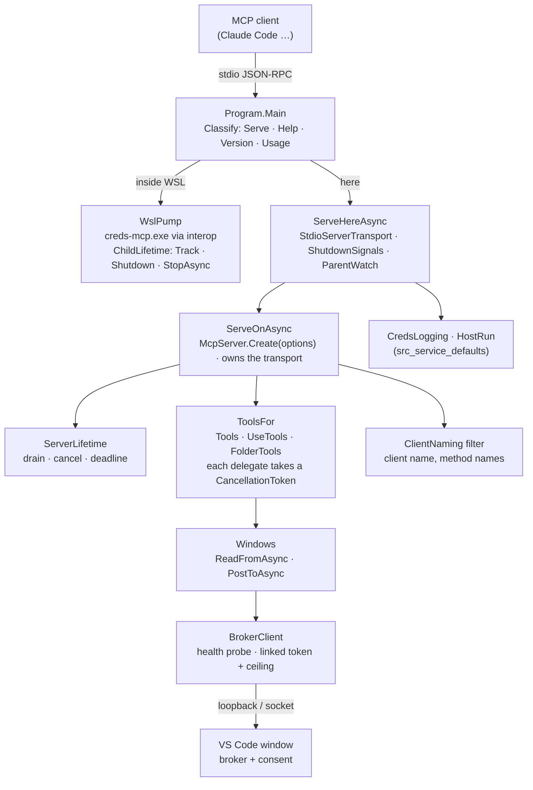

# Module — `src_mcp` (`creds-mcp`, the MCP server)

> `CredsMcp`, a .NET 10 Native AOT executable, `creds-mcp` / `creds-mcp.exe`. Entry point from the system view:
> [architecture.md](architecture.md) (*The MCP server inside WSL*, *How long a `creds-mcp` lives*). The surface
> and its switches were designed in [PLAN_mcp_server.md](PLAN_mcp_server.md), the WSL bridge in
> [PLAN_mcp_wsl_bridge.md](PLAN_mcp_wsl_bridge.md), the caller record in
> [PLAN_caller_identity_in_consent.md](PLAN_caller_identity_in_consent.md), its lifetime in
> [PLAN_wsl_bridge_outlives_its_client.md](../todo/PLAN_wsl_bridge_outlives_its_client.md) (E1 logs, E2 the server's
> lifetime, E3 the pump's). Written 2026-10-10 (E2 code round): before it, this binary was described only inside
> `architecture.md`.

## Purpose

What an AI agent talks to. An MCP client starts `creds-mcp` as its own child and speaks JSON-RPC over stdio; every
answer comes from a running VS Code window over the loopback (or, on a Remote-SSH host, a forwarded socket), and only
for entries and folders whose agent-access switches a person turned on. **It holds no credential and can obtain
none** — no response shape here has a field a secret could travel in.

Three things it does, and nothing else:

1. **Serve the protocol here** — eighteen tools over the broker routes, with the client's name and the caller
   record attached to every request (`ServeHereAsync`).
2. **Carry the session across WSL** — inside a distribution it starts `creds-mcp.exe` through interop and pumps
   stdio both ways (`WslPump`), forwarding the caller record it computed as `--caller`.
3. **End when its client is gone** — end-of-stream, a termination signal, or its parent's death, within a bounded
   time, saying which in its log: `ServerLifetime` for a server answering here, `ChildLifetime` for the pump — which
   also **stops the Windows half it started** before it goes (E3, defect B).

## Diagram

## Core entities

| Type | What it is |
|---|---|
| `Program.Startup` (enum) | `Serve`, `Help`, `Version`, `Usage` — decided by `Classify` before anything runs; help, version and a usage error are answered on the side the person ran |
| `ServerLifetime` | Holds the SDK `RunAsync` token: end-of-stream → 1 s drain → cancel; signal or parent → cancel at once; deadline armed before the cancel → exit line, flush, `Environment.Exit`. Pure over injected tasks |
| `LifetimeSignals` (record) | The three endings as tasks: `ClientGone` (`transport.MessageReader.Completion`), `ParentGone`, `Signal` |
| `LifetimeTimings` (record) | `Drain` 1 s, `Deadline` 5 s |
| `Tools`, `UseTools`, `FolderTools` | The tool catalogue: descriptions, the body each verb composes field by field, refusals passed on in the window's words. `UseTools.Rotation` (record) is a rotation's request |
| `Windows` | Finding live windows (announcement files + health probe) and the read/post walks over them, newest first |
| `CallerSource`, `CallerForwarding` | Who is asking: the record computed from this process's environment (or forwarded from the Linux half), the client's name from the handshake, the tab title per call |
| `ClientNaming` | An incoming message filter: names the client once, logs method names at Debug — never a body |
| `WslPump` | The Linux half of the bridge: starts the Windows half and tracks it in a `ChildLifetime`, pumps both directions, settles who ended first — three endings since E3: `ClientClosed`, `WindowsHalfClosed`, `Interrupted` (a signal or the parent's death returned the pump at once) — and stops the child through the lifetime's one killer. `HangUpBound` (the Windows half's drain + deadline, 6 s) is how long it waits for the child's stdout after the client hung up; `GraceFor` is how long the child may take to leave on its own by what ended the session |

## Entry points

- **stdio JSON-RPC** — the only way a client uses it. The 2025-06-18 `initialize` handshake and the 2026-07-28
  `server/discover` + `subscriptions/listen` one are both served by ModelContextProtocol 2.2.0.
- **`--help`** — the help text; also the probe signal the Linux half reads for `--caller`.
- **`--version`** — `creds-mcp <version>` (the `ServerInfo.Version` source), written and flushed at once; inside WSL
  a second line, `windows half: <answer> (<executable asked>)`, where no answer reads `older than --version, or no
  answer`, an empty one `answered without a version`, a launch failure `not started`.
- **`--caller <base64url json>`** — the record the Linux half forwards; never typed by a person.

## Behaviour worth knowing

- **Cancellation reaches the window.** The SDK binds each tool delegate's `CancellationToken` to its request (and
  leaves it out of the schema). It flows through `Windows` into every `BrokerClient` call as a linked source bounded
  by the call's own ceiling, so a session that ends closes its connection at once — which is what the extension's
  abandon path (E4.S1, `requestLife.ts`) observes as a gone request.
- **The parent watch is off** for the Windows half of the bridge (`CREDS_RELAYED_FROM_WSL` — its parent is the
  distribution's session-long `wsl.exe`), for a process started with ppid 1, and with `CREDS_MCP_NO_PARENT_WATCH=1`.
  The variable reaches the Windows half only because the bridge names it in `WSLENV` (E3: environment variables do
  not cross interop on their own, and until then the Windows half watched that `wsl.exe` — seen in the end-to-end log).
- **The pump stops the Windows half (E3, defect B).** Until 2026-10-10 the Linux wrapper died from Claude Code's exit
  SIGINT by the default disposition, and its `ProcessExit` hook — the only thing that stopped the Windows half — never
  ran. Now its child is held by a shared `ChildLifetime` ([module_service_defaults.md](module_service_defaults.md)):
  a handled signal or the parent's death returns `PumpAsync` at once (`Interrupted`); the child's stdin is closed and,
  for a **signal**, its tree is killed at once — Claude Code 2.1.296 follows SIGINT with SIGTERM after 100 ms and
  SIGKILL about half a second later (measured), so any grace would be a grace that never ends in a kill, and a
  Windows half still in defect A (a stale install) would outlive the session as before; killing the `/init` interop
  proxy ends the Windows half (measured). A lost parent or a client that hung up gives the child 2 s to leave on
  its own; a child that closed its own stdout gets 5 s. After a hang-up the pump waits for the child's stdout at most
  6 s instead of forever (the second half of defect B), and says so when the wait begins. A child the lifetime could
  not end answers with exit code 1 and a Warning rather than the exception `Process.ExitCode` throws. Exit code: the child's, or 128 + n after a signal, with the
  reason (`signalled`, `parentGone`) in the exit line; a backstop exits the process through the same forced exit as
  the server's deadline if the wrapper has not ended `grace + 2 s` after the shutdown began.
- **Logs.** A serving run writes `creds-mcp` (or `creds-mcp-wsl`) files through
  [module_service_defaults.md](module_service_defaults.md): start, client name, method names at Debug, why it
  stopped, the exit line once. Never argv values, environment values, the caller record, bodies or tool data.
- **stdout is the protocol.** Nothing but the transport writes to it while serving; the console sink is stderr.

## External dependencies

`ModelContextProtocol` 2.2.0 (the stdio transport and server; its EOF-with-listen behaviour is upstream
csharp-sdk#1914, worked around by `ServerLifetime`), `src_broker_client` (discovery, health probe, wire contract,
WSL interop — shared with `creds`), `src_service_defaults` (logging, `ShutdownSignals`, `ParentWatch`,
`ChildLifetime`).

## Tests

`src_mcp/tests` (MTP executable `CredsMcp.Tests`): the tool bodies and refusals, the catalogue, caller forwarding,
the pump on streams, the start/exit log lines with a secret marker grepped out — and E2's lifetime tier: the built
binary given a captured Claude Code 2.1.289 session (`fixtures/`) must exit within 10 s of EOF with a listen open; a
stub window holding a POST must see the connection close before `drain + deadline`; a server started through
`cmd /c` / `sh -c` must exit when that intermediary is killed; plus in-process twins (`ServeOnTests`,
`ServerLifetimeTests`, `ToolCancellationTests`). E3's pump tier: `WslPumpTests` on streams (the two old endings, the
bounded wait after a hang-up, a shutdown returning the pump at once — also mid-wait), `WslPumpRunTests` in-process
against a script standing in for `creds-mcp.exe` (a signal, a lost parent, a hang-up on a child that never closes
stdout, a child that answers and leaves, a child that leaves on end-of-stream; `GraceFor`'s three answers), and
`WslPumpHostTests` on Linux and macOS: the BUILT binary on the pump path (`WSL_DISTRO_NAME` set, no WSL anywhere) with
a stubborn child — SIGINT, SIGTERM and SIGHUP each end it with 128 + n and the child dead after the `SigIgn` check,
and a hang-up ends it within the bound. The node harness `src_vs_code/scripts/creds-mcp-itest.cjs` drives
the real binary against real window code ([module_tests.md](module_tests.md)).
