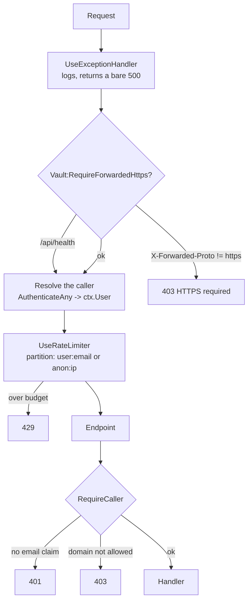

# Module: Cred Vault Server

`src_minimalapi_server/` — a .NET 10 minimal API, four source files, that stores ciphertext it
cannot read.

> This document is the **single statement of the HTTP contract**. It is implemented twice: in
> `src_minimalapi_server/src/Program.cs` and in `src_vs_code/src/serverTransport.ts`. Changing one
> without the other ships a broken client.

## Purpose

Replace a shared NAS folder with an authenticated endpoint, so a company can use the extension
without giving everyone read access to everyone's encrypted files — and so that the sender of a
shared secret is a fact rather than a claim.

It is deliberately small. There is no database, no ORM, no background service, no admin UI. The
whole server is ~470 lines.

## Files

| File | Role |
|---|---|
| `src/Program.cs` | Configuration, startup guards, the pipeline, and all eight endpoints |
| `src/VaultStore.cs` | Filesystem storage: atomic writes, hashed paths, the crash sweep |
| `src/TokenIdentity.cs` | Reads the verified caller identity out of JWT claims |
| `src/Models.cs` | `ShareItem`, `ShareRequest`, `TeamMemberDto`, `WhoAmIDto` |
| `src/Logging.cs` | Serilog: console + a file per run |
| `src/InstanceFile.cs` | Publishes where this instance is listening, for the DewFlow editor panel |

## The request pipeline

Order is load-bearing, and two of the four positions were defects until 2026-08-23.



Two things this ordering fixes:

- **The limiter must run *after* identity is resolved**, or it has nothing to partition by.
  Nothing else populates `ctx.User` here — the endpoints authenticate by hand, there is no
  `UseAuthentication()`, and no default scheme to give it one.
- **The HTTPS guard must run first**, before any token is even parsed.

`/api/health` is the single exemption from the HTTPS guard: the container's own healthcheck runs
inside the network with no proxy to add the header, and health carries no secret.

## Endpoints

Every authenticated endpoint derives its resource from the token's email. **No URL contains a user
identifier**, so there is nothing to tamper with.

| Method | Path | Auth | Success | Notes |
|---|---|---|---|---|
| `GET` | `/api/health` | none | `200` | Probes that `DataDir` is writable; `503` when it is not |
| `GET` | `/api/whoami` | any allowed caller | `200` | `{email, name, hasVault}` |
| `GET` | `/api/vault` | token email | `200` bytes / `404` | `application/octet-stream` + an `ETag`; 404 means nothing stored yet |
| `PUT` | `/api/vault` | token email | `204` | 1..`MaxVaultBytes`; `400` outside that. Honours `If-Match` / `If-None-Match`, `412` when the precondition fails |
| `DELETE` | `/api/vault` | token email | `204` | Deletes the vault, its `.email` sidecar, and the whole inbox |
| `GET` | `/api/team` | any allowed caller | `200` | `[{email}]` — vault owners in the caller's own domain |
| `POST` | `/api/shares` | sender = token email | `201` | Body below |
| `GET` | `/api/shares` | recipient = token email | `200` | Your inbox, **streamed** |
| `DELETE` | `/api/shares/{id}` | recipient = token email | `204` / `404` | `id` must parse as a GUID |

### `POST /api/shares`

```json
{
  "toEmail":     "colleague@company.com",
  "entityName":  "prod db",
  "entityKind":  "db",
  "salt": "base64", "iv": "base64", "tag": "base64", "data": "base64",
  "kdfN": 131072, "kdfR": 8, "kdfP": 1
}
```

The server validates only the *shape*: that the four crypto fields are base64, that the payload is
under `MaxShareBytes`, that `entityName` is under 512 characters, and that the recipient's inbox is
under `MaxInboxItems`.

**`fromEmail` and `fromName` are not accepted from the body.** They are stamped from the verified
token. This is the single most important line in the file — it is the difference between this
server and a shared folder.

The recipient must be in the sender's own domain (`403` otherwise), so this endpoint cannot be used
to post into a stranger's inbox on another tenant.

### `GET /api/shares` streams

The handler returns an `IAsyncEnumerable<ShareItem>` rather than a list. With
`MaxInboxItems=500` and `MaxShareBytes=1 MiB`, materialising the inbox first put roughly 700 MiB
live — before JSON encoding doubled it — on a request any same-domain account could provoke by
filling someone's inbox. Streaming keeps one item live at a time.

## Authorization

```csharp
(string Email, string? Name)? RequireCaller(HttpContext ctx)
```

Three outcomes: `401` when no verified email claim is present, `403` when the domain is not allowed,
otherwise the caller. `TokenIdentity.Email` walks `email` → `preferred_username` → `upn` →
`ClaimTypes.Email` → `ClaimTypes.Name`, lowercases the result, and **rejects outright** a token
carrying `email_verified: false` (Google sets it in some tenants; Microsoft does not send it at
all, so absent means accept).

### The three auth schemes

| Scheme | Enabled by | Validates |
|---|---|---|
| `Microsoft` | `Auth:Microsoft:Tenant` | OIDC discovery for that tenant; issuer + lifetime, audience only if configured |
| `Google` | `Auth:Google:Enabled` | Google's discovery document; issuer + lifetime |
| `Local` | `Auth:Local:SigningKey` | HMAC-SHA256, issuer `cred-vault-local`. Offline and test use only |

`AuthenticateAny` tries each configured scheme in turn and takes the first that succeeds.

**On audience validation:** an access token minted for Microsoft Graph carries Graph's audience, so
switching audience validation on before the extension has its own app registration rejects every
real token. The server logs a loud warning at startup when audience validation is off rather than
silently accepting it.

## Startup guards — fail fast, and say why

The server refuses to start rather than run in a state that looks like a network fault:

1. **No auth scheme configured** → it would 401 every request forever.
2. **`AllowedDomains` empty without `AllowAnyDomain=true`** → a credential server open to every
   verified account on earth, by omission.
3. **`DataDir` not writable** → checked *before* `VaultStore` is constructed, with a message that
   names the usual cause (a root-owned bind mount against an unprivileged container) and the fix.

Then `SweepStaleTempFiles()` runs: any `*.tmp` older than ten minutes is a write interrupted by a
crash, and is removed.

## Storage

```
${DataDir}/vaults/<key>.bin      the ciphertext
${DataDir}/vaults/<key>.email    the plaintext email, for team discovery
${DataDir}/shares/<key>/<guid>.json
```

`key = sha256(lowercased email) hex, first 32 chars` (128 bits). Hashed so a directory listing is
not a staff directory; the `.email` sidecar exists only because `/api/team` has to answer "who else
is here", and it is read defensively — a malformed or locked sidecar is skipped, never fatal.

Every write is atomic: write `<path>.<random>.tmp`, then `File.Move(overwrite: true)`. A reader
therefore never sees a partial blob, which is what lets `deploy/backup.sh` archive a live server.

### Known limits

- **Optimistic concurrency is opt-in.** `GET` returns an `ETag` derived from the content; `PUT`
  honours `If-Match` (and `If-None-Match: *` for "only if I am the first"), answering `412` when the
  caller's copy is stale. The check and the write happen under the same lock — a fixed stripe of 64,
  rather than a per-email dictionary that would grow with every account and never be pruned. A client
  that sends neither header keeps the old last-write-wins behaviour, so an extension predating this
  still works.
- **No inbox TTL.** A share nobody accepts sits there until the recipient deletes it or deletes
  their account. Bounded by `MaxInboxItems`, not by time.
- **`/api/team` enumerates.** Any authenticated caller can list every colleague's email. That is the
  feature, but it is worth knowing it is also directory enumeration for anyone inside the domain.

## Tests

`src_minimalapi_server/tests/` — xUnit v3 on Microsoft Testing Platform, 36 tests, ~1.5 s, entirely
in-process through `WebApplicationFactory`. No free port, no background `dotnet run`.

```bash
dotnet build dew_flow_creds_for_devs.slnx
./src_minimalapi_server/tests/bin/Debug/net10.0/CredVaultServer.Tests.exe
```

Never `dotnet test` — there is no VSTest host here and it aborts.

| Class | Covers |
|---|---|
| `HealthTests` | Public reachability, storage-writability reporting |
| `AuthenticationTests` | No token, foreign domain, `alg=none`, wrong key, no email claim, expired |
| `VaultTests` | Round-trip fidelity, per-caller isolation, size caps, survival after an oversize upload |
| `TeamTests` | Owners listed, non-owners absent, deletion drops out |
| `SharingTests` | Delivery, sender stamping, cross-domain refusal, traversal ids, recipient-only delete |
| `RateLimitTests` | One caller cannot lock out another; a caller who overruns is still throttled |
| `ForwardedHttpsTests` | A missing header is refused; health stays exempt |
| `InboxScaleTests` | A large inbox lists completely; a corrupted item is skipped |

Configuration reaches the app through **process environment variables**, not
`WithWebHostBuilder` — `Program.cs` reads `builder.Configuration` before `Build()`, so anything a
`WebApplicationFactory` adds during `ConfigureWebHost` lands too late to be seen. Because process
environment is global, the suite runs in one non-parallel collection (`ServerCollection`).

## Telling the editor panel where it is

On startup the host writes `<LocalAppData>/dew-flow/services/cred-vault-server.json` — name, url,
pid, start time, and the addresses it serves — and deletes it on a graceful stop. The DewFlow VS Code
panel reads that directory and lists a locally running server under **Services**.

The convention is copied from `dew_flow_rag_qln · src/ServiceDefaults/DaemonEndpointFile.cs` rather
than reinvented: same directory, same JSON shape, same best-effort semantics. The one deliberate
difference is the **filename** — that daemon owns `dew-flow/daemon.json`, and a second product
writing there would overwrite it, so everything else publishes under `services/`.

Three properties worth knowing:

- **A file, not a fixed port.** The port is assigned per run, so a reader that hardcodes one is wrong
  the first time anyone looks.
- **Staleness is the reader's problem, deliberately.** A killed process cannot delete its own file,
  so the contents are a hint confirmed by asking — which is why the file carries a pid and no status
  field. A status written by a process that has since died is worse than none.
- **Best-effort in every direction.** An unwritable profile, a container with no home, a read-only
  filesystem: discovery degrades, the server does not. It is skipped entirely when there is no bound
  address, which is what keeps an in-process test run from writing to a developer's real profile.

`Vault:PublishInstanceFile=false` turns it off; the compose stack sets that, because a per-user
profile file inside a container reaches nobody.

## Configuration

| Key | Default | Meaning |
|---|---|---|
| `Vault:DataDir` | `<app>/data` | Where blobs live |
| `Vault:AllowedDomains` | *(empty — refuses to start)* | CSV of allowed email domains |
| `Vault:AllowAnyDomain` | `false` | Explicitly run with no domain boundary |
| `Vault:MaxVaultBytes` | 8 MiB | Per-vault upload cap |
| `Vault:MaxShareBytes` | 1 MiB | Per-share payload cap |
| `Vault:MaxInboxItems` | 500 | Pending shares per recipient |
| `Vault:RateLimit:PermitLimit` | 120 | Requests per window, per caller |
| `Vault:RateLimit:WindowSeconds` | 10 | The window |
| `Vault:RequireForwardedHttps` | `false` | Refuse anything not forwarded as https |
| `Auth:Microsoft:Tenant` | — | Enables the Microsoft scheme |
| `Auth:Microsoft:Audiences` | *(empty = not validated)* | See the audience note above |
| `Auth:Google:Enabled` | `false` | Enables the Google scheme |
| `Auth:Google:Audiences` | *(empty = not validated)* | Accepted Google client ids |
| `Auth:Local:SigningKey` | *(empty = disabled)* | HMAC key for the offline scheme |
| `Vault:PublishInstanceFile` | `true` | Publish this instance for the DewFlow editor panel |
| `Logging:Directory` | `<app>/logs` | Root of the per-run log files |
| `Serilog:MinimumLevel:Default` | `Information` | Verbosity |

Environment form uses `__` as the section separator: `Vault__AllowedDomains`.

## Dependencies

| Package | Why |
|---|---|
| `Microsoft.AspNetCore.Authentication.JwtBearer` | Entra + Google token validation |
| `Serilog.AspNetCore` | The logging convention |

Test-only: `xunit.v3`, `FluentAssertions` (pinned at 7.2.2 — 8.x is not Apache-2.0),
`Microsoft.AspNetCore.Mvc.Testing`, `System.IdentityModel.Tokens.Jwt`.


## Native AOT (2026-08-24)

The server publishes **Native AOT**: `PublishAot` in the csproj, so `dotnet publish -r <rid>` produces
one static binary (~21 MB) with no .NET runtime beside it. Ordinary builds and the
WebApplicationFactory tests stay JIT; the trim/AOT analyzers run on every build, so an incompatible
pattern fails at compile time.

What it took, each a real blocker found by building:

- **One source-generated JSON contract** (`AppJsonContext` / `InstanceJsonContext`): the reflection
  serializer is the biggest AOT blocker in a minimal API. Every HTTP call site passes its
  `JsonTypeInfo` explicitly; anonymous response types became `ErrorDto` / `HealthDto`; the shares
  stream is materialized (the inbox is capped anyway).
- **`(HttpContext) => Task` lambdas** match `RequestDelegate` itself and the request-delegate
  generator mis-intercepts them (CS9144) — each takes a `CancellationToken` now.
- **`Serilog.Settings.Configuration` is reflection by design** (finds sinks by scanning assemblies).
  Replaced with explicit reads of the same `Serilog:MinimumLevel:*` keys, so the "levels from
  config" contract survives without the scanning. Core Serilog's residual IL2104 (internal `@`
  destructuring, unused here) is suppressed in the server csproj alone, with the behaviour verified
  by running the AOT binary: console and per-run file logs both checked.

Verified locally before CI ever saw it: 53/53 JIT tests, the win-x64 binary booting with health,
startup-guard and log-file checks, the Linux AOT image built and running — and the extension's
13-check transport itest green against BOTH.

Release (`server-v*` tag): per-architecture image builds on native runners (amd64 + arm64 — AOT does
not cross-compile under qemu) stitched into one `ghcr.io` manifest, plus four standalone binaries
(linux-x64, linux-arm64, win-x64, win-arm64) attached to the GitHub release.

The runtime image is `runtime-deps:10.0-noble-chiseled` — **50 MB**, no shell, no package manager, no
.NET; the entrypoint is the binary. That killed curl, so the container HEALTHCHECK execs the binary
itself: `CredVaultServer --healthcheck` (`HealthProbe`) asks the running instance for `/api/health`
over the same `ASPNETCORE_URLS` Kestrel binds on, wildcard binds probed via loopback, and maps the
answer to an exit code. A chiseled image also has no `mkdir` and no `/etc/passwd`: the writable
directories arrive as COPIED empty dirs owned by uid 10001, and `USER` is numeric — the same number
the compose init service chowns bind mounts to. The first cut of the image was 275 MB (Debian +
curl + 42 MB of `.dbg` symbols the COPY dragged along); the path down was measured, not guessed.
