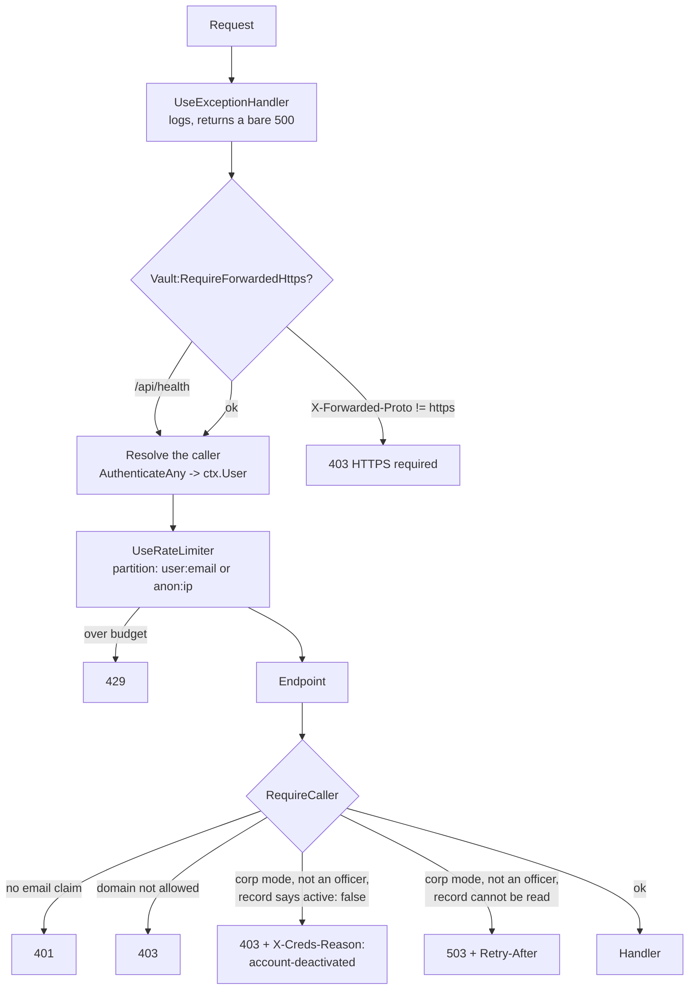

# Module: Cred Vault Server

`src_minimalapi_server/` — a .NET 10 minimal API, fourteen source files, that stores ciphertext it
cannot read.

> This document is the **single statement of the HTTP contract**. It is implemented twice: in
> `src_minimalapi_server/src/Program.cs` and in `src_vs_code/src/serverTransport.ts`. Changing one
> without the other ships a broken client.

## Purpose

Replace a shared NAS folder with an authenticated endpoint, so a company can use the extension
without giving everyone read access to everyone's encrypted files — and so that the sender of a
shared secret is a fact rather than a claim.

It is deliberately small. There is no database, no ORM, no background service, no admin UI. The
whole server is ~2,100 lines.

## Files

| File | Role |
|---|---|
| `src/Program.cs` | Configuration, startup guards, the pipeline, the gates, and the twenty-five endpoints of the personal and recovery surfaces; the corporate routes are mapped from `OrgEndpoints.cs` |
| `src/VaultStore.cs` | Filesystem storage: atomic writes, hashed paths, the crash sweep |
| `src/VaultStoreOutbox.cs` | The sender's receipts, and the two sweeps that bound both sides — the reconcile sweep keeps a receipt the server withdrew |
| `src/VaultStoreBlocking.cs` | Withdrawal at the moment of a block: every pending share to the person leaves their inbox and its sender's receipt gains a reason; every pending share from them leaves every recipient's inbox |
| `src/CallerStanding.cs` | The blocking gate's decision as a pure function — the five branches — and the `X-Creds-Reason` header it refuses with; `RequireCaller` applies it |
| `src/ShareMaintenance.cs` | The hourly pass: retire dealt-with receipts, prune what aged out |
| `src/ContractVersion.cs` | The HTTP contract version, and what a mismatch does |
| `src/TokenIdentity.cs` | Reads the verified caller identity out of JWT claims |
| `src/Models.cs` | `ShareItem`, `ShareRequest`, `SentShare`, `TeamMemberDto`, `WhoAmIDto` |
| `src/OrgRecovery.cs` | The corporate-recovery roster, its quorum guard and its fingerprint |
| `src/OrgRecoveryStore.cs` | Setup invites and the published org public key, on disk |
| `src/OrgRecoveryMaintenance.cs` | Drops setup invites nobody acknowledged |
| `src/OrgMembers.cs` | The members registry as records with no I/O: roles, share defaults, the three-state lookup, the policy derived from a role |
| `src/OrgMembersStore.cs` | One record per person under `org/members/`, read synchronously from a stat-checked cache, written read-modify-write under the vault's per-email lock |
| `src/OrgSettingsStore.cs` | The runtime settings an admin edits without a restart (`org/settings.json`); absent answers the default and writes nothing |
| `src/OrgEventLog.cs` | The append-only NDJSON event log, one file per UTC day under `org/events/` — the writer only; the reader is a later epic's |
| `src/ShareRule.cs` | The project boundary as a pure truth table — three answers, so an unreadable record can never read as "not on that project" |
| `src/TeamRoster.cs` | Its discovery half: who a caller may be offered, and how much of each colleague they are told |
| `src/OrgProjects.cs` | The project records, the name rule, and `EffectiveShare` — an unassigned person may do nothing, which is not the same as having no override |
| `src/OrgProjectsStore.cs` | One JSON file per project under `org/projects/`, three-answer lookup, striped writes, archived never deleted |
| `src/OrgProjectsEndpoints.cs` | The six project and assignment routes, mapped from their own file so `Program.cs` gains one call |
| `src/LoginKeyStore.cs` | Custody of the per-developer login key S under `org/login-keys/`: AES-256-GCM under the deployment KEK, minted once by create-if-absent, and a three-answer lookup whose unreadable branch NEVER mints a replacement |
| `src/LoginKeyKek.cs` | Reading that KEK out of configuration and refusing anything that is not exactly 32 bytes of base64, plus the startup line an operator gets when theirs is unusable |
| `src/OrgEndpoints.cs` | The corporate surface `/api/org/*`, mapped from its own file (`Program.cs` is past the size ceiling and four more epics add routes): `GET /api/org/me`, the admin's roster, role and settings routes, the block/unblock route `PUT /api/org/members/{email}/active`, the JSON `FailJson` every refusal there uses, and the registration hook `PUT /api/vault` calls. The gates stay in `Program.cs` and cross over as delegates in one `OrgEndpointDeps` record |
| `src/Logging.cs` | Serilog wiring: the coloured console + the segmenting run file |
| `src/AnsiConsoleSink.cs` | Hand-written ANSI colour (ported from the family — Serilog's own theme writes zero escapes once stdout is redirected, and a container's captured stdout always is) |
| `src/DailyRunFileSink.cs` | A file per run, segmenting at UTC midnight (`00-00-00-<pid>.log` in the next day's folder) so a never-restarting container cannot grow one file for months |
| `src/LogRetention.cs` | The named owner of `logs/`: day folders older than `Logging:RetentionDays` (14, the extension's own number) swept at startup |
| `src/InstanceFile.cs` | Publishes where this instance is listening, for the DewFlow editor panel |
| `src/HealthProbe.cs` | The container healthcheck the binary runs against itself (no curl in the image) |
| `src/AppJsonContext.cs` | The `JsonSerializerContext` source-gen contract that makes Native AOT possible |
| `src/Key32.cs` | "base64 of exactly 32 bytes, or no key at all" — one decision, shared by the login-key KEK and the backup key |
| `src/BackupArchiveFormat.cs` | What a backup archive IS: the `CVBK` marker, the version, the bounds every length is checked against, the HKDF derivation and the nonce construction, plus the header record and its reader |
| `src/BackupChunkStreams.cs` | The two streams the format is made of: one that seals what is written to it a chunk at a time, one that opens a chunk at a time and refuses the archive the moment a tag does not check |
| `src/BackupArchive.cs` | The two ends of the pipe: the walk that decides what enters an archive (and the one function that decides what never does), and the extraction that resolves every entry against the destination before writing a byte |
| `src/BackupArchiveException.cs` | Every refusal the format makes, each one a sentence naming the move that fixes it |
| `src/BackupArchiveCommand.cs` | `--create-archive`, `--verify-archive` and `--decrypt-archive`, intercepted in `Program.cs` beside `--healthcheck` |
| `src/PrintableKey.cs` | Crockford Base32, the grouping, the checksum and the normalising parser — the construction `RC1-` already uses in TypeScript, with the prefix and the domain string as parameters |
| `src/BackupKey.cs` | The `BK1-` form: minting, parsing, and the HKDF from the words a person keeps to the 32 bytes the server seals |
| `src/BackupKeyFile.cs` | The key FILE: the printable form or base64, decided by the prefix and never by guessing |
| `src/KekSeal.cs` | Sealing bytes under the deployment KEK — the AEAD call, shared by the login-key store and the backup store |
| `src/BackupStore.cs` | `org/backup/`: the sealed key, the marker saying its words were shown, the settings, the last run's status, and `archives/` |
| `src/ConfigKeys.cs` | Every configuration key this server reads, named once, checked against the source by a test |
| `src/BackupConfigSnapshot.cs` | That list as `KEY=value` lines, to travel inside an archive — resolved values, secrets included |
| `src/BackupRun.cs` | What a run is called and when one is due: the archive-name shape, the pure due-math, and the ONE place "is it running" is derived |
| `src/BackupStoreRun.cs` | The run's half of the store: the claim held as an OS handle, the interrupted-run sweep, the archive listing, and retention with the shell backup's own floor |
| `src/BackupRunner.cs` | One run in two halves — claim and announce inside the request, build outside it — and the refusals, each a sentence naming what to do |
| `src/BackupScheduleService.cs` | The five-minute question, the startup sweep, and a hosted service that never throws out of `ExecuteAsync`. Corp mode only |
| `src/OrgBackupEndpoints.cs` | The six backup routes, all admin-only, from their own file |
| `src/AwsSigV4.cs` | Signature Version 4 as a pure function, returning every intermediate the published vectors pin |
| `src/AzureSharedKey.cs` | SharedKey the same way: the thirteen-line string to sign, the canonical headers and resource |
| `src/ArchiveTarget.cs` | What a destination IS — four operations, the retention floor they share, and which endpoints may be used |
| `src/S3Target.cs`, `src/AzureBlobTarget.cs` | The two clients over signed REST: upload with verification, paginated listing, delete, and a write probe |
| `src/BackupTargets.cs` | Sealing a target's credentials under the deployment KEK, opening them again, and building the client |

## The request pipeline

Order is load-bearing, and two of the four positions were defects until 2026-08-23.



The last two are the blocking gate (2026-09-06), and they live INSIDE `RequireCaller` rather than
beside it — see *Authorization* below for the five branches and why an officer is never refused.

Two things this ordering fixes:

- **The limiter must run *after* identity is resolved**, or it has nothing to partition by.
  Nothing else populates `ctx.User` here — the endpoints authenticate by hand, there is no
  `UseAuthentication()`, and no default scheme to give it one.
- **The HTTPS guard must run first**, before any token is even parsed.

`/api/health` is the single exemption from the HTTPS guard: the container's own healthcheck runs
inside the network with no proxy to add the header, and health carries no secret.

## Endpoints

Every authenticated endpoint derives its resource from the token's email. **No URL contains a user
identifier**, so there is nothing to tamper with.

| Method | Path | Auth | Success | Notes |
|---|---|---|---|---|
| `GET` | `/api/health` | none | `200` | Probes that `DataDir` is writable; `503` when it is not |
| `GET` | `/api/client-config` | none | `200` | `{microsoftScope}` from `Auth__Microsoft__ClientScope`, `""` when unset. See below |
| `GET` | `/api/whoami` | any allowed caller | `200` | `{email, name, hasVault}` |
| `GET` | `/api/vault` | token email | `200` bytes / `404` | `application/octet-stream` + an `ETag`; 404 means nothing stored yet |
| `PUT` | `/api/vault` | token email | `204` | 1..`MaxVaultBytes`; `400` outside that. Honours `If-Match` / `If-None-Match`, `412` when the precondition fails. In corp mode the first write also **registers** the caller (below) |
| `DELETE` | `/api/vault` | token email | `204` | Deletes the vault, its `.email` sidecar, the whole inbox — and the registry record |
| `GET` | `/api/team` | any allowed caller | `200` | Vault owners in the caller's own domain, minus anyone the gate would refuse. **A developer is offered only the people they share a project with.** `[{email}]` for a caller that claims no contract; `[{email, role, projectIds}]` from contract 3 |
| `GET` | `/api/org/me` | any allowed caller | `200` / `503` | The role-and-policy document — **a document the client obeys, not a boundary the server holds**. Corp mode off → `corpMode: false` and inert defaults. Never writes. See below |
| `GET` | `/api/org/members` | **admin** | `200` | The roster of the caller's own domain, one row per record, officers flagged. Not streamed: 200 records of about a kilobyte |
| `PUT` | `/api/org/members/{email}` | **admin** | `200` / `400` / `403` / `409` / `503` | Set a role, a share default, or both — for somebody who may not have synced yet. See below |
| `PUT` | `/api/org/members/{email}/active` | **admin** | `204` / `400` / `403` / `409` / `503` | `{active}` — `false` blocks, `true` re-admits. Idempotent: `204` whether or not anything changed. A real block withdraws every pending share to and from the person and appends `member.blocked`; an officer target is `409`. See below |
| `GET` | `/api/org/projects` | any active corporate caller | `200` / `503` | The projects this caller may see: all of them for an admin or a member, **only their own assignments for a developer** — a project name is a fact about a customer engagement |
| `POST` | `/api/org/projects` | **admin** | `200` / `400` / `403` | `{name}` → the project. Ids are hex GUIDs, minted server-side |
| `PUT` | `/api/org/projects/{id}` | **admin** | `200` / `400` / `403` / `404` / `503` | `{name?, archived?}`, both nullable: an omitted `archived` means *leave it*, so a rename cannot unarchive. Unarchiving is allowed and has its own event row |
| `PUT` | `/api/org/projects/{id}/members/{email}` | **admin** | `204` / `400` / `403` / `404` / `409` / `503` | `{share}` — assign, or change the override. The project must exist (`404`), and an ARCHIVED one takes nobody new (`409`) |
| `DELETE` | `/api/org/projects/{id}/members/{email}` | **admin** | `204` / `400` / `403` / `404` / `409` / `503` | **`?deleteFolder=` is required.** `true` also appends a `pendingFolderRemovals` entry; `false` leaves their copy with them. No default, because the two are not recoverable from each other. `false` also WITHDRAWS a standing instruction, and the target must be on the roster (`404`) |
| `POST` | `/api/org/members/me/pending-folder-removals/{projectId}/ack` | own caller | `204` / `503` | The person's own proof that the removal has landed AND been pushed. Idempotent |
| `GET` | `/api/org/login-key` | any active corporate caller | `200` / `404` / `503` | The caller's own login key and its fingerprint. Minted for an active **dev**; served to anybody active who already has one; `404` when they have none; `503` with no KEK, or when the stored key cannot be read. **`Cache-Control: no-store`** — the one response here that carries key material. See below |
| `GET` | `/api/org/settings` | **admin** | `200` | The runtime settings; absent file → the defaults, and no file is written |
| `PUT` | `/api/org/settings` | **admin** | `200` / `400` | `offlineLeaseHours >= 0`; `0` is the legal "strictly online" |
| `GET` | `/api/org/events` | any allowed caller | `200` / `400` / `503` | The event log, newest first, `{items, nextCursor}`. **Scoped by who the caller is**, not by a parameter they could leave out: an admin reads the domain, everybody else reads only rows naming them. Filters: `actor`, `subject`, `person`, `project`, `kind`, `since`, `until`, `q`, `cursor`, `limit`. See below |
| `GET` | `/api/org-recovery/config` | any allowed caller | `200` | The corporate-recovery roster this server runs under. See below |
| `POST` | `/api/org-recovery/invites` | officer | `201` | One officer's sealed Shamir share; sender stamped |
| `GET` | `/api/org-recovery/invites` | officer | `200` | Your own pending invites, **streamed** |
| `POST` | `/api/org-recovery/invites/{id}/ack` | officer, own inbox | `204` / `404` | Stored durably — drop it |
| `GET` | `/api/org-recovery/invites/status` | officer | `200` | `?setupId=` → who has not answered |
| `POST` | `/api/org-recovery/setup` | officer | `200` / `409` | Publish the key once everyone has |
| `POST` | `/api/org-recovery/sessions` | officer | `201` | Start a break-glass for one target |
| `GET` | `/api/org-recovery/sessions/{id}` | officer | `200` | Status and the collected (opaque) contributions |
| `POST` | `/api/org-recovery/sessions/{id}/contribute` | officer | `204` | Your share, resealed to the session key |
| `GET` | `/api/org-recovery/sessions/{id}/target-vault` | **initiator, at quorum** | `200` / `409` | The one cross-owner read |
| `PUT` | `/api/org-recovery/sessions/{id}/target-vault` | **initiator, at quorum** | `204` / `412` | The re-keyed vault, written back once |
| `DELETE` | `/api/org-recovery/sessions/{id}` | initiator | `204` / `404` | Call it off |
| `GET` | `/api/org-recovery/audit` | officer | `200` | Who opened whose vault, **streamed** |
| `POST` | `/api/shares` | sender = token email | `201` / `400` / `403` / `409` / `503` | Body below. In corp mode the RECIPIENT's standing is checked (`403` deactivated, `503` unreadable) and then **the project rule** (`ShareRule`), which fences developers only — see below |
| `GET` | `/api/shares` | recipient = token email | `200` | Your inbox, **streamed** |
| `DELETE` | `/api/shares/{id}` | recipient = token email | `204` / `404` | `id` must parse as a GUID. **`?outcome=accepted\|declined`** says which it was, for the log; absent or unknown is recorded as `share.unknown` and deletes exactly as before |
| `GET` | `/api/shares/sent` | sender = token email | `200` | Your own receipts, **streamed**. No ciphertext — see below. A receipt the server withdrew when its recipient was blocked carries `withdrawnReason`; every other receipt has no such key |
| `DELETE` | `/api/shares/sent/{id}` | sender = token email | `204` / `409` / `404` | Withdraw while pending; `409` once accepted or declined; a receipt carrying `withdrawnReason` is **dismissed** with `204` whatever the inbox says |

### `POST /api/shares`

```json
{
  "toEmail":     "colleague@company.com",
  "entityName":  "prod db",
  "entityKind":  "db",
  "salt": "base64", "iv": "base64", "tag": "base64", "data": "base64",
  "kdfN": 131072, "kdfR": 8, "kdfP": 1,
  "format": 3
}
```

The server validates only the *shape*: that the four crypto fields are base64, that the payload is
under `MaxShareBytes`, that `entityName` is under 512 characters, and that the recipient's inbox is
under `MaxInboxItems`.

**`format` is carried verbatim and never read** (contract 2). It names which fields the client
bound into the payload's GCM additional authenticated data, and the recipient cannot choose the
right AAD without it — exactly as `kdfN`/`kdfR`/`kdfP` name the scrypt cost. Until contract 2 the
field did not exist here, so every share posted by extension 0.82.1 through 0.87 arrived with its
binding unnamed, could not be decrypted at all, and was reported to the recipient as *"sent by an
extension older than 0.82"*. The extension's side of the same rule is that it seals a **bound**
form only when the response header says the server is contract 2 or higher; below that it seals
unbound, because a binding the recipient cannot reconstruct is worse than none.

A client that sends no `format` gets an item with **no `format` property at all** — never
`"format": null`. Every released extension's `isShareItem` guard accepts the field as a number or
as absent and drops an item carrying a null, which would empty those recipients' inboxes rather
than explain anything; the wire shape for such a client is byte-identical to contract 1.

**`fromEmail` and `fromName` are not accepted from the body.** They are stamped from the verified
token. This is the single most important line in the file — it is the difference between this
server and a shared folder.

The recipient must be in the sender's own domain (`403` otherwise), so this endpoint cannot be used
to post into a stranger's inbox on another tenant.

### `GET /api/shares` streams

The array is written to the response as the store reads it, never assembled first. With
`MaxInboxItems=500` and `MaxShareBytes=1 MiB`, materialising the inbox put roughly 700 MiB live —
before JSON encoding doubled it — on a request any same-domain account could provoke by filling
someone's inbox. Streaming keeps one item live at a time.

It is written by hand rather than by handing the framework an `IAsyncEnumerable`, because the AOT
source generator has no converter for one — a fact the **build** enforces (`IL2026`/`IL3050`)
rather than leaving to be found at runtime. The org-recovery invite listing needs the same shape,
so both go through one `WriteJsonArrayAsync` helper instead of a second copy.

### The sender's side, and why it did not exist before

An inbox is keyed by the RECIPIENT (`shares/<sha256(recipient)[..32]>/<id>.json`), which is what
made a share impossible to withdraw rather than merely awkward: the sender could not learn the id
of the thing waiting for someone else. Scanning every inbox for their name would have answered it
and would have been a real disclosure — the server would then be able to answer "what has this
person sent to whom".

So the sender gets `sent/<sha256(sender)[..32]>/<id>.json`: a **receipt**, carrying `id`,
`toEmail`, `entityName`, `entityKind` and `createdAt` and NO `salt`/`iv`/`tag`/`data`. The sealed
payload still exists exactly once. Listing a sender their own actions discloses nothing new.

`DELETE /api/shares/sent/{id}` reads that receipt, and the inbox it then reaches into is named by
what the SENDER once wrote rather than by anything in the request — so a caller holding someone
else's id has nothing to look it up in, and gets `404`. Already accepted is **`409`, not `404`**:
"there is no such share" and "it is beyond recall" are different answers, and only one of them
means the secret is now somewhere the sender cannot reach.

`ShareMaintenance` retires a receipt once the inbox file is gone — the recipient acting is the
only signal there is, because nothing tells the sender — **with one exception, below.**

### Withdrawal at a block, and what the sender sees (2026-09-06)

When an admin blocks somebody (`PUT /api/org/members/{email}/active` with `{active: false}`), the
server withdraws their pending shares in **both directions**, inline in that request — "immediately"
is owner decision 5, and the recipient's next sync is not something an admin can wait for
(`VaultStoreBlocking.cs`):

- **Shares TO the blocked person** are deleted from their inbox, and each sender's receipt is
  **rewritten** with `withdrawnReason` set — a sentence, *"Withdrawn: the recipient's account was
  deactivated by an administrator before they accepted it."* Rewritten, never deleted, because the
  receipt is the only place the sender can learn why their share vanished. A receipt that no longer
  exists (already dismissed, pruned, or from an older server) is not resurrected.
- **Shares FROM the blocked person** are deleted from every recipient's inbox, and the blocked
  sender's own receipts go with them: they need no reason, because a blocked person cannot call
  anything to read one.
- **Best-effort per file, never a `500`.** The block is already on disk when this runs; a file that
  will not delete is skipped and the rest are still withdrawn, exactly as the sweeps skip one. The
  `member.blocked` row and the Warning log line carry the two counts.
- **Repeating the block finishes what a first one could not.** The withdrawal runs on **every**
  `active: false` write, transition or not: it is a loop over other people's files, and a crash, a
  handle somebody else holds or a permission flipped half-way leaves shares in an inbox the block was
  meant to empty, with nothing retrying them on a cadence. A repeat that compared the record, saw no
  transition and answered `204` would make the only recovery a human has — send it again — the one
  action guaranteed to do nothing. A repeat that finds nothing costs two directory reads and writes no
  row; one that finds leftovers logs a Warning saying it completed an unfinished withdrawal, rather
  than appending a second `member.blocked` a reader would count as a second block.
- **A sender who could not be told is counted, never silently lost.** The inbox copy is deleted
  *before* the sender's receipt is rewritten — the right order, since the reverse leaves readable
  material in the inbox of somebody who may be re-admitted — so a receipt that will not rewrite costs
  that sender their one explanation, and the hourly sweep then retires the unmarked receipt like any
  accepted one. That is best-effort working as designed; being invisible is not, so `Withdrawal`
  carries `UnexplainedSenders` and both the Warning line and the `member.blocked` row say *"N sender(s)
  could NOT be told why"*. The residual is real and stated: that sender learns nothing from the
  product, and only the block's own record says it happened.

**The recipient half: a share cannot be addressed to a blocked person.** The caller gate judges
whoever is calling, and a share is addressed to somebody else — so `POST /api/shares` consults the
recipient's standing before anything is written: `403` *"Recipient's account has been deactivated."*,
`503` with `Retry-After` when their record cannot be read (fail-closed for the gate's own reason: one
corrupt file must not deliver to somebody who may be blocked), and unchanged for an active colleague,
somebody who never synced, an officer, or any recipient on a personal server. Without this a colleague
whose client remembers the address — a blocked person is hidden from `/api/team`, not from a client's
memory — drops material into an inbox its owner is refused at, where it waits out the 31-day prune and
becomes readable the day they are re-admitted, while the sender holds a receipt saying it was sent.
**Neither refusal carries `X-Creds-Reason`**: that header tells a client to lock its OWN account and
purge its key material, and an honest client matching it here would lock the innocent sender out.

**The client half of the same contract** (`serverTransport.ts`, the second implementation this
document governs): a `403` now produces three different sentences instead of one guess. With
`X-Creds-Reason: account-deactivated` it names the caller's own deactivation and says to ask an
administrator; with a body it quotes the server's sentence and deliberately does **not** name the
caller as the refused party, because the refusal may be about a recipient; with neither it falls back
to the old *"outside the allowed domain, or not permitted"*. Before this, a share to a deactivated
colleague told the sender their own domain was wrong — a guess, about the wrong person, pointing at a
setting that was fine. Other failed statuses on a share quote the server's sentence too, truncated to
300 characters because the answer may come from a proxy rather than from us.

What the sender sees, in order: `GET /api/shares/sent` still lists the receipt, now with
`withdrawnReason`; `DELETE /api/shares/sent/{id}` on it answers `204` and forgets it — a **first
branch** ahead of the ordinary withdraw logic, which would read the missing inbox file as "already
accepted" and answer `409`, the one thing a withdrawn share is not. Nothing comes back on unblock:
withdrawal is not a suspension.

**`ReconcileSentAsync` keeps a receipt carrying a reason.** Its "still pending" test is "the inbox
file exists", and withdrawal deletes exactly that file — so without the exception the hourly sweep
would erase the sender's one explanation within the hour. The story split found this by reading the
two paths side by side; a test pins it with an accepted receipt as the positive control. The 31-day
prune (`PruneOlderThanAsync`) still retires it by its own `createdAt`, so a sender who never opens
their Sent view does not accumulate them.

The wire shape for every other receipt is unchanged: `withdrawnReason` is **omitted**, never `null`
or `""`, and a released extension's `isSentShare` checks its five fields and ignores extras, so no
contract bump was needed. On the server the field is `string?` read only through `IsWithdrawn` — a
`string` with `= ""` would still arrive `null` for a receipt lacking the key (the deserializer runs
no initializer; measured on `ShareRequest.EntityKind`), while the type claimed otherwise.

### The login key — one factor of a developer's vault key, held here (2026-09-06)

A developer's copied vault file must be dead without a live login. That needs a factor this server
holds: **S**, 32 random bytes per person, at `org/login-keys/<KeyFor(email)>.bin` as AES-256-GCM
ciphertext under the deployment KEK (`Vault:LoginKey:Kek`, base64 of exactly 32 bytes). The client
folds S into a developer's PIN and security-key wraps — `HKDF(scrypt(accountId + PIN) ‖ S)` — which is
epic 2's story 3; this is the custody half.

**S is one factor of two, and the sentence that changes is worth stating precisely.** The server never
sees the PIN and never sees the master key. What an operator holding S and a stolen blob gains is an
offline attack on the PIN — which they can already mount today against the plain `pin` wrap with no S
at all. The operator's position is unchanged; what changes is that the FILE alone is no longer enough.

**Minting is idempotent by lock and by filesystem, not by luck**, because re-minting is the worst
thing this store can do: every wrap already sealed to the old S becomes unopenable. In-process, the
64-way stripe every other store takes. Across processes — a rolling restart with two containers on one
volume — the write is a **create-if-absent** (`AtomicWriteAsync(..., overwrite: false)`, which the OS
refuses when the file exists), and the loser of the race reads the winner's key.

**An unreadable key is never replaced.** The lookup has three answers, like the registry's: found,
absent, and *unreadable* — a wrong KEK after a restore, a tampered file, a truncated write. Only
*absent* mints. Collapsing the third into the second is what would issue a second key while the
person's vault stayed sealed to the first, and the API would report success the whole way; the route
answers `503` instead, and the log says nothing was replaced.

**Who is served.** An active developer is minted one. An active member or admin is served a key they
already have, and gets `404` when they have none — not `403`, because **binding is a property of a
VERSION, not of a person**: somebody demoted from developer still holds bound versions, and refusing
them the key would leave them with a vault nobody can open. For the same reason the key is deleted
only with the vault, never on demotion.

**No rotation, and therefore no revocation.** Rotating on unblock would orphan the vault it was meant
to protect — every wrap is sealed to S, so a new key leaves the person's current vault openable by
nobody and turns every unblock into a three-officer ceremony. It also protects nothing, since whoever
kept a copy of S is the person being re-admitted. **Blocking already makes S unobtainable** — the
caller gate refuses them before the handler runs — and that is the mechanism. Stated plainly: a copy
of S taken while somebody was a developer stays valid until a two-key rotation exists.

**`DELETE /api/vault` removes the key last**, after the vault and the registry record. The order is
the design: a crash between steps leaves something behind either way, and a key outliving its vault is
300 bytes of ciphertext nobody can use, while a vault outliving its key is a vault nobody can OPEN.
Removal needs no KEK — deleting a file is not decryption — so a server that cannot issue keys can
still delete accounts.

**A missing KEK degrades this feature and nothing else**: an `ERROR` line at startup naming the
setting, `503` on this one route, and vault sync, sharing and the registry untouched. That is the
officer roster's lesson applied (below): refusing to boot over an optional feature took ordinary sync
down for everyone. A KEK that is not exactly 32 bytes is **ignored rather than padded or truncated** —
a nearly-right key is how vaults end up sealed under something nobody can reproduce.

**Nothing about S is ever logged.** The two lines are `login key issued for {email} ({fingerprint})`
and `login key removed for {email}`. The fingerprint — the first eight bytes of SHA-256(S) as sixteen
lowercase hex characters — is a public name: it lets a client tell "the server's key changed under me"
from "wrong PIN" without either side comparing secrets, and it is what appears in the log instead of
the key. A store-level test asserts the material never reaches a log line, with a positive control so
a run that logged nothing cannot pass it.

### The project rule — the one boundary of epic 3 the server enforces (2026-09-06)

`ShareRule.Decide` is a pure truth table applied in `POST /api/shares` **after** the blocking gate's
recipient check and before the size caps. Pure for the reason `CallerStanding` is: the interesting
part is the set of branches, and a branch nobody enumerated is the one that fails open.

| The sender is | and the request | the answer |
|---|---|---|
| on a personal server | anything | allowed, and **no record is read at all** |
| an officer | anything | allowed, decided from configuration; their record is never read |
| a member or an admin | with or without a `projectId` | allowed — today's behaviour, untouched |
| unknown to the registry | anything | allowed; no file means they never synced, and the default is `member` |
| a record this build cannot read | anything | **`503`** — "is this person a developer" cannot be answered |
| a **developer** | with no `projectId` | `403`: they may share only out of a project folder |
| a **developer** | naming a project that is absent or **archived** | `403`: a closed engagement is not a channel |
| a **developer** | naming a project file this build cannot read | **`503`**, never a refusal |
| a **developer** | whose effective share for it is `none` | `403` |
| a **developer** | whose recipient is not on that project | `403` |
| a **developer** | whose recipient's record cannot be read | **`503`** |
| a **developer** | inside their project, to somebody on it | allowed |

**The server checks what it can SEE, and the rest is named rather than assumed.** `projectId` is
client-supplied and the payload it describes is ciphertext, so the server cannot verify that the
entity really sat in that folder — a developer could name a project they are on while sending
something from outside it. That is the same trust class `entityKind` has always occupied, and it
is why the client-side move gate — which keeps entities inside their project folders — is part of
this epic rather than a nicety. What the rule DOES verify is the two facts it holds: that the
project is open, and that both people are on it. Stated here so a reader does not assume a
guarantee the ciphertext makes impossible.

**Developers only, and the field is carried for everybody.** The client sends `projectId` for any
entity under a project folder whatever the sender's role, so a rule keyed on *"this request names a
project"* would refuse a MEMBER sharing out of one — a regression on the behaviour this epic
promises to leave alone. Epic 4 logs the field and story 4 binds it into the AAD.

**It never re-reads `active`.** `RecipientRefused` already answers `403` for a deactivated recipient
and `503` for a record it cannot read; a second reading here would answer `403` where the gate
answers `503`, reading *unavailable* as *not a member*.

**`projectId` is omitted from a stored `ShareItem` rather than written as `null`** — the trap
`format` records one field above, which cost six days: a released extension's own shape check
accepts a string or an absent field, and drops the whole item on a JSON null, so the recipient sees
an empty inbox rather than anything they could investigate. It is also **counted by**
`PayloadBytes`: the rule bounds a developer's to a real project, while a member's is stored
verbatim, and a field nobody counts is a field an attacker fills.

### Team discovery: one filter, two shapes

`TeamRoster.For` is the discovery half of the same boundary — a client that proposes a recipient the
rule will refuse teaches people the feature is broken. Two things happen, gated on **different**
questions:

- **The filter is about the caller's ROLE.** A developer is offered the colleagues they share a
  project with, and nobody else, whatever contract they claim. **The caller is always in their own
  list** — by a branch, not by the assumption that everybody shares their projects with themselves,
  which is false for a developer assigned to nothing and would drop them from their own roster.
- **The shape is about the contract they CLAIM.** A header-less client is served on a corp server
  too, so the wider row travels only from contract 3. Two TYPES rather than optional fields, so the
  old shape's identity is structural and cannot be lost by dropping an attribute.

**A developer's own project set is the ones they may SEND from**, not merely the ones they are on: an assignment whose share is `none` puts them in a project they cannot share into, and offering them its colleagues proposes recipients the rule will refuse. `TeamRoster` and `ShareRule` ask `OrgProjects.EffectiveShare` the same question.

**A developer is told only the projects they share with each colleague.** Somebody on A1 with them
and on A5 without them yields `A1` alone: the full list would leak the engagement names this epic
exists to fence, to exactly the role it fences. A member or an admin, who may read the roster
through the admin surface anyway, gets the full list.


**Discovery agrees with the rule about the PROJECT too, not only about the person.** Two rounds of
the gate found the same shape twice: a developer whose share for a project is `none` is on it and
can send nothing into it, and a developer on an ARCHIVED project is on it and cannot send into it
either — a closed engagement is not a channel. Offering either one's colleagues proposes a recipient
`ShareRule` will refuse. `TeamRoster` now asks both questions of the same two places the rule asks
them: permission of `OrgProjects.EffectiveShare`, availability of the project store.
**Discovery is still vault-based** (`ListVaultOwners`): a colleague assigned to a project who has
never synced has no vault and is not discoverable. Left as it is — changing the source of team
discovery changes what every non-corporate deployment shows — and recorded here as a limit.
### The contract floor is 4 from epic 3 (2026-09-06)

`ContractVersion.Current` is 4, and `ShareProjectContract` is the floor a corporate server applies.
A client below it is refused with `426` before authentication, and the sentence says why: it cannot
read the role-and-policy document, and it cannot open a share sealed to a project — it would report
a wrong PIN for a share that is intact.

**The floor is not lowerable from configuration.** `MinimumFor` is
`Math.Max(configured, ShareProjectContract)` in corp mode, so an operator can raise it and not lower
it; rolling back means deploying the previous server build. `POST_DEPLOY.md` item 2 carries the
expected number so a server left on the old build is caught by the check rather than by a colleague.

`POST /api/shares` carries `projectId` verbatim, as it carries `format`. The server has no opinion
about either beyond the share rule, and both are omitted rather than written as `null` — a released
client's own shape check accepts a field or its absence, and drops the whole item on a null.

### Projects, assignments, and the instruction to remove a folder (2026-09-06)

A project is a name people are assigned to: `${DataDir}/org/projects/<guid>.json`, one small record
each (`OrgProjectsStore`). Epic 3's later stories turn an assignment into a folder in that person's own
vault and into a share rule; this is the surface that creates them.

**A project is archived, never deleted.** The event log records assignments and shares by project id
and is kept forever, so a deleted project turns every row that names it into an id nobody can resolve.
Archiving keeps the name readable and stops the project being used. **Unarchiving is allowed** — an
admin who archived the wrong one must be able to say so — and writes its own row, because a log that
records the archive and not the undo describes a state the server is not in.

**Three answers, again.** `Find` returns found / absent / **unreadable**, for the reason the members
store does: read as "absent", a rename would write a fresh record over a half-written one and lose
whatever it held, including assignments nobody touched. Writes take the same 64-way stripe every other
store takes, so a rename and an archive arriving together are serialised rather than racing.

**`deleteFolder` is required on an unassignment**, and that is the one place this surface refuses to
guess. Left to a default, one reading deletes somebody's folder when the admin meant only to unassign,
and the other leaves corporate material on a machine when they meant it gone — and the two requests
look identical. Making the caller say it costs one query parameter.

**The removal instruction is durable, and the acknowledgement is per PERSON.** `deleteFolder=true`
appends a `pendingFolderRemovals` entry to the member record, which `GET /api/org/me` already carries;
the client clears it by calling the ack route. One entry per record, not per device: the first machine
to carry the instruction out clears it, and every other machine of theirs receives the deletion the
ordinary way — as a tombstone through their own vault sync. **That is why the client must ack after the
PUSH and not after the local delete**: the acknowledgement claims the removal has left the machine, not
merely that it happened on it. A person who never syncs again never acks, and the instruction waits.

**Somebody not assigned may do nothing in a project.** `OrgProjects.EffectiveShare` answers `none` for
an absent assignment rather than falling through to the person's own `shareDefault` — the plan round's
finding, and it would have given a member with a permissive default the run of every project on the
server. An assignment carrying `inherit` re-reads the role's default every time rather than freezing it,
so changing somebody's role changes their projects with it. **It re-reads it through `MemberPolicy`,
never off the record's `shareDefault` field** — the code round's finding, and the distinction is the one
`PolicyDto` already documents: a stored copy of a rule is a second source of truth, and these two
disagree exactly where it matters. A role written by a NEWER server fails closed in the policy (`none`)
and fell through to the stored value here; so did a share default this build does not recognise.

**An archived project takes no new assignments** (`409`), and still lets people off it. Archiving is the
only way a project closes, so one that keeps taking people is not closed — and a project routinely
closes with people still on it, which is why the refusal points one way only.

**Putting somebody back on a project WITHDRAWS a standing instruction to delete that folder**, and so
does an unassignment that says `deleteFolder=false`. Both facts are durable and the client reads them in
one document: left standing, the removal is carried out on the next cycle against the folder the same
document has just told it that it owns. `RemovalsAfter` is the single place either is written, so the
rule cannot hold on one path and not the other.

**An unassignment names somebody who is actually ON that project, or it is a `404`.** Being on the roster is not enough — the code round found that an admin's typo naming a real colleague answered `204`, wrote a `project.unassigned` row for something that never happened, and queued a folder deletion against a project that person had never been on, which their client would then carry out. A standing removal for the project also qualifies, which is what keeps `?deleteFolder=false` able to withdraw one after the assignment is gone.

**And they must be on the roster at all.** The member store creates what it
cannot find, and the asymmetry is deliberate: on the way IN that is the feature — an admin puts a new
hire on a project before they have opened the extension, exactly as the members surface already gives
them a role — while on the way out there is nothing to create, and a typo would otherwise put somebody
on the roster by removing them from something they were never on.

**`UpdateAsync` answers with the record it REPLACED as well as the one it wrote** (`ProjectUpdate`),
because the caller derives the event rows from the difference. Read with a `Find` before the call, the
baseline is whatever a concurrent admin had not yet written: A starts a rename, B archives and commits
first, and A then logs a `project.archived` row for an archive it did not perform. The same shape, for
the same reason, as `UpsertResult.Before` on the member store.


**Three more economies and one guard, from the code round.** A developer's project listing resolves the
ids on their own record instead of reading every project on the server and discarding the rest. The
share rule takes its project and recipient lookups as FUNCTIONS, so an ordinary member's `POST` no
longer reads three registry files to reach a branch that consults none of them — one of which the
blocking gate had just read. `/api/team` hands its discoverability pass and its roster pass one
memoized reader rather than parsing every colleague's record twice. And the acknowledgement route —
the only write on this surface with no admin gate of its own — answers `204` on a personal server
instead of writing through a store that creates what it cannot find, which would have conjured the
`org/` tree such a server is documented never to grow.

**Four more from story 3's code round.** A project name must be ONE LINE — no tabs, no line breaks —
because it becomes a folder name on every assigned person's machine and a path Windows refuses
outright. The LISTING now checks the id inside a file against the filename outside, as `Find` always
did: a copied file used to answer under one project's id in the list while being absent from every
id-based route, so an admin saw a project they could not rename, archive or assign anybody to. A
projects folder that cannot be ENUMERATED is logged rather than swallowed — it looked exactly like a
server with no projects. And a developer's listing answers `503` when one of their own assigned
projects cannot be read, instead of quietly returning a shorter list: the missing project reads as
"you are not on it any more", a policy statement the server never made.

**A project name has no slashes, no tabs and no line breaks**, because it is carried to every
assigned machine as a folder name and an export writes files named after what it exports. **A null
project id is absent rather than a crash** — the type says non-nullable and the AOT serializer does
not enforce it, so a record from a newer server can carry one, and answering with an exception would
fail the whole /api/org/me document over somebody else's bad record. **A server with no projects yet
logs nothing**: the directory appears on the first write, so its absence is the ordinary first state
— while a FILE sitting where the folder belongs is a fault and says so, which Directory.Exists alone
cannot tell apart.
**Six kinds reach the event log** at the point of durable write — `project.created`, `project.renamed`,
`project.archived`, `project.unarchived`, `project.assigned`, `project.unassigned` — each with a test
that reads the row back OUT of the log rather than asserting a status code. Written in this epic rather
than left to epic 4's reader, because a log nothing is required to write to is the defect epic 1 called
its sharpest.

**`GET /api/org/me` now names the projects** it lists: `ProjectSelfDto` gained `Name`, joined from the
store. Epic 1 shipped it without one because there was no store to take a name from, and an id is not
something a person can read. An assignment whose project has since been removed answers an empty name
rather than failing the whole document.


### The contract version

**Current: 4** — a share carries the corporate project it came out of, and a client below this
cannot OPEN one: it would open the project form with no additional authenticated data, fail the
GCM tag, and report a wrong PIN for a share that is intact. That is the six-day failure of
0.82.1–0.87 in a new place, so the corp floor moved with the number rather than a story later.
**3** was the role-and-policy document, `GET /api/org/me` (below). A version-2
client does not know the route exists, so on a server with a corporate roster it obeys no policy at
all — not a garbled response but a missing one: it exports, shares and backs up exactly as before,
and nothing on either side says so. That is the misreading the bump names. **2** was a share
carrying its `format` (above): version 1 dropped it, and a client must know which version it is
talking to *before* it seals, not after it fails.

Every response carries `X-Creds-Contract: <server version>`; a client sends the same header.
Below the minimum the middleware answers **`426` before authentication**, so an extension too old
to be served is told THAT instead of a `401` about a token that was never the problem. A caller
that sends nothing, or something a proxy mangled, is served — every extension released before this
existed sends nothing, on a corp server too.

**The minimum applied is the effective one, and corp mode floors it at 3.**
`ContractVersion.MinimumFor(configured, corpMode)` is `Math.Max(configured, 3)` when a roster is
configured and the configured value otherwise, so an operator's higher minimum stands and a
personal server is exactly as before. The reason is narrower than "make the policy binding" — the
policy is what an honest client obeys, not what the server enforces — but a client that cannot even
read the document cannot be expected to obey any of it, and serving it would be serving a bypass
while hiding that from whoever deployed the server. So the `426` body in corp mode says why:
*"this server speaks contract 3 and no longer serves 2 — this server has a corporate roster, and a
client below contract 3 cannot read the role and policy document (GET /api/org/me) every client
here is expected to obey; update the extension."* The sentence is built from `OrgPolicyContract`,
not typed, so a later cutover cannot advertise a stale number, and it is added only when the claim
is below 3; an operator who configured 5 refuses a contract-4 client for their own reason. **On
`/api/org/*` the `426` is a JSON `{error}`**, because that surface promises one on every refusal and
the middleware answers before any of its endpoints can; every older route — `/api/org-recovery/*`
included, a shared prefix and none of the shape — keeps the plain sentence byte for byte. This is a
hard cutover on the day a corp server upgrades (owner decision 12) and belongs in the release notes;
the extension's `CLIENT_CONTRACT_VERSION` and `ORG_POLICY_CONTRACT` moved to 3 in the same change,
because a gap between the two halves is a window in which this repository's own extension is
refused by its own server.

It rides on a header rather than in `/api/client-config` because that endpoint documents its own
reason for having exactly one field, and because a header means a client learns the version from
a call it was already making. The default minimum stays 1, so on a personal server the refusal
path is reachable only through configuration — which is precisely why `Vault:MinimumClientContract`
is configurable: a test raises it and drives a real refusal, instead of a branch nobody has ever
seen run being discovered wrong on the day it first matters. On a corp server the floor makes the
refusal real with no configuration at all, and `http/org/me.http` provokes it over the wire.

### `RequireAdmin` — two ways in, one refusal

Beside `RequireOfficer`, and deliberately two answers to one question. **An officer passes
unconditionally**: the roster is the operator's own list, an officer cannot be given a registry role
(the `409` below), and a deployment whose officers could not administer would need a second list to
say who can. **Everybody else passes only by their record saying `admin`.**

Every refusal it decides is the **same `403` with the same JSON body** — not an admin, never
registered, corp mode off. That is `RequireOfficer`'s doctrine for its reason: telling a caller which
fact failed hands them the roster's shape for free. A record this build cannot read used to be a fourth
cause of that `403`; since the blocking gate (2026-09-06) a non-officer with such a record is met one
gate earlier, inside `RequireCaller`, with the `503` + `Retry-After` that `/api/org/me` answers for the
same file — a fact about the caller's own record, not about the roster. Either way: a record the server
cannot parse is not a person whose standing it may guess, and guessing would mean the computed default,
which is a `member` — the plan round's escalation, one gate later. The gate writes its own body, unlike
`RequireOfficer`, because this surface promises a reason and an empty `403` is not one.

### The admin's routes

**A record the server cannot read is absent from the roster** rather than breaking it: one damaged
file must not cost an admin the whole list, and it must not be drawn as a person with a role either.
The store logs its path at Error, and the person themselves meets the `503` on their own
`/api/org/me` — so whoever is looking for them finds the log, and whoever is looking at everybody
else is not stopped by them.

**`GET /api/org/members`** answers `MemberListEntryDto[]` — the record's facts plus `isOfficer`,
which the record cannot hold because it comes from configuration. It is reported beside the role for
a practical reason: a list that showed the CTO as a plain `member` would invite exactly the edit the
server refuses. The scoping is the **store's** (`ListForDomain`), not the endpoint's: on a server
whose `Vault:AllowedDomains` names two companies, one company's admin must never be handed the
other's roster, and a filter written at the call site is one the next call site forgets.

**`PUT /api/org/members/{email}`** is the upsert, and it creates: Bob joins on Monday and the admin
sets him up on Friday, so his first policy is the one the admin chose rather than the default his
first sync would have written. Its refusals, in the order they are checked:

| Answer | When, and why it is that answer |
|---|---|
| `400` | The path segment is not an email address. Checked FIRST: it would otherwise hash to a key like any string and be written, and answering the cross-domain `403` would tell an admin their own colleague is in another company |
| `403` | The target is in another domain (unless `Vault:AllowAnyDomain`). Two reviewers found this hole independently in the plan; on a two-company server it is one company administering the other. Mirrors the break-glass session start's own check |
| `409` | The target is a recovery officer. Never a silent no-op: the roster is configuration, and a UI that appeared to demote the CTO would be lying about what happened |
| `400` | An unknown role, an unknown share default, a body that is not this endpoint's JSON, or one that changes nothing. The sentence names the legal values, because it is for an admin UI rather than a log; `{}` is a `400` rather than a `200` that re-stamps a record and reports success |
| `503` | The record exists and cannot be read. The file is left exactly as it was: overwriting it would start from the default, and a default written over a blocked developer's corrupt record is an unblock nobody ordered |

A share default sent for somebody who is not a developer is **stored, not refused** — it takes effect
only for `dev`, exactly as `MemberPolicy.For` reads it, and refusing it would stop an admin setting
the shape first and demoting second, which is the order that never leaves a developer with a share
default nobody chose. `updatedBy` is stamped from the token; a field in the body that claims
otherwise is ignored.

**`GET` / `PUT /api/org/settings`** are runtime because nothing in them has a cryptographic
consequence: the offline lease changes what an honest client does between two successful syncs, while
the officer roster changes what a key is sealed to — which is why that one stays in configuration and
costs a restart and a ceremony. `SetSettingsRequest.OfflineLeaseHours` is **nullable on purpose**: a
deserializer runs no defaults, so a positional `int` a client omitted would bind to `0`, and `0` here
is the legal "strictly online" — a body of `{}` would have switched every client's lease off in
silence. Absent is a `400` instead.

**`PUT /api/org/members/{email}/active`** (2026-09-06) is the block and the unblock — `{active: false}`
and `{active: true}` — and its own route rather than a field on the upsert: "changed a role" and
"locked somebody out" are different acts an audit log must tell apart, and the body's one field has to
be impossible to omit by accident. `SetActiveRequest.Active` is **nullable for the reason
`SetSettingsRequest` gives, with higher stakes**: a positional `bool` a client omitted would bind to
`false`, and `false` here blocks somebody — `{}` and an explicit `null` are `400`s that name the field.

It shares `TargetProblem` with the role upsert, so the two cannot disagree about whom an admin may
reach: a non-address is `400`, a cross-domain target `403`, **an officer `409`** — the roster is
configuration, and a gate that refused an officer would lock the break-glass quorum out of the only
road into a blocked developer's vault, so an officer cannot be blocked at all. An unreadable record is
`503` with the file left untouched: a default written over a blocked developer's corrupt record is an
unblock nobody ordered. A non-admin is `403`.

**`409` beats `503` when both are true.** An officer whose own record cannot be read is refused with
`409`, not `503`: the officer check reads configuration and never opens the record, so it decides
first — and must, because `503` invites a retry that can never succeed and makes a corrupt file look
like the reason an officer is protected. The same precedence the caller gate applies when it passes an
officer whose record will not parse. A test pins the order.

**Idempotent, `204` either way.** The write is `UpsertAsync(email, r => r with { Active = … })` — the
same per-member lock as every other edit, and the edit touches `Active` alone, so a developer who is
blocked and re-admitted comes back the developer they were, not the default member who may export. A
value the record already holds writes no row — the log records transitions — but a repeated
`active: false` **does** re-run the withdrawal, which is how an unfinished one is completed (above). A
real transition to `false` is the block: the caller gate refuses the person from their very next request
(the record is on disk and the gate re-stats), both directions of pending shares are withdrawn (above),
`member.blocked` is appended and a **Warning** names the admin, the target and the two counts — this is
the one admin action that changes what happens to other people's inboxes, and an operator must be able
to see who did it to whom from the server log alone. A real transition to `true` appends
`member.unblocked` and logs likewise; nothing withdrawn comes back. The upsert creates, as the role
upsert does, so an admin may shut a door before the person has ever opened it — the record is created
inactive with the admin's stamp, `member.registered` names the admin, and the first sync never happens.

**No client token from the moment the record has landed.** The withdrawal and the rows run under
`CancellationToken.None`, on the precedent of `DELETE /api/vault`: the person is already refused, so the
withdrawal is owed whether or not the admin's client is still listening — a disconnect that cancelled
it half-way would leave shares in inboxes the block was meant to empty.

### What the admin routes write to the log

**One row per changed PROPERTY, not per request** — a PUT that sets both a role and a share default
leaves two, and one that sets a role to the value it already had leaves none. Each row is appended
**after** the write it records has landed, and **an append that fails never fails the mutation**: the
change is on disk, a `500` would tell the admin otherwise, and the loss is logged at Error carrying
the kind, the actor and the subject, so the trail degrades to the server log rather than vanishing.
So the guarantee is exactly that and no more — the log is a record of what happened, not a second
commit the mutation waits for:

| Kind | From | Detail |
|---|---|---|
| `member.registered` | the upsert, when it created the record — with the ADMIN as actor | the role it was created with |
| `member.role_changed` | the upsert, only when the value actually differs | `from -> to` |
| `member.share_default_changed` | the upsert, only when the value actually differs | `from -> to` |
| `member.blocked` | `PUT …/active` with `false`, only on the real transition — with the ADMIN as actor; the store cannot emit it, because the same `UpsertAsync` serves a sync and an admin and only the caller knows which | `withdrew N pending share(s) to them and M from them` |
| `member.unblocked` | `PUT …/active` with `true`, only on the real transition | — |
| `settings.changed` | `PUT /api/org/settings`, only when the value differs | `offlineLeaseHours from -> to` |

"Differs" is decided against `UpsertResult.Before` — the record the write actually replaced, read
under the store's own lock. A lookup at the call site would compare against whatever a concurrent
admin had not yet written, and two admins editing one person could then log a transition that never
happened.

### `GET /api/org/events` — reading the log back, and the scope that is not a parameter

Epic 4's first story. The log has been written to since epic 1; this is the only way to read a row
back without a shell on the server.

**The scope is decided from the caller's own record, never from the request.** An officer, or a
registry record that says `admin`, reads every row in the domain. Everybody else — a member, a
developer, somebody who has never synced — reads the rows that name them as `actor` or `subject`, and
their filters can only NARROW that set: the scope rides into the reader as a field of the query and
is applied by the same predicate, before any filter. A member passing `person=<a colleague>` therefore
gets the rows naming both of them — a subset of their own — rather than an error or the colleague's
history. A record this build cannot read is the same `503` `/api/org/me` answers for the same file:
the record decides the scope, so a guess would be a guess about who may see what.

**The query.** All optional, all ANDed:

| Parameter | Reads |
|---|---|
| `actor`, `subject` | one email, exactly, case-insensitively |
| `person` | actor OR subject |
| `project` | a project id |
| `kind` | exact — or, ending in a dot, the GROUP: `share.` is every share kind |
| `since`, `until` | unix milliseconds, inclusive; `since > until` is `400` |
| `q` | a case-insensitive substring over every field a row carries |
| `cursor` | what a previous page answered in `nextCursor` |
| `limit` | rows per page; default 100, capped at 500, and a larger number is CAPPED rather than refused |

A parameter this server cannot read is `400` naming it — a limit below 1, a cursor it did not hand
out, an instant that is not a number, a filter longer than 256 characters.

**The cursor is `<utc day>:<line index>`**, the physical line of the day file the page stopped on.
Physical, counting blank and torn lines, and that is what makes it stable: the writer only ever
appends and never repairs a torn tail, so no line below a handed-out index can move. A page taken
while the log is being written therefore neither repeats a row nor skips one — appended rows are
newer than everything on the page, and the cursor walks older. A cursor whose day file is gone
resumes at the next older day; one past a file's end resumes at its last line.

**No `total`.** An exact count is a second full scan with the same filter, which is what the server
already refused to pay when the inbox was made to stream. What a "load more" button needs is the page
and whether there is more, and that is `nextCursor`: null means the end. A page that fills on the
oldest row of the oldest file answers null rather than costing a client one round trip to be told so;
in every other case knowing would mean scanning past the page.

**Newest first is the order rows were APPENDED** — the file's own order, newest file first — not a
sort on `at`. They agree to the microsecond, because the day file is chosen from the same clock that
stamps the row; sorting by `at` across files would cost a merge of every file in range and a cursor
that could no longer be a position. The log records the sequence of what happened, and that is what
it answers.

**Every query has two budgets** — 20,000 lines and 400 day files. A substring filter with no date
range would otherwise read the whole history, kept forever, on one request; the request limiter
bounds how OFTEN a caller asks, never how much one ask costs. The second budget is not the first in
disguise: a deployment with two rows a day never reaches the line budget and spends its cost OPENING
files instead, so one request would otherwise open a decade of them. Past either budget the page ends
early with a cursor, so an empty page WITH a cursor means "nothing yet, keep going".

**A line that will not parse is skipped and counted**, and the file is named once at Warning however
many queries read it — a process killed mid-append leaves exactly one such line, and it must not end
a query. A day file that cannot be OPENED is different and is not skipped: half a history answered as
if it were the whole one is the one failure an audit log must not have, so the query fails and the
caller gets a `503` naming an administrator, with the file in the server log. A file that has vanished
between the listing and the open is gone rather than broken, and the walk carries on.

### What a SHARE writes to the log (2026-09-07, epic 4 story 2)

Seven kinds, and every one of them names both people — the actor is whoever acted, the subject is the
other party — because the reader shows a person the rows where they are one or the other, so both
sides of a share see it and nobody else does.

| Kind | Written at | Actor / Subject | Detail |
|---|---|---|---|
| `share.sent` | `POST /api/shares`, after the INBOX write lands | sender / recipient | — |
| `share.accepted` | `DELETE /api/shares/{id}?outcome=accepted` | **recipient** / sender | `outcome: accepted` |
| `share.declined` | the same with `declined` | **recipient** / sender | `outcome: declined` |
| `share.unknown` | the same with no outcome, or one this build does not know | **recipient** / sender | — |
| `share.withdrawn` | `DELETE /api/shares/sent/{id}`, the `204` path only | sender / recipient | — |
| `share.withdrawn_blocked` | the block handler, one row per share it took | sender / recipient | — |
| `share.expired` | `ShareMaintenance`'s prune, one per expired inbox item | sender / recipient | — |
| `login_key.issued` | `GET /api/org/login-key`, on the MINT only | the developer / — | `first issue` |

Each row carries the share's id, the entity's plaintext name and kind, and the project when the
sender named one. **Never a byte of the payload** — a test posts a share whose ciphertext is a
distinctive marker and greps every byte of the log for it, with a control asserting the search would
have found the row.

**The row for a send goes with the INBOX write, not after both writes.** That write is the durable
fact the row is about: from that moment the recipient can open it. The sender's receipt is their own
copy, and a receipt write that fails answers `500`, after which a client retries and posts a second
share — leaving two rows, both true.

**A delete records only what actually happened.** `VaultStore.TakeShareAsync` reads the item and
deletes it in one place, and the DELETE decides: two clients racing the same share both read it and
only one removes it, so a row written off the read would carry two answers for one share and one of
them would be a lie. A share deleted but unreadable by this build leaves no row and a `Warning` line
— the share is gone either way, and the row would be a fabrication.

**The outcome is the client's word and cannot be verified**, the same trust class as `entityKind` and
`projectId`. An absent one is not an error: every client released before contract 3 sends none, and
refusing the delete over a log field would break every inbox in the field on the day the server
deploys.

**A retired receipt leaves no row.** The reconcile retires a receipt because the recipient acted, and
that act already wrote `share.accepted` / `.declined` / `.unknown`; a second row would double every
share in the history. The prune's receipt half is counted and not recorded for the same reason —
only its INBOX half writes `share.expired`, and that item names both parties, which is why
`SentShare` needed no new address field (the epic plan expected `fromEmail`). It did gain
`projectId`: the withdrawal paths hold the receipt rather than the inbox item, and a log an admin
filters by project must not lose half the rows about one. Omitted when absent, so the wire stays
byte-identical for every released client, and a receipt written before this reads as no project —
which is the truthful answer.

**Batches are one append, not one per row.** Blocking somebody withdraws up to `Vault:MaxInboxItems`
shares and each earns a row; a weekend's expiries arrive together. `OrgEventLog.AppendManyAsync` takes
both halves of the lock and opens the day file once for the whole batch — one at a time would be 500
lock acquisitions and 500 opens inside one admin request. The expiry drain also **does not honour the
stopping token**: the files are already deleted when it runs, so a loop that stopped half-way would
leave shares gone and unrecorded, and no later sweep can find them to try again.

**An append can no longer fail a request in any way.** `AppendManyAsync` catches everything rather
than a list of types: the guarantee is that a mutation already on disk is never turned into a `500` by
the log, and a list of anticipated types is a bet that the fourth one never comes — which on the share
path is lost in the sender's face, with the share in the recipient's inbox and the sender told it
failed.

**A block writes one row per share and keeps the counts in `member.blocked`.** The counts answer
"what did this block do"; the rows answer "what happened to the share I sent Boris", which a number
in somebody else's row cannot. Bounded by the inbox cap, and only on the real transition.

**`login_key.issued` fires on a mint, never on a read.** The client revalidates every five minutes,
so a row per read would be a row per developer per five minutes — the log's whole budget spent on the
fact that somebody is still employed. The mint decision is made under the same per-email gate the
write is, so two calls racing for one absent key leave exactly one row.

### An operator log names the person, and code scanning is told so once

The lines that name an email — a registry record refused, a record that could not be removed, an
audit row lost — are flagged by CodeQL as exposure of private information, and they are dismissed
rather than redacted. The server already keeps an `.email` sidecar per account in plaintext and has
logged the caller on every vault write and delete since long before the registry existed, so nothing
new is exposed; and each of these lines exists **because a review finding asked for it**: an
operator's one signal has to name whose record it is and which file held it, or nobody can act on it.
A future line of the same shape earns the same dismissal, with that reason.

### `GET /api/org/me` — a document the client obeys, not a boundary

```json
{
  "corpMode": true,
  "email": "dev@company.com", "role": "member", "active": true,
  "isOfficer": false,
  "shareDefault": "project",
  "projects": [], "pendingFolderRemovals": [],
  "policy": { "export": true, "share": "any", "moveOutOfProject": true },
  "offlineLeaseHours": 24,
  "loginKeyVersion": 0,
  "serverContract": 3
}
```

The one document every client reads each cycle, in corp mode and out of it. Everything in it is
what the shipped extension is expected to act on — export, local backup and moving an entry out of
a project happen inside the extension, where the server cannot see them — so nothing here stops a
developer holding a valid token and `curl`. The umbrella plan's *Boundaries* table grades every
rule; the ones the server does enforce land at `POST /api/shares` and in the caller gate in the
next epics. Written down here because the natural mistake is to later "fix" a client-side ban by
moving it to a server that cannot observe the thing it would be banning.

- **Corp mode off** (`orgRecovery.Enabled` false — the roster is the switch, there is no second
  flag) answers `corpMode: false` and the defaults computed from constants, and consults nothing:
  a personal server is indistinguishable from one that never had a registry, whatever a leftover
  file under `org/` says. A test writes Alice as a blocked developer and reads back a member.
- **Never registered** — no record on disk — answers the *computed* default: `member`, active, no
  projects, the default lease. **It writes nothing.** This is `OrgRecoveryConfig.Read`'s "off is
  the shape, not a flag" applied to a person: the answer is correct before the disk agrees, and a
  token that stored nothing gets no file — not even the directory.
- **A record this build cannot read** answers **`503`** with `Retry-After: 60` and a JSON
  `{error}` that says an administrator must repair it — never the member default, and never the
  file, which stays in the log. The plan round's finding: not registered means the default, the
  default is `member`, and a member may export — so "treat an unparseable record as not registered"
  was a privilege escalation with a corrupted file as its trigger. One bad file costs one person a
  refusal an administrator can end (the store already logged the path at Error); it must not buy a
  developer an export.
- `isOfficer` comes from the roster, `role` from the record: two facts from two sources, both
  reported, because the client's admin predicate is `role === 'admin' || isOfficer` and an officer
  cannot be given a registry role. `offlineLeaseHours` is `OrgSettingsStore`'s current value;
  `policy` is derived from the role on every call and never stored; `serverContract` repeats the
  response header so a kept document says which server wrote it.
- **Every refusal on `/api/org/*` is a JSON `ErrorDto`** — the `401` and `403` from the shared
  gate included, and the contract middleware's `426` — through `OrgEndpoints.FailJson`, the sibling
  of `Program.cs`'s plain-text `Fail`. An admin UI has to show *why*; the older endpoints keep their
  empty bodies and plain sentences because their clients were written against them.

**Registration happens on the first vault write, not on the first authenticated call.**
`PUT /api/vault` calls `OrgEndpoints.RegisterOnSyncAsync` right after `RecordOwnerAsync`, in corp
mode only. It writes only when there is **no record**, and the store decides that INSIDE the
per-member lock (`OrgMembersStore.InsertIfAbsentAsync`): the plan spelt the hook as an unconditional
identity upsert, and that was watched doing the wrong thing — the store stamps every write, so a
sync re-stamped a record an admin had edited (`updatedBy` became `""`, `updatedAt` the time of the
sync) and the admin list would have shown that nobody changed the role, at a time nobody did. A
lookup before the upsert was the first fix, and that was watched too: with the lock held by a test,
an admin's create landing between the lookup and the write was re-stamped all the same, so the
decision moved inside the lock and the window is gone. A record that exists is left alone — not a
byte, not its mtime; one that cannot be read is logged and left alone too (a default written over a
blocked developer's unreadable record is an unblock nobody ordered). On the write that creates a
record, one `member.registered` row is appended to the event log with the person as actor and the
default role as detail — and only on that write, so the log does not grow by one row per sync. The
record is written before the row, so a crash between the two costs one row and never a duplicate:
the row rides on `Created`, computed under the lock, and two devices syncing for the first time at
once leave one row. **The append takes no client token**: once the record exists the row is owed
whoever is still listening, and a disconnect that cancelled it would lose the row for good, since
every later sync finds the record and emits nothing (watched with the log's lock held by a test);
the insert keeps the request's token, because a client that leaves before the record exists has
lost nothing the next sync does not retry. **The hook can never fail the response it rides on:** the
vault has already landed, so a registry write that throws — disk full, a lock, a permission, a file
where `org/members` should be a directory — is logged at Error and swallowed, and the next sync is
the retry. Watched failing without the catch: a stored vault answered `500`.

**`/api/team` is filtered, not replaced.** Personal mode is byte-identical (sidecars, domain
filter, `[{email}]`). In corp mode an owner whose record says `active: false` — the behaviour epic
2 gives the field — is dropped, and so is one whose record cannot be read: the caller gate will
refuse that person, so a share to them would wait in an inbox nobody can open, and "unreadable"
must never read as "fine". A person with no record is listed; the default is active. The DTO is not
widened here — the role and the projects join it in epic 3, which needs them for its own filtering.

**`DELETE /api/vault` takes the registry record with the vault**, so the registry cannot outgrow
the people it describes. Not gated on corp mode: a record left behind by a roster since removed is
still one to remove, and where no `org/` exists this is one stat and nothing else. Vault first, then
the record, and the vault decides the response: `RemoveAsync` swallows a lock or a permission itself
and logs at Error naming the person, so a registry the OS will not release cannot turn a delete that
happened into a `500`. The surviving state is a record with no vault — the admin list shows it, and
the next `DELETE` or an admin removes it. The removal takes **no client token**: the vault is already
gone, so it is owed whether or not the client is still listening, and a disconnect that cancelled
the wait would leave that record behind and throw out of a handler whose work had happened (watched
with the lock held by a test); what that makes uncancellable is one lock held for a stat and an unlink.

### `/api/org-recovery/config` — and why it is not officer-only

```json
{
  "enabled": true,
  "officerEmails": ["cto@company.com", "lead@company.com", "devops@company.com"],
  "threshold": 2,
  "setupComplete": false,
  "orgPublicKey": "",
  "orgPublicKeyFingerprint": "",
  "rosterFingerprint": "315f89eb…",
  "publishedAt": 0
}
```

An operator may configure a roster of **recovery officers** — `Vault:CorpRecovery:OfficerEmails`,
minimum three, with `Vault:CorpRecovery:Threshold` (default 2) of them required to act together.
When they do, every account on the server is enrolled: the client seals its vault master key to
the organisation's recovery public key as an extra wrap, so a quorum of officers can open a vault
whose owner has left. The design, the ceremonies and the remaining endpoints are
[PLAN_org_recovery.md](PLAN_org_recovery.md); **what is built today is this endpoint,
its configuration and its guards** — the setup ceremony has not been written, which is exactly
what `setupComplete: false` reports.

**Readable by any allowed caller, deliberately.** Enrolment is automatic and needs no consent, so
a person whose secrets a quorum of named colleagues can recover is entitled to know that, and to
know which colleagues. A silent escrow is a backdoor by shape even when it is legitimate by
intent. It stays behind authentication because the roster names real people.

**`enabled` and `setupComplete` are two different facts** and collapsing them is how a client
would try to enrol against a key that does not exist yet: the first means the operator asked for
this, the second means the officers have actually run the ceremony.

**`rosterFingerprint`** is what clients pin, the way `senderPinning.ts` pins a share signer: this
server is trusted to relay, never to decide, so an operator quietly adding themselves to the
roster — or lowering the threshold — is the change the fingerprint makes visible. Sorted before
hashing and binding the threshold, so re-typing the same officers in another order is not a change
and does not read as one.

Nothing here is a secret the server must keep: a roster the operator wrote, a number, and (once
the ceremony exists) an X25519 **public** key. The private half lives only as Shamir shares sealed
inside the officers' own vaults, and there is no code path here that could hold one — which is
what keeps this feature on the right side of rule 1.

### The setup ceremony

One officer initiates: they mint the organisation's X25519 pair locally, split the **private**
half into one Shamir share per officer, seal each under a one-time PIN told out of band, and
`POST` them one at a time. Each officer then reads their own invite, stores the share in their own
vault, and acknowledges — **after** the durable write, so a crash in between leaves the invite
safely pending rather than acked-but-lost. When nobody is pending, the initiator publishes the
public half and destroys the assembled private key.

Four refusals, each for a way the ceremony could produce something that *looks* recoverable:

- **Off the roster → `403`, for both "not an officer" and "the feature is off here."** One answer
  for two states, because telling a caller which it is hands them the roster's shape for free.
  These endpoints are gated not because the payloads are readable — they are opaque — but because
  they are the levers: a stranger who can post an invite seats their own share where a real
  officer's belongs.
- **A recipient outside the roster → `403`.** Otherwise an officer could seat a share with an
  accomplice the operator never named, and a 2-of-3 quietly becomes something one person controls.
- **A split disagreeing with the roster → `409`.** Clients pin a fingerprint that says "2 of 3";
  shares minted as 2-of-5 would implement a different scheme behind that same pin.
- **Publishing while anyone is pending → `409`.** A key whose quorum cannot be assembled is
  recoverable-looking and not recoverable, which is the worst of the three states to be in.
- **Publishing for a ceremony this server never saw → `409`**, likewise one whose recorded
  initiator is not the caller, or which invited fewer officers than the roster holds. "Is anybody
  still pending?" can only be answered from invites that EXIST, so on its own it passed a
  `setupId` nobody had ever used — one officer could publish their own key, with no invites, no
  shares and no quorum, and every client would then seal its master key to a key that person held
  alone. The server records a ceremony (`org-recovery/ceremonies/`) as its first invite is posted:
  who ran it and whom it invited. That record is what the question is asked *about*.

Republishing the **same** `setupId` with the **same** key is `200` — a retry after a dropped
response has to succeed. The same ceremony offering a *different* key is `409`: that is not a
retry, it is a swap.

`fromEmail` is stamped from the verified token, never read from the body — the same rule as
`POST /api/shares` and for a stronger reason: an invite a stranger could attribute to the CTO is
one an officer might accept into their own vault.

`OrgRecoveryMaintenance` drops invites nobody acknowledged after
`Vault:CorpRecovery:SetupTtlHours` (72). A published key has no TTL and is never swept — taking it
would disable corporate recovery on a working server, silently. The timer is registered **only
when a roster is configured**.

### Break-glass — the one place a vault crosses an owner boundary

An officer starts a session naming the target and an **ephemeral session public key** minted for
that session alone. Each contributing officer unlocks their own vault as usual, opens their share,
and reseals it to that key — so a share crosses this server encrypted to a private half that exists
only in the initiator's memory. At quorum the initiator reads the target's ciphertext, reconstructs
the org key locally, opens the escrow wrap, re-keys the vault and writes it back. One audit line is
appended and the session is spent.

**The threshold gate here is a courtesy, not a security boundary**, and a maintainer who assumes
otherwise will be assuming something this server structurally cannot do. It counts contributions
and refuses to serve the ciphertext below the threshold — but it cannot tell a genuine contribution
from a random blob, because they are opaque to it. The real gate is on the initiator's machine:
Shamir interpolation only reconstructs the true key from a correct subset, and the integrity tag
minted with the shares is what proves it did.

Four conditions on that gate, all necessary:

- **The caller is the officer who STARTED this session**, not merely an officer — and the refusal
  is `404`, not `403`: somebody who did not start it has no business learning that it exists or
  whose vault it concerns.
- **The quorum has actually contributed.** Below it, `409` naming the count.
- **The session is still open.** A completed session is not a standing licence to read that vault
  again, so its contributions are purged the moment the recovery lands.
- **One officer counts once.** Contributions are upserted by officer, because retrying is a person
  retrying and counting it twice would let one officer alone satisfy a threshold of two.

The write-back is **conditional** like an ordinary `PUT /api/vault`: the target may still have a
machine online and syncing, and break-glass is not a licence to clobber a write that happened while
the quorum was being assembled. `412` says so.

The audit log is NDJSON — a crash mid-append can cost the line being written, never the readability
of every line before it — carries **metadata only**, and is readable by every officer rather than
only initiators. A recovery nobody else can see is a recovery nobody else can question, and being
witnessed is the point of a quorum. It is never swept.

### `/api/metrics` — one document, for the officers (2026-08-28)

`ServerMetrics.cs` keeps process-lifetime counters — requests by outcome (4xx, 5xx, 429), vault
reads and writes with bytes — fed by one middleware that records every response once its status is
known, and by the vault PUT for the bytes. The endpoint snapshots them together with what the data
directory holds (`VaultStore.VaultFootprint` / `ShareFootprint`), the free space on that disk, the
binary's version (stamped by the release tag through `-p:Version`) and the runtime's support window
(`RuntimeSupport.cs`, the same line the server logs at startup — a warning inside the last 90 days).
Officer-only through `RequireOfficer`, whether or not the ceremony has run: the owner's rule is
that whoever may read the server's load is whoever the operator named. Read by a human through the
extension's *Server Metrics…*; not a scrape target.

Two more shipped the same day. **The byte budget** (`ByteBudget.cs`, roadmap E1): the request
limiter counted a full vault as one request, so `PUT /api/vault` now spends a per-caller byte budget
— 64 MiB per ten minutes by default — and the write over it is `429` with `Retry-After`; a refused
write spends nothing. **The health cache** (`HealthCache.cs`): a good `/api/health` verdict is served
from memory for five seconds, a bad one is never cached — the probe still writes the disk, it just
does not do so thousands of times a day for the same answer.

### `/api/client-config` — why an anonymous endpoint is the right shape

A client cannot authenticate until it knows **which scope to ask the identity provider for**, so
this one cannot require a token: the caller has none yet, by definition.

It gives away nothing. The value is an Entra **Application ID URI plus a permission name**, and a
client id is public by construction — it appears in every authorization URL the extension opens and
in the audience of every token this server accepts. Knowing it lets you *request* a token for this
app; it does not let you *get* one, which still requires being a member of the tenant and passing
sign-in.

What it buys is the failure it removes. Before it, every developer had to paste
`credSshManager.microsoftApiScope` into their own `settings.json`, and the symptom when one did not
was an **empty Team with no error** — the server answered 401, the extension swallowed it, and an
empty list is indistinguishable from a team nobody has joined. The extension now reads this
endpoint and configures itself; an explicitly configured setting still wins, as the escape hatch for
a server advertising the wrong value.

### The backup archive — one file, encrypted in chunks, opened by the server binary (2026-09-07, epic 5 story 1)

An archive is **tar, then gzip, then AES-256-GCM in chunks**, written and read as a stream in both
directions, so holding hundreds of megabytes in memory is impossible by construction rather than by
care. The shape:

```
"CVBK" | version(u16) | salt(16) | noncePrefix(8) | chunkSize(u32) | createdAtUnixMs(i64)
then, repeated:  flags(u8) | length(u32) | ciphertext | tag(16)
AAD of every chunk = the whole 42-byte header | counter(u32) | flags(u8)
```

Why each part is there:

- **Chunked, not one-shot.** `AesGcm` encrypts a whole buffer in one call, and the container's memory
  limit is 512 MiB. AES-CTR with a separate HMAC streams too, but it is two primitives whose failure
  modes are ordering and comparison mistakes; per-chunk GCM is one AEAD call per chunk.
- **The whole header is associated data.** Otherwise the created-at stamp, the chunk size and the
  nonce prefix could all be edited without breaking a single tag. One altered bit anywhere in the
  header fails chunk 0.
- **The counter and the is-last flag are associated data too.** That is what turns "each chunk is
  authentic" into "no chunk was reordered, dropped, or the file truncated". A stream that ends without
  a chunk marked last is reported as **truncated**, never as a shorter archive.
- **A fresh salt per archive, HKDF to that archive's own key**, so one archive's key is not the secret
  that opens every archive ever taken. The nonce is a per-archive random prefix plus the chunk
  counter; the counter is refused rather than wrapped, because a repeated (key, nonce) pair is the one
  catastrophic mistake in GCM.
- **Every length is bounded before anything is allocated.** The declared chunk size must be a power of
  two between 1 KiB and 8 MiB, and each record's length must be inside it. A crafted header asking for
  a two-gigabyte buffer is a denial of service written into the format, so the bound is checked in the
  only place it can help — before the `new byte[...]`.
- **The version is read before anything else fails.** A build meeting an archive from a later release
  says so by number and tells the operator to fetch a newer build; it does not report corruption and
  send them looking for a better copy of a file that is fine.

**Two things never enter an archive, and one function decides it**
(`BackupArchive.Excluded`): any `*.tmp` (a write in flight — the store writes a temporary and renames)
and everything under `org/backup/` (an archive inside an archive, and the sealed backup key, which is
the one secret that must never travel with the data it opens). "A measure applied at SOME of its
sites" is this codebase's most repeated defect, so there is exactly one site.

**Nothing is locked while an archive is built.** Every write in the store is atomic, so a reader sees
the old file or the new one — the property the shell backup already relies on. What a live tree does
produce is files that vanish between the walk and the read; those are counted as `Skipped` rather than
being allowed to abort a backup.

**Extraction is the dangerous direction.** An archive is a list of names somebody else chose, and a
name is a path if the extractor lets it be one. Every entry is refused unless it is relative, free of
`..` segments, and resolves below the destination; only files and directories are written at all, so a
symlink entry is a refusal rather than a redirect. Four decisions in that sentence are worth their own
line, because each is a way the usual version of this check is wrong:

- **The leading slash is not trimmed before the check.** Trimming it is how `/etc/cron.d/evil` quietly
  becomes an ordinary relative path inside the destination and gets written instead of refused. A
  normalisation that runs before a safety check can only weaken it.
- **Containment is asked as a RELATIVE path**, not as a string prefix. `full.StartsWith(root +
  separator)` is the usual spelling and it answers "outside" for every entry when the destination is a
  filesystem root, because the root already ends in a separator — refusing an entire good archive and
  reporting it as an attack.
- **A colon is refused on Windows only.** `notes.txt:hidden` addresses an alternate data stream, not a
  file below the destination; on Linux a colon is an ordinary character and an archive taken there has
  to restore there.
- **No directory on the way to a file may be a link.** The containment check is lexical and the staging
  tree is real, so a component replaced by a symlink between the check and the write would redirect the
  entry. .NET exposes no open-without-following, so every component below the root is resolved and
  refused if it is a link — which closes the ordinary case and narrows the race rather than eliminating
  it. Restore into a directory nobody else can write to.

The whole extraction lands in a staging directory renamed into place only after the last chunk
authenticates, so a failure on chunk 20 leaves nothing that could be mistaken for a restore. **The
destination is checked twice and deleted only at the end**: up front so a restore into an occupied
directory fails in a second rather than after ten minutes of decryption, and again at commit time,
because an empty directory the operator had prepared — often a mount point — must not be taken away by
a restore that then fails on a mistyped key. If the final rename cannot happen (a destination on
another filesystem, or one somebody created in the last few seconds) the message says where the
complete tree is rather than implying the work has to be done again.

**Three verbs**, intercepted in `Program.cs` before any host is built, the way `--healthcheck` is:
`--create-archive <source-dir> <archive> <key-file>`, `--verify-archive <archive> <key-file>` and
`--decrypt-archive <archive> <output-dir> <key-file>`. Creation is here rather than waiting for the
scheduled run of a later story, because a format whose only writer does not exist yet cannot be
exercised by anything — it is what the scenario harness drives and what a restore rehearsal needs on a
machine that has an image and nothing else. Each prints what it is about to do BEFORE doing it and then
one line per entry: an archive of a real server takes minutes, and a terminal silent for four of them
is indistinguishable from a hung one. There is no percentage, because the archive does not record its
uncompressed size and an invented number would be worse than none. The
moment anyone needs them is the moment a server is gone, and the recovery kit should be the image and
the key, not a second tool somebody has to find. The key file holds base64 of exactly 32 bytes,
surrounding whitespace ignored, and anything else is refused with the contract named — a key that is
NEARLY right opens nothing while looking like the archive's fault; the file's SIZE is checked before it
is read, so a mistyped path pointing at a gigabyte log is a sentence rather than a gigabyte allocation.
Verified against the **published Native AOT binary**, not only the analysers: it verifies, decrypts,
prints each entry as it goes, and answers 1 with a sentence for a wrong key. Driven end to end in CI by
`src_minimalapi_server/scripts/backup-archive-itest.cjs` — see
[module_tests.md](module_tests.md).

**The walk prunes rather than filters.** An excluded directory is never entered, which matters because
`org/backup/` holds archives and is reliably the largest directory on the disk; and the walk is
recursive and lazy rather than "enumerate everything, then sort", which would materialise every path in
the tree before the first byte was written.
### The backup key, and the four files a backup deployment has (2026-09-07, epic 5 story 2)

The archive format takes 32 bytes. **Nobody holds a key like that.** The person this feature exists
for is shown a secret once, writes it down, and types it back a year later on a different machine
while a server is down — and base64 is case-sensitive, contains `I`, `l`, `O` and `0`, and carries no
checksum, so one mis-copied character produces *"the first chunk will not decrypt"* and no way to tell
a bad key from a bad archive.

So a backup key is **`BK1-XXXXX-XXXXX-XXXXX-XXXXX-XXXXX-XXXXX-CCCC`**: Crockford Base32 (the digits
and letters minus `I L O U`), grouped in fives, with a four-symbol checksum. 30 symbols is **exactly
150 bits**, reported unrounded. Parsing forgives case, spaces and dashes and folds the confusables
(`O→0`, `I/L→1`), and it answers one of two things, never "invalid":

| Answer | What it means | Why it is its own answer |
|---|---|---|
| `BadFormat` | not shaped like a key | go and find a different file |
| `BadChecksum` | shaped right, one character off | go and read the paper again |

**It is the same construction as the recovery code, and that is pinned rather than intended.** `RC1-`
shipped first in TypeScript (`src_vs_code/src/recoveryCode.ts`); `PrintableKey` is that construction
with the prefix and the checksum's domain string as parameters, because `RC1`'s string carries the
product's old name and tidying it would change every code ever issued.
`contract/printable-key-v1.json` holds cases for both forms and **both suites assert it** — the C#
tests and `recoveryCode.test.ts` — so a drift is a red test in two languages rather than a key that
will not type. The generator that writes the file feeds every `RC1` case back through the shipped
TypeScript parser, so the vectors are taken FROM the implementation rather than typed next to it. The
backup cases additionally carry the **derived 32 bytes**: a checksum can agree while an HKDF call
disagrees about its salt, and the vectors pin `HKDF-SHA256(ikm = UTF-8 of the core, salt = EMPTY,
info = "credvault-backup-key-v1", L = 32)` across both languages. A finite list is not enough on its
own, so the round trip also runs over 500 random cores.

**The words are the secret; the 32 bytes are derived from them.** That order is what makes "shown
once" a fact rather than a promise: what `org/backup/key.sealed` holds is the DERIVED key, and HKDF
does not run backwards. A server that could re-show the key would be a server whose compromise hands
over every archive ever taken.

**Which is exactly why there is an acknowledgement.** Sealing a key and showing it to a person are two
steps, and a crash between them would leave a deployment taking archives sealed to words nobody has.
So the lookup has **four** answers, and the third one is that gap:

| `BackupKeyLookup` | Means | A run may seal an archive |
|---|---|---|
| `Absent` | no key yet | no — mint one |
| `AwaitingAcknowledgement` | minted, nobody has confirmed seeing the words | **no**, and minting again is allowed — nothing is sealed to it yet |
| `Ready` | the ordinary state | yes |
| `Unreadable` | a key exists and this server cannot open it | no, and **nothing is minted in its place** |

Two answers would collapse the two that matter: a KEK changed by a restore or a typo would mint a
second key while every archive already taken stayed sealed to the first — data present and permanently
unopenable. That is the same three-answer reading the login-key store and the members registry both
make, and the sealed record carries a `schemaVersion` so that a record from a later build is
unreadable BY VERSION, with the number in the message, rather than reported as corruption.

The key is written with a **create that refuses to overwrite**, so a rolling restart with two
containers on one volume ends with one key and the loser re-reads the winner's file. Only the
awaiting-acknowledgement state overwrites, and only because nothing can be sealed to that key yet.

Four files under `org/backup/` — the one directory the archive builder refuses to walk:

```
org/backup/key.sealed     the derived key, sealed under the deployment KEK, create-if-absent
org/backup/key.shown      zero bytes; its EXISTENCE is the acknowledgement
org/backup/settings.json  the schedule hour and the retention window an admin edits
org/backup/status.json    the last run's outcome
org/backup/archives/      where story 3 puts them
```

Settings and status are separate files because they have separate writers: a run writes status every
time it runs, and one file would mean a run overwriting an admin's edit through a read-modify-write
window. Both answer their defaults when absent — and when unreadable, deliberately: they are
conveniences, and failing a whole backup deployment over a torn status file would be the wrong trade.
The defaults are the shell backup's own, 03:00 UTC and 30 days, so a deployment moving from
`deploy/backup/backup-once.sh` to this feature does not silently change schedule.

**The sealing itself is shared, and the file formats are not.** `KekSeal` is the AES-256-GCM call —
the part where a stale nonce or a short tag would be silent — used by both the login-key store and
this one. `SealedLoginKey` and `SealedBackupKey` stay separate records, because they are files every
existing deployment already has. `LoginKeyStore`'s 27 tests passing **unchanged** was the condition
for that extraction.

**The configuration travels with the data, secrets and all.** A restore onto a fresh host has the
archive and nothing else — the container never sees `.env` — so without the KEK and the local signing
key, recovering the data recovers vaults nobody can open. `ConfigKeys` names every key the server
reads and `BackupConfigSnapshot` writes them as `KEY=value` lines in .NET's own environment spelling
(`Vault__DataDir`), which is what makes the file comparable to an `.env` by eye. A key with no value
is written empty rather than omitted, because "not set here" and "this snapshot forgot it" are
different facts. **That list is a mirror, and mirrors drift**, so `ConfigKeysTests` scans the source
for config-key-shaped literals and fails in BOTH directions — a key the code reads and the list does
not name, and a key in the list that nothing reads. It was watched failing: dropping
`Vault:RateLimit:ByteWindowSeconds` from the list named exactly that key.

This is what makes the **backup key the highest-value secret in the system** — higher than the KEK,
which is inside the archive while the backup key is not. The snapshot says so in its own header, and
the admin's screen will say it at the moment the key is shown.
### Taking the backup: the run, the schedule and six routes (2026-09-07, epic 5 story 3)

Everything was in place and nothing took a backup. This is the part that does, on a schedule, with a
page an administrator can look at.

| Route (all `RequireAdmin`) | Answers |
|---|---|
| `GET /api/org/backup/status` | Everything the page draws: the key's state, the schedule, the window, the last run and the local archive |
| `PUT /api/org/backup/settings` | The hour (0–23) and the window (≥ 1 day), each refused with its range named |
| `POST /api/org/backup/key` | Mints the key and hands over its words **once** — delivering them IS the acknowledgement |
| `POST /api/org/backup/run` | `202` and the build detached, or `409` with the reason it did not start |
| `GET /api/org/backup/archive` | Streams the newest archive with a length, or `404` saying how to get one |
| `POST /api/org/backup/key/rotate` | `501`, with the decision in it |

**The claim on a run is an open file handle**, not a boolean and not a timestamp. A boolean dies with
the process while the state it guards — a half-built archive, a status saying "in progress" — outlives
it. A lock file reclaimed after some "longest plausible run" starts a second build over the same tree
on the day a vault directory grows past that guess, and a second container cannot tell a live run from
a dead one by a file's age. `org/backup/run.lock` opened with `FileShare.None` has neither problem:
two processes cannot hold it, a process that dies releases it because that is what the kernel does on
exit, and "is a run live?" becomes a question with an answer — try to take it.

**The startup sweep sweeps only what it can prove is orphaned.** Rule 8 requires it: a container
killed mid-build leaves `in progress` on disk and the page shows a spinner for ever. The proof is the
claim — if the sweep can TAKE it, nothing is running, so an in-progress status is a lie left by
something that died. If it cannot, a run is live, possibly in another container minutes into a large
archive, and the sweep does nothing. It also never creates `org/`: four existing tests caught an
earlier version that did, because a probe that made the directory just to find nothing running would
have put an `org/` on every personal deployment.

**A run is claimed and announced INSIDE the request, and only the build is detached.** The first cut
detached the whole thing, so `POST /run` answered `202` while the status still said "never run" until
the background task got going — a page reloaded in that window saw nothing, which is precisely the
"clicked, reloaded, state lost" rule 8 is about. The `.http` contract suite found it. Now the claim
and the in-progress status are written before the response is sent, and the refusals ("no key yet",
"the key nobody has acknowledged", "already running") come back as a `409` with a sentence rather than
as silence after a cheerful `202`.

**"Due" is a question about the day, asked every five minutes.** Sleeping until 03:00 means a restart
at 02:59 skips the night. And it asks `hour >= configured`, not `==`: a server stopped through its
whole window would otherwise skip the day entirely. So a server that comes back at 07:00 takes the
day's backup at 07:00, and not again until tomorrow — measured in UTC on both sides, because a local
day boundary would move the schedule for half the world.

**Retention has the shell backup's floor and reads the NAME.** A pass whose every candidate is old
deletes **nothing** — a clock that jumped, a server that was down for a month, or an upload that has
not worked must not turn "prune old backups" into "delete every backup", which is what
`deploy/backup/backup-once.sh:129` says in its own comment. Ages come from each archive's name
(`cred-vault-20260907-030405Z.cvbk`, UTC and sortable) rather than its mtime, because a restore
rewrites every mtime — the same reason the share prune reads each item's own `createdAt`. A file the
sweep cannot account for is left alone: somebody's own copy, sitting where they put it, is not this
pass's to remove.

**Every run goes through one queue** — an administrator's and the schedule's alike, drained by the
hosted service, not by a `Task.Run` nobody owns — rule 8
names that pairing and the reliability rule says why: a detached task whose fault nobody observes is a
worker that dies with no line in the log while the process looks healthy. The same service already
owns scheduled builds, so it is the natural owner of an administrator's. A run it cannot take answers `503`, and the claim
plus the in-progress status are GIVEN BACK — announcing a run and then failing to hand it over would
leave a spinner for something nobody will ever carry out. **The audit row is best effort, after the
terminal status**: an event log that cannot be appended to must not turn a run that succeeded, archive
and all, into a failed one. And the detached work ends in a **catch-all**: an
exception that escaped would leave the status saying "in progress" until the next restart, which is a
spinner all night and no failure row.

**Retention is the only policy over the archives directory.** An earlier cut also kept just the newest
archive on every run, which quietly made the administrator's retention setting mean nothing locally —
two policies over one directory, and the one nobody configured winning.

**The configuration snapshot is deleted after the archive is sealed.** It holds the deployment's
secrets in PLAINTEXT — that is the point of it — so it belongs inside the sealed archive and nowhere
else; leaving it in the data directory would put the KEK unencrypted on the volume the archive's
encryption exists to protect.

**The download streams the newest archive** with a known length instead of building one inside a
request. The download opens the file BEFORE writing anything to the response, with
`FileShare.Delete`, so a retention pass completing mid-download cannot truncate it. And it answers
`404` rather than starting a run: a `GET` with a side effect is wrong HTTP, and a client that retries
would start a run per attempt.

**Every run leaves a row** — `backup.taken` naming the archive, `backup.failed` carrying the reason,
`backup.key_issued` recording that a key was handed over (never the key, and not a fingerprint of it
either), `backup.settings_changed` with the new hour and window. They go through `OrgEndpoints.Row`
like every other row on this server, which is also what stamps them: building the record by hand is
how three rows reached the log with `at: 0` and broke the event reader's newest-first ordering. The
`.http` suite caught that too.
### Somewhere off this machine to put it (2026-09-07, epic 5 story 4)

A backup that lives on the same disk as the thing it backs up is not a backup. A run now uploads its
archive to every configured target, and the status says what happened to **each** — a target that
failed is named, not hidden behind one word.

**Two kinds, both signed by hand.** S3-compatible over AWS Signature Version 4, Azure Blob over
SharedKey. `Directory.Packages.props` still carries no cloud SDK and the csproj still carries exactly
one suppression: an SDK is tens of megabytes built on the reflection an AOT binary refuses, while each
signature is about a hundred lines of HMAC. **What makes that defensible is that both are published
with worked examples**, and both are asserted at every intermediate step — the canonical request, the
string to sign, and the signature — because one end-to-end assertion says a signature is wrong and not
which of the four stages got it wrong. The Azure expectations were produced by an INDEPENDENT
implementation of the documented algorithm rather than by this one.

The traps each specification hides, and where they are caught:

| Trap | Caught by |
|---|---|
| SigV4 header values collapse internal whitespace, not just trim | `get-header-value-trim` |
| The query is sorted by the ENCODED name, then the value | `get-vanilla-query-order-key-case` |
| Its percent-encoding is not `Uri.EscapeDataString`'s, and a path keeps its slashes | a table of five |
| Azure writes a zero content length as an EMPTY line, not `0` | its own test |
| Azure signs the account from the CREDENTIAL, so a custom domain still works | its own test |
| `Put Blob` is a 400 without `x-ms-blob-type`, and its size ceiling moves with `x-ms-version` | both pinned, both asserted |

**`UNSIGNED-PAYLOAD` for S3, and the check that makes it safe.** Hashing a multi-gigabyte archive into
the canonical request means reading it twice; the sentinel is AWS's own answer and is what every SDK
uses for large PUTs. But it leaves the body out of the signature, so a 200 means the service accepted
a REQUEST rather than that it stored the bytes — **every upload is followed by a HEAD comparing the
stored length against what was sent**. Without it a truncated upload reads as a good backup and the
only moment anybody finds out is a restore.

**Listings follow their continuation token** on both services. A bucket answers 1000 keys at a time,
and retention over the first page only would leave everything past it for ever — while the floor that
protects against deleting everything would be computing against a set that is not the set.

**Retention at the destination has the local pass's floor and reads the NAME.** A pass whose every
object is old deletes nothing, which on a destination that may be the only copy left is the difference
between a retention window and an erasure; and ages come from each archive's name rather than the
service's `LastModified`, which a re-upload, a lifecycle rule or a copy between buckets all rewrite.
It runs only after a SUCCESSFUL upload: pruning a destination whose new archive did not arrive is how
a window turns into deletion of the last copies.

**A target is proved USABLE when it is saved, and the proof writes.** A `HEAD` is not enough — both
clouds routinely grant read while denying write, so a check that only reads gives false confidence at
save time and discovers the truth at 03:00 in a log nobody reads. The probe puts a tiny object and
deletes it again, which is exactly what a run and a retention pass do; a target that accepts the write
and refuses the delete is refused too, with both facts, because its archives could only accumulate.

**Credentials are write-only, and omitting them KEEPS them.** Nothing returns them — not the status,
not an error, not any route — so an administrator editing a prefix cannot copy the secret out of a GET
and paste it back. A target is identified by its kind, endpoint, bucket and prefix; credentials left
out of an edit are the ones already sealed. Without that rule, changing the schedule would silently
wipe them and the next run would answer 403 at three in the morning.

**An OMITTED `targets` member means unchanged; an empty array means remove them all.** They are
different requests and they used to be the same one. A client that predates targets — the extension
before story 5, a script written against story 3 — sends no `targets` member at all, and reading that
as "remove every destination" would silently turn a configured deployment back into a local-only one
the next time somebody edited the schedule, with the failure arriving as a missing off-site copy weeks
later. The null-vs-empty distinction is the whole fix, and
`ASettingsSaveThatOMITSTargetsLeavesThemAlone` is what holds it.

**Credentials are complete, or absent and already sealed. Never half.** An Azure account name with no
key made "did they send credentials?" answer yes, and the save-time probe then handed an empty string
to a base64 decoder — a 500 where a sentence belongs. The message names the FIELD that is missing,
because an administrator who forgot one of two has to guess otherwise.

**The save-time probes run TOGETHER, and against the SEALED record.** Serially, three targets whose
hosts each accept a connection and then say nothing would hold the administrator's `PUT` for six
minutes, past every browser and reverse-proxy timeout there is; concurrently the worst case is one
20-second probe deadline. And each probe builds its client from the sealed target — seal, then open,
then use — so what is proved usable is exactly what will be stored, rather than a parallel object
built from the request that a sealing bug could let differ from it.

**Deadlines reach the BODY read, not only the request.** A service can send headers and then never
finish sending the body, so a response read on the caller's token would sit past the deadline the
request was given; the deadline token travels with the response and every body read uses it.

**A listing that FAILED is not an empty one.** Both clients return a failed `TargetListing` — for a
transport failure and for a 200 carrying something that is not a listing — because retention over
"what came back before the failure" would treat the rest as absent, and the floor that stops it
deleting everything would be measuring the wrong set. A target whose list permission was revoked now
says so in the run's status instead of accumulating archives for ever in silence.

**The status is rewritten after EACH target, not once at the end.** A three-target run over a
multi-gigabyte archive is hours; an administrator polling the page would otherwise see "in progress"
and nothing else the whole time, and a restart in the middle would leave no record of which targets
had already taken it. Uploads stay sequential on purpose — one file, one uplink, and each target's
outcome durable before the next begins — and each target opens the archive for itself, because one
`FileStream` shared across targets would have every one after the first upload nothing.

**A settings file written before targets existed reads back with an empty list, not a null one.**
Normalised where the value is READ — `BackupStore.ReadSettingsAsync` and `ReadStatusAsync` — because a
DTO field absent from the JSON is null whatever its initializer says, and every caller of a store that
hands back null is one `NullReferenceException` away from a 500 on a deployment that upgraded.

**The endpoint must be `https`**, because the archive's body is not covered by the request signature
and an account key in clear is the whole deployment. Loopback is the only exception, and only
loopback: a developer running MinIO on `127.0.0.1` has nothing between, while "it is on our network"
is exactly the assumption that makes an interception interesting.

**A single upload is the limit** — 5 GiB on S3, 5000 MiB on Azure at the pinned version — and it is
refused BEFORE the request, because discovering it by sending five gigabytes and being told no is an
afternoon nobody gets back.

**The run's verdict is not "was an archive made".** Every configured target refusing is `failed`, some
refusing is `partial`, and none configured is `ok`: a backup that stayed on the machine it was taken
from is not a backup, and a page that cried failure over one target of two would train an
administrator to ignore it.

**An upload and the retention that follows it are two outcomes, not one field.** They shared one until
the second review round, and it hid the case that matters most quietly: the archive ARRIVES at a
destination whose old archives can then not be listed or deleted, so every assertion about the upload
is satisfied while that destination's directory grows for ever, reported as `succeeded` with the
problem in an error field on a row a page draws green. `BackupTargetStatus` and `BackupTargetDto` now
carry `Retention` beside `Error`, and a run in that state is `partial` — not `failed`, because the copy
that matters did leave the building.

**A kind this server does not implement is skipped, loudly, and never built as another.** The factory
was a ternary, so anything that was not `s3` became Azure Blob. Nothing can SAVE an unknown kind — the
request validator refuses it — and that is not the case this guards: a `settings.json` restored from a
deployment that has the drive targets of the next plan carries one, and a ternary would have uploaded
the company's archive to Azure with credentials meant for somebody else. It is a `switch` over the two
implemented kinds with a default that returns nothing, and `BuiltTarget` carries the sentence saying
which of the two reasons applies — a KEK that changed, or a kind from the future — because both call
sites used to invent the same wrong advice for the second.

## Authorization

```csharp
(string Email, string? Name)? RequireCaller(HttpContext ctx)
```

Three outcomes before corp mode: `401` when no verified email claim is present, `403` when the domain
is not allowed, otherwise the caller. `TokenIdentity.Email` walks `email` → `preferred_username` →
`upn` → `ClaimTypes.Email` → `ClaimTypes.Name`, lowercases the result, and **rejects outright** a token
carrying `email_verified: false` (Google sets it in some tenants; Microsoft does not send it at
all, so absent means accept).

### The blocking gate — five branches, inside `RequireCaller` (2026-09-06)

Once the token and the domain have passed, the gate asks where the caller stands with this deployment
(`CallerStanding.Decide`, a pure function; `RequireCaller` applies its answer):

| Branch | Answer | Why that answer |
|---|---|---|
| corp mode off | pass, **registry not consulted** | personal mode stays byte-identical whatever a leftover `org/` holds |
| an officer — whatever their record says, inactive or unreadable | pass, **registry not consulted** | the roster is configuration; a gate that refused an officer would lock the break-glass quorum out of the only road into a blocked developer's vault, which is the vault this feature exists for. The API cannot write such a record (an officer target is `409`); a hand-edit or a restore can |
| not registered | pass | never synced, so the computed default applies, and the default is active |
| found, `active: true` | pass | |
| found, `active: false` | **`403` + `X-Creds-Reason: account-deactivated`** | a client that must lock the account and purge local key material cannot be asked to match prose, and this `403` has to stay distinguishable from the domain's, which carries no header |
| record cannot be read | **`503` + `Retry-After: 60`**, never a pass | failing open would mean one corrupt file re-admits somebody a company has just locked out — the escalation the registry's plan round found, one gate later |

**Inside `RequireCaller`, not beside it.** Every endpoint opens with `RequireCaller` —
`RequireOfficer`, `RequireAdminAsync` and the corporate routes' `RequireOrgCallerAsync` included — so
one edit covers every call site, and a route added tomorrow is covered by opening the way every route
does. A sibling gate would have meant converting seventeen call sites by hand: *a measure applied at
some of the sites that need it*, the class of defect this repository keeps finding. A test derives the
route list from the server's own `EndpointDataSource` and asserts the `403` and the header on every
authenticated route, so the list cannot go stale. `Find` is synchronous and answered from a stat-checked
cache, so the gate stays synchronous and a block written under the server — by the admin route, a
restore, an operator — is met on the very next request. The gate sets a status and a header and writes no
body, because the older routes answer their `401` and `403` with none; `RequireOrgCallerAsync` adds the
corporate surface's JSON sentence for the deactivated case and hands the `503` to the same sentence
`/api/org/me` uses for that file. The rate limiter is untouched: it partitions on the email before the
gate runs, so a blocked caller's retries punish nobody else. `/api/team`'s corp-mode filter is the same
decision (`IsDiscoverable` → `Standing.Admitted`), so the gate and the filter cannot disagree about a
person. One consequence worth naming: **a blocked person cannot delete their own vault** — the vault is
kept for the officers' break-glass, and erasing it on the way out is exactly what blocking exists to
prevent.

**And it refuses an identity it could not print.** A value carrying a control character, or longer
than 320 characters, is not an email this server will act on — the caller meets the `401` instead.
The reason is a log line: the address is written into `"vault write by {Email}"`, into a registry
record, into an audit row and into a share's stamped sender, and a newline in the MIDDLE of it (which
trimming does not reach) puts the rest of the value at the start of a line, where it reads as an entry
the server never wrote. A timeline the person it describes can write into is not evidence. Code
scanning named this on the corporate log lines; the fix is at the boundary rather than at each of
them, because the next log line would otherwise have to remember — and *a measure applied at some of
the sites that need it* is a class of defect this repository has shipped more than once. Worth knowing
why it matters at all when the issuer signs the token: the claim list includes `preferred_username`,
`upn` and the name claim, which some directories let a person edit, so "signed" is not "chosen by
nobody". A refused value is never sanitised into a different one — quietly rewriting an address is how
somebody ends up reading another person's vault.

### The three auth schemes

| Scheme | Enabled by | Validates |
|---|---|---|
| `Microsoft` | `Auth:Microsoft:Tenant` | OIDC discovery for that tenant; issuer + lifetime, audience only if configured |
| `Google` | `Auth:Google:Enabled` | Google's discovery document; issuer + lifetime |
| `Local` | `Auth:Local:SigningKey` | HMAC-SHA256, issuer `cred-vault-local`. Offline and test use only |

`AuthenticateAny` tries each configured scheme in turn and takes the first that succeeds.

**On audience validation:** an access token minted for Microsoft Graph carries Graph's audience, so
switching audience validation on before the extension has its own app registration rejects every
real token. The server logs a loud warning at startup when audience validation is off rather than
silently accepting it.

## Startup guards — fail fast, and say why

The server refuses to start rather than run in a state that looks like a network fault:

1. **No auth scheme configured** → it would 401 every request forever.
2. **`AllowedDomains` empty without `AllowAnyDomain=true`** → a credential server open to every
   verified account on earth, by omission.
3. **`DataDir` not writable** → checked *before* `VaultStore` is constructed, with a message that
   names the usual cause (a root-owned bind mount against an unprivileged container) and the fix.
4. **`DataDir` on a network filesystem** (`DataDirCheck.cs`, 2026-08-28) → a UNC path, or a mount
   whose type `/proc/mounts` names as remote (nfs, cifs, sshfs, …), is refused before the writable
   probe even runs: the store's durability is atomic rename, which those do not promise. Pure — the
   mount table is text, so the decision is a unit test. `Vault:AllowNetworkDataDir=true` overrides,
   in writing.
The corporate-recovery roster is deliberately **not** on that list. It used to be, and that was
the wrong lever: corporate recovery is one optional feature among many, and a typo in its roster
stopped ordinary vault sync for everybody — an outage caused by the safety check, on a server
where nobody had enrolled yet. What must not happen is narrower than an outage: no master key may
ever be sealed to a quorum that cannot be assembled.

So a roster that can never reach quorum leaves the feature **off** and the server running:

| roster | result |
|---|---|
| empty | off, silently — the default, and the common case |
| fewer than three officers | off + **Error** log; a 2-of-2 goes down with the first departure, which is the event the feature exists for |
| threshold of 1 | off + **Error** log; any single officer would open every vault on the server |
| threshold above the roster size | off + **Error** log; unreachable, the misconfiguration that looks like a working feature for months |
| three or more, threshold in 2..N | **on** + **Warning** log naming the officers and the fingerprint |

`OrgRecoveryConfig.Read` implements this by returning an **empty** roster whenever it complains,
never the roster as typed — every downstream check reads `Enabled`, so off is the shape rather
than a flag somebody could forget to test, and a client is never shown officers it could not
actually be recovered by. The reason travels in `Misconfiguration`, which `Program.cs` logs at
**Error**: off-because-of-a-typo is indistinguishable from off-on-purpose otherwise, and the
operator who wrote those two lines is entitled to believe they work. Duplicates and casing are
normalised *before* the count, so three entries naming two people are rejected rather than
passing as a 2-of-2 in disguise.

A usable roster logs at **Warning** instead, naming the officers and the fingerprint: it is the
one setting that changes what happens to *other people's* vaults, and an operator who did not
mean to enable it should find out from the log rather than from a user.

Then `SweepStaleTempFiles()` runs: any `*.tmp` older than ten minutes is a write interrupted by a
crash, and is removed.

## Storage

```
${DataDir}/vaults/<key>.bin      the ciphertext
${DataDir}/vaults/<key>.email    the plaintext email, for team discovery
${DataDir}/shares/<key>/<guid>.json                   a recipient's inbox: one sealed share
${DataDir}/sent/<key>/<guid>.json                     the sender's receipt: no ciphertext; `withdrawnReason` once the server withdrew it; `projectId` when the share named one
${DataDir}/org-recovery/setup.json                    the published org PUBLIC key
${DataDir}/org-recovery/invites/<key>/<guid>.json     one officer's sealed Shamir share
${DataDir}/org-recovery/ceremonies/<guid>.json        who ran a setup, and whom it invited
${DataDir}/org-recovery/sessions/<guid>.json          a live break-glass and its contributions
${DataDir}/org-recovery/audit.log                     NDJSON: who opened whose vault, never swept
${DataDir}/org/members/<key>.json                     one person's registry record: role, flags, who changed it and when
${DataDir}/org/settings.json                          the runtime settings an admin may change; absent means the defaults
${DataDir}/org/events/<yyyy-MM-dd>.ndjson             the corporate event log, one file per UTC day, never swept
${DataDir}/org/events/.append.lock                    zero bytes; held exclusively for the length of one append, across processes
${DataDir}/org/login-keys/<key>.bin                   one developer's login key, AES-256-GCM under the deployment KEK; written create-if-absent, removed only with the vault
${DataDir}/org/projects/<guid>.json                    one project: its name, whether it is archived, and who last touched it
```

`key = sha256(lowercased email) hex, first 32 chars` (128 bits). Hashed so a directory listing is
not a staff directory; the `.email` sidecar exists only because `/api/team` has to answer "who else
is here", and it is read defensively — a malformed or locked sidecar is skipped, never fatal.

Every write is atomic: write `<path>.<random>.tmp`, then `File.Move(overwrite: true)`. A reader
therefore never sees a partial blob, which is what lets `deploy/backup.sh` archive a live server.

`org/` appears only when something is written into it — a personal deployment never has one, which is
how an operator looking at the disk can tell a server with a roster from one without. The first
write is a person's first vault sync on a corp server (`org/members/`, and the day's `org/events/`
file for the `member.registered` row); reading `GET /api/org/me` creates nothing, and the three
stores are constructed on every deployment without creating their directories. Three things about
what is under it:

- **A member record this build cannot read is *unavailable*, never *not registered*.** Not registered
  means the default role, and the default may export, so a malformed file, an unreadable one, one
  whose `schemaVersion` is above this build's (however many of its fields this build recognises), or a
  well-formed record whose email does not hash to the file it sits in — a restore that mixed two files
  — would otherwise promote its owner or hand them a colleague's role; every caller fails closed
  instead, and the log names the file at Error, once. A field this build does not know is carried and
  written back rather than dropped, so an older instance cannot strip what a newer one wrote. Lookups
  are synchronous, from an in-memory cache that re-stats the file first — a record changed by a restore
  or a second instance is seen on the next lookup, and "no file" is cached the same way, so a person
  who never synced costs one exception once, not per request; writes are read-modify-write under the
  same per-email lock as `PUT /api/vault`, so two admins editing one person cannot lose an edit.
- **A settings file that exists but cannot be read answers the last value this process read or
  wrote**, and only a process that never had one answers the default (a 24-hour offline lease) —
  because an admin who set the lease to `0`, strictly online, must not have every client handed 24
  hours back by a permission flip. Absent still answers the default and writes nothing. Either way the
  log names the file at Error, once, and says which value is being answered; refusing everybody over
  this file would be an outage.
- **The event log takes one dedicated lock in two halves, with one five-second bound** — an in-process
  semaphore, and `org/events/.append.lock` opened exclusively across processes, because every writer
  appends to the same day file, so the vault's stripe would race — and a failed append never fails the
  mutation it records: it answers false and logs at Error naming the file, the kind, the actor and the
  subject, so the trail degrades to the server log rather than vanishing. The day file is opened for
  append with shared read-write, so a second instance during a rolling restart appends rather than
  losing its row and a reader never blocks a writer; the lock file exists because that alone is not
  an atomic append in .NET — measured: 71 of 400 rows from two instances overwritten while every
  append reported success. A torn final line from a killed process gets a newline before the next
  row, so the reader loses one row rather than two. Neither maintenance sweep touches `org/events/`;
  a test pins it.

### Known limits

- **Optimistic concurrency is opt-in.** `GET` returns an `ETag` derived from the content; `PUT`
  honours `If-Match` (and `If-None-Match: *` for "only if I am the first"), answering `412` when the
  caller's copy is stale. The check and the write happen under the same lock — a fixed stripe of 64,
  rather than a per-email dictionary that would grow with every account and never be pruned. A client
  that sends neither header keeps the old last-write-wins behaviour, so an extension predating this
  still works.
- **Inbox TTL is `Vault:ShareMaxAgeDays` (31).** A pending share and its sender-side receipt are
  swept by `ShareMaintenance`, hourly and once at startup; on a corporate deployment each expired
  INBOX item also leaves a `share.expired` row naming both people. Before it, an inbox only ever shrank
  when its owner acted — so one that reached `MaxInboxItems` refused every later share with `409`,
  a failure the SENDER saw about a state only the recipient could clear.
- **`/api/team` enumerates.** Any authenticated caller can list every colleague's email. That is the
  feature, but it is worth knowing it is also directory enumeration for anyone inside the domain. In
  corp mode the list is narrower — blocked and unreadable records are absent — but no wider.

## Tests

`src_minimalapi_server/tests/` — xUnit v3 on Microsoft Testing Platform, 703 tests, ~26 s. The
endpoint suites run in-process through `WebApplicationFactory` — no free port, no background
`dotnet run`; the store suites drive a store directly on a throwaway data directory.

```bash
dotnet build dew_flow_creds_for_devs.slnx
./src_minimalapi_server/tests/bin/Debug/net10.0/CredVaultServer.Tests.exe
```

Never `dotnet test` — there is no VSTest host here and it aborts.

| Class | Covers |
|---|---|
| `HealthTests` | Public reachability, storage-writability reporting |
| `AuthenticationTests` | No token, foreign domain, `alg=none`, wrong key, no email claim, expired |
| `VaultTests` | Round-trip fidelity, per-caller isolation, size caps, survival after an oversize upload, deleting a vault removes the registry record, a registry removal the OS refuses does not fail the delete, a client hanging up mid-delete does not abandon the removal |
| `TeamTests` | Owners listed, non-owners absent, deletion drops out |
| `TeamCorpTests` | An inactive member is absent in corp mode and present in personal mode; the shape for an old client is `[{email}]` and byte-identical across the two modes |
| `ContractVersionTests` | The header on every response, silent and garbled and newer clients served, a configured minimum refuses with a reason, the refusal precedes authentication; corp mode floors the minimum at 3 with the default configuration, the refusal names the policy, personal mode is unchanged, a corp server still serves a contract-3 client and a silent one, the floor never lowers a higher configured minimum, the reason names the floor from the constant, a corporate route's `426` is JSON while every older route's stays plain text |
| `OrgMembersTests` | Registration on the first vault write and not on `/api/org/me`; the default role is member; a second sync does not re-stamp a record an admin edited; personal mode creates no `org/` and answers `corpMode: false` from constants whatever a leftover record says; a never-synced caller is computed and nothing is written; an officer reads `isOfficer: true` with no registry row |
| `OrgRegistrationTests` | A registry that cannot be written (`org/members` is a file) does not fail the vault write; the next sync registers the person after all; two syncs leave exactly one `member.registered` row and the second emits nothing; two concurrent first syncs leave one row and one record; an admin creating the record in the hook's window keeps their stamp (the lock held by the test); a client hanging up after registration still gets its row; the swallowed failure is logged at Error naming the person |
| `IdentityHygieneTests` | What an identity may look like before the server acts on it: a control character anywhere in the address is refused (a newline forges a log line, and trimming only reaches the ends), 320 characters is the ceiling, a name that cannot be printed is dropped rather than stamped, and a token carrying a forged address is refused at the door with nothing written |
| `OrgAdminGateTests` | Who administers: an officer with no record passes and registers nobody, a registry admin passes, a member and a developer and a never-registered caller are refused, an admin whose record became unreadable is refused rather than guessed at (the caller gate's `503`, since epic 2), corp mode off is the same `403` to the byte, and the gate's own `401` carries a JSON body |
| `OrgMembersAdminTests` | The roster and the upsert: scoped to the caller's domain with officers flagged, a role set before the person's first sync and left alone by it, cross-domain `403`, officer `409`, unknown role and empty body and malformed JSON and a target that is not an address `400`, a share default stored for a member and inert in the policy, `updatedBy` from the token, one row per real change and none for a change that changes nothing, and a `503` that leaves the record's bytes untouched |
| `OrgSettingsTests` | The lease over the wire: the default without a file, written and read back, `0` accepted, negative and `{}` refused, non-admin `403`, and one `settings.changed` row |
| `OrgMeAuthorizationTests` | No token → `401` with a JSON body; an outside-domain token → `403` with a JSON body and nothing registered; an email differing only in case and surrounding space resolves to one record, end to end |
| `OrgUnavailableTests` | A corrupted record makes `/api/org/me` answer `503` with `Retry-After` and a JSON body — never the member default; the body says an administrator must repair it and never names the file; an officer's sync never overwrites a record it cannot read and still stores the vault (the officer is the one caller the gate lets reach the hook), and a non-officer's sync is refused at the door with the record left as it was |
| `OrgBlockingGateTests` | The blocking gate: a blocked caller meets `403` + `X-Creds-Reason` on EVERY authenticated route, the list derived from the server's own `EndpointDataSource` (with a companion asserting the enumeration still sees the vault routes); a blocked person cannot delete their vault; the corporate surface's refusal is JSON naming the deactivation; a domain `403` carries no header; an unreadable record is `503` + `Retry-After` and never served; an officer whose record says inactive — or cannot be read — still passes; a never-registered caller passes and registers nobody; personal mode is byte-identical with or without a leftover record; a block written under the server is met on the very next request and an unblock likewise; the limiter still partitions a blocked caller on their own bucket; the five branches as a truth table, and the registry is not consulted for an officer or on a personal server |
| `OrgBlockingAdminTests` | `PUT /api/org/members/{email}/active`: `204` and the roster shows inactive; the blocked person is refused on the very next request; blocking twice is idempotent and leaves exactly one `member.blocked` row; unblocking restores and leaves one `member.unblocked` row; a no-op leaves no row; blocking a never-synced person creates the record inactive with the admin's stamp; officer `409`, cross-domain `403`, non-address `400`, `{}` and `null` and garbage `400` (never a `false` the deserializer invented), corrupt record `503` with the file untouched, non-admin `403`, no token `401`; **an officer target stays `409` even when their own record cannot be read** (the precedence, pinned); `updatedBy` from the token; a block still answers `204` when the event log cannot be written; a block touches neither the role nor the share default |
| `OrgBlockingWithdrawalTests` | A share to a blocked person leaves their inbox and the sender's receipt carries the reason; a receipt not withdrawn has no `withdrawnReason` key; the hourly sweep keeps a withdrawn receipt and still retires an accepted one (the positive control), end to end too; dismissing a withdrawn receipt is `204` and forgets it; the 31-day prune still retires it; a share from a blocked person leaves the recipient's inbox and the blocked sender's receipt goes too; both directions in one block with an unrelated share surviving; nothing comes back on unblock; **a repeated block finishes a withdrawal the first one could not** (the inbox file held open through the first PUT, released, and the repeat takes it); **a sender who could not be told is counted in the block row** rather than silently lost (their receipt held open for the whole block); an idempotent re-block with nothing left withdraws nothing twice |
| `OrgBlockingShareTests` | The recipient half: `POST /api/shares` to a deactivated colleague is `403` naming the deactivation, creates no inbox and no receipt, and carries **no** `X-Creds-Reason` (which would make an honest client lock the innocent sender's own account); an unreadable recipient record is `503` with `Retry-After` and no delivery; an active colleague, somebody who never synced, and a personal server with a leftover corrupt record are all unaffected |
| `AppJsonContextTests` | Every DTO the org routes and their refusals serialize, lists included, is in the source-generated context — the one class of bug the endpoint suites cannot see, because under JIT an unregistered type falls through to reflection and only the AOT binary fails |
| `ShareRuleTests` | The project rule as a truth table, every row: a personal server and an officer allow without a lookup; a member is not fenced, with or without a project; somebody who never synced is a member; a sender whose own record is unreadable is unavailable; a developer with no project, a blank one, one they are not on, an assignment set to `none`, a role default of `none`, an absent or archived project, a project file that cannot be read, a recipient off the project, a recipient who never synced, a recipient record that cannot be read — and the one row that allows |
| `OrgProjectShareTests` | The same rule over the wire, and the two things a status code cannot say: a refused share leaves NO inbox for the recipient and NO receipt for the sender. Plus the carrying half — the project reaches the recipient's item, a share with none carries no `projectId` field at all (the `null` that would hide a released client's whole inbox), and an oversized one is counted against the share budget |
| `OrgProjectsStoreTests` | The store alone: a project round-trips and is named by its id; no projects means no `org/` tree at all; a file this build cannot read is **unreadable, never absent**, and says so once; a record in the wrong file is unreadable too; an id that could leave the folder simply is not there; a rename and an archive arriving together both survive (the stripe); updating something absent does not create it; the list is newest-first and skips what it cannot read; `NameOf` answers empty for anything it cannot resolve; an unassigned person may do NOTHING in a project, and `inherit` resolves through the ROLE's policy so a role this build does not know fails closed; an omitted `archived` means unchanged; an update answers with the record it replaced |
| `OrgProjectsAdminTests` | The six routes over the wire, with every mutation's event row read back from the LOG rather than from the response: create, rename (both names in the row), archive and unarchive as two kinds, assign (replacing an override rather than repeating the project), assign to a project that does not exist → `404` with nothing written, an unassignment with no `deleteFolder` → `400` and nothing changed, `false` leaves no instruction, `true` leaves one the person can acknowledge, the ack clears exactly one and is idempotent, a developer sees only their own projects, their own document names the project, a non-admin changes nothing, officer `409` / cross-domain `403` / non-address `400` through the shared `TargetProblem`, an unknown share `400`, mixed casing is one person, and a personal server has no projects and grows no folder. The code round added five: an unreadable member record hands out no project names at all, an ARCHIVED project takes nobody new while still letting people off, a re-assignment withdraws a standing folder removal, so does `deleteFolder=false`, and an unassignment naming somebody who is on no roster is a `404` that registers nobody — while an ASSIGNMENT naming them still pre-provisions, which is a test of its own so the asymmetry is not later 'fixed' |
| `LoginKeyEndpointTests` | `GET /api/org/login-key`: a developer is minted one and a second call returns byte-identical bytes; the response is `no-store`; the fingerprint is sixteen hex characters and travels with the key; a member with no key is `404` **and none is minted for them**; a demoted developer is still served theirs; a blocked one is refused by the gate and gets the SAME key back on unblock (no rotation); no KEK is `503` while sync, vault reads and team all still work; a 16-byte KEK is refused rather than truncated; a personal server answers "this deployment issues no login keys" and grows no `org/`; the file on disk is ciphertext; `DELETE /api/vault` removes the key, and still succeeds on a server that cannot issue any; mixed casing is one person and one key |
| `LoginKeyStoreTests` | The store alone: no log line carries the key material (with a positive control, so a run that logged nothing cannot pass); a key that will not decrypt under this KEK is **never replaced** and the file is byte-identical afterwards; a tampered ciphertext and garbage JSON are both `Unreadable`, never plausible bytes; two stores over one directory mint ONE key and leave no temp file; `Find` never mints, not even the folder; the fingerprint is stable, differs per key, and is empty when there is nothing to name; removing what is not there is success while removing a file held open is not, and says so at Error; the KEK is 32 bytes of base64 or nothing; the startup complaint is silent only where nobody asked for the feature |
| `SharingTests` | Delivery, sender stamping, cross-domain refusal, traversal ids, recipient-only delete |
| `RateLimitTests` | One caller cannot lock out another; a caller who overruns is still throttled |
| `ForwardedHttpsTests` | A missing header is refused; health stays exempt |
| `InboxScaleTests` | A large inbox lists completely; a corrupted item is skipped |
| `StartupGuardTests` | The four fail-fast startup guards each refuse to boot with the wrong config |
| `ConcurrencyTests` | `If-Match`/`If-None-Match` optimistic-concurrency semantics on `PUT /api/vault` |
| `InstanceFileTests` | The instance-file publish/withdraw lifecycle |
| `ClientConfigTests`, `HealthProbeUrlTests` | (nested in `HealthTests.cs`) the advertised scope, and the probe URL |
| `MemberPolicyTests` | The role → policy table: admin and member unrestricted whatever the share default, both developer share defaults, an unknown role or share default gets the most restrictive policy, the default role is member |
| `OrgMembersStoreTests` | The registry: answered from the cache (a missing record too), the stat check sees an outside write and a record that appears, the per-member lock keeps both of two concurrent edits, unreadable is unavailable (never the default), a record whose email does not hash to its file is unavailable, schema version — with only known fields too — refuses whole, unknown fields carried, `@domain` accepted, no `org/` until a write, a record the OS will not delete is logged at Error naming the person, insert-if-absent leaves an existing record untouched to the byte and the mtime, creates the default and says so, refuses an unreadable one |
| `OrgSettingsStoreTests` | The default without a file and no write, write then read, a malformed or unopenable file answers the last value this process read (the default only when it never read one), logged once, an outside write is seen |
| `OrgEventLogTests` | Append and read back, the UTC day boundary, a torn tail gets its newline, the bounded lock, an unwritable folder is logged not thrown, two instances over one directory lose no row, both sweeps leave `org/events/` alone |

Configuration reaches the app through **process environment variables**, not
`WithWebHostBuilder` — `Program.cs` reads `builder.Configuration` before `Build()`, so anything a
`WebApplicationFactory` adds during `ConfigureWebHost` lands too late to be seen. Because process
environment is global, the suite runs in one non-parallel collection (`ServerCollection`).
| `BackupArchiveTests` | The archive format: a tree round-trips byte for byte including an empty file and an empty directory; a `*.tmp` file, a `*.tmp` DIRECTORY's children and everything under `org/backup/` are absent from what comes out, asserted by listing the restored tree rather than by trusting the walk; the exclusion rule answered directly over nine paths, `org/backups/` and `notes/tmp.json` included; a wrong key fails on the FIRST chunk and says so about the key; a flipped ciphertext byte fails at chunk 3 and not later; a dropped final chunk is truncation, not a shorter archive; two chunks swapped are refused; an edited created-at stamp breaks the archive (the header is associated data); a newer version names both version numbers and the move that fixes it; an oversized declared chunk size is refused before any buffer is allocated; a random binary is refused as not an archive; `../escaped.txt`, `/etc/cron.d/evil` and a symlink entry are each refused and write nothing; a failure late in the archive leaves neither a tree nor a staging directory; a destination that already holds something is refused and untouched |
| `BackupArchiveCommandTests` | `--decrypt-archive` restores and names what came out; `--verify-archive` authenticates and writes nothing; a tampered archive, a missing archive, a missing key file and a key file that is not base64 of exactly 32 bytes each answer 1 with a sentence naming the contract; a trailing newline in the key file is still the key; the wrong number of arguments prints the usage and answers 2; the verbs claimed are its own and not `--healthcheck`; and one test leaves an archive plus its key at a fixed path so the PUBLISHED Native AOT binary can be pointed at them |
| `PrintableKeyTests` | Every vector in `contract/printable-key-v1.json` — checksum, display form and parse — for both forms; the backup vectors' DERIVED 32 bytes, which pin HKDF's salt across languages; a 500-core round trip; a key typed in lower case with spaces and confusables; one altered character as `BadChecksum` and six malformed inputs as `BadFormat`; the entropy as exactly 150 bits; and the two forms not sharing a checksum |
| `BackupKeyFileTests` | The printable form and base64 of one key reading as the same bytes; the prefix in either case; leading and trailing whitespace; a mistyped printable key answering about the CHECKSUM and never mentioning base64; something that is neither form naming both; base64 of the wrong length; a file the size of a log refused unread; and an archive sealed from the words opening with the bytes |
| `BackupStoreTests` | A fresh deployment minting once; a minted key NOT usable for a run until its words are acknowledged; minting again before that replacing it and after that changing nothing and handing over no words; a KEK that changed answering `Unreadable` with nothing minted over it; a record from a later build unreadable by VERSION with the number logged; a deployment with no KEK saying which key to set; the sealed key absent from an archive of its own deployment, asserted by listing what came out; settings and status round-tripping and answering defaults when absent or torn; and the words and the bytes being the same key |
| `ConfigKeysTests` | Every configuration key the source reads is in the list, and every key in the list is read somewhere — both directions, watched failing on a dropped key; the snapshot carrying every key, its secrets unredacted, and saying so in its header; an unset key written empty rather than omitted; and the environment spelling being the one the compose stack uses |
| `BackupScheduleTests` | The due-math as a table: due at the hour, not at 02:59, still due at 07:00 after a window the server slept through, not twice in a day, due again tomorrow, the UTC day boundary on both sides, midnight as an ordinary hour; the archive-name round trip and the four names that have no instant (a `.partial`, somebody else's file, an unreadable stamp, a missing `Z`); and the running state derived in one place |
| `BackupRunnerTests` | A run takes an archive and says it succeeded; the archive opens with the words the administrator wrote down; it carries the configuration snapshot and NOT the backup tree; a second run while the claim is held is refused; the claim is an OS handle released by disposal; the four refusals (no key, unacknowledged key, no KEK, already running); an in-progress status swept into a failure at startup; the sweep leaving a LIVE run alone; only the newest archive kept; retention never emptying the directory, deleting what aged out, and leaving a file it cannot account for; and a row naming the archive |
| `BackupEndpointTests` | All six routes refused for a developer; a fresh deployment's status; minting once and the refusal for a second; the settings bounds and their row; a run reaching `ok` with an archive and a row; a run with no key refused in the RESPONSE; `409` while one is live; the page reading "running" the instant after the button; `404` with the way to get an archive; the stream with its length, filename and `CVBK` marker; the status after a real restart showing the swept failure and never the spinner; and `501` for rotation |
| `AwsSigV4Tests` | AWS's own published vectors — `get-vanilla`, `get-vanilla-query-order-key-case`, `get-header-value-trim` — each asserted at the canonical request, the string to sign AND the signature; two headers of one name joined in order; a PUT signing the UNSIGNED-PAYLOAD sentinel rather than a body; and a table of five showing that SigV4's percent-encoding is not `Uri.EscapeDataString`'s |
| `AzureSharedKeyTests` | The documented SharedKey algorithm at both steps, with the expected values produced by an independent implementation: the thirteen lines of a Put Blob, a zero content length as an EMPTY line, the `x-ms-` headers lower-cased and sorted and nothing else canonicalised, the query appended one per line, the account taken from the CREDENTIAL rather than the host, and the pinned version with its ceiling |
| `BackupTargetTests` | Both clients over a stubbed transport: a path-style PUT that is then verified by a HEAD; an upload the service stored SHORT reported as a failure; a 403 becoming a sentence rather than an exception; both listings following their continuation token; the save-time probe writing and then deleting, and a target that refuses the delete refused with both facts; Azure's two mandatory headers; the endpoint rule over six spellings; and destination retention's floor |

## Telling the editor panel where it is

On startup the host writes `<LocalAppData>/dew-flow/services/cred-vault-server.json` — name, url,
pid, start time, and the addresses it serves — and deletes it on a graceful stop. The DewFlow VS Code
panel reads that directory and lists a locally running server under **Services**.

The convention is copied from `dew_flow_rag_qln · src/ServiceDefaults/DaemonEndpointFile.cs` rather
than reinvented: same directory, same JSON shape, same best-effort semantics. The one deliberate
difference is the **filename** — that daemon owns `dew-flow/daemon.json`, and a second product
writing there would overwrite it, so everything else publishes under `services/`.

Three properties worth knowing:

- **A file, not a fixed port.** The port is assigned per run, so a reader that hardcodes one is wrong
  the first time anyone looks.
- **Staleness is the reader's problem, deliberately.** A killed process cannot delete its own file,
  so the contents are a hint confirmed by asking — which is why the file carries a pid and no status
  field. A status written by a process that has since died is worse than none.
- **Best-effort in every direction.** An unwritable profile, a container with no home, a read-only
  filesystem: discovery degrades, the server does not. It is skipped entirely when there is no bound
  address, which is what keeps an in-process test run from writing to a developer's real profile.

`Vault:PublishInstanceFile=false` turns it off; the compose stack sets that, because a per-user
profile file inside a container reaches nobody.

## Configuration

| Key | Default | Meaning |
|---|---|---|
| `Vault:DataDir` | `<app>/data` | Where blobs live |
| `Vault:AllowedDomains` | *(empty — refuses to start)* | CSV of allowed email domains |
| `Vault:AllowAnyDomain` | `false` | Explicitly run with no domain boundary |
| `Vault:MaxVaultBytes` | 8 MiB | Per-vault upload cap |
| `Vault:MaxShareBytes` | 1 MiB | Per-share payload cap |
| `Vault:MaxInboxItems` | 500 | Pending shares per recipient |
| `Vault:CorpRecovery:OfficerEmails` | *(empty — feature off)* | CSV of recovery officers; **min 3** when set |
| `Vault:CorpRecovery:Threshold` | 2 | How many officers must act together; 2..roster size |
| `Vault:CorpRecovery:SetupTtlHours` | 72 | How long an unacknowledged setup invite lives |
| `Vault:RateLimit:PermitLimit` | 120 | Requests per window, per caller |
| `Vault:RateLimit:WindowSeconds` | 10 | The window |
| `Vault:RequireForwardedHttps` | `false` | Refuse anything not forwarded as https |
| `Auth:Microsoft:Tenant` | — | Enables the Microsoft scheme |
| `Auth:Microsoft:Audiences` | *(empty = not validated)* | See the audience note above |
| `Auth:Microsoft:ClientScope` | *(empty = advertise nothing)* | The scope clients should request; served on `/api/client-config` |
| `Auth:Google:Enabled` | `false` | Enables the Google scheme |
| `Auth:Google:Audiences` | *(empty = not validated)* | Accepted Google client ids |
| `Auth:Local:SigningKey` | *(empty = disabled)* | HMAC key for the offline scheme |
| `Vault:PublishInstanceFile` | `true` | Publish this instance for the DewFlow editor panel |
| `Logging:Directory` | `<app>/logs` | Root of the per-run log files |
| `Logging:RetentionDays` | `14` | Day folders older than this are deleted at startup; `0` disables the sweep |
| `Serilog:MinimumLevel:Default` | `Information` | Verbosity |

Environment form uses `__` as the section separator: `Vault__AllowedDomains`.

## Dependencies

| Package | Why |
|---|---|
| `Microsoft.AspNetCore.Authentication.JwtBearer` | Entra + Google token validation |
| `Serilog.AspNetCore` | The logging convention |

Test-only: `xunit.v3`, `FluentAssertions` (pinned at 7.2.2 — 8.x is not Apache-2.0),
`Microsoft.AspNetCore.Mvc.Testing`, `System.IdentityModel.Tokens.Jwt`.


## Native AOT (2026-08-24)

The server publishes **Native AOT**: `PublishAot` in the csproj, so `dotnet publish -r <rid>` produces
one static binary (~21 MB) with no .NET runtime beside it. Ordinary builds and the
WebApplicationFactory tests stay JIT; the trim/AOT analyzers run on every build, so an incompatible
pattern fails at compile time.

What it took, each a real blocker found by building:

- **One source-generated JSON contract** (`AppJsonContext` / `InstanceJsonContext`): the reflection
  serializer is the biggest AOT blocker in a minimal API. Every HTTP call site passes its
  `JsonTypeInfo` explicitly; anonymous response types became `ErrorDto` / `HealthDto`; the shares
  stream is materialized (the inbox is capped anyway).
- **`(HttpContext) => Task` lambdas** match `RequestDelegate` itself and the request-delegate
  generator mis-intercepts them (CS9144) — each takes a `CancellationToken` now.
- **`Serilog.Settings.Configuration` is reflection by design** (finds sinks by scanning assemblies).
  Replaced with explicit reads of the same `Serilog:MinimumLevel:*` keys, so the "levels from
  config" contract survives without the scanning. Core Serilog's residual IL2104 (internal `@`
  destructuring, unused here) is suppressed in the server csproj alone, with the behaviour verified
  by running the AOT binary: console and per-run file logs both checked.

Verified locally before CI ever saw it: 53/53 JIT tests, the win-x64 binary booting with health,
startup-guard and log-file checks, the Linux AOT image built and running — and the extension's
13-check transport itest green against BOTH.

Release (`server-v*` tag): per-architecture image builds on native runners (amd64 + arm64 — AOT does
not cross-compile under qemu) stitched into one `ghcr.io` manifest, plus four standalone binaries
(linux-x64, linux-arm64, win-x64, win-arm64) attached to the GitHub release.

`System.Formats.Tar` and `GZipStream` joined that list with epic 5 and needed no suppression of their
own: the AOT publish is clean, and the published binary was then driven against a real archive —
`--verify-archive`, `--decrypt-archive`, and a wrong key answering 1 — because an analyser proves a
pattern is legal, not that it works.

The runtime image is `runtime-deps:10.0-noble-chiseled` — **50 MB**, no shell, no package manager, no
.NET; the entrypoint is the binary. That killed curl, so the container HEALTHCHECK execs the binary
itself: `CredVaultServer --healthcheck` (`HealthProbe`) asks the running instance for `/api/health`
over the same `ASPNETCORE_URLS` Kestrel binds on, wildcard binds probed via loopback, and maps the
answer to an exit code. A chiseled image also has no `mkdir` and no `/etc/passwd`: the writable
directories arrive as COPIED empty dirs owned by uid 10001, and `USER` is numeric — the same number
the compose init service chowns bind mounts to. The first cut of the image was 275 MB (Debian +
curl + 42 MB of `.dbg` symbols the COPY dragged along); the path down was measured, not guessed.
