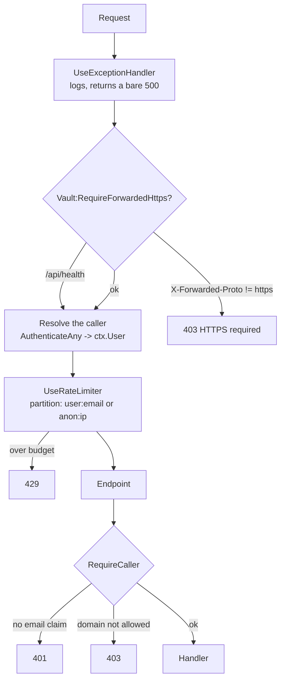

# Module: Cred Vault Server

`src_minimalapi_server/` — a .NET 10 minimal API, fourteen source files, that stores ciphertext it
cannot read.

> This document is the **single statement of the HTTP contract**. It is implemented twice: in
> `src_minimalapi_server/src/Program.cs` and in `src_vs_code/src/serverTransport.ts`. Changing one
> without the other ships a broken client.

## Purpose

Replace a shared NAS folder with an authenticated endpoint, so a company can use the extension
without giving everyone read access to everyone's encrypted files — and so that the sender of a
shared secret is a fact rather than a claim.

It is deliberately small. There is no database, no ORM, no background service, no admin UI. The
whole server is ~2,100 lines.

## Files

| File | Role |
|---|---|
| `src/Program.cs` | Configuration, startup guards, the pipeline, and all twenty-five endpoints |
| `src/VaultStore.cs` | Filesystem storage: atomic writes, hashed paths, the crash sweep |
| `src/VaultStoreOutbox.cs` | The sender's receipts, and the two sweeps that bound both sides |
| `src/ShareMaintenance.cs` | The hourly pass: retire dealt-with receipts, prune what aged out |
| `src/ContractVersion.cs` | The HTTP contract version, and what a mismatch does |
| `src/TokenIdentity.cs` | Reads the verified caller identity out of JWT claims |
| `src/Models.cs` | `ShareItem`, `ShareRequest`, `SentShare`, `TeamMemberDto`, `WhoAmIDto` |
| `src/OrgRecovery.cs` | The corporate-recovery roster, its quorum guard and its fingerprint |
| `src/OrgRecoveryStore.cs` | Setup invites and the published org public key, on disk |
| `src/OrgRecoveryMaintenance.cs` | Drops setup invites nobody acknowledged |
| `src/OrgMembers.cs` | The members registry as records with no I/O: roles, share defaults, the three-state lookup, the policy derived from a role |
| `src/OrgMembersStore.cs` | One record per person under `org/members/`, read synchronously from a stat-checked cache, written read-modify-write under the vault's per-email lock |
| `src/OrgSettingsStore.cs` | The runtime settings an admin edits without a restart (`org/settings.json`); absent answers the default and writes nothing |
| `src/OrgEventLog.cs` | The append-only NDJSON event log, one file per UTC day under `org/events/` — the writer only; the reader is a later epic's |
| `src/Logging.cs` | Serilog wiring: the coloured console + the segmenting run file |
| `src/AnsiConsoleSink.cs` | Hand-written ANSI colour (ported from the family — Serilog's own theme writes zero escapes once stdout is redirected, and a container's captured stdout always is) |
| `src/DailyRunFileSink.cs` | A file per run, segmenting at UTC midnight (`00-00-00-<pid>.log` in the next day's folder) so a never-restarting container cannot grow one file for months |
| `src/LogRetention.cs` | The named owner of `logs/`: day folders older than `Logging:RetentionDays` (14, the extension's own number) swept at startup |
| `src/InstanceFile.cs` | Publishes where this instance is listening, for the DewFlow editor panel |
| `src/HealthProbe.cs` | The container healthcheck the binary runs against itself (no curl in the image) |
| `src/AppJsonContext.cs` | The `JsonSerializerContext` source-gen contract that makes Native AOT possible |

## The request pipeline

Order is load-bearing, and two of the four positions were defects until 2026-08-23.



Two things this ordering fixes:

- **The limiter must run *after* identity is resolved**, or it has nothing to partition by.
  Nothing else populates `ctx.User` here — the endpoints authenticate by hand, there is no
  `UseAuthentication()`, and no default scheme to give it one.
- **The HTTPS guard must run first**, before any token is even parsed.

`/api/health` is the single exemption from the HTTPS guard: the container's own healthcheck runs
inside the network with no proxy to add the header, and health carries no secret.

## Endpoints

Every authenticated endpoint derives its resource from the token's email. **No URL contains a user
identifier**, so there is nothing to tamper with.

| Method | Path | Auth | Success | Notes |
|---|---|---|---|---|
| `GET` | `/api/health` | none | `200` | Probes that `DataDir` is writable; `503` when it is not |
| `GET` | `/api/client-config` | none | `200` | `{microsoftScope}` from `Auth__Microsoft__ClientScope`, `""` when unset. See below |
| `GET` | `/api/whoami` | any allowed caller | `200` | `{email, name, hasVault}` |
| `GET` | `/api/vault` | token email | `200` bytes / `404` | `application/octet-stream` + an `ETag`; 404 means nothing stored yet |
| `PUT` | `/api/vault` | token email | `204` | 1..`MaxVaultBytes`; `400` outside that. Honours `If-Match` / `If-None-Match`, `412` when the precondition fails |
| `DELETE` | `/api/vault` | token email | `204` | Deletes the vault, its `.email` sidecar, and the whole inbox |
| `GET` | `/api/team` | any allowed caller | `200` | `[{email}]` — vault owners in the caller's own domain |
| `GET` | `/api/org-recovery/config` | any allowed caller | `200` | The corporate-recovery roster this server runs under. See below |
| `POST` | `/api/org-recovery/invites` | officer | `201` | One officer's sealed Shamir share; sender stamped |
| `GET` | `/api/org-recovery/invites` | officer | `200` | Your own pending invites, **streamed** |
| `POST` | `/api/org-recovery/invites/{id}/ack` | officer, own inbox | `204` / `404` | Stored durably — drop it |
| `GET` | `/api/org-recovery/invites/status` | officer | `200` | `?setupId=` → who has not answered |
| `POST` | `/api/org-recovery/setup` | officer | `200` / `409` | Publish the key once everyone has |
| `POST` | `/api/org-recovery/sessions` | officer | `201` | Start a break-glass for one target |
| `GET` | `/api/org-recovery/sessions/{id}` | officer | `200` | Status and the collected (opaque) contributions |
| `POST` | `/api/org-recovery/sessions/{id}/contribute` | officer | `204` | Your share, resealed to the session key |
| `GET` | `/api/org-recovery/sessions/{id}/target-vault` | **initiator, at quorum** | `200` / `409` | The one cross-owner read |
| `PUT` | `/api/org-recovery/sessions/{id}/target-vault` | **initiator, at quorum** | `204` / `412` | The re-keyed vault, written back once |
| `DELETE` | `/api/org-recovery/sessions/{id}` | initiator | `204` / `404` | Call it off |
| `GET` | `/api/org-recovery/audit` | officer | `200` | Who opened whose vault, **streamed** |
| `POST` | `/api/shares` | sender = token email | `201` | Body below |
| `GET` | `/api/shares` | recipient = token email | `200` | Your inbox, **streamed** |
| `DELETE` | `/api/shares/{id}` | recipient = token email | `204` / `404` | `id` must parse as a GUID |
| `GET` | `/api/shares/sent` | sender = token email | `200` | Your own receipts, **streamed**. No ciphertext — see below |
| `DELETE` | `/api/shares/sent/{id}` | sender = token email | `204` / `409` / `404` | Withdraw while pending; `409` once accepted or declined |

### `POST /api/shares`

```json
{
  "toEmail":     "colleague@company.com",
  "entityName":  "prod db",
  "entityKind":  "db",
  "salt": "base64", "iv": "base64", "tag": "base64", "data": "base64",
  "kdfN": 131072, "kdfR": 8, "kdfP": 1,
  "format": 3
}
```

The server validates only the *shape*: that the four crypto fields are base64, that the payload is
under `MaxShareBytes`, that `entityName` is under 512 characters, and that the recipient's inbox is
under `MaxInboxItems`.

**`format` is carried verbatim and never read** (contract 2). It names which fields the client
bound into the payload's GCM additional authenticated data, and the recipient cannot choose the
right AAD without it — exactly as `kdfN`/`kdfR`/`kdfP` name the scrypt cost. Until contract 2 the
field did not exist here, so every share posted by extension 0.82.1 through 0.87 arrived with its
binding unnamed, could not be decrypted at all, and was reported to the recipient as *"sent by an
extension older than 0.82"*. The extension's side of the same rule is that it seals a **bound**
form only when the response header says the server is contract 2 or higher; below that it seals
unbound, because a binding the recipient cannot reconstruct is worse than none.

A client that sends no `format` gets an item with **no `format` property at all** — never
`"format": null`. Every released extension's `isShareItem` guard accepts the field as a number or
as absent and drops an item carrying a null, which would empty those recipients' inboxes rather
than explain anything; the wire shape for such a client is byte-identical to contract 1.

**`fromEmail` and `fromName` are not accepted from the body.** They are stamped from the verified
token. This is the single most important line in the file — it is the difference between this
server and a shared folder.

The recipient must be in the sender's own domain (`403` otherwise), so this endpoint cannot be used
to post into a stranger's inbox on another tenant.

### `GET /api/shares` streams

The array is written to the response as the store reads it, never assembled first. With
`MaxInboxItems=500` and `MaxShareBytes=1 MiB`, materialising the inbox put roughly 700 MiB live —
before JSON encoding doubled it — on a request any same-domain account could provoke by filling
someone's inbox. Streaming keeps one item live at a time.

It is written by hand rather than by handing the framework an `IAsyncEnumerable`, because the AOT
source generator has no converter for one — a fact the **build** enforces (`IL2026`/`IL3050`)
rather than leaving to be found at runtime. The org-recovery invite listing needs the same shape,
so both go through one `WriteJsonArrayAsync` helper instead of a second copy.

### The sender's side, and why it did not exist before

An inbox is keyed by the RECIPIENT (`shares/<sha256(recipient)[..32]>/<id>.json`), which is what
made a share impossible to withdraw rather than merely awkward: the sender could not learn the id
of the thing waiting for someone else. Scanning every inbox for their name would have answered it
and would have been a real disclosure — the server would then be able to answer "what has this
person sent to whom".

So the sender gets `sent/<sha256(sender)[..32]>/<id>.json`: a **receipt**, carrying `id`,
`toEmail`, `entityName`, `entityKind` and `createdAt` and NO `salt`/`iv`/`tag`/`data`. The sealed
payload still exists exactly once. Listing a sender their own actions discloses nothing new.

`DELETE /api/shares/sent/{id}` reads that receipt, and the inbox it then reaches into is named by
what the SENDER once wrote rather than by anything in the request — so a caller holding someone
else's id has nothing to look it up in, and gets `404`. Already accepted is **`409`, not `404`**:
"there is no such share" and "it is beyond recall" are different answers, and only one of them
means the secret is now somewhere the sender cannot reach.

`ShareMaintenance` retires a receipt once the inbox file is gone — the recipient acting is the
only signal there is, because nothing tells the sender.

### The contract version

**Current: 2** — a share carries its `format` (above). Version 1 dropped it, which is why the bump
is the first one the mechanism was actually built for: a client must know which version it is
talking to *before* it seals, not after it fails.

Every response carries `X-Creds-Contract: <server version>`; a client sends the same header.
Below `Vault:MinimumClientContract` the middleware answers **`426` before authentication**, so an
extension too old to be served is told THAT instead of a `401` about a token that was never the
problem. A caller that sends nothing, or something a proxy mangled, is served — every extension
released before this existed sends nothing.

It rides on a header rather than in `/api/client-config` because that endpoint documents its own
reason for having exactly one field, and because a header means a client learns the version from
a call it was already making. The default minimum equals the current version, so the refusal path
is unreachable in production today — which is precisely why `Vault:MinimumClientContract` is
configurable: a test raises it and drives a real refusal, instead of a branch nobody has ever seen
run being discovered wrong on the day it first matters.

### `/api/org-recovery/config` — and why it is not officer-only

```json
{
  "enabled": true,
  "officerEmails": ["cto@company.com", "lead@company.com", "devops@company.com"],
  "threshold": 2,
  "setupComplete": false,
  "orgPublicKey": "",
  "orgPublicKeyFingerprint": "",
  "rosterFingerprint": "315f89eb…",
  "publishedAt": 0
}
```

An operator may configure a roster of **recovery officers** — `Vault:CorpRecovery:OfficerEmails`,
minimum three, with `Vault:CorpRecovery:Threshold` (default 2) of them required to act together.
When they do, every account on the server is enrolled: the client seals its vault master key to
the organisation's recovery public key as an extra wrap, so a quorum of officers can open a vault
whose owner has left. The design, the ceremonies and the remaining endpoints are
[PLAN_org_recovery.md](PLAN_org_recovery.md); **what is built today is this endpoint,
its configuration and its guards** — the setup ceremony has not been written, which is exactly
what `setupComplete: false` reports.

**Readable by any allowed caller, deliberately.** Enrolment is automatic and needs no consent, so
a person whose secrets a quorum of named colleagues can recover is entitled to know that, and to
know which colleagues. A silent escrow is a backdoor by shape even when it is legitimate by
intent. It stays behind authentication because the roster names real people.

**`enabled` and `setupComplete` are two different facts** and collapsing them is how a client
would try to enrol against a key that does not exist yet: the first means the operator asked for
this, the second means the officers have actually run the ceremony.

**`rosterFingerprint`** is what clients pin, the way `senderPinning.ts` pins a share signer: this
server is trusted to relay, never to decide, so an operator quietly adding themselves to the
roster — or lowering the threshold — is the change the fingerprint makes visible. Sorted before
hashing and binding the threshold, so re-typing the same officers in another order is not a change
and does not read as one.

Nothing here is a secret the server must keep: a roster the operator wrote, a number, and (once
the ceremony exists) an X25519 **public** key. The private half lives only as Shamir shares sealed
inside the officers' own vaults, and there is no code path here that could hold one — which is
what keeps this feature on the right side of rule 1.

### The setup ceremony

One officer initiates: they mint the organisation's X25519 pair locally, split the **private**
half into one Shamir share per officer, seal each under a one-time PIN told out of band, and
`POST` them one at a time. Each officer then reads their own invite, stores the share in their own
vault, and acknowledges — **after** the durable write, so a crash in between leaves the invite
safely pending rather than acked-but-lost. When nobody is pending, the initiator publishes the
public half and destroys the assembled private key.

Four refusals, each for a way the ceremony could produce something that *looks* recoverable:

- **Off the roster → `403`, for both "not an officer" and "the feature is off here."** One answer
  for two states, because telling a caller which it is hands them the roster's shape for free.
  These endpoints are gated not because the payloads are readable — they are opaque — but because
  they are the levers: a stranger who can post an invite seats their own share where a real
  officer's belongs.
- **A recipient outside the roster → `403`.** Otherwise an officer could seat a share with an
  accomplice the operator never named, and a 2-of-3 quietly becomes something one person controls.
- **A split disagreeing with the roster → `409`.** Clients pin a fingerprint that says "2 of 3";
  shares minted as 2-of-5 would implement a different scheme behind that same pin.
- **Publishing while anyone is pending → `409`.** A key whose quorum cannot be assembled is
  recoverable-looking and not recoverable, which is the worst of the three states to be in.
- **Publishing for a ceremony this server never saw → `409`**, likewise one whose recorded
  initiator is not the caller, or which invited fewer officers than the roster holds. "Is anybody
  still pending?" can only be answered from invites that EXIST, so on its own it passed a
  `setupId` nobody had ever used — one officer could publish their own key, with no invites, no
  shares and no quorum, and every client would then seal its master key to a key that person held
  alone. The server records a ceremony (`org-recovery/ceremonies/`) as its first invite is posted:
  who ran it and whom it invited. That record is what the question is asked *about*.

Republishing the **same** `setupId` with the **same** key is `200` — a retry after a dropped
response has to succeed. The same ceremony offering a *different* key is `409`: that is not a
retry, it is a swap.

`fromEmail` is stamped from the verified token, never read from the body — the same rule as
`POST /api/shares` and for a stronger reason: an invite a stranger could attribute to the CTO is
one an officer might accept into their own vault.

`OrgRecoveryMaintenance` drops invites nobody acknowledged after
`Vault:CorpRecovery:SetupTtlHours` (72). A published key has no TTL and is never swept — taking it
would disable corporate recovery on a working server, silently. The timer is registered **only
when a roster is configured**.

### Break-glass — the one place a vault crosses an owner boundary

An officer starts a session naming the target and an **ephemeral session public key** minted for
that session alone. Each contributing officer unlocks their own vault as usual, opens their share,
and reseals it to that key — so a share crosses this server encrypted to a private half that exists
only in the initiator's memory. At quorum the initiator reads the target's ciphertext, reconstructs
the org key locally, opens the escrow wrap, re-keys the vault and writes it back. One audit line is
appended and the session is spent.

**The threshold gate here is a courtesy, not a security boundary**, and a maintainer who assumes
otherwise will be assuming something this server structurally cannot do. It counts contributions
and refuses to serve the ciphertext below the threshold — but it cannot tell a genuine contribution
from a random blob, because they are opaque to it. The real gate is on the initiator's machine:
Shamir interpolation only reconstructs the true key from a correct subset, and the integrity tag
minted with the shares is what proves it did.

Four conditions on that gate, all necessary:

- **The caller is the officer who STARTED this session**, not merely an officer — and the refusal
  is `404`, not `403`: somebody who did not start it has no business learning that it exists or
  whose vault it concerns.
- **The quorum has actually contributed.** Below it, `409` naming the count.
- **The session is still open.** A completed session is not a standing licence to read that vault
  again, so its contributions are purged the moment the recovery lands.
- **One officer counts once.** Contributions are upserted by officer, because retrying is a person
  retrying and counting it twice would let one officer alone satisfy a threshold of two.

The write-back is **conditional** like an ordinary `PUT /api/vault`: the target may still have a
machine online and syncing, and break-glass is not a licence to clobber a write that happened while
the quorum was being assembled. `412` says so.

The audit log is NDJSON — a crash mid-append can cost the line being written, never the readability
of every line before it — carries **metadata only**, and is readable by every officer rather than
only initiators. A recovery nobody else can see is a recovery nobody else can question, and being
witnessed is the point of a quorum. It is never swept.

### `/api/metrics` — one document, for the officers (2026-08-28)

`ServerMetrics.cs` keeps process-lifetime counters — requests by outcome (4xx, 5xx, 429), vault
reads and writes with bytes — fed by one middleware that records every response once its status is
known, and by the vault PUT for the bytes. The endpoint snapshots them together with what the data
directory holds (`VaultStore.VaultFootprint` / `ShareFootprint`), the free space on that disk, the
binary's version (stamped by the release tag through `-p:Version`) and the runtime's support window
(`RuntimeSupport.cs`, the same line the server logs at startup — a warning inside the last 90 days).
Officer-only through `RequireOfficer`, whether or not the ceremony has run: the owner's rule is
that whoever may read the server's load is whoever the operator named. Read by a human through the
extension's *Server Metrics…*; not a scrape target.

Two more shipped the same day. **The byte budget** (`ByteBudget.cs`, roadmap E1): the request
limiter counted a full vault as one request, so `PUT /api/vault` now spends a per-caller byte budget
— 64 MiB per ten minutes by default — and the write over it is `429` with `Retry-After`; a refused
write spends nothing. **The health cache** (`HealthCache.cs`): a good `/api/health` verdict is served
from memory for five seconds, a bad one is never cached — the probe still writes the disk, it just
does not do so thousands of times a day for the same answer.

### `/api/client-config` — why an anonymous endpoint is the right shape

A client cannot authenticate until it knows **which scope to ask the identity provider for**, so
this one cannot require a token: the caller has none yet, by definition.

It gives away nothing. The value is an Entra **Application ID URI plus a permission name**, and a
client id is public by construction — it appears in every authorization URL the extension opens and
in the audience of every token this server accepts. Knowing it lets you *request* a token for this
app; it does not let you *get* one, which still requires being a member of the tenant and passing
sign-in.

What it buys is the failure it removes. Before it, every developer had to paste
`credSshManager.microsoftApiScope` into their own `settings.json`, and the symptom when one did not
was an **empty Team with no error** — the server answered 401, the extension swallowed it, and an
empty list is indistinguishable from a team nobody has joined. The extension now reads this
endpoint and configures itself; an explicitly configured setting still wins, as the escape hatch for
a server advertising the wrong value.

## Authorization

```csharp
(string Email, string? Name)? RequireCaller(HttpContext ctx)
```

Three outcomes: `401` when no verified email claim is present, `403` when the domain is not allowed,
otherwise the caller. `TokenIdentity.Email` walks `email` → `preferred_username` → `upn` →
`ClaimTypes.Email` → `ClaimTypes.Name`, lowercases the result, and **rejects outright** a token
carrying `email_verified: false` (Google sets it in some tenants; Microsoft does not send it at
all, so absent means accept).

### The three auth schemes

| Scheme | Enabled by | Validates |
|---|---|---|
| `Microsoft` | `Auth:Microsoft:Tenant` | OIDC discovery for that tenant; issuer + lifetime, audience only if configured |
| `Google` | `Auth:Google:Enabled` | Google's discovery document; issuer + lifetime |
| `Local` | `Auth:Local:SigningKey` | HMAC-SHA256, issuer `cred-vault-local`. Offline and test use only |

`AuthenticateAny` tries each configured scheme in turn and takes the first that succeeds.

**On audience validation:** an access token minted for Microsoft Graph carries Graph's audience, so
switching audience validation on before the extension has its own app registration rejects every
real token. The server logs a loud warning at startup when audience validation is off rather than
silently accepting it.

## Startup guards — fail fast, and say why

The server refuses to start rather than run in a state that looks like a network fault:

1. **No auth scheme configured** → it would 401 every request forever.
2. **`AllowedDomains` empty without `AllowAnyDomain=true`** → a credential server open to every
   verified account on earth, by omission.
3. **`DataDir` not writable** → checked *before* `VaultStore` is constructed, with a message that
   names the usual cause (a root-owned bind mount against an unprivileged container) and the fix.
4. **`DataDir` on a network filesystem** (`DataDirCheck.cs`, 2026-08-28) → a UNC path, or a mount
   whose type `/proc/mounts` names as remote (nfs, cifs, sshfs, …), is refused before the writable
   probe even runs: the store's durability is atomic rename, which those do not promise. Pure — the
   mount table is text, so the decision is a unit test. `Vault:AllowNetworkDataDir=true` overrides,
   in writing.
The corporate-recovery roster is deliberately **not** on that list. It used to be, and that was
the wrong lever: corporate recovery is one optional feature among many, and a typo in its roster
stopped ordinary vault sync for everybody — an outage caused by the safety check, on a server
where nobody had enrolled yet. What must not happen is narrower than an outage: no master key may
ever be sealed to a quorum that cannot be assembled.

So a roster that can never reach quorum leaves the feature **off** and the server running:

| roster | result |
|---|---|
| empty | off, silently — the default, and the common case |
| fewer than three officers | off + **Error** log; a 2-of-2 goes down with the first departure, which is the event the feature exists for |
| threshold of 1 | off + **Error** log; any single officer would open every vault on the server |
| threshold above the roster size | off + **Error** log; unreachable, the misconfiguration that looks like a working feature for months |
| three or more, threshold in 2..N | **on** + **Warning** log naming the officers and the fingerprint |

`OrgRecoveryConfig.Read` implements this by returning an **empty** roster whenever it complains,
never the roster as typed — every downstream check reads `Enabled`, so off is the shape rather
than a flag somebody could forget to test, and a client is never shown officers it could not
actually be recovered by. The reason travels in `Misconfiguration`, which `Program.cs` logs at
**Error**: off-because-of-a-typo is indistinguishable from off-on-purpose otherwise, and the
operator who wrote those two lines is entitled to believe they work. Duplicates and casing are
normalised *before* the count, so three entries naming two people are rejected rather than
passing as a 2-of-2 in disguise.

A usable roster logs at **Warning** instead, naming the officers and the fingerprint: it is the
one setting that changes what happens to *other people's* vaults, and an operator who did not
mean to enable it should find out from the log rather than from a user.

Then `SweepStaleTempFiles()` runs: any `*.tmp` older than ten minutes is a write interrupted by a
crash, and is removed.

## Storage

```
${DataDir}/vaults/<key>.bin      the ciphertext
${DataDir}/vaults/<key>.email    the plaintext email, for team discovery
${DataDir}/shares/<key>/<guid>.json
${DataDir}/org-recovery/setup.json                    the published org PUBLIC key
${DataDir}/org-recovery/invites/<key>/<guid>.json     one officer's sealed Shamir share
${DataDir}/org-recovery/ceremonies/<guid>.json        who ran a setup, and whom it invited
${DataDir}/org-recovery/sessions/<guid>.json          a live break-glass and its contributions
${DataDir}/org-recovery/audit.log                     NDJSON: who opened whose vault, never swept
${DataDir}/org/members/<key>.json                     one person's registry record: role, flags, who changed it and when
${DataDir}/org/settings.json                          the runtime settings an admin may change; absent means the defaults
${DataDir}/org/events/<yyyy-MM-dd>.ndjson             the corporate event log, one file per UTC day, never swept
```

`key = sha256(lowercased email) hex, first 32 chars` (128 bits). Hashed so a directory listing is
not a staff directory; the `.email` sidecar exists only because `/api/team` has to answer "who else
is here", and it is read defensively — a malformed or locked sidecar is skipped, never fatal.

Every write is atomic: write `<path>.<random>.tmp`, then `File.Move(overwrite: true)`. A reader
therefore never sees a partial blob, which is what lets `deploy/backup.sh` archive a live server.

`org/` appears only when something is written into it — a personal deployment never has one, which is
how an operator looking at the disk can tell a server with a roster from one without. Three things
about what is under it, none of which has an endpoint yet:

- **A member record this build cannot read is *unavailable*, never *not registered*.** Not registered
  means the default role, and the default may export, so a malformed file, an unreadable one, or one
  whose `schemaVersion` is above this build's would otherwise promote its owner; every caller fails
  closed instead, and the log names the file at Error, once. A field this build does not know is
  carried and written back rather than dropped, so an older instance cannot strip what a newer one
  wrote. Lookups are synchronous, from an in-memory cache that re-stats the file first — a record
  changed by a restore or a second instance is seen on the next lookup; writes are read-modify-write
  under the same per-email lock as `PUT /api/vault`, so two admins editing one person cannot lose an
  edit.
- **A settings file this build cannot read answers the default** (a 24-hour offline lease), logged
  once — nothing in it grants a permission, and refusing everybody over it would be an outage.
- **The event log takes one dedicated lock with a five-second bound** — every writer appends to the
  same day file, so the vault's stripe would race — and a failed append never fails the mutation it
  records: it answers false and logs at Error naming the file. A torn final line from a killed process
  gets a newline before the next row, so the reader loses one row rather than two. Neither maintenance
  sweep touches `org/events/`; a test pins it.

### Known limits

- **Optimistic concurrency is opt-in.** `GET` returns an `ETag` derived from the content; `PUT`
  honours `If-Match` (and `If-None-Match: *` for "only if I am the first"), answering `412` when the
  caller's copy is stale. The check and the write happen under the same lock — a fixed stripe of 64,
  rather than a per-email dictionary that would grow with every account and never be pruned. A client
  that sends neither header keeps the old last-write-wins behaviour, so an extension predating this
  still works.
- **Inbox TTL is `Vault:ShareMaxAgeDays` (31).** A pending share and its sender-side receipt are
  swept by `ShareMaintenance`, hourly and once at startup. Before it, an inbox only ever shrank
  when its owner acted — so one that reached `MaxInboxItems` refused every later share with `409`,
  a failure the SENDER saw about a state only the recipient could clear.
- **`/api/team` enumerates.** Any authenticated caller can list every colleague's email. That is the
  feature, but it is worth knowing it is also directory enumeration for anyone inside the domain.

## Tests

`src_minimalapi_server/tests/` — xUnit v3 on Microsoft Testing Platform, 189 tests, ~5 s. The
endpoint suites run in-process through `WebApplicationFactory` — no free port, no background
`dotnet run`; the store suites drive a store directly on a throwaway data directory.

```bash
dotnet build dew_flow_creds_for_devs.slnx
./src_minimalapi_server/tests/bin/Debug/net10.0/CredVaultServer.Tests.exe
```

Never `dotnet test` — there is no VSTest host here and it aborts.

| Class | Covers |
|---|---|
| `HealthTests` | Public reachability, storage-writability reporting |
| `AuthenticationTests` | No token, foreign domain, `alg=none`, wrong key, no email claim, expired |
| `VaultTests` | Round-trip fidelity, per-caller isolation, size caps, survival after an oversize upload |
| `TeamTests` | Owners listed, non-owners absent, deletion drops out |
| `SharingTests` | Delivery, sender stamping, cross-domain refusal, traversal ids, recipient-only delete |
| `RateLimitTests` | One caller cannot lock out another; a caller who overruns is still throttled |
| `ForwardedHttpsTests` | A missing header is refused; health stays exempt |
| `InboxScaleTests` | A large inbox lists completely; a corrupted item is skipped |
| `StartupGuardTests` | The four fail-fast startup guards each refuse to boot with the wrong config |
| `ConcurrencyTests` | `If-Match`/`If-None-Match` optimistic-concurrency semantics on `PUT /api/vault` |
| `InstanceFileTests` | The instance-file publish/withdraw lifecycle |
| `ClientConfigTests`, `HealthProbeUrlTests` | (nested in `HealthTests.cs`) the advertised scope, and the probe URL |
| `OrgMembersStoreTests` | The registry: answered from the cache, the stat check sees an outside write, the per-member lock keeps both of two concurrent edits, unreadable is unavailable (never the default), schema version, unknown fields carried, no `org/` until a write |
| `OrgSettingsStoreTests` | The default without a file and no write, write then read, a malformed file answers the default once-logged, an outside write is seen |
| `OrgEventLogTests` | Append and read back, the UTC day boundary, a torn tail gets its newline, the bounded lock, an unwritable folder is logged not thrown, both sweeps leave `org/events/` alone |

Configuration reaches the app through **process environment variables**, not
`WithWebHostBuilder` — `Program.cs` reads `builder.Configuration` before `Build()`, so anything a
`WebApplicationFactory` adds during `ConfigureWebHost` lands too late to be seen. Because process
environment is global, the suite runs in one non-parallel collection (`ServerCollection`).

## Telling the editor panel where it is

On startup the host writes `<LocalAppData>/dew-flow/services/cred-vault-server.json` — name, url,
pid, start time, and the addresses it serves — and deletes it on a graceful stop. The DewFlow VS Code
panel reads that directory and lists a locally running server under **Services**.

The convention is copied from `dew_flow_rag_qln · src/ServiceDefaults/DaemonEndpointFile.cs` rather
than reinvented: same directory, same JSON shape, same best-effort semantics. The one deliberate
difference is the **filename** — that daemon owns `dew-flow/daemon.json`, and a second product
writing there would overwrite it, so everything else publishes under `services/`.

Three properties worth knowing:

- **A file, not a fixed port.** The port is assigned per run, so a reader that hardcodes one is wrong
  the first time anyone looks.
- **Staleness is the reader's problem, deliberately.** A killed process cannot delete its own file,
  so the contents are a hint confirmed by asking — which is why the file carries a pid and no status
  field. A status written by a process that has since died is worse than none.
- **Best-effort in every direction.** An unwritable profile, a container with no home, a read-only
  filesystem: discovery degrades, the server does not. It is skipped entirely when there is no bound
  address, which is what keeps an in-process test run from writing to a developer's real profile.

`Vault:PublishInstanceFile=false` turns it off; the compose stack sets that, because a per-user
profile file inside a container reaches nobody.

## Configuration

| Key | Default | Meaning |
|---|---|---|
| `Vault:DataDir` | `<app>/data` | Where blobs live |
| `Vault:AllowedDomains` | *(empty — refuses to start)* | CSV of allowed email domains |
| `Vault:AllowAnyDomain` | `false` | Explicitly run with no domain boundary |
| `Vault:MaxVaultBytes` | 8 MiB | Per-vault upload cap |
| `Vault:MaxShareBytes` | 1 MiB | Per-share payload cap |
| `Vault:MaxInboxItems` | 500 | Pending shares per recipient |
| `Vault:CorpRecovery:OfficerEmails` | *(empty — feature off)* | CSV of recovery officers; **min 3** when set |
| `Vault:CorpRecovery:Threshold` | 2 | How many officers must act together; 2..roster size |
| `Vault:CorpRecovery:SetupTtlHours` | 72 | How long an unacknowledged setup invite lives |
| `Vault:RateLimit:PermitLimit` | 120 | Requests per window, per caller |
| `Vault:RateLimit:WindowSeconds` | 10 | The window |
| `Vault:RequireForwardedHttps` | `false` | Refuse anything not forwarded as https |
| `Auth:Microsoft:Tenant` | — | Enables the Microsoft scheme |
| `Auth:Microsoft:Audiences` | *(empty = not validated)* | See the audience note above |
| `Auth:Microsoft:ClientScope` | *(empty = advertise nothing)* | The scope clients should request; served on `/api/client-config` |
| `Auth:Google:Enabled` | `false` | Enables the Google scheme |
| `Auth:Google:Audiences` | *(empty = not validated)* | Accepted Google client ids |
| `Auth:Local:SigningKey` | *(empty = disabled)* | HMAC key for the offline scheme |
| `Vault:PublishInstanceFile` | `true` | Publish this instance for the DewFlow editor panel |
| `Logging:Directory` | `<app>/logs` | Root of the per-run log files |
| `Logging:RetentionDays` | `14` | Day folders older than this are deleted at startup; `0` disables the sweep |
| `Serilog:MinimumLevel:Default` | `Information` | Verbosity |

Environment form uses `__` as the section separator: `Vault__AllowedDomains`.

## Dependencies

| Package | Why |
|---|---|
| `Microsoft.AspNetCore.Authentication.JwtBearer` | Entra + Google token validation |
| `Serilog.AspNetCore` | The logging convention |

Test-only: `xunit.v3`, `FluentAssertions` (pinned at 7.2.2 — 8.x is not Apache-2.0),
`Microsoft.AspNetCore.Mvc.Testing`, `System.IdentityModel.Tokens.Jwt`.


## Native AOT (2026-08-24)

The server publishes **Native AOT**: `PublishAot` in the csproj, so `dotnet publish -r <rid>` produces
one static binary (~21 MB) with no .NET runtime beside it. Ordinary builds and the
WebApplicationFactory tests stay JIT; the trim/AOT analyzers run on every build, so an incompatible
pattern fails at compile time.

What it took, each a real blocker found by building:

- **One source-generated JSON contract** (`AppJsonContext` / `InstanceJsonContext`): the reflection
  serializer is the biggest AOT blocker in a minimal API. Every HTTP call site passes its
  `JsonTypeInfo` explicitly; anonymous response types became `ErrorDto` / `HealthDto`; the shares
  stream is materialized (the inbox is capped anyway).
- **`(HttpContext) => Task` lambdas** match `RequestDelegate` itself and the request-delegate
  generator mis-intercepts them (CS9144) — each takes a `CancellationToken` now.
- **`Serilog.Settings.Configuration` is reflection by design** (finds sinks by scanning assemblies).
  Replaced with explicit reads of the same `Serilog:MinimumLevel:*` keys, so the "levels from
  config" contract survives without the scanning. Core Serilog's residual IL2104 (internal `@`
  destructuring, unused here) is suppressed in the server csproj alone, with the behaviour verified
  by running the AOT binary: console and per-run file logs both checked.

Verified locally before CI ever saw it: 53/53 JIT tests, the win-x64 binary booting with health,
startup-guard and log-file checks, the Linux AOT image built and running — and the extension's
13-check transport itest green against BOTH.

Release (`server-v*` tag): per-architecture image builds on native runners (amd64 + arm64 — AOT does
not cross-compile under qemu) stitched into one `ghcr.io` manifest, plus four standalone binaries
(linux-x64, linux-arm64, win-x64, win-arm64) attached to the GitHub release.

The runtime image is `runtime-deps:10.0-noble-chiseled` — **50 MB**, no shell, no package manager, no
.NET; the entrypoint is the binary. That killed curl, so the container HEALTHCHECK execs the binary
itself: `CredVaultServer --healthcheck` (`HealthProbe`) asks the running instance for `/api/health`
over the same `ASPNETCORE_URLS` Kestrel binds on, wildcard binds probed via loopback, and maps the
answer to an exit code. A chiseled image also has no `mkdir` and no `/etc/passwd`: the writable
directories arrive as COPIED empty dirs owned by uid 10001, and `USER` is numeric — the same number
the compose init service chowns bind mounts to. The first cut of the image was 275 MB (Debian +
curl + 42 MB of `.dbg` symbols the COPY dragged along); the path down was measured, not guessed.
