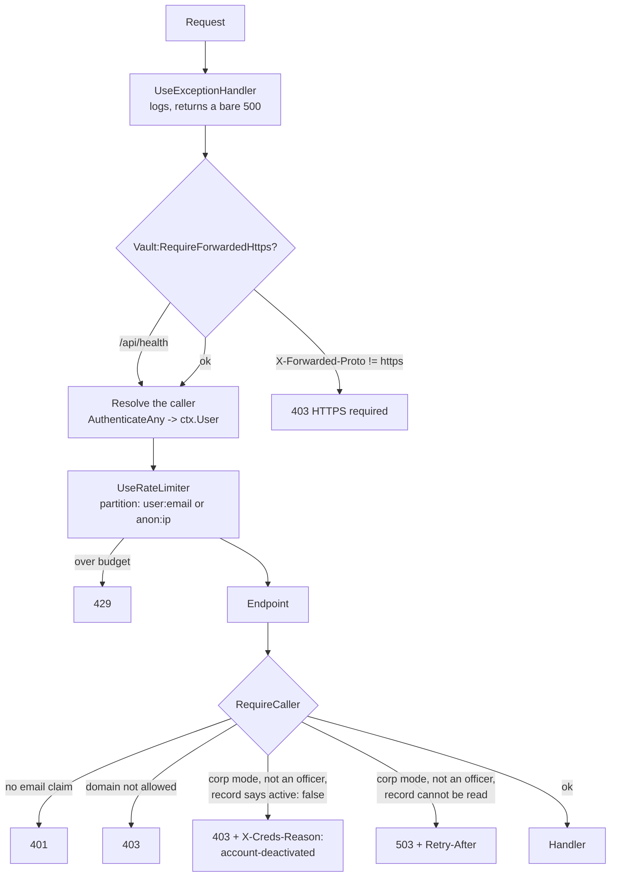

# Module: Cred Vault Server

`src_minimalapi_server/` — a .NET 10 minimal API, fourteen source files, that stores ciphertext it
cannot read.

> This document is the **single statement of the HTTP contract**. It is implemented twice: in
> `src_minimalapi_server/src/Program.cs` and in `src_vs_code/src/serverTransport.ts`. Changing one
> without the other ships a broken client.

## Purpose

Replace a shared NAS folder with an authenticated endpoint, so a company can use the extension
without giving everyone read access to everyone's encrypted files — and so that the sender of a
shared secret is a fact rather than a claim.

It is deliberately small. There is no database, no ORM, no background service, no admin UI. The
whole server is ~2,100 lines.

## Files

| File | Role |
|---|---|
| `src/Program.cs` | Configuration, startup guards, the pipeline, the gates, and the twenty-five endpoints of the personal and recovery surfaces; the corporate routes are mapped from `OrgEndpoints.cs` |
| `src/VaultStore.cs` | Filesystem storage: atomic writes, hashed paths, the crash sweep |
| `src/VaultStoreOutbox.cs` | The sender's receipts, and the two sweeps that bound both sides — the reconcile sweep keeps a receipt the server withdrew |
| `src/VaultStoreBlocking.cs` | Withdrawal at the moment of a block: every pending share to the person leaves their inbox and its sender's receipt gains a reason; every pending share from them leaves every recipient's inbox |
| `src/CallerStanding.cs` | The blocking gate's decision as a pure function — the five branches — and the `X-Creds-Reason` header it refuses with; `RequireCaller` applies it |
| `src/ShareMaintenance.cs` | The hourly pass: retire dealt-with receipts, prune what aged out |
| `src/ContractVersion.cs` | The HTTP contract version, and what a mismatch does |
| `src/TokenIdentity.cs` | Reads the verified caller identity out of JWT claims |
| `src/Models.cs` | `ShareItem`, `ShareRequest`, `SentShare`, `TeamMemberDto`, `WhoAmIDto` |
| `src/OrgRecovery.cs` | The corporate-recovery roster, its quorum guard and its fingerprint |
| `src/OrgRecoveryStore.cs` | Setup invites and the published org public key, on disk |
| `src/OrgRecoveryMaintenance.cs` | Drops setup invites nobody acknowledged |
| `src/OrgMembers.cs` | The members registry as records with no I/O: roles, share defaults, the three-state lookup, the policy derived from a role |
| `src/OrgMembersStore.cs` | One record per person under `org/members/`, read synchronously from a stat-checked cache, written read-modify-write under the vault's per-email lock |
| `src/OrgSettingsStore.cs` | The runtime settings an admin edits without a restart (`org/settings.json`); absent answers the default and writes nothing |
| `src/OrgEventLog.cs` | The append-only NDJSON event log, one file per UTC day under `org/events/` — the writer only; the reader is a later epic's |
| `src/LoginKeyStore.cs` | Custody of the per-developer login key S under `org/login-keys/`: AES-256-GCM under the deployment KEK, minted once by create-if-absent, and a three-answer lookup whose unreadable branch NEVER mints a replacement |
| `src/LoginKeyKek.cs` | Reading that KEK out of configuration and refusing anything that is not exactly 32 bytes of base64, plus the startup line an operator gets when theirs is unusable |
| `src/OrgEndpoints.cs` | The corporate surface `/api/org/*`, mapped from its own file (`Program.cs` is past the size ceiling and four more epics add routes): `GET /api/org/me`, the admin's roster, role and settings routes, the block/unblock route `PUT /api/org/members/{email}/active`, the JSON `FailJson` every refusal there uses, and the registration hook `PUT /api/vault` calls. The gates stay in `Program.cs` and cross over as delegates in one `OrgEndpointDeps` record |
| `src/Logging.cs` | Serilog wiring: the coloured console + the segmenting run file |
| `src/AnsiConsoleSink.cs` | Hand-written ANSI colour (ported from the family — Serilog's own theme writes zero escapes once stdout is redirected, and a container's captured stdout always is) |
| `src/DailyRunFileSink.cs` | A file per run, segmenting at UTC midnight (`00-00-00-<pid>.log` in the next day's folder) so a never-restarting container cannot grow one file for months |
| `src/LogRetention.cs` | The named owner of `logs/`: day folders older than `Logging:RetentionDays` (14, the extension's own number) swept at startup |
| `src/InstanceFile.cs` | Publishes where this instance is listening, for the DewFlow editor panel |
| `src/HealthProbe.cs` | The container healthcheck the binary runs against itself (no curl in the image) |
| `src/AppJsonContext.cs` | The `JsonSerializerContext` source-gen contract that makes Native AOT possible |

## The request pipeline

Order is load-bearing, and two of the four positions were defects until 2026-08-23.



The last two are the blocking gate (2026-09-06), and they live INSIDE `RequireCaller` rather than
beside it — see *Authorization* below for the five branches and why an officer is never refused.

Two things this ordering fixes:

- **The limiter must run *after* identity is resolved**, or it has nothing to partition by.
  Nothing else populates `ctx.User` here — the endpoints authenticate by hand, there is no
  `UseAuthentication()`, and no default scheme to give it one.
- **The HTTPS guard must run first**, before any token is even parsed.

`/api/health` is the single exemption from the HTTPS guard: the container's own healthcheck runs
inside the network with no proxy to add the header, and health carries no secret.

## Endpoints

Every authenticated endpoint derives its resource from the token's email. **No URL contains a user
identifier**, so there is nothing to tamper with.

| Method | Path | Auth | Success | Notes |
|---|---|---|---|---|
| `GET` | `/api/health` | none | `200` | Probes that `DataDir` is writable; `503` when it is not |
| `GET` | `/api/client-config` | none | `200` | `{microsoftScope}` from `Auth__Microsoft__ClientScope`, `""` when unset. See below |
| `GET` | `/api/whoami` | any allowed caller | `200` | `{email, name, hasVault}` |
| `GET` | `/api/vault` | token email | `200` bytes / `404` | `application/octet-stream` + an `ETag`; 404 means nothing stored yet |
| `PUT` | `/api/vault` | token email | `204` | 1..`MaxVaultBytes`; `400` outside that. Honours `If-Match` / `If-None-Match`, `412` when the precondition fails. In corp mode the first write also **registers** the caller (below) |
| `DELETE` | `/api/vault` | token email | `204` | Deletes the vault, its `.email` sidecar, the whole inbox — and the registry record |
| `GET` | `/api/team` | any allowed caller | `200` | `[{email}]` — vault owners in the caller's own domain; in corp mode, minus anyone whose record says `active: false` or cannot be read |
| `GET` | `/api/org/me` | any allowed caller | `200` / `503` | The role-and-policy document — **a document the client obeys, not a boundary the server holds**. Corp mode off → `corpMode: false` and inert defaults. Never writes. See below |
| `GET` | `/api/org/members` | **admin** | `200` | The roster of the caller's own domain, one row per record, officers flagged. Not streamed: 200 records of about a kilobyte |
| `PUT` | `/api/org/members/{email}` | **admin** | `200` / `400` / `403` / `409` / `503` | Set a role, a share default, or both — for somebody who may not have synced yet. See below |
| `PUT` | `/api/org/members/{email}/active` | **admin** | `204` / `400` / `403` / `409` / `503` | `{active}` — `false` blocks, `true` re-admits. Idempotent: `204` whether or not anything changed. A real block withdraws every pending share to and from the person and appends `member.blocked`; an officer target is `409`. See below |
| `GET` | `/api/org/login-key` | any active corporate caller | `200` / `404` / `503` | The caller's own login key and its fingerprint. Minted for an active **dev**; served to anybody active who already has one; `404` when they have none; `503` with no KEK, or when the stored key cannot be read. **`Cache-Control: no-store`** — the one response here that carries key material. See below |
| `GET` | `/api/org/settings` | **admin** | `200` | The runtime settings; absent file → the defaults, and no file is written |
| `PUT` | `/api/org/settings` | **admin** | `200` / `400` | `offlineLeaseHours >= 0`; `0` is the legal "strictly online" |
| `GET` | `/api/org-recovery/config` | any allowed caller | `200` | The corporate-recovery roster this server runs under. See below |
| `POST` | `/api/org-recovery/invites` | officer | `201` | One officer's sealed Shamir share; sender stamped |
| `GET` | `/api/org-recovery/invites` | officer | `200` | Your own pending invites, **streamed** |
| `POST` | `/api/org-recovery/invites/{id}/ack` | officer, own inbox | `204` / `404` | Stored durably — drop it |
| `GET` | `/api/org-recovery/invites/status` | officer | `200` | `?setupId=` → who has not answered |
| `POST` | `/api/org-recovery/setup` | officer | `200` / `409` | Publish the key once everyone has |
| `POST` | `/api/org-recovery/sessions` | officer | `201` | Start a break-glass for one target |
| `GET` | `/api/org-recovery/sessions/{id}` | officer | `200` | Status and the collected (opaque) contributions |
| `POST` | `/api/org-recovery/sessions/{id}/contribute` | officer | `204` | Your share, resealed to the session key |
| `GET` | `/api/org-recovery/sessions/{id}/target-vault` | **initiator, at quorum** | `200` / `409` | The one cross-owner read |
| `PUT` | `/api/org-recovery/sessions/{id}/target-vault` | **initiator, at quorum** | `204` / `412` | The re-keyed vault, written back once |
| `DELETE` | `/api/org-recovery/sessions/{id}` | initiator | `204` / `404` | Call it off |
| `GET` | `/api/org-recovery/audit` | officer | `200` | Who opened whose vault, **streamed** |
| `POST` | `/api/shares` | sender = token email | `201` / `400` / `403` / `409` / `503` | Body below. In corp mode the RECIPIENT's standing is checked too: `403` for a deactivated recipient, `503` while their record cannot be read — see below |
| `GET` | `/api/shares` | recipient = token email | `200` | Your inbox, **streamed** |
| `DELETE` | `/api/shares/{id}` | recipient = token email | `204` / `404` | `id` must parse as a GUID |
| `GET` | `/api/shares/sent` | sender = token email | `200` | Your own receipts, **streamed**. No ciphertext — see below. A receipt the server withdrew when its recipient was blocked carries `withdrawnReason`; every other receipt has no such key |
| `DELETE` | `/api/shares/sent/{id}` | sender = token email | `204` / `409` / `404` | Withdraw while pending; `409` once accepted or declined; a receipt carrying `withdrawnReason` is **dismissed** with `204` whatever the inbox says |

### `POST /api/shares`

```json
{
  "toEmail":     "colleague@company.com",
  "entityName":  "prod db",
  "entityKind":  "db",
  "salt": "base64", "iv": "base64", "tag": "base64", "data": "base64",
  "kdfN": 131072, "kdfR": 8, "kdfP": 1,
  "format": 3
}
```

The server validates only the *shape*: that the four crypto fields are base64, that the payload is
under `MaxShareBytes`, that `entityName` is under 512 characters, and that the recipient's inbox is
under `MaxInboxItems`.

**`format` is carried verbatim and never read** (contract 2). It names which fields the client
bound into the payload's GCM additional authenticated data, and the recipient cannot choose the
right AAD without it — exactly as `kdfN`/`kdfR`/`kdfP` name the scrypt cost. Until contract 2 the
field did not exist here, so every share posted by extension 0.82.1 through 0.87 arrived with its
binding unnamed, could not be decrypted at all, and was reported to the recipient as *"sent by an
extension older than 0.82"*. The extension's side of the same rule is that it seals a **bound**
form only when the response header says the server is contract 2 or higher; below that it seals
unbound, because a binding the recipient cannot reconstruct is worse than none.

A client that sends no `format` gets an item with **no `format` property at all** — never
`"format": null`. Every released extension's `isShareItem` guard accepts the field as a number or
as absent and drops an item carrying a null, which would empty those recipients' inboxes rather
than explain anything; the wire shape for such a client is byte-identical to contract 1.

**`fromEmail` and `fromName` are not accepted from the body.** They are stamped from the verified
token. This is the single most important line in the file — it is the difference between this
server and a shared folder.

The recipient must be in the sender's own domain (`403` otherwise), so this endpoint cannot be used
to post into a stranger's inbox on another tenant.

### `GET /api/shares` streams

The array is written to the response as the store reads it, never assembled first. With
`MaxInboxItems=500` and `MaxShareBytes=1 MiB`, materialising the inbox put roughly 700 MiB live —
before JSON encoding doubled it — on a request any same-domain account could provoke by filling
someone's inbox. Streaming keeps one item live at a time.

It is written by hand rather than by handing the framework an `IAsyncEnumerable`, because the AOT
source generator has no converter for one — a fact the **build** enforces (`IL2026`/`IL3050`)
rather than leaving to be found at runtime. The org-recovery invite listing needs the same shape,
so both go through one `WriteJsonArrayAsync` helper instead of a second copy.

### The sender's side, and why it did not exist before

An inbox is keyed by the RECIPIENT (`shares/<sha256(recipient)[..32]>/<id>.json`), which is what
made a share impossible to withdraw rather than merely awkward: the sender could not learn the id
of the thing waiting for someone else. Scanning every inbox for their name would have answered it
and would have been a real disclosure — the server would then be able to answer "what has this
person sent to whom".

So the sender gets `sent/<sha256(sender)[..32]>/<id>.json`: a **receipt**, carrying `id`,
`toEmail`, `entityName`, `entityKind` and `createdAt` and NO `salt`/`iv`/`tag`/`data`. The sealed
payload still exists exactly once. Listing a sender their own actions discloses nothing new.

`DELETE /api/shares/sent/{id}` reads that receipt, and the inbox it then reaches into is named by
what the SENDER once wrote rather than by anything in the request — so a caller holding someone
else's id has nothing to look it up in, and gets `404`. Already accepted is **`409`, not `404`**:
"there is no such share" and "it is beyond recall" are different answers, and only one of them
means the secret is now somewhere the sender cannot reach.

`ShareMaintenance` retires a receipt once the inbox file is gone — the recipient acting is the
only signal there is, because nothing tells the sender — **with one exception, below.**

### Withdrawal at a block, and what the sender sees (2026-09-06)

When an admin blocks somebody (`PUT /api/org/members/{email}/active` with `{active: false}`), the
server withdraws their pending shares in **both directions**, inline in that request — "immediately"
is owner decision 5, and the recipient's next sync is not something an admin can wait for
(`VaultStoreBlocking.cs`):

- **Shares TO the blocked person** are deleted from their inbox, and each sender's receipt is
  **rewritten** with `withdrawnReason` set — a sentence, *"Withdrawn: the recipient's account was
  deactivated by an administrator before they accepted it."* Rewritten, never deleted, because the
  receipt is the only place the sender can learn why their share vanished. A receipt that no longer
  exists (already dismissed, pruned, or from an older server) is not resurrected.
- **Shares FROM the blocked person** are deleted from every recipient's inbox, and the blocked
  sender's own receipts go with them: they need no reason, because a blocked person cannot call
  anything to read one.
- **Best-effort per file, never a `500`.** The block is already on disk when this runs; a file that
  will not delete is skipped and the rest are still withdrawn, exactly as the sweeps skip one. The
  `member.blocked` row and the Warning log line carry the two counts.
- **Repeating the block finishes what a first one could not.** The withdrawal runs on **every**
  `active: false` write, transition or not: it is a loop over other people's files, and a crash, a
  handle somebody else holds or a permission flipped half-way leaves shares in an inbox the block was
  meant to empty, with nothing retrying them on a cadence. A repeat that compared the record, saw no
  transition and answered `204` would make the only recovery a human has — send it again — the one
  action guaranteed to do nothing. A repeat that finds nothing costs two directory reads and writes no
  row; one that finds leftovers logs a Warning saying it completed an unfinished withdrawal, rather
  than appending a second `member.blocked` a reader would count as a second block.
- **A sender who could not be told is counted, never silently lost.** The inbox copy is deleted
  *before* the sender's receipt is rewritten — the right order, since the reverse leaves readable
  material in the inbox of somebody who may be re-admitted — so a receipt that will not rewrite costs
  that sender their one explanation, and the hourly sweep then retires the unmarked receipt like any
  accepted one. That is best-effort working as designed; being invisible is not, so `Withdrawal`
  carries `UnexplainedSenders` and both the Warning line and the `member.blocked` row say *"N sender(s)
  could NOT be told why"*. The residual is real and stated: that sender learns nothing from the
  product, and only the block's own record says it happened.

**The recipient half: a share cannot be addressed to a blocked person.** The caller gate judges
whoever is calling, and a share is addressed to somebody else — so `POST /api/shares` consults the
recipient's standing before anything is written: `403` *"Recipient's account has been deactivated."*,
`503` with `Retry-After` when their record cannot be read (fail-closed for the gate's own reason: one
corrupt file must not deliver to somebody who may be blocked), and unchanged for an active colleague,
somebody who never synced, an officer, or any recipient on a personal server. Without this a colleague
whose client remembers the address — a blocked person is hidden from `/api/team`, not from a client's
memory — drops material into an inbox its owner is refused at, where it waits out the 31-day prune and
becomes readable the day they are re-admitted, while the sender holds a receipt saying it was sent.
**Neither refusal carries `X-Creds-Reason`**: that header tells a client to lock its OWN account and
purge its key material, and an honest client matching it here would lock the innocent sender out.

**The client half of the same contract** (`serverTransport.ts`, the second implementation this
document governs): a `403` now produces three different sentences instead of one guess. With
`X-Creds-Reason: account-deactivated` it names the caller's own deactivation and says to ask an
administrator; with a body it quotes the server's sentence and deliberately does **not** name the
caller as the refused party, because the refusal may be about a recipient; with neither it falls back
to the old *"outside the allowed domain, or not permitted"*. Before this, a share to a deactivated
colleague told the sender their own domain was wrong — a guess, about the wrong person, pointing at a
setting that was fine. Other failed statuses on a share quote the server's sentence too, truncated to
300 characters because the answer may come from a proxy rather than from us.

What the sender sees, in order: `GET /api/shares/sent` still lists the receipt, now with
`withdrawnReason`; `DELETE /api/shares/sent/{id}` on it answers `204` and forgets it — a **first
branch** ahead of the ordinary withdraw logic, which would read the missing inbox file as "already
accepted" and answer `409`, the one thing a withdrawn share is not. Nothing comes back on unblock:
withdrawal is not a suspension.

**`ReconcileSentAsync` keeps a receipt carrying a reason.** Its "still pending" test is "the inbox
file exists", and withdrawal deletes exactly that file — so without the exception the hourly sweep
would erase the sender's one explanation within the hour. The story split found this by reading the
two paths side by side; a test pins it with an accepted receipt as the positive control. The 31-day
prune (`PruneOlderThanAsync`) still retires it by its own `createdAt`, so a sender who never opens
their Sent view does not accumulate them.

The wire shape for every other receipt is unchanged: `withdrawnReason` is **omitted**, never `null`
or `""`, and a released extension's `isSentShare` checks its five fields and ignores extras, so no
contract bump was needed. On the server the field is `string?` read only through `IsWithdrawn` — a
`string` with `= ""` would still arrive `null` for a receipt lacking the key (the deserializer runs
no initializer; measured on `ShareRequest.EntityKind`), while the type claimed otherwise.

### The login key — one factor of a developer's vault key, held here (2026-09-06)

A developer's copied vault file must be dead without a live login. That needs a factor this server
holds: **S**, 32 random bytes per person, at `org/login-keys/<KeyFor(email)>.bin` as AES-256-GCM
ciphertext under the deployment KEK (`Vault:LoginKey:Kek`, base64 of exactly 32 bytes). The client
folds S into a developer's PIN and security-key wraps — `HKDF(scrypt(accountId + PIN) ‖ S)` — which is
epic 2's story 3; this is the custody half.

**S is one factor of two, and the sentence that changes is worth stating precisely.** The server never
sees the PIN and never sees the master key. What an operator holding S and a stolen blob gains is an
offline attack on the PIN — which they can already mount today against the plain `pin` wrap with no S
at all. The operator's position is unchanged; what changes is that the FILE alone is no longer enough.

**Minting is idempotent by lock and by filesystem, not by luck**, because re-minting is the worst
thing this store can do: every wrap already sealed to the old S becomes unopenable. In-process, the
64-way stripe every other store takes. Across processes — a rolling restart with two containers on one
volume — the write is a **create-if-absent** (`AtomicWriteAsync(..., overwrite: false)`, which the OS
refuses when the file exists), and the loser of the race reads the winner's key.

**An unreadable key is never replaced.** The lookup has three answers, like the registry's: found,
absent, and *unreadable* — a wrong KEK after a restore, a tampered file, a truncated write. Only
*absent* mints. Collapsing the third into the second is what would issue a second key while the
person's vault stayed sealed to the first, and the API would report success the whole way; the route
answers `503` instead, and the log says nothing was replaced.

**Who is served.** An active developer is minted one. An active member or admin is served a key they
already have, and gets `404` when they have none — not `403`, because **binding is a property of a
VERSION, not of a person**: somebody demoted from developer still holds bound versions, and refusing
them the key would leave them with a vault nobody can open. For the same reason the key is deleted
only with the vault, never on demotion.

**No rotation, and therefore no revocation.** Rotating on unblock would orphan the vault it was meant
to protect — every wrap is sealed to S, so a new key leaves the person's current vault openable by
nobody and turns every unblock into a three-officer ceremony. It also protects nothing, since whoever
kept a copy of S is the person being re-admitted. **Blocking already makes S unobtainable** — the
caller gate refuses them before the handler runs — and that is the mechanism. Stated plainly: a copy
of S taken while somebody was a developer stays valid until a two-key rotation exists.

**`DELETE /api/vault` removes the key last**, after the vault and the registry record. The order is
the design: a crash between steps leaves something behind either way, and a key outliving its vault is
300 bytes of ciphertext nobody can use, while a vault outliving its key is a vault nobody can OPEN.
Removal needs no KEK — deleting a file is not decryption — so a server that cannot issue keys can
still delete accounts.

**A missing KEK degrades this feature and nothing else**: an `ERROR` line at startup naming the
setting, `503` on this one route, and vault sync, sharing and the registry untouched. That is the
officer roster's lesson applied (below): refusing to boot over an optional feature took ordinary sync
down for everyone. A KEK that is not exactly 32 bytes is **ignored rather than padded or truncated** —
a nearly-right key is how vaults end up sealed under something nobody can reproduce.

**Nothing about S is ever logged.** The two lines are `login key issued for {email} ({fingerprint})`
and `login key removed for {email}`. The fingerprint — the first eight bytes of SHA-256(S) as sixteen
lowercase hex characters — is a public name: it lets a client tell "the server's key changed under me"
from "wrong PIN" without either side comparing secrets, and it is what appears in the log instead of
the key. A store-level test asserts the material never reaches a log line, with a positive control so
a run that logged nothing cannot pass it.

### The contract version

**Current: 3** — the server has a role-and-policy document, `GET /api/org/me` (below). A version-2
client does not know the route exists, so on a server with a corporate roster it obeys no policy at
all — not a garbled response but a missing one: it exports, shares and backs up exactly as before,
and nothing on either side says so. That is the misreading the bump names. **2** was a share
carrying its `format` (above): version 1 dropped it, and a client must know which version it is
talking to *before* it seals, not after it fails.

Every response carries `X-Creds-Contract: <server version>`; a client sends the same header.
Below the minimum the middleware answers **`426` before authentication**, so an extension too old
to be served is told THAT instead of a `401` about a token that was never the problem. A caller
that sends nothing, or something a proxy mangled, is served — every extension released before this
existed sends nothing, on a corp server too.

**The minimum applied is the effective one, and corp mode floors it at 3.**
`ContractVersion.MinimumFor(configured, corpMode)` is `Math.Max(configured, 3)` when a roster is
configured and the configured value otherwise, so an operator's higher minimum stands and a
personal server is exactly as before. The reason is narrower than "make the policy binding" — the
policy is what an honest client obeys, not what the server enforces — but a client that cannot even
read the document cannot be expected to obey any of it, and serving it would be serving a bypass
while hiding that from whoever deployed the server. So the `426` body in corp mode says why:
*"this server speaks contract 3 and no longer serves 2 — this server has a corporate roster, and a
client below contract 3 cannot read the role and policy document (GET /api/org/me) every client
here is expected to obey; update the extension."* The sentence is built from `OrgPolicyContract`,
not typed, so a later cutover cannot advertise a stale number, and it is added only when the claim
is below 3; an operator who configured 5 refuses a contract-4 client for their own reason. **On
`/api/org/*` the `426` is a JSON `{error}`**, because that surface promises one on every refusal and
the middleware answers before any of its endpoints can; every older route — `/api/org-recovery/*`
included, a shared prefix and none of the shape — keeps the plain sentence byte for byte. This is a
hard cutover on the day a corp server upgrades (owner decision 12) and belongs in the release notes;
the extension's `CLIENT_CONTRACT_VERSION` and `ORG_POLICY_CONTRACT` moved to 3 in the same change,
because a gap between the two halves is a window in which this repository's own extension is
refused by its own server.

It rides on a header rather than in `/api/client-config` because that endpoint documents its own
reason for having exactly one field, and because a header means a client learns the version from
a call it was already making. The default minimum stays 1, so on a personal server the refusal
path is reachable only through configuration — which is precisely why `Vault:MinimumClientContract`
is configurable: a test raises it and drives a real refusal, instead of a branch nobody has ever
seen run being discovered wrong on the day it first matters. On a corp server the floor makes the
refusal real with no configuration at all, and `http/org/me.http` provokes it over the wire.

### `RequireAdmin` — two ways in, one refusal

Beside `RequireOfficer`, and deliberately two answers to one question. **An officer passes
unconditionally**: the roster is the operator's own list, an officer cannot be given a registry role
(the `409` below), and a deployment whose officers could not administer would need a second list to
say who can. **Everybody else passes only by their record saying `admin`.**

Every refusal it decides is the **same `403` with the same JSON body** — not an admin, never
registered, corp mode off. That is `RequireOfficer`'s doctrine for its reason: telling a caller which
fact failed hands them the roster's shape for free. A record this build cannot read used to be a fourth
cause of that `403`; since the blocking gate (2026-09-06) a non-officer with such a record is met one
gate earlier, inside `RequireCaller`, with the `503` + `Retry-After` that `/api/org/me` answers for the
same file — a fact about the caller's own record, not about the roster. Either way: a record the server
cannot parse is not a person whose standing it may guess, and guessing would mean the computed default,
which is a `member` — the plan round's escalation, one gate later. The gate writes its own body, unlike
`RequireOfficer`, because this surface promises a reason and an empty `403` is not one.

### The admin's routes

**A record the server cannot read is absent from the roster** rather than breaking it: one damaged
file must not cost an admin the whole list, and it must not be drawn as a person with a role either.
The store logs its path at Error, and the person themselves meets the `503` on their own
`/api/org/me` — so whoever is looking for them finds the log, and whoever is looking at everybody
else is not stopped by them.

**`GET /api/org/members`** answers `MemberListEntryDto[]` — the record's facts plus `isOfficer`,
which the record cannot hold because it comes from configuration. It is reported beside the role for
a practical reason: a list that showed the CTO as a plain `member` would invite exactly the edit the
server refuses. The scoping is the **store's** (`ListForDomain`), not the endpoint's: on a server
whose `Vault:AllowedDomains` names two companies, one company's admin must never be handed the
other's roster, and a filter written at the call site is one the next call site forgets.

**`PUT /api/org/members/{email}`** is the upsert, and it creates: Bob joins on Monday and the admin
sets him up on Friday, so his first policy is the one the admin chose rather than the default his
first sync would have written. Its refusals, in the order they are checked:

| Answer | When, and why it is that answer |
|---|---|
| `400` | The path segment is not an email address. Checked FIRST: it would otherwise hash to a key like any string and be written, and answering the cross-domain `403` would tell an admin their own colleague is in another company |
| `403` | The target is in another domain (unless `Vault:AllowAnyDomain`). Two reviewers found this hole independently in the plan; on a two-company server it is one company administering the other. Mirrors the break-glass session start's own check |
| `409` | The target is a recovery officer. Never a silent no-op: the roster is configuration, and a UI that appeared to demote the CTO would be lying about what happened |
| `400` | An unknown role, an unknown share default, a body that is not this endpoint's JSON, or one that changes nothing. The sentence names the legal values, because it is for an admin UI rather than a log; `{}` is a `400` rather than a `200` that re-stamps a record and reports success |
| `503` | The record exists and cannot be read. The file is left exactly as it was: overwriting it would start from the default, and a default written over a blocked developer's corrupt record is an unblock nobody ordered |

A share default sent for somebody who is not a developer is **stored, not refused** — it takes effect
only for `dev`, exactly as `MemberPolicy.For` reads it, and refusing it would stop an admin setting
the shape first and demoting second, which is the order that never leaves a developer with a share
default nobody chose. `updatedBy` is stamped from the token; a field in the body that claims
otherwise is ignored.

**`GET` / `PUT /api/org/settings`** are runtime because nothing in them has a cryptographic
consequence: the offline lease changes what an honest client does between two successful syncs, while
the officer roster changes what a key is sealed to — which is why that one stays in configuration and
costs a restart and a ceremony. `SetSettingsRequest.OfflineLeaseHours` is **nullable on purpose**: a
deserializer runs no defaults, so a positional `int` a client omitted would bind to `0`, and `0` here
is the legal "strictly online" — a body of `{}` would have switched every client's lease off in
silence. Absent is a `400` instead.

**`PUT /api/org/members/{email}/active`** (2026-09-06) is the block and the unblock — `{active: false}`
and `{active: true}` — and its own route rather than a field on the upsert: "changed a role" and
"locked somebody out" are different acts an audit log must tell apart, and the body's one field has to
be impossible to omit by accident. `SetActiveRequest.Active` is **nullable for the reason
`SetSettingsRequest` gives, with higher stakes**: a positional `bool` a client omitted would bind to
`false`, and `false` here blocks somebody — `{}` and an explicit `null` are `400`s that name the field.

It shares `TargetProblem` with the role upsert, so the two cannot disagree about whom an admin may
reach: a non-address is `400`, a cross-domain target `403`, **an officer `409`** — the roster is
configuration, and a gate that refused an officer would lock the break-glass quorum out of the only
road into a blocked developer's vault, so an officer cannot be blocked at all. An unreadable record is
`503` with the file left untouched: a default written over a blocked developer's corrupt record is an
unblock nobody ordered. A non-admin is `403`.

**`409` beats `503` when both are true.** An officer whose own record cannot be read is refused with
`409`, not `503`: the officer check reads configuration and never opens the record, so it decides
first — and must, because `503` invites a retry that can never succeed and makes a corrupt file look
like the reason an officer is protected. The same precedence the caller gate applies when it passes an
officer whose record will not parse. A test pins the order.

**Idempotent, `204` either way.** The write is `UpsertAsync(email, r => r with { Active = … })` — the
same per-member lock as every other edit, and the edit touches `Active` alone, so a developer who is
blocked and re-admitted comes back the developer they were, not the default member who may export. A
value the record already holds writes no row — the log records transitions — but a repeated
`active: false` **does** re-run the withdrawal, which is how an unfinished one is completed (above). A
real transition to `false` is the block: the caller gate refuses the person from their very next request
(the record is on disk and the gate re-stats), both directions of pending shares are withdrawn (above),
`member.blocked` is appended and a **Warning** names the admin, the target and the two counts — this is
the one admin action that changes what happens to other people's inboxes, and an operator must be able
to see who did it to whom from the server log alone. A real transition to `true` appends
`member.unblocked` and logs likewise; nothing withdrawn comes back. The upsert creates, as the role
upsert does, so an admin may shut a door before the person has ever opened it — the record is created
inactive with the admin's stamp, `member.registered` names the admin, and the first sync never happens.

**No client token from the moment the record has landed.** The withdrawal and the rows run under
`CancellationToken.None`, on the precedent of `DELETE /api/vault`: the person is already refused, so the
withdrawal is owed whether or not the admin's client is still listening — a disconnect that cancelled
it half-way would leave shares in inboxes the block was meant to empty.

### What the admin routes write to the log

**One row per changed PROPERTY, not per request** — a PUT that sets both a role and a share default
leaves two, and one that sets a role to the value it already had leaves none. Each row is appended
**after** the write it records has landed, and **an append that fails never fails the mutation**: the
change is on disk, a `500` would tell the admin otherwise, and the loss is logged at Error carrying
the kind, the actor and the subject, so the trail degrades to the server log rather than vanishing.
So the guarantee is exactly that and no more — the log is a record of what happened, not a second
commit the mutation waits for:

| Kind | From | Detail |
|---|---|---|
| `member.registered` | the upsert, when it created the record — with the ADMIN as actor | the role it was created with |
| `member.role_changed` | the upsert, only when the value actually differs | `from -> to` |
| `member.share_default_changed` | the upsert, only when the value actually differs | `from -> to` |
| `member.blocked` | `PUT …/active` with `false`, only on the real transition — with the ADMIN as actor; the store cannot emit it, because the same `UpsertAsync` serves a sync and an admin and only the caller knows which | `withdrew N pending share(s) to them and M from them` |
| `member.unblocked` | `PUT …/active` with `true`, only on the real transition | — |
| `settings.changed` | `PUT /api/org/settings`, only when the value differs | `offlineLeaseHours from -> to` |

"Differs" is decided against `UpsertResult.Before` — the record the write actually replaced, read
under the store's own lock. A lookup at the call site would compare against whatever a concurrent
admin had not yet written, and two admins editing one person could then log a transition that never
happened.

### An operator log names the person, and code scanning is told so once

The lines that name an email — a registry record refused, a record that could not be removed, an
audit row lost — are flagged by CodeQL as exposure of private information, and they are dismissed
rather than redacted. The server already keeps an `.email` sidecar per account in plaintext and has
logged the caller on every vault write and delete since long before the registry existed, so nothing
new is exposed; and each of these lines exists **because a review finding asked for it**: an
operator's one signal has to name whose record it is and which file held it, or nobody can act on it.
A future line of the same shape earns the same dismissal, with that reason.

### `GET /api/org/me` — a document the client obeys, not a boundary

```json
{
  "corpMode": true,
  "email": "dev@company.com", "role": "member", "active": true,
  "isOfficer": false,
  "shareDefault": "project",
  "projects": [], "pendingFolderRemovals": [],
  "policy": { "export": true, "share": "any", "moveOutOfProject": true },
  "offlineLeaseHours": 24,
  "loginKeyVersion": 0,
  "serverContract": 3
}
```

The one document every client reads each cycle, in corp mode and out of it. Everything in it is
what the shipped extension is expected to act on — export, local backup and moving an entry out of
a project happen inside the extension, where the server cannot see them — so nothing here stops a
developer holding a valid token and `curl`. The umbrella plan's *Boundaries* table grades every
rule; the ones the server does enforce land at `POST /api/shares` and in the caller gate in the
next epics. Written down here because the natural mistake is to later "fix" a client-side ban by
moving it to a server that cannot observe the thing it would be banning.

- **Corp mode off** (`orgRecovery.Enabled` false — the roster is the switch, there is no second
  flag) answers `corpMode: false` and the defaults computed from constants, and consults nothing:
  a personal server is indistinguishable from one that never had a registry, whatever a leftover
  file under `org/` says. A test writes Alice as a blocked developer and reads back a member.
- **Never registered** — no record on disk — answers the *computed* default: `member`, active, no
  projects, the default lease. **It writes nothing.** This is `OrgRecoveryConfig.Read`'s "off is
  the shape, not a flag" applied to a person: the answer is correct before the disk agrees, and a
  token that stored nothing gets no file — not even the directory.
- **A record this build cannot read** answers **`503`** with `Retry-After: 60` and a JSON
  `{error}` that says an administrator must repair it — never the member default, and never the
  file, which stays in the log. The plan round's finding: not registered means the default, the
  default is `member`, and a member may export — so "treat an unparseable record as not registered"
  was a privilege escalation with a corrupted file as its trigger. One bad file costs one person a
  refusal an administrator can end (the store already logged the path at Error); it must not buy a
  developer an export.
- `isOfficer` comes from the roster, `role` from the record: two facts from two sources, both
  reported, because the client's admin predicate is `role === 'admin' || isOfficer` and an officer
  cannot be given a registry role. `offlineLeaseHours` is `OrgSettingsStore`'s current value;
  `policy` is derived from the role on every call and never stored; `serverContract` repeats the
  response header so a kept document says which server wrote it.
- **Every refusal on `/api/org/*` is a JSON `ErrorDto`** — the `401` and `403` from the shared
  gate included, and the contract middleware's `426` — through `OrgEndpoints.FailJson`, the sibling
  of `Program.cs`'s plain-text `Fail`. An admin UI has to show *why*; the older endpoints keep their
  empty bodies and plain sentences because their clients were written against them.

**Registration happens on the first vault write, not on the first authenticated call.**
`PUT /api/vault` calls `OrgEndpoints.RegisterOnSyncAsync` right after `RecordOwnerAsync`, in corp
mode only. It writes only when there is **no record**, and the store decides that INSIDE the
per-member lock (`OrgMembersStore.InsertIfAbsentAsync`): the plan spelt the hook as an unconditional
identity upsert, and that was watched doing the wrong thing — the store stamps every write, so a
sync re-stamped a record an admin had edited (`updatedBy` became `""`, `updatedAt` the time of the
sync) and the admin list would have shown that nobody changed the role, at a time nobody did. A
lookup before the upsert was the first fix, and that was watched too: with the lock held by a test,
an admin's create landing between the lookup and the write was re-stamped all the same, so the
decision moved inside the lock and the window is gone. A record that exists is left alone — not a
byte, not its mtime; one that cannot be read is logged and left alone too (a default written over a
blocked developer's unreadable record is an unblock nobody ordered). On the write that creates a
record, one `member.registered` row is appended to the event log with the person as actor and the
default role as detail — and only on that write, so the log does not grow by one row per sync. The
record is written before the row, so a crash between the two costs one row and never a duplicate:
the row rides on `Created`, computed under the lock, and two devices syncing for the first time at
once leave one row. **The append takes no client token**: once the record exists the row is owed
whoever is still listening, and a disconnect that cancelled it would lose the row for good, since
every later sync finds the record and emits nothing (watched with the log's lock held by a test);
the insert keeps the request's token, because a client that leaves before the record exists has
lost nothing the next sync does not retry. **The hook can never fail the response it rides on:** the
vault has already landed, so a registry write that throws — disk full, a lock, a permission, a file
where `org/members` should be a directory — is logged at Error and swallowed, and the next sync is
the retry. Watched failing without the catch: a stored vault answered `500`.

**`/api/team` is filtered, not replaced.** Personal mode is byte-identical (sidecars, domain
filter, `[{email}]`). In corp mode an owner whose record says `active: false` — the behaviour epic
2 gives the field — is dropped, and so is one whose record cannot be read: the caller gate will
refuse that person, so a share to them would wait in an inbox nobody can open, and "unreadable"
must never read as "fine". A person with no record is listed; the default is active. The DTO is not
widened here — the role and the projects join it in epic 3, which needs them for its own filtering.

**`DELETE /api/vault` takes the registry record with the vault**, so the registry cannot outgrow
the people it describes. Not gated on corp mode: a record left behind by a roster since removed is
still one to remove, and where no `org/` exists this is one stat and nothing else. Vault first, then
the record, and the vault decides the response: `RemoveAsync` swallows a lock or a permission itself
and logs at Error naming the person, so a registry the OS will not release cannot turn a delete that
happened into a `500`. The surviving state is a record with no vault — the admin list shows it, and
the next `DELETE` or an admin removes it. The removal takes **no client token**: the vault is already
gone, so it is owed whether or not the client is still listening, and a disconnect that cancelled
the wait would leave that record behind and throw out of a handler whose work had happened (watched
with the lock held by a test); what that makes uncancellable is one lock held for a stat and an unlink.

### `/api/org-recovery/config` — and why it is not officer-only

```json
{
  "enabled": true,
  "officerEmails": ["cto@company.com", "lead@company.com", "devops@company.com"],
  "threshold": 2,
  "setupComplete": false,
  "orgPublicKey": "",
  "orgPublicKeyFingerprint": "",
  "rosterFingerprint": "315f89eb…",
  "publishedAt": 0
}
```

An operator may configure a roster of **recovery officers** — `Vault:CorpRecovery:OfficerEmails`,
minimum three, with `Vault:CorpRecovery:Threshold` (default 2) of them required to act together.
When they do, every account on the server is enrolled: the client seals its vault master key to
the organisation's recovery public key as an extra wrap, so a quorum of officers can open a vault
whose owner has left. The design, the ceremonies and the remaining endpoints are
[PLAN_org_recovery.md](PLAN_org_recovery.md); **what is built today is this endpoint,
its configuration and its guards** — the setup ceremony has not been written, which is exactly
what `setupComplete: false` reports.

**Readable by any allowed caller, deliberately.** Enrolment is automatic and needs no consent, so
a person whose secrets a quorum of named colleagues can recover is entitled to know that, and to
know which colleagues. A silent escrow is a backdoor by shape even when it is legitimate by
intent. It stays behind authentication because the roster names real people.

**`enabled` and `setupComplete` are two different facts** and collapsing them is how a client
would try to enrol against a key that does not exist yet: the first means the operator asked for
this, the second means the officers have actually run the ceremony.

**`rosterFingerprint`** is what clients pin, the way `senderPinning.ts` pins a share signer: this
server is trusted to relay, never to decide, so an operator quietly adding themselves to the
roster — or lowering the threshold — is the change the fingerprint makes visible. Sorted before
hashing and binding the threshold, so re-typing the same officers in another order is not a change
and does not read as one.

Nothing here is a secret the server must keep: a roster the operator wrote, a number, and (once
the ceremony exists) an X25519 **public** key. The private half lives only as Shamir shares sealed
inside the officers' own vaults, and there is no code path here that could hold one — which is
what keeps this feature on the right side of rule 1.

### The setup ceremony

One officer initiates: they mint the organisation's X25519 pair locally, split the **private**
half into one Shamir share per officer, seal each under a one-time PIN told out of band, and
`POST` them one at a time. Each officer then reads their own invite, stores the share in their own
vault, and acknowledges — **after** the durable write, so a crash in between leaves the invite
safely pending rather than acked-but-lost. When nobody is pending, the initiator publishes the
public half and destroys the assembled private key.

Four refusals, each for a way the ceremony could produce something that *looks* recoverable:

- **Off the roster → `403`, for both "not an officer" and "the feature is off here."** One answer
  for two states, because telling a caller which it is hands them the roster's shape for free.
  These endpoints are gated not because the payloads are readable — they are opaque — but because
  they are the levers: a stranger who can post an invite seats their own share where a real
  officer's belongs.
- **A recipient outside the roster → `403`.** Otherwise an officer could seat a share with an
  accomplice the operator never named, and a 2-of-3 quietly becomes something one person controls.
- **A split disagreeing with the roster → `409`.** Clients pin a fingerprint that says "2 of 3";
  shares minted as 2-of-5 would implement a different scheme behind that same pin.
- **Publishing while anyone is pending → `409`.** A key whose quorum cannot be assembled is
  recoverable-looking and not recoverable, which is the worst of the three states to be in.
- **Publishing for a ceremony this server never saw → `409`**, likewise one whose recorded
  initiator is not the caller, or which invited fewer officers than the roster holds. "Is anybody
  still pending?" can only be answered from invites that EXIST, so on its own it passed a
  `setupId` nobody had ever used — one officer could publish their own key, with no invites, no
  shares and no quorum, and every client would then seal its master key to a key that person held
  alone. The server records a ceremony (`org-recovery/ceremonies/`) as its first invite is posted:
  who ran it and whom it invited. That record is what the question is asked *about*.

Republishing the **same** `setupId` with the **same** key is `200` — a retry after a dropped
response has to succeed. The same ceremony offering a *different* key is `409`: that is not a
retry, it is a swap.

`fromEmail` is stamped from the verified token, never read from the body — the same rule as
`POST /api/shares` and for a stronger reason: an invite a stranger could attribute to the CTO is
one an officer might accept into their own vault.

`OrgRecoveryMaintenance` drops invites nobody acknowledged after
`Vault:CorpRecovery:SetupTtlHours` (72). A published key has no TTL and is never swept — taking it
would disable corporate recovery on a working server, silently. The timer is registered **only
when a roster is configured**.

### Break-glass — the one place a vault crosses an owner boundary

An officer starts a session naming the target and an **ephemeral session public key** minted for
that session alone. Each contributing officer unlocks their own vault as usual, opens their share,
and reseals it to that key — so a share crosses this server encrypted to a private half that exists
only in the initiator's memory. At quorum the initiator reads the target's ciphertext, reconstructs
the org key locally, opens the escrow wrap, re-keys the vault and writes it back. One audit line is
appended and the session is spent.

**The threshold gate here is a courtesy, not a security boundary**, and a maintainer who assumes
otherwise will be assuming something this server structurally cannot do. It counts contributions
and refuses to serve the ciphertext below the threshold — but it cannot tell a genuine contribution
from a random blob, because they are opaque to it. The real gate is on the initiator's machine:
Shamir interpolation only reconstructs the true key from a correct subset, and the integrity tag
minted with the shares is what proves it did.

Four conditions on that gate, all necessary:

- **The caller is the officer who STARTED this session**, not merely an officer — and the refusal
  is `404`, not `403`: somebody who did not start it has no business learning that it exists or
  whose vault it concerns.
- **The quorum has actually contributed.** Below it, `409` naming the count.
- **The session is still open.** A completed session is not a standing licence to read that vault
  again, so its contributions are purged the moment the recovery lands.
- **One officer counts once.** Contributions are upserted by officer, because retrying is a person
  retrying and counting it twice would let one officer alone satisfy a threshold of two.

The write-back is **conditional** like an ordinary `PUT /api/vault`: the target may still have a
machine online and syncing, and break-glass is not a licence to clobber a write that happened while
the quorum was being assembled. `412` says so.

The audit log is NDJSON — a crash mid-append can cost the line being written, never the readability
of every line before it — carries **metadata only**, and is readable by every officer rather than
only initiators. A recovery nobody else can see is a recovery nobody else can question, and being
witnessed is the point of a quorum. It is never swept.

### `/api/metrics` — one document, for the officers (2026-08-28)

`ServerMetrics.cs` keeps process-lifetime counters — requests by outcome (4xx, 5xx, 429), vault
reads and writes with bytes — fed by one middleware that records every response once its status is
known, and by the vault PUT for the bytes. The endpoint snapshots them together with what the data
directory holds (`VaultStore.VaultFootprint` / `ShareFootprint`), the free space on that disk, the
binary's version (stamped by the release tag through `-p:Version`) and the runtime's support window
(`RuntimeSupport.cs`, the same line the server logs at startup — a warning inside the last 90 days).
Officer-only through `RequireOfficer`, whether or not the ceremony has run: the owner's rule is
that whoever may read the server's load is whoever the operator named. Read by a human through the
extension's *Server Metrics…*; not a scrape target.

Two more shipped the same day. **The byte budget** (`ByteBudget.cs`, roadmap E1): the request
limiter counted a full vault as one request, so `PUT /api/vault` now spends a per-caller byte budget
— 64 MiB per ten minutes by default — and the write over it is `429` with `Retry-After`; a refused
write spends nothing. **The health cache** (`HealthCache.cs`): a good `/api/health` verdict is served
from memory for five seconds, a bad one is never cached — the probe still writes the disk, it just
does not do so thousands of times a day for the same answer.

### `/api/client-config` — why an anonymous endpoint is the right shape

A client cannot authenticate until it knows **which scope to ask the identity provider for**, so
this one cannot require a token: the caller has none yet, by definition.

It gives away nothing. The value is an Entra **Application ID URI plus a permission name**, and a
client id is public by construction — it appears in every authorization URL the extension opens and
in the audience of every token this server accepts. Knowing it lets you *request* a token for this
app; it does not let you *get* one, which still requires being a member of the tenant and passing
sign-in.

What it buys is the failure it removes. Before it, every developer had to paste
`credSshManager.microsoftApiScope` into their own `settings.json`, and the symptom when one did not
was an **empty Team with no error** — the server answered 401, the extension swallowed it, and an
empty list is indistinguishable from a team nobody has joined. The extension now reads this
endpoint and configures itself; an explicitly configured setting still wins, as the escape hatch for
a server advertising the wrong value.

## Authorization

```csharp
(string Email, string? Name)? RequireCaller(HttpContext ctx)
```

Three outcomes before corp mode: `401` when no verified email claim is present, `403` when the domain
is not allowed, otherwise the caller. `TokenIdentity.Email` walks `email` → `preferred_username` →
`upn` → `ClaimTypes.Email` → `ClaimTypes.Name`, lowercases the result, and **rejects outright** a token
carrying `email_verified: false` (Google sets it in some tenants; Microsoft does not send it at
all, so absent means accept).

### The blocking gate — five branches, inside `RequireCaller` (2026-09-06)

Once the token and the domain have passed, the gate asks where the caller stands with this deployment
(`CallerStanding.Decide`, a pure function; `RequireCaller` applies its answer):

| Branch | Answer | Why that answer |
|---|---|---|
| corp mode off | pass, **registry not consulted** | personal mode stays byte-identical whatever a leftover `org/` holds |
| an officer — whatever their record says, inactive or unreadable | pass, **registry not consulted** | the roster is configuration; a gate that refused an officer would lock the break-glass quorum out of the only road into a blocked developer's vault, which is the vault this feature exists for. The API cannot write such a record (an officer target is `409`); a hand-edit or a restore can |
| not registered | pass | never synced, so the computed default applies, and the default is active |
| found, `active: true` | pass | |
| found, `active: false` | **`403` + `X-Creds-Reason: account-deactivated`** | a client that must lock the account and purge local key material cannot be asked to match prose, and this `403` has to stay distinguishable from the domain's, which carries no header |
| record cannot be read | **`503` + `Retry-After: 60`**, never a pass | failing open would mean one corrupt file re-admits somebody a company has just locked out — the escalation the registry's plan round found, one gate later |

**Inside `RequireCaller`, not beside it.** Every endpoint opens with `RequireCaller` —
`RequireOfficer`, `RequireAdminAsync` and the corporate routes' `RequireOrgCallerAsync` included — so
one edit covers every call site, and a route added tomorrow is covered by opening the way every route
does. A sibling gate would have meant converting seventeen call sites by hand: *a measure applied at
some of the sites that need it*, the class of defect this repository keeps finding. A test derives the
route list from the server's own `EndpointDataSource` and asserts the `403` and the header on every
authenticated route, so the list cannot go stale. `Find` is synchronous and answered from a stat-checked
cache, so the gate stays synchronous and a block written under the server — by the admin route, a
restore, an operator — is met on the very next request. The gate sets a status and a header and writes no
body, because the older routes answer their `401` and `403` with none; `RequireOrgCallerAsync` adds the
corporate surface's JSON sentence for the deactivated case and hands the `503` to the same sentence
`/api/org/me` uses for that file. The rate limiter is untouched: it partitions on the email before the
gate runs, so a blocked caller's retries punish nobody else. `/api/team`'s corp-mode filter is the same
decision (`IsDiscoverable` → `Standing.Admitted`), so the gate and the filter cannot disagree about a
person. One consequence worth naming: **a blocked person cannot delete their own vault** — the vault is
kept for the officers' break-glass, and erasing it on the way out is exactly what blocking exists to
prevent.

**And it refuses an identity it could not print.** A value carrying a control character, or longer
than 320 characters, is not an email this server will act on — the caller meets the `401` instead.
The reason is a log line: the address is written into `"vault write by {Email}"`, into a registry
record, into an audit row and into a share's stamped sender, and a newline in the MIDDLE of it (which
trimming does not reach) puts the rest of the value at the start of a line, where it reads as an entry
the server never wrote. A timeline the person it describes can write into is not evidence. Code
scanning named this on the corporate log lines; the fix is at the boundary rather than at each of
them, because the next log line would otherwise have to remember — and *a measure applied at some of
the sites that need it* is a class of defect this repository has shipped more than once. Worth knowing
why it matters at all when the issuer signs the token: the claim list includes `preferred_username`,
`upn` and the name claim, which some directories let a person edit, so "signed" is not "chosen by
nobody". A refused value is never sanitised into a different one — quietly rewriting an address is how
somebody ends up reading another person's vault.

### The three auth schemes

| Scheme | Enabled by | Validates |
|---|---|---|
| `Microsoft` | `Auth:Microsoft:Tenant` | OIDC discovery for that tenant; issuer + lifetime, audience only if configured |
| `Google` | `Auth:Google:Enabled` | Google's discovery document; issuer + lifetime |
| `Local` | `Auth:Local:SigningKey` | HMAC-SHA256, issuer `cred-vault-local`. Offline and test use only |

`AuthenticateAny` tries each configured scheme in turn and takes the first that succeeds.

**On audience validation:** an access token minted for Microsoft Graph carries Graph's audience, so
switching audience validation on before the extension has its own app registration rejects every
real token. The server logs a loud warning at startup when audience validation is off rather than
silently accepting it.

## Startup guards — fail fast, and say why

The server refuses to start rather than run in a state that looks like a network fault:

1. **No auth scheme configured** → it would 401 every request forever.
2. **`AllowedDomains` empty without `AllowAnyDomain=true`** → a credential server open to every
   verified account on earth, by omission.
3. **`DataDir` not writable** → checked *before* `VaultStore` is constructed, with a message that
   names the usual cause (a root-owned bind mount against an unprivileged container) and the fix.
4. **`DataDir` on a network filesystem** (`DataDirCheck.cs`, 2026-08-28) → a UNC path, or a mount
   whose type `/proc/mounts` names as remote (nfs, cifs, sshfs, …), is refused before the writable
   probe even runs: the store's durability is atomic rename, which those do not promise. Pure — the
   mount table is text, so the decision is a unit test. `Vault:AllowNetworkDataDir=true` overrides,
   in writing.
The corporate-recovery roster is deliberately **not** on that list. It used to be, and that was
the wrong lever: corporate recovery is one optional feature among many, and a typo in its roster
stopped ordinary vault sync for everybody — an outage caused by the safety check, on a server
where nobody had enrolled yet. What must not happen is narrower than an outage: no master key may
ever be sealed to a quorum that cannot be assembled.

So a roster that can never reach quorum leaves the feature **off** and the server running:

| roster | result |
|---|---|
| empty | off, silently — the default, and the common case |
| fewer than three officers | off + **Error** log; a 2-of-2 goes down with the first departure, which is the event the feature exists for |
| threshold of 1 | off + **Error** log; any single officer would open every vault on the server |
| threshold above the roster size | off + **Error** log; unreachable, the misconfiguration that looks like a working feature for months |
| three or more, threshold in 2..N | **on** + **Warning** log naming the officers and the fingerprint |

`OrgRecoveryConfig.Read` implements this by returning an **empty** roster whenever it complains,
never the roster as typed — every downstream check reads `Enabled`, so off is the shape rather
than a flag somebody could forget to test, and a client is never shown officers it could not
actually be recovered by. The reason travels in `Misconfiguration`, which `Program.cs` logs at
**Error**: off-because-of-a-typo is indistinguishable from off-on-purpose otherwise, and the
operator who wrote those two lines is entitled to believe they work. Duplicates and casing are
normalised *before* the count, so three entries naming two people are rejected rather than
passing as a 2-of-2 in disguise.

A usable roster logs at **Warning** instead, naming the officers and the fingerprint: it is the
one setting that changes what happens to *other people's* vaults, and an operator who did not
mean to enable it should find out from the log rather than from a user.

Then `SweepStaleTempFiles()` runs: any `*.tmp` older than ten minutes is a write interrupted by a
crash, and is removed.

## Storage

```
${DataDir}/vaults/<key>.bin      the ciphertext
${DataDir}/vaults/<key>.email    the plaintext email, for team discovery
${DataDir}/shares/<key>/<guid>.json                   a recipient's inbox: one sealed share
${DataDir}/sent/<key>/<guid>.json                     the sender's receipt: no ciphertext; `withdrawnReason` once the server withdrew it
${DataDir}/org-recovery/setup.json                    the published org PUBLIC key
${DataDir}/org-recovery/invites/<key>/<guid>.json     one officer's sealed Shamir share
${DataDir}/org-recovery/ceremonies/<guid>.json        who ran a setup, and whom it invited
${DataDir}/org-recovery/sessions/<guid>.json          a live break-glass and its contributions
${DataDir}/org-recovery/audit.log                     NDJSON: who opened whose vault, never swept
${DataDir}/org/members/<key>.json                     one person's registry record: role, flags, who changed it and when
${DataDir}/org/settings.json                          the runtime settings an admin may change; absent means the defaults
${DataDir}/org/events/<yyyy-MM-dd>.ndjson             the corporate event log, one file per UTC day, never swept
${DataDir}/org/events/.append.lock                    zero bytes; held exclusively for the length of one append, across processes
${DataDir}/org/login-keys/<key>.bin                   one developer's login key, AES-256-GCM under the deployment KEK; written create-if-absent, removed only with the vault
```

`key = sha256(lowercased email) hex, first 32 chars` (128 bits). Hashed so a directory listing is
not a staff directory; the `.email` sidecar exists only because `/api/team` has to answer "who else
is here", and it is read defensively — a malformed or locked sidecar is skipped, never fatal.

Every write is atomic: write `<path>.<random>.tmp`, then `File.Move(overwrite: true)`. A reader
therefore never sees a partial blob, which is what lets `deploy/backup.sh` archive a live server.

`org/` appears only when something is written into it — a personal deployment never has one, which is
how an operator looking at the disk can tell a server with a roster from one without. The first
write is a person's first vault sync on a corp server (`org/members/`, and the day's `org/events/`
file for the `member.registered` row); reading `GET /api/org/me` creates nothing, and the three
stores are constructed on every deployment without creating their directories. Three things about
what is under it:

- **A member record this build cannot read is *unavailable*, never *not registered*.** Not registered
  means the default role, and the default may export, so a malformed file, an unreadable one, one
  whose `schemaVersion` is above this build's (however many of its fields this build recognises), or a
  well-formed record whose email does not hash to the file it sits in — a restore that mixed two files
  — would otherwise promote its owner or hand them a colleague's role; every caller fails closed
  instead, and the log names the file at Error, once. A field this build does not know is carried and
  written back rather than dropped, so an older instance cannot strip what a newer one wrote. Lookups
  are synchronous, from an in-memory cache that re-stats the file first — a record changed by a restore
  or a second instance is seen on the next lookup, and "no file" is cached the same way, so a person
  who never synced costs one exception once, not per request; writes are read-modify-write under the
  same per-email lock as `PUT /api/vault`, so two admins editing one person cannot lose an edit.
- **A settings file that exists but cannot be read answers the last value this process read or
  wrote**, and only a process that never had one answers the default (a 24-hour offline lease) —
  because an admin who set the lease to `0`, strictly online, must not have every client handed 24
  hours back by a permission flip. Absent still answers the default and writes nothing. Either way the
  log names the file at Error, once, and says which value is being answered; refusing everybody over
  this file would be an outage.
- **The event log takes one dedicated lock in two halves, with one five-second bound** — an in-process
  semaphore, and `org/events/.append.lock` opened exclusively across processes, because every writer
  appends to the same day file, so the vault's stripe would race — and a failed append never fails the
  mutation it records: it answers false and logs at Error naming the file, the kind, the actor and the
  subject, so the trail degrades to the server log rather than vanishing. The day file is opened for
  append with shared read-write, so a second instance during a rolling restart appends rather than
  losing its row and a reader never blocks a writer; the lock file exists because that alone is not
  an atomic append in .NET — measured: 71 of 400 rows from two instances overwritten while every
  append reported success. A torn final line from a killed process gets a newline before the next
  row, so the reader loses one row rather than two. Neither maintenance sweep touches `org/events/`;
  a test pins it.

### Known limits

- **Optimistic concurrency is opt-in.** `GET` returns an `ETag` derived from the content; `PUT`
  honours `If-Match` (and `If-None-Match: *` for "only if I am the first"), answering `412` when the
  caller's copy is stale. The check and the write happen under the same lock — a fixed stripe of 64,
  rather than a per-email dictionary that would grow with every account and never be pruned. A client
  that sends neither header keeps the old last-write-wins behaviour, so an extension predating this
  still works.
- **Inbox TTL is `Vault:ShareMaxAgeDays` (31).** A pending share and its sender-side receipt are
  swept by `ShareMaintenance`, hourly and once at startup. Before it, an inbox only ever shrank
  when its owner acted — so one that reached `MaxInboxItems` refused every later share with `409`,
  a failure the SENDER saw about a state only the recipient could clear.
- **`/api/team` enumerates.** Any authenticated caller can list every colleague's email. That is the
  feature, but it is worth knowing it is also directory enumeration for anyone inside the domain. In
  corp mode the list is narrower — blocked and unreadable records are absent — but no wider.

## Tests

`src_minimalapi_server/tests/` — xUnit v3 on Microsoft Testing Platform, 350 tests, ~16 s. The
endpoint suites run in-process through `WebApplicationFactory` — no free port, no background
`dotnet run`; the store suites drive a store directly on a throwaway data directory.

```bash
dotnet build dew_flow_creds_for_devs.slnx
./src_minimalapi_server/tests/bin/Debug/net10.0/CredVaultServer.Tests.exe
```

Never `dotnet test` — there is no VSTest host here and it aborts.

| Class | Covers |
|---|---|
| `HealthTests` | Public reachability, storage-writability reporting |
| `AuthenticationTests` | No token, foreign domain, `alg=none`, wrong key, no email claim, expired |
| `VaultTests` | Round-trip fidelity, per-caller isolation, size caps, survival after an oversize upload, deleting a vault removes the registry record, a registry removal the OS refuses does not fail the delete, a client hanging up mid-delete does not abandon the removal |
| `TeamTests` | Owners listed, non-owners absent, deletion drops out |
| `TeamCorpTests` | An inactive member is absent in corp mode and present in personal mode; the shape for an old client is `[{email}]` and byte-identical across the two modes |
| `ContractVersionTests` | The header on every response, silent and garbled and newer clients served, a configured minimum refuses with a reason, the refusal precedes authentication; corp mode floors the minimum at 3 with the default configuration, the refusal names the policy, personal mode is unchanged, a corp server still serves a contract-3 client and a silent one, the floor never lowers a higher configured minimum, the reason names the floor from the constant, a corporate route's `426` is JSON while every older route's stays plain text |
| `OrgMembersTests` | Registration on the first vault write and not on `/api/org/me`; the default role is member; a second sync does not re-stamp a record an admin edited; personal mode creates no `org/` and answers `corpMode: false` from constants whatever a leftover record says; a never-synced caller is computed and nothing is written; an officer reads `isOfficer: true` with no registry row |
| `OrgRegistrationTests` | A registry that cannot be written (`org/members` is a file) does not fail the vault write; the next sync registers the person after all; two syncs leave exactly one `member.registered` row and the second emits nothing; two concurrent first syncs leave one row and one record; an admin creating the record in the hook's window keeps their stamp (the lock held by the test); a client hanging up after registration still gets its row; the swallowed failure is logged at Error naming the person |
| `IdentityHygieneTests` | What an identity may look like before the server acts on it: a control character anywhere in the address is refused (a newline forges a log line, and trimming only reaches the ends), 320 characters is the ceiling, a name that cannot be printed is dropped rather than stamped, and a token carrying a forged address is refused at the door with nothing written |
| `OrgAdminGateTests` | Who administers: an officer with no record passes and registers nobody, a registry admin passes, a member and a developer and a never-registered caller are refused, an admin whose record became unreadable is refused rather than guessed at (the caller gate's `503`, since epic 2), corp mode off is the same `403` to the byte, and the gate's own `401` carries a JSON body |
| `OrgMembersAdminTests` | The roster and the upsert: scoped to the caller's domain with officers flagged, a role set before the person's first sync and left alone by it, cross-domain `403`, officer `409`, unknown role and empty body and malformed JSON and a target that is not an address `400`, a share default stored for a member and inert in the policy, `updatedBy` from the token, one row per real change and none for a change that changes nothing, and a `503` that leaves the record's bytes untouched |
| `OrgSettingsTests` | The lease over the wire: the default without a file, written and read back, `0` accepted, negative and `{}` refused, non-admin `403`, and one `settings.changed` row |
| `OrgMeAuthorizationTests` | No token → `401` with a JSON body; an outside-domain token → `403` with a JSON body and nothing registered; an email differing only in case and surrounding space resolves to one record, end to end |
| `OrgUnavailableTests` | A corrupted record makes `/api/org/me` answer `503` with `Retry-After` and a JSON body — never the member default; the body says an administrator must repair it and never names the file; an officer's sync never overwrites a record it cannot read and still stores the vault (the officer is the one caller the gate lets reach the hook), and a non-officer's sync is refused at the door with the record left as it was |
| `OrgBlockingGateTests` | The blocking gate: a blocked caller meets `403` + `X-Creds-Reason` on EVERY authenticated route, the list derived from the server's own `EndpointDataSource` (with a companion asserting the enumeration still sees the vault routes); a blocked person cannot delete their vault; the corporate surface's refusal is JSON naming the deactivation; a domain `403` carries no header; an unreadable record is `503` + `Retry-After` and never served; an officer whose record says inactive — or cannot be read — still passes; a never-registered caller passes and registers nobody; personal mode is byte-identical with or without a leftover record; a block written under the server is met on the very next request and an unblock likewise; the limiter still partitions a blocked caller on their own bucket; the five branches as a truth table, and the registry is not consulted for an officer or on a personal server |
| `OrgBlockingAdminTests` | `PUT /api/org/members/{email}/active`: `204` and the roster shows inactive; the blocked person is refused on the very next request; blocking twice is idempotent and leaves exactly one `member.blocked` row; unblocking restores and leaves one `member.unblocked` row; a no-op leaves no row; blocking a never-synced person creates the record inactive with the admin's stamp; officer `409`, cross-domain `403`, non-address `400`, `{}` and `null` and garbage `400` (never a `false` the deserializer invented), corrupt record `503` with the file untouched, non-admin `403`, no token `401`; **an officer target stays `409` even when their own record cannot be read** (the precedence, pinned); `updatedBy` from the token; a block still answers `204` when the event log cannot be written; a block touches neither the role nor the share default |
| `OrgBlockingWithdrawalTests` | A share to a blocked person leaves their inbox and the sender's receipt carries the reason; a receipt not withdrawn has no `withdrawnReason` key; the hourly sweep keeps a withdrawn receipt and still retires an accepted one (the positive control), end to end too; dismissing a withdrawn receipt is `204` and forgets it; the 31-day prune still retires it; a share from a blocked person leaves the recipient's inbox and the blocked sender's receipt goes too; both directions in one block with an unrelated share surviving; nothing comes back on unblock; **a repeated block finishes a withdrawal the first one could not** (the inbox file held open through the first PUT, released, and the repeat takes it); **a sender who could not be told is counted in the block row** rather than silently lost (their receipt held open for the whole block); an idempotent re-block with nothing left withdraws nothing twice |
| `OrgBlockingShareTests` | The recipient half: `POST /api/shares` to a deactivated colleague is `403` naming the deactivation, creates no inbox and no receipt, and carries **no** `X-Creds-Reason` (which would make an honest client lock the innocent sender's own account); an unreadable recipient record is `503` with `Retry-After` and no delivery; an active colleague, somebody who never synced, and a personal server with a leftover corrupt record are all unaffected |
| `AppJsonContextTests` | Every DTO the org routes and their refusals serialize, lists included, is in the source-generated context — the one class of bug the endpoint suites cannot see, because under JIT an unregistered type falls through to reflection and only the AOT binary fails |
| `LoginKeyEndpointTests` | `GET /api/org/login-key`: a developer is minted one and a second call returns byte-identical bytes; the response is `no-store`; the fingerprint is sixteen hex characters and travels with the key; a member with no key is `404` **and none is minted for them**; a demoted developer is still served theirs; a blocked one is refused by the gate and gets the SAME key back on unblock (no rotation); no KEK is `503` while sync, vault reads and team all still work; a 16-byte KEK is refused rather than truncated; a personal server answers "this deployment issues no login keys" and grows no `org/`; the file on disk is ciphertext; `DELETE /api/vault` removes the key, and still succeeds on a server that cannot issue any; mixed casing is one person and one key |
| `LoginKeyStoreTests` | The store alone: no log line carries the key material (with a positive control, so a run that logged nothing cannot pass); a key that will not decrypt under this KEK is **never replaced** and the file is byte-identical afterwards; a tampered ciphertext and garbage JSON are both `Unreadable`, never plausible bytes; two stores over one directory mint ONE key and leave no temp file; `Find` never mints, not even the folder; the fingerprint is stable, differs per key, and is empty when there is nothing to name; removing what is not there is success while removing a file held open is not, and says so at Error; the KEK is 32 bytes of base64 or nothing; the startup complaint is silent only where nobody asked for the feature |
| `SharingTests` | Delivery, sender stamping, cross-domain refusal, traversal ids, recipient-only delete |
| `RateLimitTests` | One caller cannot lock out another; a caller who overruns is still throttled |
| `ForwardedHttpsTests` | A missing header is refused; health stays exempt |
| `InboxScaleTests` | A large inbox lists completely; a corrupted item is skipped |
| `StartupGuardTests` | The four fail-fast startup guards each refuse to boot with the wrong config |
| `ConcurrencyTests` | `If-Match`/`If-None-Match` optimistic-concurrency semantics on `PUT /api/vault` |
| `InstanceFileTests` | The instance-file publish/withdraw lifecycle |
| `ClientConfigTests`, `HealthProbeUrlTests` | (nested in `HealthTests.cs`) the advertised scope, and the probe URL |
| `MemberPolicyTests` | The role → policy table: admin and member unrestricted whatever the share default, both developer share defaults, an unknown role or share default gets the most restrictive policy, the default role is member |
| `OrgMembersStoreTests` | The registry: answered from the cache (a missing record too), the stat check sees an outside write and a record that appears, the per-member lock keeps both of two concurrent edits, unreadable is unavailable (never the default), a record whose email does not hash to its file is unavailable, schema version — with only known fields too — refuses whole, unknown fields carried, `@domain` accepted, no `org/` until a write, a record the OS will not delete is logged at Error naming the person, insert-if-absent leaves an existing record untouched to the byte and the mtime, creates the default and says so, refuses an unreadable one |
| `OrgSettingsStoreTests` | The default without a file and no write, write then read, a malformed or unopenable file answers the last value this process read (the default only when it never read one), logged once, an outside write is seen |
| `OrgEventLogTests` | Append and read back, the UTC day boundary, a torn tail gets its newline, the bounded lock, an unwritable folder is logged not thrown, two instances over one directory lose no row, both sweeps leave `org/events/` alone |

Configuration reaches the app through **process environment variables**, not
`WithWebHostBuilder` — `Program.cs` reads `builder.Configuration` before `Build()`, so anything a
`WebApplicationFactory` adds during `ConfigureWebHost` lands too late to be seen. Because process
environment is global, the suite runs in one non-parallel collection (`ServerCollection`).

## Telling the editor panel where it is

On startup the host writes `<LocalAppData>/dew-flow/services/cred-vault-server.json` — name, url,
pid, start time, and the addresses it serves — and deletes it on a graceful stop. The DewFlow VS Code
panel reads that directory and lists a locally running server under **Services**.

The convention is copied from `dew_flow_rag_qln · src/ServiceDefaults/DaemonEndpointFile.cs` rather
than reinvented: same directory, same JSON shape, same best-effort semantics. The one deliberate
difference is the **filename** — that daemon owns `dew-flow/daemon.json`, and a second product
writing there would overwrite it, so everything else publishes under `services/`.

Three properties worth knowing:

- **A file, not a fixed port.** The port is assigned per run, so a reader that hardcodes one is wrong
  the first time anyone looks.
- **Staleness is the reader's problem, deliberately.** A killed process cannot delete its own file,
  so the contents are a hint confirmed by asking — which is why the file carries a pid and no status
  field. A status written by a process that has since died is worse than none.
- **Best-effort in every direction.** An unwritable profile, a container with no home, a read-only
  filesystem: discovery degrades, the server does not. It is skipped entirely when there is no bound
  address, which is what keeps an in-process test run from writing to a developer's real profile.

`Vault:PublishInstanceFile=false` turns it off; the compose stack sets that, because a per-user
profile file inside a container reaches nobody.

## Configuration

| Key | Default | Meaning |
|---|---|---|
| `Vault:DataDir` | `<app>/data` | Where blobs live |
| `Vault:AllowedDomains` | *(empty — refuses to start)* | CSV of allowed email domains |
| `Vault:AllowAnyDomain` | `false` | Explicitly run with no domain boundary |
| `Vault:MaxVaultBytes` | 8 MiB | Per-vault upload cap |
| `Vault:MaxShareBytes` | 1 MiB | Per-share payload cap |
| `Vault:MaxInboxItems` | 500 | Pending shares per recipient |
| `Vault:CorpRecovery:OfficerEmails` | *(empty — feature off)* | CSV of recovery officers; **min 3** when set |
| `Vault:CorpRecovery:Threshold` | 2 | How many officers must act together; 2..roster size |
| `Vault:CorpRecovery:SetupTtlHours` | 72 | How long an unacknowledged setup invite lives |
| `Vault:RateLimit:PermitLimit` | 120 | Requests per window, per caller |
| `Vault:RateLimit:WindowSeconds` | 10 | The window |
| `Vault:RequireForwardedHttps` | `false` | Refuse anything not forwarded as https |
| `Auth:Microsoft:Tenant` | — | Enables the Microsoft scheme |
| `Auth:Microsoft:Audiences` | *(empty = not validated)* | See the audience note above |
| `Auth:Microsoft:ClientScope` | *(empty = advertise nothing)* | The scope clients should request; served on `/api/client-config` |
| `Auth:Google:Enabled` | `false` | Enables the Google scheme |
| `Auth:Google:Audiences` | *(empty = not validated)* | Accepted Google client ids |
| `Auth:Local:SigningKey` | *(empty = disabled)* | HMAC key for the offline scheme |
| `Vault:PublishInstanceFile` | `true` | Publish this instance for the DewFlow editor panel |
| `Logging:Directory` | `<app>/logs` | Root of the per-run log files |
| `Logging:RetentionDays` | `14` | Day folders older than this are deleted at startup; `0` disables the sweep |
| `Serilog:MinimumLevel:Default` | `Information` | Verbosity |

Environment form uses `__` as the section separator: `Vault__AllowedDomains`.

## Dependencies

| Package | Why |
|---|---|
| `Microsoft.AspNetCore.Authentication.JwtBearer` | Entra + Google token validation |
| `Serilog.AspNetCore` | The logging convention |

Test-only: `xunit.v3`, `FluentAssertions` (pinned at 7.2.2 — 8.x is not Apache-2.0),
`Microsoft.AspNetCore.Mvc.Testing`, `System.IdentityModel.Tokens.Jwt`.


## Native AOT (2026-08-24)

The server publishes **Native AOT**: `PublishAot` in the csproj, so `dotnet publish -r <rid>` produces
one static binary (~21 MB) with no .NET runtime beside it. Ordinary builds and the
WebApplicationFactory tests stay JIT; the trim/AOT analyzers run on every build, so an incompatible
pattern fails at compile time.

What it took, each a real blocker found by building:

- **One source-generated JSON contract** (`AppJsonContext` / `InstanceJsonContext`): the reflection
  serializer is the biggest AOT blocker in a minimal API. Every HTTP call site passes its
  `JsonTypeInfo` explicitly; anonymous response types became `ErrorDto` / `HealthDto`; the shares
  stream is materialized (the inbox is capped anyway).
- **`(HttpContext) => Task` lambdas** match `RequestDelegate` itself and the request-delegate
  generator mis-intercepts them (CS9144) — each takes a `CancellationToken` now.
- **`Serilog.Settings.Configuration` is reflection by design** (finds sinks by scanning assemblies).
  Replaced with explicit reads of the same `Serilog:MinimumLevel:*` keys, so the "levels from
  config" contract survives without the scanning. Core Serilog's residual IL2104 (internal `@`
  destructuring, unused here) is suppressed in the server csproj alone, with the behaviour verified
  by running the AOT binary: console and per-run file logs both checked.

Verified locally before CI ever saw it: 53/53 JIT tests, the win-x64 binary booting with health,
startup-guard and log-file checks, the Linux AOT image built and running — and the extension's
13-check transport itest green against BOTH.

Release (`server-v*` tag): per-architecture image builds on native runners (amd64 + arm64 — AOT does
not cross-compile under qemu) stitched into one `ghcr.io` manifest, plus four standalone binaries
(linux-x64, linux-arm64, win-x64, win-arm64) attached to the GitHub release.

The runtime image is `runtime-deps:10.0-noble-chiseled` — **50 MB**, no shell, no package manager, no
.NET; the entrypoint is the binary. That killed curl, so the container HEALTHCHECK execs the binary
itself: `CredVaultServer --healthcheck` (`HealthProbe`) asks the running instance for `/api/health`
over the same `ASPNETCORE_URLS` Kestrel binds on, wildcard binds probed via loopback, and maps the
answer to an exit code. A chiseled image also has no `mkdir` and no `/etc/passwd`: the writable
directories arrive as COPIED empty dirs owned by uid 10001, and `USER` is numeric — the same number
the compose init service chowns bind mounts to. The first cut of the image was 275 MB (Debian +
curl + 42 MB of `.dbg` symbols the COPY dragged along); the path down was measured, not guessed.
