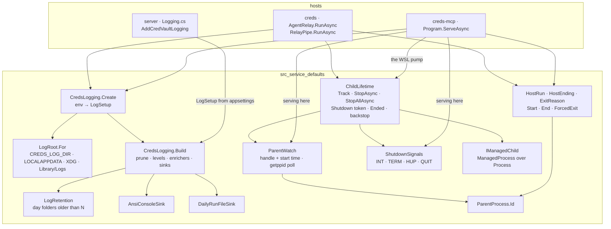

# Module — `src_service_defaults` (the shared logging)

> `CredsForDevs.ServiceDefaults`, a .NET 10 class library, `IsAotCompatible`. Created 2026-10-09 by epic E1 of
> [PLAN_wsl_bridge_outlives_its_client.md](../todo/PLAN_wsl_bridge_outlives_its_client.md). Entry point from the
> system view: [architecture.md](architecture.md) §Logging.

## Purpose

The repository's ONE Serilog configuration, per the family rule
(`.claude/rules/shared/common/logging-serilog.md`): a coloured console and a file per run under a folder per UTC day,
with retention owned by the host. Three hosts use it — the server, `creds-mcp` and `creds` — and it exists so that a
fix to how a log is written is made once. Before it, only the server wrote files; the two AOT binaries wrote one
`[creds-for-devs]` line to stderr, and the WSL orphan investigation could not read why a process lived or ended.

It configures nothing by itself. A library never picks sinks for a host; each host calls one of its two entry points.

**Since E2 (2026-10-10) it also holds the two process-lifetime primitives** a serving host needs to notice its
client is gone — `ShutdownSignals` (the four termination signals, handled instead of dying by the default
disposition) and `ParentWatch` (the parent process, built on `ParentProcess`). They live here rather than in one
binary because the server uses them, and so do the WSL pump and the SSH-agent relay since E3: one copy, per the
reuse rule and the cadence consultation's fifth point (plan §14). Like the logging, they observe and report; ending
the process is the host's decision (`ServerLifetime` in `src_mcp`).

**Since E3 (2026-10-10) it holds the one lifetime for a process that holds CHILDREN for a client** — `ChildLifetime`,
composed from the two primitives above, with `IManagedChild` / `ManagedProcess` as the shape of a child it stops. The
pump (`WslPump`) and the relay (`AgentRelay`) each held Windows children for somebody else's session and each had its
own partial ending — the pump a `ProcessExit` hook a SIGINT never ran, the relay nothing — which is defects B and C of
the plan. It lives here, beside the primitives it composes, rather than in `src_broker_client` as §5.4 first said: that
project does not reference this one, and the helper needs the signals, the watch and the logger.

## Diagram

## Core entities

| Type | What it is |
|---|---|
| `LogSetup` (record) | Everything one logger is built from: app name, root (empty = console only), start time, levels, retention days, console writer, default source |
| `LogLevels` (record) | The floor and per-source overrides, bound EXPLICITLY — `Serilog.Settings.Configuration` scans assemblies, which AOT cannot |
| `LogPlatform` (enum) | Windows / MacOS / Linux — which folder convention the root follows |
| `ExitReason` (enum) | The closed vocabulary of the exit line (`clientClosed`, `busy`, `noAgentAnnounced`, `signalled`, `parentGone`, …), written as its camelCase word; never a contract exit name |
| `HostEnding` (record) | Exit code + `ExitReason` — the code stays the contract's |
| `HostRun` | Writes the start line (mode, version, pid, parent pid) and the exit line (code, reason, uptime) — ONCE per run, since a shutdown deadline and a normal return can both reach `End`; `Crash` logs the exception first; `ForcedExit(log)` is the way out when a deadline passes — the exit line, the logger disposed, `Environment.Exit` — shared by the server's `ServerLifetime` and the child holders' backstop so the two cannot drift |
| `AnsiConsoleSink`, `DailyRunFileSink`, `LogRetention`, `UtcTimestampEnricher` | Moved unchanged from the server (see [module_server.md](module_server.md)) |
| `ParentProcess` | The parent pid: `getppid()` or `NtQueryInformationProcess`; 0 when the platform will not say |
| `ShutdownSignals` | SIGINT/SIGTERM/SIGHUP/SIGQUIT registered with `Cancel = true`; `Received` completes with the FIRST; `ExitCode` = 128 + the POSIX number (129, 130, 131, 143) |
| `IManagedChild`, `ManagedProcess` | A child this process started, as the lifetime stops it: `CloseStdin` (the end-of-stream every creds child ends on by itself — `Process.Close` deliberately never sends it, which was the whole of defect C), `WaitForExitAsync`, `KillTree`, `ExitCode` (so an owner reads the child's ending through the interface, not a `Process` beside it). The adapter swallows a second close of a stdin the owner already disposed |
| `ChildLifetime` | `Track` a child; `StopAsync(child, grace)` is the ONE killer — close its stdin, wait the grace, kill its tree, swallow what a child that already left throws; one stop per child, shared: a second caller gets the stop already in flight, and each stop runs off the lock (a stdin close can block). `StopAllAsync` stops every tracked child in parallel and returns only when no stop is in flight — a stop a late `Track` started included — idempotent (one shared task; a child tracked after it began is stopped at once — the flag is set under the lock before the snapshot). A child that survives its kill, or whose kill is refused, is said at Warning. `Shutdown` fires and `Ended` completes with the first of a handled signal (128 + n, `signalled`) or the parent's death (0, `parentGone`); `EndingOr(ordinary)` lets an owner whose loop ended for its own reason still report a signal that arrived meanwhile. A **backstop** timer, armed before the token fires, exits the process through `forceExit` after `grace + 2 s` — a blocking read of the client's stdin cannot be cancelled. `Start` registers the signals, takes the parent watch (started, or `Off` with its reason) and hooks `ProcessExit` to `StopAllAsync` with a bound |
| `ParentWatch` | `Gone` completes when the parent is gone. Windows: the parent opened at once by handle, and a holder of its pid that started after this process means the pid was reused (gone already); a parent that cannot be found is gone; one that cannot be opened is logged and not watched. Linux/macOS: `getppid()` every 2 s on a `PeriodicTimer`, a change means re-parented; a start with ppid ≤ 1 is not watched. `Off(reason)` logs why and never completes |

## Entry points

- **`CredsLogging.Build(LogSetup)`** — the core. Prunes the root's expired day folders, applies the floor, the rule's two
  overrides (`Microsoft.AspNetCore`, `System.Net.Http.HttpClient` at Warning) and the host's own, the enrichers
  (`UtcTimestamp`, `Application`, `ProcessId`, a default `SourceContext`), the coloured console and the file. An
  unwritable or undeterminable root → console only, said once on stderr, start never blocked.
- **`CredsLogging.Create(appName, consoleToStdErr: true)`** — the AOT hosts' factory. `CREDS_LOG_DIR`,
  `CREDS_LOG_LEVEL` (verbose/debug for more; Information is the default AND the ceiling, because the start and
  exit lines are Information and the sentences a person or the extension reads are Warning or above), `CREDS_LOG_RETENTION_DAYS` (default 14, 0 disables).
- **`HostRun.Start` / `End` / `Crash`** — the two lines every serving run writes.
- **`ShutdownSignals.Register()`** and **`ParentWatch.Start(log)` / `ParentWatch.Off(reason, log)`** — the lifetime
  primitives; `creds-mcp` passes their tasks to `ServerLifetime` with the transport's end-of-stream.
- **`ChildLifetime.Start(log, parent, grace, forceExit)`** — for a host that holds children: the pump (parent watch by
  the server's own rule, `Program.WatchParent`) and the relay (`ParentWatch.Off` — it outlives its launcher by design;
  a killed `wsl.exe` delivers SIGHUP instead, measured). `DefaultGrace` is 2 s.

## Behaviour worth knowing

- **One root, one retention window.** The AOT hosts on one machine share their platform root, and retention deletes
  whole DAY folders — the shape the family rule mandates. Two hosts given different `CREDS_LOG_RETENTION_DAYS` for the
  same root therefore resolve to the shortest window: the first host to start with it prunes for everyone. (Code
  round finding 2, rejected as a redesign and stated here instead.)
- **What a log line may carry.** Mode words, versions, pids, exit codes and reasons, the client's NAME (cleaned to
  one line), incoming method NAMES (Debug), the relay's socket path — which the relay already prints on stdout as its
  `export` line and which the extension reads from the busy refusal — and exception messages. **Never:** argument
  values, other environment values, the forwarded caller record, protocol bodies, tool arguments or results, stream
  bytes, tokens. The process tests in `src_mcp/tests/ServingLogTests.cs` and `src_cli/tests/RelayLogTests.cs` grep a
  marker out of every one of those places after positive controls.

- **The stop order is fixed, and the grace is the owner's.** Every child is stopped the same way — stdin closed, the
  grace, the tree — but how long the grace is depends on who ended the session. The relay's `relay-pipe` leaves on
  end-of-stream within a second, so the default 2 s is never reached. The pump's Windows half drains 1 s after
  end-of-stream (E2), so a 1 s grace (the plan's §5.5) would have killed it at the moment it was leaving — hence 2 s.
  And a **signalled** pump session gets no grace at all: Claude Code 2.1.296 ends a server with SIGINT, SIGTERM 100 ms
  later and SIGKILL about half a second after that (measured 2026-10-10 through a shim), so a wrapper that waited would
  be killed before it reached the kill, and a Windows half that ignores end-of-stream — a stale install still in defect
  A — would outlive the session as before. The pump therefore kills the tree at once on a signal; the Windows half's
  log then ends without an exit line, which is the truth of how it ended ([module_mcp.md](module_mcp.md)).
- **What a log line may carry** is the same here: the child's pid, the grace in seconds, the reason word, the code.

## External dependencies

`Serilog` 4.4.0 and `Serilog.Sinks.File` 7.0.0 (Apache-2.0; versions and the freshness note in
`Directory.Packages.props`). Measured cost in the AOT binaries: about +1.2 MiB and 1–9 ms on the first response
([RESULTS_wsl_bridge_orphans.md](RESULTS_wsl_bridge_orphans.md), §7.2 section).

## Tests

`src_service_defaults/tests` (xUnit v3, MTP executable `CredsForDevs.ServiceDefaults.Tests`): the path shape, UTC
lines, the stderr choice, the floor and its ceiling, retention parsing and pruning, the unwritable fallback, the
override order, the root ladder per platform, the exit-reason words (enumerated from the type), the start/exit lines,
a real parent pid; `ShutdownSignalsTests` (first signal wins, the POSIX numbers, registration with the OS) and
`ParentWatchTests` (pid reuse → gone at once, a missing parent → gone, access denied → not watched, exit → gone,
ppid change → gone, ppid 1 → off, the real opener on a real process, the real watch of the runner's own parent);
`ChildLifetimeTests` (E3.S1: a child that leaves on end-of-stream is never killed, one that ignores it is killed
after the grace, idempotence and a late-tracked child, a throwing child not stopping the others, each signal's
token and 128 + n, the parent gone with code 0, the first reason winning, the backstop firing and NOT firing after a
normal return, a stopped child forgotten — and the production adapter against a real child: `cat`/`cmd` leaving on
end-of-stream, `sleep`/`ping` killed, an already-exited child as the ordinary race).

`Support/` holds the helpers LINKED into the mcp and cli test projects rather than copied: `HostProcess.cs` (start a
built binary, find its run's file, wait for its exit with a bound, kill it on dispose), `FakeChild.cs` (scripts that
stand in for a Windows half — stubborn, echo, one-shot; `/bin/sh` on Unix, `.cmd` on Windows), `Posix.cs` (a real
signal to a pid the test started, whether a pid is alive or gone, the `SigIgn` check from `/proc`, a SIGKILL reaper for
a child a red run would otherwise leave behind) and `TestStreams.cs` (a destination that records being closed, a
source that is held open until hung up or disposed, a source whose first read fails).
